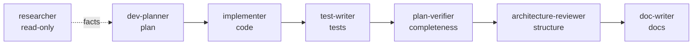

# Agents

> Custom Claude Code subagents for DevDigest. Each lives as a `.claude/agents/*.md`
> file with YAML frontmatter (`name`, `description`, `tools`, `model`, …) and a
> system-prompt body. They are invoked via the `Agent` tool (`subagent_type`) or
> proactively delegated based on their `description`. Checked into version control
> so the whole team shares them.

## Catalog

| Agent | Model | Tools | Role |
| --- | --- | --- | --- |
| [researcher](researcher.md) | sonnet | Read, Grep, Glob, WebSearch, WebFetch | Read-only investigator — finds facts in the codebase or on the web and returns a strictly structured, honest report. Never modifies anything. |
| [dev-planner](dev-planner.md) | opus | Read, Grep, Glob, WebSearch, WebFetch | Read-only architect — produces a structured **Development Plan** before non-trivial coding. Maps modules, applies Onion architecture, reads INSIGHTS.md, and breaks work into tasks that each name the skills the implementer must load. |
| [implementer](implementer.md) | sonnet · `isolation: worktree` | Read, Edit, Write, Bash, Grep, Glob, Skill | Executes **one** plan task (backend or UI), runs safely in parallel (own git worktree), loads domain-specific skills, and iterates until the touched package's tests + type-check pass. Self-review is limited to the code it wrote. |
| [test-writer](test-writer.md) | sonnet · `isolation: worktree` | Read, Edit, Write, Bash, Grep, Glob, Skill | Writes/extends tests (backend or UI) for a scoped change. Reads `TESTING.md` + INSIGHTS first, follows repo test conventions and the typological philosophy, tests behaviour at the seams, then runs the suite and iterates until green — showing real output. Does not write production code. |
| [architecture-reviewer](architecture-reviewer.md) | opus | Read, Grep, Glob, Bash *(read-only)* | Read-only **architectural** review — structure, not lines. Checks the Onion dependency rule, layer boundaries, coupling/cohesion, cycles, anemic domain, leaky ports. Findings by severity + confidence, each anchored to `path:line`. Never edits. |
| [plan-verifier](plan-verifier.md) | opus | Read, Grep, Glob, Bash *(read-only)* | Read-only **completeness** audit — verifies every plan/requirement item is actually built. Builds a requirement→`path:line` traceability matrix (Implemented / Partial / Missing / Cannot-verify) and reports gaps honestly. Not a quality reviewer. |
| [doc-writer](doc-writer.md) | sonnet | Read, Edit, Write, Grep, Glob | Turns existing material into documentation — documents built functionality, converts plans into docs, produces structured docs with Mermaid diagrams. Evidence-based (cites `path:line`), applies Diátaxis, routes each doc to its correct home. Docs only; never edits source. |

## The full lifecycle

The agents cover a **Plan → Implement → Test → Verify → Review → Document** loop.
Each stage is a focused, single-responsibility agent with least-privilege tools;
compose only the stages a given change needs.

- **Write agents** (touch files): `implementer` (code), `test-writer` (tests),
  `doc-writer` (docs only). The two code/test agents use `isolation: worktree`
  so they can run in parallel without clobbering each other on disk.
- **Read-only agents** (no Edit/Write): `researcher`, `dev-planner`,
  `plan-verifier`, `architecture-reviewer`. The two reviewers keep `Bash` but for
  **read-only evidence gathering only** (`tsc`, tests, `git log`) — never
  mutation.
- **Division of labour among the checkers:** `plan-verifier` asks *"was every
  requirement built?"* (completeness), `architecture-reviewer` asks *"is it in
  the right place, dependencies pointing the right way?"* (structure), and the
  [`pr-self-review`](../skills/pr-self-review/SKILL.md) gate handles line-level
  findings before a PR. They deliberately don't overlap.

## How the two work together

`dev-planner` and `implementer` form an **orchestrator-workers** pipeline:

1. **Plan** — `dev-planner` explores the repo (read-only), applies the
   [`onion-architecture`](../skills/onion-architecture/SKILL.md) skill, reads each
   touched module's `INSIGHTS.md`, and emits a Development Plan: 15–40 discrete
   tasks, each tagged with its owned files, the skills to load, and a `[P]` marker
   when it touches files disjoint from other tasks (i.e. safe to parallelize).
2. **Implement** — one `implementer` per task. Tasks marked `[P]` can run in
   parallel; each implementer gets its own git worktree so parallel runs can't
   clobber each other's files on disk. Each implementer reads its module's local
   `INSIGHTS.md`, loads the skills the plan assigned, writes the code, and loops on
   tests + `tsc` until green.

The planner deliberately embeds the **full skills matrix**, so every practice the
implementer will apply is decided up front, at planning time.

### Skills routing (shared by both agents)

Both agents route skills by the files a task touches — the same table the
[`pr-self-review`](../skills/pr-self-review/SKILL.md) gate uses:

| Files touched | Skills |
| --- | --- |
| `server/src/**` (backend logic) | fastify-best-practices, onion-architecture, zod, security, typescript-expert |
| `server/src/db/schema/**`, migrations | postgresql-table-design, drizzle-orm-patterns |
| `server/src/vendor/shared/contracts/**` | zod, typescript-expert |
| `reviewer-core/**` (pure domain) | onion-architecture, typescript-expert |
| `client/**` (UI) | react-best-practices, react-component-architecture, next-best-practices, security, typescript-expert |
| new `client/**/*.tsx` needing tests | + react-testing-library |

### Insights (INSIGHTS.md) flow

- **Planner** reads *all* touched modules' `INSIGHTS.md` at plan time and distils
  the relevant lessons into each task.
- **Implementer** additionally reads *only its own module's* `INSIGHTS.md` in
  place (just-in-time), so no single agent has to load the whole repo's history.

See the [`engineering-insights`](../skills/engineering-insights/SKILL.md) skill for
how those files are produced and consumed.

## What these agents are based on

Both `dev-planner` and `implementer` were designed against current
Claude Code / Anthropic guidance and a spec-driven-development reference. The
practices they encode:

- **Single responsibility + routing-style `description`.** Each agent does one
  thing; the `description` is written as a "when to delegate" rule. Tools are
  restricted to match the role (planner is read-only; implementer gets code tools).
- **Explore → Plan → Implement → Verify.** The planner produces the plan; the
  implementer's contract is "give it a way to verify its work" — write code, run
  tests/`tsc`, iterate until green, and *show real output as evidence* rather than
  asserting success.
- **Orchestrator-workers + parallel isolation.** Work is decomposed into discrete,
  independently verifiable tasks; `[P]` tasks touch disjoint files and each
  implementer runs in its own worktree (`isolation: worktree`). Worktrees prevent
  *file* conflicts; disjoint task scoping (the planner's job) prevents *logical*
  conflicts.
- **Conditional Skills loading.** Skills are preloaded via the `skills:` frontmatter
  field *and* routed at runtime in the agent body by file type (backend vs UI), so
  the right domain skills load whether or not a given harness preloads frontmatter.
- **Progressive disclosure for context.** Insights are surfaced as short,
  task-scoped pointers and read just-in-time per module, rather than inlining the
  repo's entire lessons corpus into every agent.

### Sources

- [Create custom subagents](https://code.claude.com/docs/en/sub-agents) — Claude
  Code docs (official). Frontmatter schema; "design focused subagents / write
  detailed descriptions / limit tool access"; `skills:` preloading; fresh isolated
  context per subagent.
- [Best practices for Claude Code](https://code.claude.com/docs/en/best-practices) —
  Claude Code docs (official). Explore→Plan→Implement→Commit workflow; "give Claude
  a way to verify its work"; adversarial/self-review; CLAUDE.md-vs-Skills split.
- [Run parallel sessions with worktrees](https://code.claude.com/docs/en/worktrees) —
  Claude Code docs (official). `isolation: worktree` mechanism for parallel
  subagents; auto-cleanup; file-vs-logical conflict distinction.
- [Building Effective AI Agents](https://www.anthropic.com/engineering/building-effective-agents) —
  Anthropic engineering blog (official). Orchestrator-workers and
  evaluator-optimizer patterns; "keep it simple" design philosophy.
- [Agent Skills — authoring best practices](https://platform.claude.com/docs/en/agents-and-tools/agent-skills/best-practices) —
  Claude docs (official). Progressive disclosure; description-driven discovery;
  domain-partitioned reference material; references one level deep.
- [GitHub spec-kit — spec-driven.md](https://github.com/github/spec-kit/blob/main/spec-driven.md) —
  GitHub (primary source, third-party). Spec → Plan → Tasks → Implement structure;
  15–40 discrete tasks with "done-when" criteria; `[P]` parallelizable tagging.

The lifecycle agents (`test-writer`, `architecture-reviewer`, `plan-verifier`,
`doc-writer`) add these references:

- [Testing Library — Guiding Principles](https://testing-library.com/docs/guiding-principles/)
  & [Kent C. Dodds — Testing Implementation Details](https://kentcdodds.com/blog/testing-implementation-details) —
  official / author. "Tests should resemble how the software is used"; test
  behaviour, not internals; query priority (`getByRole` → … → `getByTestId`).
  Backs `test-writer`, alongside the repo's own `TESTING.md` (typological, mock
  the outside world) and [Fastify — Testing](https://fastify.dev/docs/latest/Guides/Testing/)
  (`fastify.inject()`).
- [Martin Fowler — TestCoverage](https://martinfowler.com/bliki/TestCoverage.html) —
  primary. Coverage is a find-the-gaps tool, not a quality metric — `test-writer`
  writes meaningful tests, not coverage-chasing ones.
- [Robert C. Martin — The Clean Architecture](https://blog.cleancoder.com/uncle-bob/2012/08/13/the-clean-architecture.html),
  [Alistair Cockburn — Hexagonal](https://alistair.cockburn.us/hexagonal-architecture),
  [Martin Fowler — AnemicDomainModel](https://martinfowler.com/bliki/AnemicDomainModel.html) —
  primary. The Dependency Rule, ports/adapters, and rich-vs-anemic domain — the
  checklist `architecture-reviewer` applies (findings by severity + confidence,
  evidence-anchored).
- [Diátaxis](https://diataxis.fr/) &
  [GitHub — Mermaid in Markdown](https://github.blog/developer-skills/github/include-diagrams-markdown-files-mermaid/),
  plus [ADR (Fowler bliki)](https://martinfowler.com/bliki/ArchitectureDecisionRecord.html) —
  official / primary. Doc-type split, diagrams-as-code, and the `docs/adr/`
  Context→Decision→Consequences convention — the practices `doc-writer` follows.
- [Anthropic — Building Effective Agents](https://www.anthropic.com/engineering/building-effective-agents) —
  official. The evaluator-optimizer pattern and "evidence over assertion" behind
  `plan-verifier`'s requirement-traceability audit (requirements → `path:line` →
  status), which deliberately reports gaps rather than rubber-stamping.

> `researcher` predates this research pass but follows the same read-only,
> evidence-over-assertion, structured-report principles the whole roster shares.
