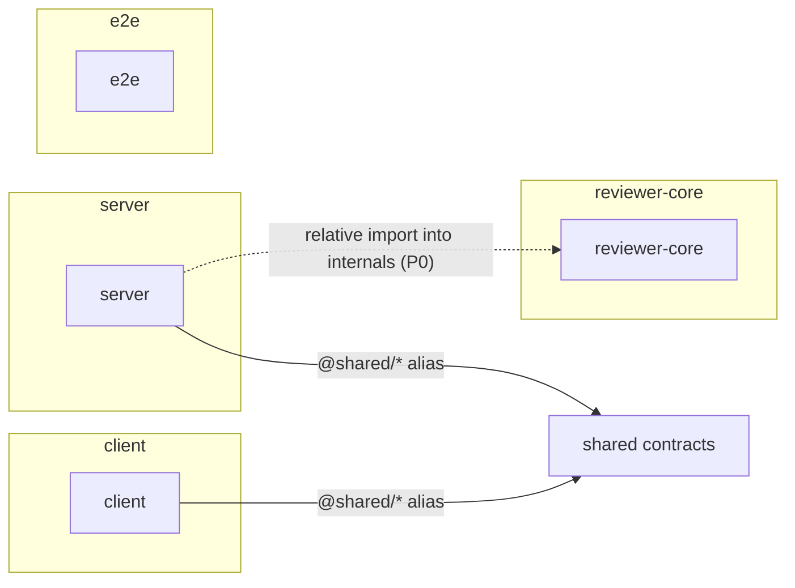

# Dependency Checker

Audits dependencies across all five packages (`server`, `client`,
`reviewer-core`, `e2e`, and the vendored `@devdigest/shared`) and produces one
structured report: a graph, a size breakdown, severity-ranked findings, and a
short prioritized summary. Read-only — it never edits `package.json`, never
runs `pnpm remove`/`pnpm add`, and never deletes anything. Every fix it
suggests is a recommendation for the user to confirm, not an action already
taken.

This repo is **not a monorepo** — `server/`, `client/`, `reviewer-core/`,
`e2e/` are five standalone packages sharing code through TypeScript path
aliases (see root `CLAUDE.md`), not `workspace:*` references. Never describe
their relationship as pnpm/npm workspace linking.

## Step 1 — Gather the data

If you have tool access (Read/Bash/Grep/Glob), collect this yourself. If the
prompt already hands you the data inline (e.g. an eval fixture), use exactly
what's given and do not ask for more.

1. **Manifests**: read `package.json` (`dependencies` + `devDependencies`)
   for `server/`, `client/`, `reviewer-core/`, `e2e/`, and the root.
2. **Installed size**: `du -sh <pkg>/node_modules/<dep>` for each direct
   dependency (top-level only — do not recurse into transitive deps, that's
   noise). Skip this step gracefully (note it as "not measured") if
   `node_modules` isn't installed rather than guessing a size.
3. **Cross-package (internal) dependencies**: grep for the path aliases each
   package's `tsconfig.json` defines (e.g. `@shared/*` → vendored
   `server/src/vendor/shared/`), plus any relative import that reaches
   *outside* its own package root (e.g. `server/src/...` importing from
   `../../reviewer-core/src/...`). Distinguish:
   - alias imports that go through a package's **public entry point**
     (its `index.ts`/`package.json` `main`/`exports`) — fine.
   - relative imports that reach **into another package's internals**,
     bypassing its public surface — a boundary violation (see Step 3).
4. **Unused dependencies**: for each declared dependency, grep the owning
   package's `src/` for an import of it. Declared-but-never-imported is a
   finding, not a silent skip.
5. **Version drift**: for any package name declared in more than one
   `package.json` (e.g. `zod`, `typescript`), compare resolved versions.

Never fabricate a size or a version — if you can't measure it, say
"not measured" rather than inventing a number.

## Step 2 — Classify findings into severity tiers

Every finding must be tagged with exactly one tier and name a concrete
package, dependency, or file/line — never a generic "consider optimizing X".

- **P0 — Correctness/architecture risk.** A relative import that reaches
  into another package's internals instead of its public entry point
  (breaks the Onion/package-boundary contract); a dependency resolved to
  meaningfully different major versions across packages that could cause
  runtime type/behavior mismatches at a shared boundary (e.g. Zod schemas
  built with different Zod majors compared across `@shared` contracts).
- **P1 — Bloat/maintenance risk.** An unused dependency still declared in
  `package.json`; a large package (call out anything single-handedly adding
  tens of MB, e.g. >20MB) where a lighter alternative or narrower import
  exists; version drift on a minor/patch level.
- **P2 — Minor/hygiene.** A dependency that could move from `dependencies`
  to `devDependencies` (or vice versa); duplicate functionality across two
  small packages doing the same job.
- **Info** — observations worth noting that aren't action items (e.g. "this
  package has the smallest dependency footprint of the four").

If a tier has no findings, state that explicitly ("No P0 findings") rather
than omitting the tier — an empty tier is signal, not absence of a section.

## Step 3 — Write the report

Always emit all five sections, in this order, even if a section is short.

````markdown
# Dependency Check — <date or branch/commit if known>

## Scope
<Which packages were analyzed: server, client, reviewer-core, e2e (+ root/@devdigest/shared if relevant). Note anything skipped and why (e.g. "node_modules not installed for e2e — sizes not measured").>

## Dependency Graph

<Internal edges (path-alias / cross-package imports) must be visually or textually distinct from external npm dependency edges — don't merge them into one undifferentiated graph. Label edges with what kind of link they are.>

## Size Breakdown
| Package | Dependency | Version | Installed size |
| --- | --- | --- | --- |
| client | next | 15.0.3 | 132M |
| ... | ... | ... | ... |

<Sort by size descending within each package, or across all packages if comparing. If sizes weren't measured, say so instead of a table.>

## Findings & Priorities

### P0
- <package/file> — <specific issue> — <why it matters>

### P1
- <package/dependency> — <specific issue>

### P2
- <package/dependency> — <specific issue>

### Info
- <observation>

(State "No P0 findings" etc. for any empty tier.)

## Summary
1. <Most important, concrete, actionable takeaway — names a package/file>
2. <...>
3. <...>
(3-5 items total, ordered by priority — P0s first. Each is a recommendation for the user to confirm/apply, phrased as "consider removing X" / "recommend moving Y", never as something already done.)
````

## Rules

- **Read-only.** Never modify `package.json`, lockfiles, or run install/remove
  commands. Present every fix as a recommendation.
- **Internal vs. external, always distinguished.** A TS path-alias or
  relative cross-package import is not the same kind of dependency as an
  npm package — never conflate them, and never describe this repo's
  packages as linked via `workspace:*` or pnpm/npm workspaces.
- **Every finding is concrete.** Name the exact package, dependency, and file
  path/line where relevant. No finding may be phrased as generic advice.
- **No invented numbers.** If size or version data wasn't gathered, say so
  explicitly instead of guessing.
- **All 5 sections, every time**, even when a section is short or a tier is
  empty — that's what keeps reports comparable across runs.
