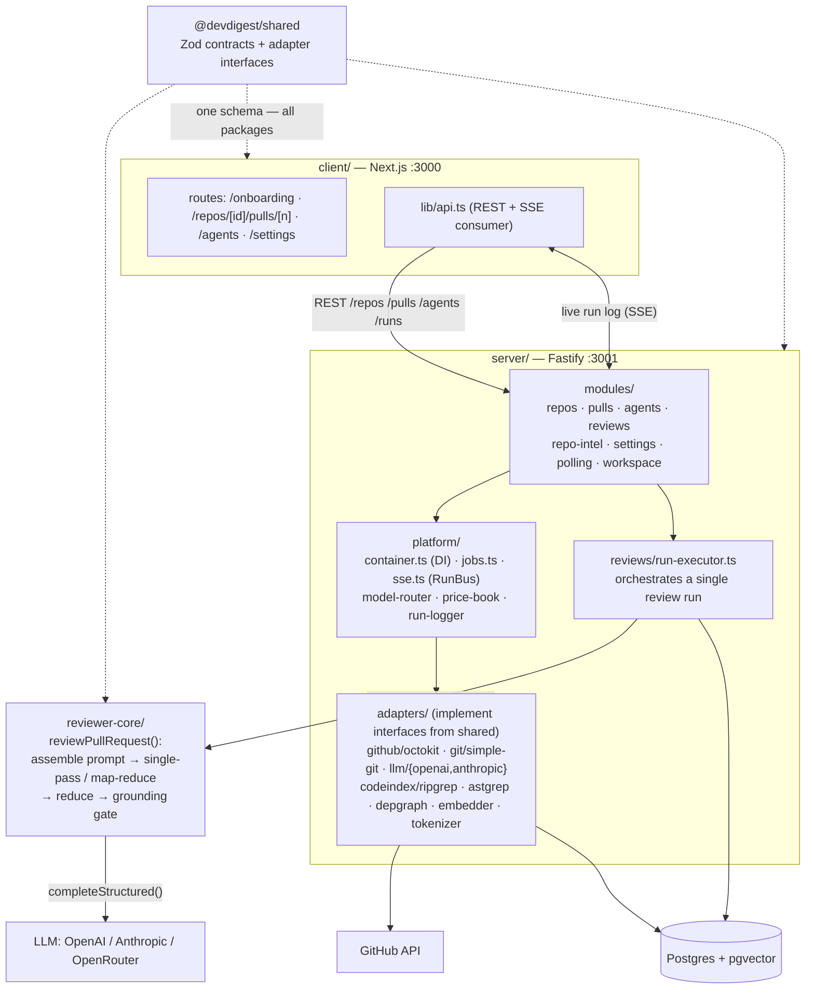

# DevDigest — Onboarding

## 🎯 Project Goal

**A local AI pull request reviewer.** The workflow: add a repo → the server clones and indexes it → import a PR from GitHub → launch an "agent" (model + system prompt) → it assembles a prompt from the diff + codebase context, calls the LLM, **validates the response**, and returns structured findings (severity, score, references to actual diff lines).

The project has an important second nature: it is a **teaching course**. The starter is intentionally minimal — "does one thing end-to-end." Each lesson (L01–L08) brings back one feature. This explains many "odd" spots (see below).

Everything runs locally; the only external calls are to GitHub (PR data) and an LLM (via OpenAI/Anthropic/OpenRouter).

---

## 🛠 Tech Stack

| Layer | Technology |
|-------|-----------|
| Backend API | **Fastify** + TypeScript (port 3001) |
| ORM / DB | **Drizzle ORM** + **Postgres** with pgvector |
| Frontend | **Next.js 15** App Router + **Mantine** (port 3000) |
| Review engine | custom `reviewer-core` package (pure logic) |
| Code analysis | **ripgrep**, **@ast-grep/napi**, **dependency-cruiser**, **graphology** |
| Tokens/budget | **js-tiktoken** |
| Git / GitHub | **simple-git** / **Octokit** |
| Streaming | **SSE** (Server-Sent Events) — Agent Live Log |
| Tests | **Vitest** (unit + integration via testcontainers), **agent-browser** (e2e) |
| Docker | **Postgres only**; API and web run on the host via `tsx`/`pnpm dev` |

---

## 🧩 5 Packages (NOT a monorepo workspace)

```
dev-digest/
├── server/          @devdigest/api            Fastify API + DB + all adapters
├── client/          @devdigest/web            Next.js Studio (UI)
├── reviewer-core/   @devdigest/reviewer-core  pure review engine (no I/O)
├── e2e/             @devdigest/e2e            browser e2e
└── server/src/vendor/shared/  @devdigest/shared  Zod contracts + adapter interfaces
```

**First important detail:** each package has its own `package.json` and lockfile, but this is **not** a pnpm workspace. Shared code is shared via **tsconfig path aliases** — `@devdigest/shared` and `@devdigest/reviewer-core` resolve **directly to TS source**, without a build step. `reviewer-core` even has `build` = just a typecheck; it never emits JS (consumed via `tsx` in dev, `vitest` in tests, `@vercel/ncc` bundle in the CI runner).

---

## 🔌 How Modules Communicate



### Architectural layers in server/
- **`platform/container.ts`** — DI container (composition root). One per application instance. Holds config, db, JobRunner, RunBus, and **lazily** builds adapters via `SecretsProvider`. Tests inject mocks via `ContainerOverrides`. Modules depend on **interfaces** (`LLMProvider`, `GitClient`…), not concrete classes.
- **`adapters/`** — implementations of interfaces from `shared/adapters.ts` (Octokit, simple-git, OpenAI/Anthropic, ripgrep, ast-grep, dependency-cruiser, embedder, tokenizer).
- **`modules/`** — feature slices (`repos`, `pulls`, `agents`, `reviews`, `repo-intel`, `settings`, `polling`, `workspace`); each typically has `routes.ts` + `service.ts` + `repository.ts`.

---

## 🌊 Review Flow (most important for understanding)

1. **Route** enqueues runs (no await) and returns 202.
2. **`reviews/run-executor.ts`** runs in the background: `loadDiff()` once → for each agent:
   - resolves the LLM provider from the container;
   - if repo-intel is enabled for the agent — builds a **callers digest** (who calls the changed symbols), **repo map** (repo skeleton), **rank note** ("N of M changed files are in the top 5% most depended-upon");
   - calls **`reviewPullRequest()`** from `reviewer-core`;
   - persists the review + findings, marks `headSha`, counts a deterministic `blockers`, saves **one RunTrace**, completes RunBus.
3. **`reviewer-core/review/run.ts`** — pure core: `assemblePrompt` → `single-pass` OR `map-reduce` (auto selects map-reduce only when the diff is both large and multi-file) → `reduceReviews` → **grounding gate**.

### Two key "smart" details of the core
- **Grounding gate** (`reviewer-core/grounding.ts`) — mechanically validates every finding against the diff and **discards hallucinated line references**. The server re-exports it via a `platform/grounding.ts` shim.
- **Score is computed from findings that SURVIVED grounding**, not from the model's self-reported number — so the score, the finding list, and the deterministic event always stay consistent.

---

## 🪄 Odd / Non-obvious Parts (things to watch out for)

1. **`shared` physically lives inside `server/src/vendor/shared`**, even though logically it is a separate package `@devdigest/shared` shared by everyone. This is a vendored copy, not a symlink workspace.
2. **DB schemas and contracts are ahead of implementation.** `db/schema/` has `ci.ts`, `eval.ts`, `knowledge.ts`, `skills.ts`, `ops.ts`, and `vendor/shared/contracts/` has `productionize.ts`, `eval-ci.ts`, `observability.ts`, `brief.ts`, `why.ts`, `knowledge.ts`. Most of these are **for future course lessons** (L01–L08) not yet in the starter. Don't be surprised when the schema exists but the UI/logic does not.
3. **`reviewer-core` is intentionally I/O-free** — no DB/GitHub/fs, the only side-effect is the injected `LLMProvider`. This lets the same engine work in both the studio (server) and the CI runner. Skills/memory/spec resolution is done by the **caller**; the core receives already-assembled strings.
4. **repo-intel "degraded contract".** The `RepoIntel` facade hides the complexity of ast-grep/dependency-cruiser/graphology. Convention: methods returning an array return `[]` on degradation (= "no enrichment"), while methods returning an object carry an inline `degraded?: boolean`. Status is always visible via `getIndexState()`. There is also a **per-agent toggle** for repo-intel — when disabled, the prompt is identical to the baseline.
5. **Double gate on repo-intel:** a global flag `REPO_INTEL_ENABLED` + a per-agent toggle. Embeddings are also behind a flag `EMBEDDINGS_ENABLED` — if disabled, the OpenAI client is **never constructed** (zero requests).
6. **SSE RunBus + RunLogger** fans out across multiple concurrent runs (shared pre-work such as diff loading is written into each run's buffer) and is **buffered**, so the trace survives a page reload even on fail/cancel.
7. **OpenRouter session grouping** — `sessionId = owner/repo#num:agent` is passed in every LLM call so all chunks of one review are grouped into a single session in the OpenRouter dashboard.
8. **Only Postgres runs in Docker.** The API and Next.js run on the host. Bootstrap the full stack with `./scripts/dev.sh` (idempotent: docker → migrate → seed → server + client).
9. **`ONBOARDING_SONNET.md`** in the root (untracked) is a draft from a previous onboarding by another model; don't confuse it with this file or the README.

---

## 🚀 Quick Start

```bash
./scripts/dev.sh            # full stack from scratch
./scripts/dev.sh --db-only  # Postgres only + migrate + seed
./scripts/e2e.sh            # hermetic e2e on alternate ports
```
Then in **Settings** enter your LLM key and GitHub token (stored via `LocalSecretsProvider`).
