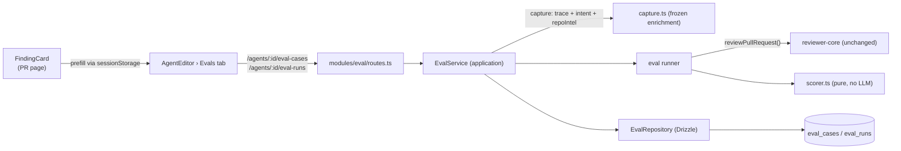

# Implementation Plan — Agent Evals
Spec: [SPEC-03-agent-evals](../../specs/SPEC-03-agent-evals.md)

**Execution mode: SINGLE-AGENT (sequential).** One `implementer` executes T1 → T24 **in
order**. There are no `[P]` markers; each task assumes every earlier task is merged.
`T-26`…`T-31` are `test-writer`'s tasks (the implementer never writes tests) and are
listed last with their dependencies.

---

## Design reference — read the README before building any UI

The spec's `Inputs (provenance)` section points at `design/agent-evals/`:

| File | Surface | Backs |
| --- | --- | --- |
| [`design/agent-evals/README.md`](../../design/agent-evals/README.md) | **read this first** | what each shot shows + the four departures |
| [`design/agent-evals/01-finding-card-turn-into-eval-case.png`](../../design/agent-evals/01-finding-card-turn-into-eval-case.png) | `Turn into eval case` on the finding card | AC-1 (T17) |
| [`design/agent-evals/02-eval-case-modal.png`](../../design/agent-evals/02-eval-case-modal.png) | the eval-case modal | AC-7 – AC-12 (T20) |
| [`design/agent-evals/03-agent-editor-evals-tab.png`](../../design/agent-evals/03-agent-editor-evals-tab.png) | Agent Editor › Evals tab | AC-31 – AC-37 (T19) |

> **The screenshots are OLDER than the spec. Where they disagree, the spec wins.**
> `design/agent-evals/README.md` lists **four things visible in the mockups that this plan
> deliberately does NOT build** — do not "restore" them from the pixels:
> 1. the **`TRACES PASSED 17/20` card is dropped** (it duplicated `N / M passing`); only
>    Recall, Precision and Citation Accuracy remain as cards;
> 2. **`View full dashboard →` is a disabled placeholder**, not a link (AC-37);
> 3. **`Learn` and `Reply to author`** on the finding card are **not** built;
> 4. the **`Stats` and `CI`** tabs in the Agent Editor are later lessons.
>
> Build from the **acceptance criteria**, using the screenshots only for layout/affordance.

## Context & module map

Two modules are touched: **server** (`@devdigest/api`) and **client** (`@devdigest/web`).
`reviewer-core` is **reused unchanged** — the eval runner calls `reviewPullRequest`
(`reviewer-core/src/review/run.ts:130`), whose `ReviewOutcome` already carries everything
scoring needs: `review.findings` (kept), `dropped` (grounding drops with reasons),
`assembly`, `tokensIn/Out`, `costUsd` (`reviewer-core/src/review/run.ts:102-120`). Citation
accuracy = `kept / (kept + dropped)` — computable **without touching `reviewer-core`**.



> **An eval run is Postgres + one model call. Nothing else.** No filesystem, no repo clone,
> no live PR row (spec *Constraints*, AC-14/AC-16). Every repo- and PR-derived input —
> including the **context-doc contents** — is frozen onto the case at **capture** time. The
> eval module therefore never touches the `GitClient` port.

### Already exists — EXTEND, do not create

| Thing | Evidence |
| --- | --- |
| `eval_cases`, `eval_runs` tables | `server/src/db/schema/eval.ts:7-35`, migrated in `server/src/db/migrations/0000_init.sql` |
| `EvalCase`, `EvalRun`, `EvalOwnerKind`, `EvalPerTrace` | `server/src/vendor/shared/contracts/knowledge.ts:50-84` |
| `EvalCaseInput`, `EvalRunRecord`, `EvalRunResult`, `EvalDashboard`, `EvalTrendPoint` | `server/src/vendor/shared/contracts/eval-ci.ts:20-89` |
| `Agent`, `AgentVersion`, `AgentVersionConfig` | `server/src/vendor/shared/contracts/knowledge.ts:215-270` |
| Grounding gate | `reviewer-core/src/grounding.ts:52` (`groundFindings`), `:87` (`groundingSummary`) |
| Canonical production review input resolution (skills, context docs, callers, repo map, rank note, intent, prDescription) | `server/src/modules/reviews/run-executor.ts:180-300` |
| Unified-diff parse (raw text → `UnifiedDiff`) | `server/src/adapters/git/diff-parser.ts:14` |
| Diff text reconstruction format the parser expects | `server/src/modules/reviews/diff-loader.ts:36-43` |
| `taskLine(pull)` — **signature NOT changed by this plan** | `server/src/modules/reviews/helpers.ts:113` |
| `buildRankNote` — `getFileRank` → `percentile >= 95` → the one-line sentence, `''` on empty/throw | `server/src/modules/reviews/run-executor.ts:461-478` |
| File-rank index (the port the rank note is recomputed from) | `container.repoIntel` at `server/src/platform/container.ts:173`; `getFileRank(repoId, files)` used at `run-executor.ts:469` |
| Context-doc contents the originating run actually read — **`{ path, content }[]`** | `RunTrace.specs_read`, `server/src/vendor/shared/contracts/trace.ts:88`; written at `run-executor.ts:221-228` |
| Run trace read (cross-module, on the container) | `server/src/modules/reviews/repository.ts:183` (`getRunTrace`), `container.reviewRepo` at `server/src/platform/container.ts:115` |
| Stored intent read | `container.intentRepo` at `server/src/platform/container.ts:124` |
| Agent Editor tabs (config / skills / context) | `client/src/app/agents/[id]/_components/AgentEditor/constants.ts:12-16`, `AgentEditor.tsx:25-31`, `client/src/app/agents/[id]/page.tsx:15` (`VALID_TABS`) |
| Finding card (Accept/Dismiss only today) | `client/src/app/repos/[repoId]/pulls/[number]/_components/FindingCard/FindingCard.tsx:91-112` |
| i18n copy for evals — **already shipped** | `client/messages/en/eval.json` (`dashboard`, `caseEditor`, `evalsTab`, `page`), `client/messages/en/agents.json:46-52` already has `editor.tabs.evals` |

### Ahead-of-implementation / does NOT exist yet

- No `server/src/modules/eval/` directory at all — the whole module is new.
- No eval functions in `client/src/lib/api.ts` and no `client/src/lib/hooks/evals.ts`.
- `client/src/app/skills/_components/SkillEditor/_components/EvalsTab/EvalsTab.tsx:9-12` is an
  `EmptyState` **stub** — spec non-goal, **leave it alone**.
- The Eval Dashboard page does not exist (`client/src/components/app-shell/helpers.ts:36`
  already maps `/eval*` to a nav key, but there is no route) — link stays a disabled
  placeholder (AC-37).

---

## Requirements (WHAT & WHY)

Editing an agent's prompt/model/skills today gives no signal about whether the agent got
better or worse. Human accept/dismiss decisions on findings are already persisted and
already are labelled data. This feature turns them into a **regression suite**:

- One click on a finding (`Turn into eval case`) freezes that finding's PR fragment plus an
  expectation derived from the accept/dismiss decision, owned by the producing agent.
- An **Evals** tab in the Agent Editor lists the agent's cases with per-case run/edit/delete,
  `Run all evals`, `New eval case`, and three metric cards (recall / precision / citation
  accuracy) with a delta against the previous agent version.
- Running a case replays the **live** agent config against the **frozen** case inputs and
  scores the result in **code only** — no model in the scoring path.

Full acceptance criteria: AC-1 … AC-38 in the spec. Every task below names the ACs it closes.

---

## Affected modules & files

### server (`@devdigest/api`)
- `server/src/vendor/shared/contracts/eval-ci.ts` — add `agent_version` to `EvalRunRecord`;
  add `ExpectedFinding` + `EvalCaseInputMeta` + `EvalCaseInputBody` (`z.input`).
  **No `repo_id`.**
- `server/src/db/schema/eval.ts` — `evalRuns.agentVersion` (integer). **One column.**
- `server/src/db/migrations/0016_*.sql` + `meta/_journal.json` + `meta/0016_snapshot.json` — **generated**.
- `server/src/modules/eval/types.ts` — NEW (module-local domain types).
- `server/src/modules/eval/scorer.ts` — NEW (pure scorer).
- `server/src/modules/eval/capture.ts` — NEW (pure frozen-enrichment builder).
- `server/src/modules/eval/prompt-inputs.ts` — NEW (pure: case → `reviewPullRequest` inputs).
- `server/src/modules/eval/runner.ts` — NEW (application: one case → one run).
- `server/src/modules/eval/service.ts` — NEW (application: CRUD, capture I/O, run set, dashboard).
- `server/src/modules/eval/repository.ts` — NEW (infrastructure: Drizzle).
- `server/src/modules/eval/routes.ts` — NEW (presentation: 6 routes).
- `server/src/modules/index.ts` — register the `eval` plugin.
- `server/src/platform/container.ts` — add `get evalRepo()` (mirrors `briefRepo`).
- `server/src/modules/reviews/helpers.ts` — **additive only**: extract the two prompt
  *sentences* (task line, rank note) as pure exports so the eval path cannot drift from
  production. `taskLine`'s own signature is **unchanged**. See decision 5.
- `server/src/modules/reviews/run-executor.ts` — **one-line change**: `buildRankNote` returns
  the extracted sentence formatter instead of an inline template. No behavior change.

### client (`@devdigest/web`)
- `client/src/vendor/shared/contracts/eval-ci.ts` — **mirror of the server contract edit**.
- `client/src/lib/hooks/evals.ts` — NEW (React Query hooks).
- `client/src/lib/eval-prefill.ts` — NEW (sessionStorage hand-off store).
- `client/src/app/repos/[repoId]/pulls/[number]/_components/FindingCard/FindingCard.tsx` +
  `helpers.ts` — `Turn into eval case` button (fail-closed).
- `.../FindingsPanel/FindingsPanel.tsx`, `.../ReviewRunAccordion/ReviewRunAccordion.tsx` —
  plumb `agentId` down one level.
- `client/src/app/agents/[id]/_components/AgentEditor/constants.ts` + `AgentEditor.tsx` — add the `evals` tab.
- `client/src/app/agents/[id]/page.tsx` — `VALID_TABS` + `evals`.
- `client/src/app/agents/[id]/_components/AgentEditor/_components/EvalsTab/**` — NEW.
- `client/src/app/agents/[id]/_components/AgentEditor/_components/EvalCaseModal/**` — NEW.
- `client/messages/en/eval.json`, `client/messages/en/prReview.json` — a handful of new keys.

---

## Architecture & layer placement (onion)

| Layer | Where | What |
| --- | --- | --- |
| **Domain** | vendored `shared` contracts + `modules/eval/types.ts` + `scorer.ts` + `capture.ts` + `prompt-inputs.ts` | Zod contracts, expected-finding shape, the matcher/metrics, the pure "case → prompt inputs" and "trace → frozen enrichment" transforms. **Zero I/O**, no Drizzle, no Fastify. |
| **Application** | `modules/eval/service.ts`, `modules/eval/runner.ts` | Use cases: create/update/delete/list a case, capture the frozen enrichment, run N cases sequentially, aggregate the dashboard. Ports used: **capture** (`service.ts`) → `reviewRepo`, `intentRepo`, `repoIntel`, `evalRepo`; **run** (`runner.ts`) → `llm`, `agentsRepo`, `priceBook`, `evalRepo`. **`container.git` is NOT a port of this module — the eval path never touches the filesystem (AC-16).** Never imports Fastify. |
| **Infrastructure** | `modules/eval/repository.ts`, `platform/container.ts` | Drizzle over `eval_cases`/`eval_runs`; `container.evalRepo` lazy getter mirroring `container.briefRepo` (`server/src/platform/container.ts:115-131`). |
| **Presentation** | `modules/eval/routes.ts` | Thin Fastify handlers + Zod schemas + `getContext` workspace scoping, mirroring `modules/brief/routes.ts:16-37` and `modules/agents/routes.ts`. |

### Key design decisions (these are decisions the implementer must NOT re-litigate)

1. **The eval prompt is `assemblePrompt` via `reviewPullRequest` — never a bespoke prompt.**
   The runner builds a `ReviewInput` and calls `reviewPullRequest` exactly like
   `run-executor.ts:252-285` does. This is what makes AC-38 (untrusted-input wrapping) and
   AC-7 (production fidelity) true *by construction*, not by re-implementation.

2. **Split rule — live vs frozen.**
   - *Live from the agent (what the eval tests):* `systemPrompt`, `provider`, `model`,
     `strategy`, linked-**and-enabled** skill bodies.
   - *Frozen on the case (what the eval holds constant):* `input_diff`, `input_meta.pr`,
     `input_meta.enrichment` — callers digest, repo map, rank note, declared intent, **and the
     context-doc contents**.
   The runner **never** loads a `pull_requests` row and **never** reads a clone (AC-14/AC-16).
   **Accepted tradeoff** (spec, *Split rule*): editing an attached context doc will **not**
   move an agent's eval numbers until the affected cases are re-captured. The regression loop
   this feature exists for is prompt / model / linked skill — all three stay live.

3. **`input_meta` shape** (the existing `jsonb` column — **no new column**):
   ```jsonc
   {
     "pr":         { "number": 42, "title": "...", "body": "...", "author": "..." },  // READ-ONLY in the modal
     "enrichment": { "callers": "…|null", "repo_map": "…|null", "rank_note": "…|''",
                     "intent": { "intent": "...", "in_scope": [], "out_of_scope": [] } | null,
                     "context_docs": [{ "path": "…", "content": "…" }] },   // frozen from RunTrace.specs_read
     "source":     { "finding_id": "…", "review_id": "…", "run_id": "…", "pr_id": "…" }  // capture-from-finding only
   }
   ```
   `input_meta` is `z.unknown().nullish()` in `EvalCaseInput` (`eval-ci.ts:26`), so `source`,
   `enrichment` and `context_docs` need **no contract change** — only `agent_version` on
   `EvalRunRecord` does, exactly as the spec's *New contract fields* table states.
   A hand-written case (S3) has **no** `source` and **no** `enrichment` at all; the eval
   prompt simply omits the sections it has no input for.

4. **Enrichment is captured server-side at create time, not by the client.** The client cannot
   obtain the rank note, the structured intent, or the doc contents. On
   `POST /agents/:id/eval-cases`, when `input_meta.source` is present the service resolves the
   whole `enrichment` block itself:
   - `callers`, `repo_map` ← the originating run's trace `prompt_assembly.*`
     (`container.reviewRepo.getRunTrace`, `repository.ts:183`). These are stored
     **raw/unwrapped** (`reviewer-core/src/prompt.ts:173-174`), so they round-trip cleanly.
   - `context_docs` ← **`RunTrace.specs_read`** (`trace.ts:88`) — the `{ path, content }[]` the
     run actually read. Skip entries whose `content` is `null` (the run couldn't read them).
     **This is AC-15.**
   - `intent` ← `container.intentRepo.get(pr_id)` — the **structured object**.
     ⚠️ `prompt_assembly.intent` is the **already-wrapped** rendered section
     (`prompt.ts:176`) — do **not** feed it back, or the prompt gets **double-wrapped**.
   - `rank_note` ← **recomputed** (decision 5).

5. **The rank note is RECOMPUTED at capture — never parsed back out of the rendered prompt.**
   (Spec, *Rejected: recovering the rank note by parsing the rendered prompt* — string surgery
   on a prompt silently yields `''` the moment the task-line wording is retuned.) Capture runs
   server-side in `EvalService.create`, where the originating repo is reachable
   (`input_meta.source.pr_id` → `pull_requests.repo_id`) and the case's diff is in hand. So:
   call `container.repoIntel.getFileRank(repoId, changedFiles)` (`container.ts:173`) and
   rebuild the sentence with the **same logic** `buildRankNote` uses
   (`run-executor.ts:461-478`): keep `percentile >= 95`; `''` on empty result, no hot file, or
   throw. Freeze the result (including its leading `\n\n`) into `enrichment.rank_note`.

   **Anti-drift decision — extract, don't duplicate.** G7 ("the eval reproduces the production
   prompt") fails silently if the eval's task line or rank sentence drifts from production's.
   So extract the two *sentences* as pure exports in `modules/reviews/helpers.ts` and have both
   sides call them:
   - `reviewTaskLine(number, title, author)` — the existing `taskLine(pull)` body;
     `taskLine(pull: PullRow)` keeps its signature and just delegates. **Not widened.**
   - `rankNoteSentence(hot, total)` — the sentence at `run-executor.ts:474`; `buildRankNote`
     keeps its `getFileRank` I/O + try/catch and returns this formatter's output.

   This is additive (two new exports; zero signature or behavior change) and touches
   `run-executor.ts` by exactly one line. *(Deviation flagged: the coordinator's note assumed
   `reviews/helpers.ts` would not be touched at all. The alternative is to duplicate both
   sentences inside the eval module, which works but creates two drift points against a stated
   goal. If the reviewer prefers duplication, swap it here and add a lockstep comment on both
   copies.)*

6. **At run time the task line is rebuilt from the case**, not from a PR:
   `reviewTaskLine(pr.number, pr.title, pr.author ?? 'unknown') + enrichment.rank_note`. PR meta
   is **read-only** in the modal (AC-11) — it is frozen at capture and merely *injected* into
   the prompt's PR-description slot + task line at run time.

7. **Scoring is a pure function** over `{ expected[], produced[], groundingKept, groundingDropped }`.
   No LLM (AC-29), no DB. Lives in `modules/eval/scorer.ts`, mirroring the existing pure
   module-local units `modules/pulls/classifier.ts` and `modules/brief/validate.ts`.

8. **Sequential, in-request execution** (spec: SSE/async explicitly rejected). `Run all` is a
   `for` loop, one model call at a time, with per-case try/catch so one failure does not
   abort the set (AC-17/AC-18). The run route sets `config: { timeout: 300_000 }` — the same
   escape hatch `modules/brief/routes.ts:22` uses (`timeout: 120_000`).

9. **Prefill hand-off is `sessionStorage`, not the URL.** App Router has no navigation state
   and a diff will not fit in a query string. `client/src/lib/eval-prefill.ts` writes a
   one-shot payload under a fixed key, then navigates to
   `/agents/:agentId?tab=evals&prefill=1`; the Evals tab reads-and-clears it on mount.

### Layer-boundary risks to watch
- Do **not** import `modules/reviews/run-executor.ts` from the eval module (it is an
  orchestrator bound to a live PR). Reuse only its *inputs pattern* plus the pure sentence
  helpers from `modules/reviews/helpers.ts` (decision 5).
- Do **not** put Drizzle in `service.ts` and do **not** put Fastify in `service.ts`/`runner.ts`.
- Do **not** reference `container.git` anywhere in `modules/eval/**`. If you find yourself
  reaching for `resolveAttachedDocPaths` or `git.readFile`, you are re-deriving a frozen input
  — the doc contents are already on the case (AC-16). A grep for `container.git` under
  `server/src/modules/eval/` must return **nothing**.
- Do **not** add anything to `reviewer-core` — if you feel the need to, you have taken a
  wrong turn (scoring inputs are all on `ReviewOutcome` already).

---

## Insights to apply (from INSIGHTS.md)

- **[server + client] `@devdigest/shared` is vendored TWICE and TypeScript will not catch the
  drift.** `server/src/vendor/shared/contracts/` and `client/src/vendor/shared/contracts/`
  are independent copies (`client/INSIGHTS.md`, *What Doesn't Work*). Every contract change
  in this plan is **two identical file edits**. Server typecheck passing proves nothing about
  the client.
- **[client] A `.default()` field is still REQUIRED in `z.infer`.** `EvalCaseInput.input_diff`
  is `z.string().default('')` (`eval-ci.ts:24`) → the inferred *output* type demands it, which
  breaks caller-side object literals and test fixtures (this is exactly what bit
  `skill_count` on `Agent`, and `RunSummary`'s new nullable field in `RunHistory.test.tsx:30`,
  `client/INSIGHTS.md` *Recurring Errors*). Export a `z.input`-based caller type
  (`EvalCaseInputBody`) and use **that** on the client — the codebase already does this for
  `ComposeReviewInputBody` (`eval-ci.ts:105-106`) and `CiExportInputBody` (`:184-185`).
- **[server] Adding a required field to a vendored contract breaks fixtures OUTSIDE `src/`.**
  Grep the whole `server/` tree, `server/test/**` included, not just `server/src/`
  (`server/INSIGHTS.md` *Recurring Errors*).
- **[server] Migration-index collisions are the #1 failure mode of `db:generate` tasks.**
  Current tip is `0015_absurd_shinobi_shaw.sql`; **the expected next index is `0016`**. Verify
  with `ls server/src/db/migrations/*.sql | tail -3` immediately before generating. Never
  hand-write the `.sql`; never regenerate a `_journal.json` `when` timestamp
  (`server/INSIGHTS.md` — both the collision entry and the `when`-timestamp follow-on bug).
- **[server] Always prefer the provider's `costUsd` over `priceBook.estimate()`** —
  `outcome.costUsd ?? priceBook.estimate(model, tokensIn, tokensOut)`
  (`run-executor.ts:287-288`; `server/INSIGHTS.md`). AC-20 is literally this lesson.
- **[server] `MockLLMProvider`'s constructor id is `'openai' | 'anthropic'`**
  (`server/src/adapters/mocks.ts:59-65`) — narrower than `LLMProvider.id`, which includes
  `'openrouter'` (the default agent provider). An eval integration test that overrides
  `container.llm` for an openrouter-backed agent must account for this. Related and worse:
  **mocks more capable than the real adapter hide real bugs** — `OpenRouterProvider.complete()`
  throws `NOT_SUPPORTED`; only `completeStructured` works. The eval path goes through
  `reviewPullRequest` → `completeStructured`, so it is safe — **do not** add a plain
  `llm.complete()` call anywhere in this feature.
- **[server] `pg` FK columns are not auto-indexed** and `tsx watch` does not reliably reload
  `src/vendor/` edits — restart the server process after touching the vendored contracts.
- **[client] `AgentCard.skillCount` was in the component signature but never passed at either
  call site** (`client/INSIGHTS.md`) — after adding `agentId` to `FindingCard`, grep **all**
  render call sites (`FindingsPanel.tsx:96`, `FindingCard.test.tsx`, `SmartDiffViewer`) to
  confirm the prop is actually wired, not just typed.
- **[client] Inline-style toggling must use consistent shorthand/longhand** and new scroll
  effects must not fight existing scroll owners — relevant only if the Evals tab adds its own
  scroll/active-row styling.

---

## Task breakdown

> Sequential. Each task's *Done when* must hold before starting the next.
> `pnpm typecheck` means **both** `cd server && pnpm typecheck` and `cd client && pnpm typecheck`
> for any task that touches a vendored contract.

### [ ] T1 — Extend the eval contracts in BOTH vendored copies  (module: server + client)
- Scope: In `server/src/vendor/shared/contracts/eval-ci.ts` **and** the byte-identical
  `client/src/vendor/shared/contracts/eval-ci.ts`: add `agent_version: z.number().int()` to
  `EvalRunRecord`; export `export type EvalCaseInputBody = z.input<typeof EvalCaseInput>`
  (mirroring `ComposeReviewInputBody` at `eval-ci.ts:105-106`); add `ExpectedFinding`
  (severity, category, title, file, start_line, optional end_line — all informational except
  file/start_line/end_line, see AC-21/22) and `EvalCaseInputMeta` (`pr` / `enrichment`
  (incl. `context_docs`) / `source` per decision 3).
  **Do NOT add `repo_id` to `EvalCaseInput`** — the case pins no repo (context docs are frozen,
  AC-15/AC-16). Do NOT change `EvalCase`/`EvalRun` in `knowledge.ts`. Do NOT add any other
  field — the spec's *New contract fields* table is exhaustive and lists exactly **one** field.
- Files owned: `server/src/vendor/shared/contracts/eval-ci.ts`,
  `client/src/vendor/shared/contracts/eval-ci.ts` (+ the two `vendor/shared/index.ts` barrels
  only if the new symbols are not already re-exported).
- Skills to load: zod, typescript-expert
- Insights to apply: vendored-twice (two edits, one truth); `.default()` is required in
  `z.infer` → that is *why* `EvalCaseInputBody` exists; grep the whole `server/` tree
  (`server/test/**` included) for `EvalCaseInput`/`EvalRunRecord` construction sites before
  declaring done.
- Tests owned by: test-writer (T-26)
- Done when: `cd server && pnpm typecheck` **and** `cd client && pnpm typecheck` are clean, and
  a `diff server/src/vendor/shared/contracts/eval-ci.ts client/src/vendor/shared/contracts/eval-ci.ts`
  shows no divergence beyond what already existed.

### [ ] T2 — DB column + generated migration  (module: server)  (depends on: T1)
- Scope: In `server/src/db/schema/eval.ts` add **exactly one column**:
  `agentVersion: integer('agent_version')` on `evalRuns`. Add an index on `eval_runs.case_id`
  if one does not already exist (Postgres does not auto-index FKs). **Do NOT add
  `eval_cases.repo_id`** — the case pins no repo. Then run `pnpm db:generate` from `server/`.
  Do **not** hand-write SQL and do **not** edit `meta/_journal.json` by hand.
- Files owned: `server/src/db/schema/eval.ts`, `server/src/db/migrations/0016_*.sql`,
  `server/src/db/migrations/meta/_journal.json`, `server/src/db/migrations/meta/0016_snapshot.json`.
- Skills to load: postgresql-table-design, drizzle-orm-patterns, typescript-expert
- Insights to apply: **run `ls server/src/db/migrations/*.sql | tail -3` first — the tip is
  `0015_absurd_shinobi_shaw.sql`, so the expected next index is `0016`.** If `db:generate`
  produces anything other than `0016_*`, stop: the branch has drifted and you are about to
  create an add/add collision. Never regenerate a `_journal.json` `when` value.
- Tests owned by: n/a (covered by T-28's integration tests)
- Done when: exactly one new `0016_*.sql` exists containing the single
  `ALTER TABLE "eval_runs" ADD COLUMN "agent_version"`; `pnpm db:migrate` applies cleanly
  against a fresh `./scripts/dev.sh --db-only`; `pnpm typecheck` clean.

### [ ] T3 — Module-local domain types  (module: server)  (depends on: T1)
- Scope: `server/src/modules/eval/types.ts` — the internal shapes: `EvalCaseRow` (Drizzle
  `$inferSelect` re-export), `EvalInputMeta` / `EvalEnrichment` (incl.
  `context_docs: { path, content }[]`) / `EvalCaseSource`, `ExpectedFinding` (re-exported from
  the contract), `CaseScore`
  (`{ pass, matched, expectedTotal, produced, falsePositives, kept, dropped }`) and
  `RunSetResult`. Pure types only — zero imports from `drizzle-orm` or `fastify`.
- Files owned: `server/src/modules/eval/types.ts`
- Skills to load: onion-architecture, typescript-expert, zod
- Insights to apply: none
- Tests owned by: n/a
- Done when: `pnpm typecheck` clean.

### [ ] T4 — Pure scorer  (module: server)  (depends on: T3)
- Scope: `server/src/modules/eval/scorer.ts`. Export:
  `matchesExpectation(expected, produced)` — identical `file` AND intersecting
  `[start_line, end_line]` ranges (an expectation with only `start_line` is a one-line range;
  **touching boundaries count as intersecting**) — AC-21; severity/category/title are ignored
  — AC-22. `scoreCase({ expected, produced, kept, dropped })` → per-case matched count,
  false positives (any finding produced for a case whose `expected` is empty — AC-25), and
  `pass` (every expectation matched AND, when `expected` is empty, zero findings produced —
  AC-30). `aggregate(caseScores)` → `{ recall, precision, citation_accuracy, traces_passed,
  traces_total }` with the empty-set rules: recall = 1 when no expectations exist anywhere in
  the run (AC-24); precision = 1 when no case in the run has an empty expectation (AC-26);
  citation accuracy = `kept / (kept + dropped)` and = 1 when nothing was produced pre-gate
  (AC-28). **No LLM call, no DB, no imports beyond types** (AC-29).
- Files owned: `server/src/modules/eval/scorer.ts`
- Skills to load: onion-architecture, typescript-expert
- Insights to apply: none
- Tests owned by: test-writer (T-26)
- Done when: `pnpm typecheck` clean; the file imports nothing from `drizzle-orm`, `fastify`,
  or any adapter.

### [ ] T5 — Extract the two prompt sentences (anti-drift)  (module: server)  (depends on: T3)
- Scope: **additive refactor, zero behavior change** — see decision 5. In
  `server/src/modules/reviews/helpers.ts` add two pure exports:
  - `reviewTaskLine(number: number, title: string, author: string): string` — the existing
    body of `taskLine` (`helpers.ts:113-121`), moved verbatim. `taskLine(pull: PullRow)` keeps
    its **exact current signature** and simply delegates:
    `return reviewTaskLine(pull.number, pull.title, pull.author)`. **Do not widen `taskLine`.**
  - `rankNoteSentence(hot: number, total: number): string` — the sentence currently inlined at
    `run-executor.ts:474`, **including its leading `\n\n`**, moved verbatim.
  Then change `buildRankNote` (`run-executor.ts:461-478`) by **one line**: its `return` now
  calls `rankNoteSentence(hot.length, changedFiles.length)`. Its `getFileRank` call, the
  `percentile >= 95` filter, the `runLog.info`, and both `''` early-returns stay exactly as
  they are.
  Why: the eval path must rebuild the same two sentences (G7 — "the eval reproduces the
  production prompt"). Duplicating them creates two silent drift points against a stated goal.
- Files owned: `server/src/modules/reviews/helpers.ts`, `server/src/modules/reviews/run-executor.ts`
- Skills to load: onion-architecture, typescript-expert
- Insights to apply: this touches the **production review hot path**. The refactor must be
  pure string movement — if `pnpm test` in `server/` goes from green to anything else, you
  changed behavior; revert and re-do it verbatim.
- Tests owned by: test-writer (T-26)
- Done when: `pnpm typecheck` clean; `pnpm test` in `server/` **still green** (existing review
  suites are the regression check); `taskLine`'s signature is byte-identical to before.

### [ ] T6 — Pure capture + eval prompt-input builders  (module: server)  (depends on: T5)
- Scope: two new **pure** files in the eval module (all I/O stays in `service.ts`, T11):
  - `server/src/modules/eval/capture.ts` — `buildEnrichment({ trace, intent, rankNote })`
    → `EvalEnrichment`, a pure function over already-fetched inputs:
    `callers` / `repo_map` ← `trace.prompt_assembly.callers` / `.repo_map` (raw/unwrapped,
    `reviewer-core/src/prompt.ts:173-174`);
    `context_docs` ← **`trace.specs_read`** (`trace.ts:88`), **dropping entries whose
    `content` is `null`** (the originating run could not read them) — **AC-15**;
    `intent` ← the **structured** stored-intent object passed in — ⚠️ **never**
    `trace.prompt_assembly.intent`, which is already wrapped and would **double-wrap**
    (`prompt.ts:176`);
    `rank_note` ← the string the caller computed (T11), passed straight through.
    Missing trace → all-empty enrichment, never throw (spec's "repo-intel disabled at capture
    time" edge case). **No prompt-string parsing of any kind lives in this file.**
  - `server/src/modules/eval/prompt-inputs.ts` — `evalTaskLine(pr, rankNote)` =
    `reviewTaskLine(pr.number, pr.title, pr.author ?? 'unknown') + rankNote` (T5's export), and
    `caseToReviewInputs(case, enrichment)` — the pure mapping of a case into the
    omit-when-empty spread shape `reviewPullRequest` expects, mirroring `run-executor.ts:252-285`
    (`...(callers ? { callers } : {})`, `...(specs.length ? { specs } : {})` …). The `specs`
    slot is fed from `enrichment.context_docs.map(d => d.content)` — **not** from a clone.
    `input_diff` → `UnifiedDiff` via `parseUnifiedDiff` (`adapters/git/diff-parser.ts:14`).
- Files owned: `server/src/modules/eval/capture.ts`, `server/src/modules/eval/prompt-inputs.ts`
- Skills to load: onion-architecture, typescript-expert
- Insights to apply: the omit-when-empty spread is load-bearing — a `callers: undefined` key
  and an absent key are the same to `assemblePrompt`, but an **empty string** is not; keep the
  `.trim().length > 0` semantics of `prompt.ts:150,154`.
- Tests owned by: test-writer (T-26)
- Done when: `pnpm typecheck` clean; neither file contains `await`, a container import, or any
  reference to `prompt_assembly.user`.

### [ ] T7 — `EvalRepository` (infrastructure)  (module: server)  (depends on: T2, T3)
- Scope: `server/src/modules/eval/repository.ts` — a Drizzle class mirroring
  `modules/brief/repository.ts`: `listCasesForOwner(workspaceId, ownerKind, ownerId)`,
  `getCase(workspaceId, id)`, `createCase(...)`, `updateCase(...)`,
  `deleteCase(workspaceId, id)` (runs cascade via the existing
  `evalRuns.caseId ... onDelete: 'cascade'` FK at `schema/eval.ts:24-26` — AC-36),
  `insertRun(caseId, {...agentVersion, pass, recall, precision, citationAccuracy, durationMs,
  costUsd, actualOutput})`, `latestRunPerCase(caseIds)`, `runsForAgentVersion(caseIds,
  agentVersion)`, `distinctAgentVersionsWithRuns(caseIds)`. Every read is workspace-scoped.
  **All SQL lives here** — none in the service.
- Files owned: `server/src/modules/eval/repository.ts`
- Skills to load: drizzle-orm-patterns, postgresql-table-design, onion-architecture, typescript-expert, security
- Insights to apply: none
- Tests owned by: test-writer (T-28)
- Done when: `pnpm typecheck` clean.

### [ ] T8 — Container wiring + module registration  (module: server)  (depends on: T7)
- Scope: add `get evalRepo(): EvalRepository` to `server/src/platform/container.ts` as a lazy
  singleton (copy the `briefRepo` getter pattern, `container.ts:115-131`). Add an `eval` entry
  to the registry in `server/src/modules/index.ts` (one import + one key) pointing at a
  minimal `modules/eval/routes.ts` stub that registers no routes yet (fleshed out in T13).
- Files owned: `server/src/platform/container.ts`, `server/src/modules/index.ts`,
  `server/src/modules/eval/routes.ts` (stub)
- Skills to load: onion-architecture, fastify-best-practices, typescript-expert
- Insights to apply: restart the server process after vendor/container edits — `tsx watch`
  does not reliably reload them.
- Tests owned by: n/a
- Done when: `pnpm typecheck` clean; the server boots (`pnpm dev`) with the new module registered.

### [ ] T9 — Eval runner: one case → one scored, persisted run  (module: server)  (depends on: T4, T6, T7)
- Scope: `server/src/modules/eval/runner.ts` — `runCase(container, agent, evalCase)`:
  1. Resolve **live** agent inputs — `agent.systemPrompt`, `agent.provider` →
     `container.llm(provider)`, `agent.model`, `agent.strategy ?? REVIEW_STRATEGY`, and
     linked-**and-enabled** skill bodies via `container.agentsRepo.linkedSkills(agent.id)`
     filtered on `l.skill.enabled` (identical to `run-executor.ts:203-207`) — AC-13.
  2. Take **frozen** case inputs via `caseToReviewInputs` (T6) — diff, PR meta, intent,
     callers, repo map, rank note, **and the context-doc contents straight off
     `enrichment.context_docs`**. **Never** touch `pull_requests`, and **never** touch
     `container.git` — no `resolveAttachedDocPaths`, no `readFile`, no `checkoutPullHead`.
     An eval run is Postgres + one model call (AC-14 / AC-16).
  3. `await reviewPullRequest({...})` — one model call per case (single-pass strategy is what
     a one-file diff yields anyway).
  4. Score with `scorer.ts` over `outcome.review.findings` (kept) + `outcome.dropped`.
  5. Persist an `eval_runs` row with `agentVersion = agent.version` (AC-19),
     `durationMs = Date.now() - start`, and
     `costUsd = outcome.costUsd ?? container.priceBook.estimate(agent.model, tokensIn, tokensOut)`
     (AC-20). `actual_output` = the produced findings.
  The **expected output is never passed into the prompt** — true by construction: the runner
  builds `ReviewInput` from `caseToReviewInputs`, which has no access to `expected_output`.
- Files owned: `server/src/modules/eval/runner.ts`
- Skills to load: fastify-best-practices, onion-architecture, zod, security, typescript-expert
- Insights to apply: **prefer `outcome.costUsd` over `priceBook.estimate` — never call
  `estimate` unconditionally** (`run-executor.ts:287`, server INSIGHTS). **Never add a plain
  `llm.complete()` call** — `OpenRouterProvider.complete()` throws `NOT_SUPPORTED` and
  `MockLLMProvider` would hide it.
- Tests owned by: test-writer (T-28)
- Done when: `pnpm typecheck` clean; the file contains zero Drizzle/Fastify imports, zero reads
  of `expected_output`, and **zero references to `container.git`** — `grep -n "\.git\b" server/src/modules/eval/runner.ts`
  returns nothing.

### [ ] T10 — `EvalService`: case CRUD  (module: server)  (depends on: T8, T9)
- Scope: `server/src/modules/eval/service.ts` — `list(workspaceId, agentId)` (each case with
  its latest run), `create(workspaceId, agentId, body)` (capture logic itself lands in T11),
  `update(workspaceId, caseId, body)`, `delete(workspaceId, caseId)`. `create` **forces**
  `owner_kind = 'agent'` and `owner_id = agentId` regardless of the body (AC-6), 404s on an
  unknown agent, and rejects an empty `input_diff` with `BadRequestError` (already exists in
  `platform/errors.ts` — reuse it; spec edge case). No `repo_id` anywhere — the case pins no
  repo.
- Files owned: `server/src/modules/eval/service.ts`
- Skills to load: fastify-best-practices, onion-architecture, zod, security, typescript-expert
- Insights to apply: reuse `BadRequestError` from `platform/errors.ts` — don't reinvent a 400
  inside a module (server INSIGHTS).
- Tests owned by: test-writer (T-28)
- Done when: `pnpm typecheck` clean; no `drizzle-orm` import in `service.ts`.

### [ ] T11 — `EvalService.captureEnrichment`: the frozen block, server-side  (module: server)  (depends on: T10)
- Scope: the capture I/O in `server/src/modules/eval/service.ts`, called from `create` when
  `input_meta.source` is present (a hand-written case skips all of this and gets **no**
  `enrichment`). Steps:
  1. `container.reviewRepo.getRunTrace(source.run_id)` (`reviews/repository.ts:183`) — the
     originating run's trace. Absent → empty enrichment, never throw.
  2. `container.intentRepo.get(source.pr_id)` (`container.ts:124`) — the **structured** intent.
  3. **Recompute the rank note** (spec: *Rejected: recovering the rank note by parsing the
     rendered prompt*). Resolve the repo from `source.pr_id` → `pull_requests.repo_id`, take
     the case's changed files from its `input_diff` (via `parseUnifiedDiff`), then
     `container.repoIntel.getFileRank(repoId, changedFiles)` (`container.ts:173`) and apply the
     **same rule as `buildRankNote`** (`run-executor.ts:461-478`): filter `percentile >= 95`;
     `''` on no changed files, empty ranks, no hot file, or a throw; otherwise
     `rankNoteSentence(hot.length, changedFiles.length)` (T5's shared export — **do not
     re-inline the sentence**).
  4. Hand `{ trace, intent, rankNote }` to `buildEnrichment` (T6) and write the result into
     `input_meta.enrichment`. **`context_docs` come from `trace.specs_read`** — AC-15.
  **Nothing here parses `prompt_assembly.user`, and nothing here touches `container.git`.**
- Files owned: `server/src/modules/eval/service.ts` (extends T10)
- Skills to load: fastify-best-practices, onion-architecture, zod, security, typescript-expert
- Insights to apply: `repoIntel` degrades rather than throwing (`server/CLAUDE.md`: array
  methods return `[]` when degraded) — an unindexed repo must yield `rank_note = ''` and a
  successful capture, exactly as a production run with repo-intel off does. Keep the I/O here
  and `capture.ts` pure.
- Tests owned by: test-writer (T-28)
- Done when: `pnpm typecheck` clean; capturing from a run whose agent had an attached context
  doc puts that doc's **content** on the case; capturing from an unindexed repo yields
  `rank_note: ''` and still succeeds.

### [ ] T12 — `EvalService.runCases`: sequential set execution  (module: server)  (depends on: T11)
- Scope: `runCases(workspaceId, agentId, caseIds?)` on the service. Load the agent (404 if
  gone), load the target cases (all of the agent's cases when `caseIds` is absent), then a
  plain `for` loop — **one model call at a time, no `Promise.all`** (AC-17). Wrap each
  `runCase` in try/catch: on failure persist an `eval_runs` row with `pass = false`, the error
  message on `actual_output`, null metrics, and **continue** to the next case (AC-18). Return
  `EvalRunResult[]`. Zero cases → return `[]` with no model calls and no rows (spec edge case).
- Files owned: `server/src/modules/eval/service.ts` (extends T11)
- Skills to load: fastify-best-practices, onion-architecture, zod, security, typescript-expert
- Insights to apply: sequential is the spec's explicit decision (SSE/fire-and-forget rejected)
  — do not "optimize" it into a parallel map.
- Tests owned by: test-writer (T-28)
- Done when: `pnpm typecheck` clean; `grep -n "Promise.all\|Promise.allSettled" server/src/modules/eval/` returns nothing.

### [ ] T13 — `EvalService.dashboard`: aggregate + version delta  (module: server)  (depends on: T12)
- Scope: `dashboard(workspaceId, agentId)` → `EvalDashboard`. `current` = aggregate over the
  **latest run per case at the agent's current `version`**; `delta` = current minus the
  aggregate over the newest *previous* agent version that has any runs. No previous version
  with runs → deltas of `0` and the route/UI treats them as absent (AC-32 — the client decides
  not to render a delta; keep the contract's non-optional numbers by returning `0` and adding
  a `has_previous`-equivalent signal via `alert: null` + `trend`/`recent_runs` as already
  contracted). Zero cases → `cases_total: 0`, `traces_total: 0`, and metrics reported as
  unavailable rather than `1`/`100%` (spec edge case: "metrics rendered as unavailable rather
  than as 100%"). Populate `trend` and `recent_runs` from the existing contract fields
  (`eval-ci.ts:57-88`) — no new fields.
- Files owned: `server/src/modules/eval/service.ts` (extends T12), `server/src/modules/eval/scorer.ts` (aggregate reuse)
- Skills to load: fastify-best-practices, onion-architecture, zod, typescript-expert
- Insights to apply: the "latest run per X" family of bugs (server INSIGHTS, PR-list cost) —
  be explicit that the aggregate is *latest run per case within one agent version*, never
  "the newest N runs".
- Tests owned by: test-writer (T-28)
- Done when: `pnpm typecheck` clean; `EvalDashboard.parse(result)` succeeds for the zero-case,
  no-previous-version, and normal shapes.

### [ ] T14 — Eval routes (presentation)  (module: server)  (depends on: T13)
- Scope: flesh out `server/src/modules/eval/routes.ts` with the spec's six routes, all
  workspace-scoped through `getContext` and Zod-validated (mirror `modules/agents/routes.ts`
  and `modules/brief/routes.ts`):
  `GET /agents/:id/eval-cases`, `POST /agents/:id/eval-cases` (201),
  `PUT /eval-cases/:id`, `DELETE /eval-cases/:id`,
  `POST /agents/:id/eval-runs` (body: `{ case_ids?: string[] }`),
  `GET /agents/:id/eval-dashboard`.
  Put `config: { timeout: 300_000 }` on `POST /agents/:id/eval-runs` (sequential N model calls
  in one request — the spec's known scaling limit). Handlers are thin: `getContext` → service
  → return. `NotFoundError` for unknown agent/case.
- Files owned: `server/src/modules/eval/routes.ts`
- Skills to load: fastify-best-practices, onion-architecture, zod, security, typescript-expert
- Insights to apply: routes import only from `service.ts` + `@devdigest/shared` — no Drizzle,
  no direct container repo access.
- Tests owned by: test-writer (T-28)
- Done when: `pnpm typecheck` clean; `curl` against a running dev server returns 200/201 for
  each of the six routes.

### [ ] T15 — Client: React Query hooks for evals  (module: client)  (depends on: T1, T14)
- Scope: `client/src/lib/hooks/evals.ts` — `useEvalCases(agentId)`, `useCreateEvalCase()`,
  `useUpdateEvalCase()`, `useDeleteEvalCase()`, `useRunEvals(agentId)`,
  `useEvalDashboard(agentId)`. Use the generic `api.get/post/put/del` from
  `client/src/lib/api.ts:69-80` — **do not add per-feature functions to `api.ts`** and do not
  `fetch` anywhere else. Query keys: `["eval-cases", agentId]`, `["eval-dashboard", agentId]`;
  mutations invalidate both. Type request bodies with **`EvalCaseInputBody`** (the `z.input`
  type from T1), not `EvalCaseInput`.
- Files owned: `client/src/lib/hooks/evals.ts`
- Skills to load: react-best-practices, react-component-architecture, next-best-practices, security, typescript-expert
- Insights to apply: `.default()` fields are required in `z.infer` — using `EvalCaseInput` as
  the caller-facing body type will force every call site (and every future test fixture) to
  pass `input_diff` explicitly. Use `EvalCaseInputBody`.
- Tests owned by: test-writer (T-30)
- Done when: `cd client && pnpm typecheck` clean.

### [ ] T16 — Client: pure prefill helpers  (module: client)  (depends on: T1)
- **Design reference:** `design/agent-evals/02-eval-case-modal.png` (the Expected output editor)
  — the expected output is a **plain array of finding skeletons**, per
  `design/agent-evals/README.md`. Shape your helpers to that, nothing richer.
- Scope: `client/src/app/agents/[id]/_components/AgentEditor/_components/EvalCaseModal/helpers.ts`
  (pure, no React):
  - `slugifyTitle(title)` → kebab-case case name (AC-5).
  - `sliceDiffToFile(files: PrFile[], path)` → the unified-diff text for that file **only**,
    emitted in exactly the format `parseUnifiedDiff` expects — `diff --git a/<p> b/<p>` /
    `--- a/<p>` / `+++ b/<p>` / `<patch>` (copy `server/src/modules/reviews/diff-loader.ts:36-43`).
    File absent / no patch → **return `''`, never throw** (spec edge case) — AC-4.
  - `expectedFromFinding(finding)` → `[]` when `dismissed_at` is set (AC-2); otherwise a
    one-element array carrying `severity`, `category`, `title`, `file`, `start_line` (accepted
    **or** undecided — AC-3).
  - `parseExpectedOutput(text)` → `{ ok, value } | { ok: false, error }` for the modal's JSON
    validation (AC-7).
  - `expectationsOffDiff(expected, diffText)` → the expected findings whose `file` is absent
    from the diff, for the save-time warning (spec edge case).
  - `FINDING_SKELETON` constant for AC-12.
- Files owned: `client/src/app/agents/[id]/_components/AgentEditor/_components/EvalCaseModal/helpers.ts`,
  `.../EvalCaseModal/constants.ts`
- Skills to load: react-component-architecture, typescript-expert, security
- Insights to apply: helpers.ts is for pure transformation only — no React, no state
  (client `react-component-architecture`).
- Tests owned by: test-writer (T-29)
- Done when: `cd client && pnpm typecheck` clean; the file imports no React.

### [ ] T17 — Client: prefill hand-off store  (module: client)  (depends on: T16)
- Scope: `client/src/lib/eval-prefill.ts` — `writeEvalPrefill(payload)` / `readAndClearEvalPrefill()`
  over `sessionStorage` under one fixed key, guarded for SSR (`typeof window === "undefined"`).
  Payload = `{ agentId, name, input_diff, input_files, input_meta: { pr, source } }` —
  **no `repoId`**: the case pins no repo, and `source` is all the server needs to resolve the
  whole `enrichment` block itself (T11).
  One-shot: reading clears it, so a later plain visit to `?tab=evals` does not reopen the modal.
- Files owned: `client/src/lib/eval-prefill.ts`
- Skills to load: react-best-practices, next-best-practices, security, typescript-expert
- Insights to apply: this is a client-only module — it must not be imported from a Server
  Component (`next-best-practices` RSC boundary); the consumers (T18, T20) are all `"use client"`.
- Tests owned by: test-writer (T-29)
- Done when: `cd client && pnpm typecheck` clean; `cd client && pnpm build` succeeds (no
  `sessionStorage` reference evaluated at module scope).

### [ ] T18 — Client: `Turn into eval case` on the finding card (fail-closed)  (module: client)  (depends on: T17)
- **Design reference:** `design/agent-evals/01-finding-card-turn-into-eval-case.png` — **read
  `design/agent-evals/README.md` first.** The mockup also shows **`Learn`** and **`Reply to
  author`** next to it: those are **out of scope — do NOT build them.** The finding card ends
  up with exactly **three** actions: Accept, Dismiss, `Turn into eval case`.
- Scope: add a third action button to `FindingCard` next to Accept/Dismiss
  (`FindingCard.tsx:91-112`). New props: `agentId?: string | null` and
  `onTurnIntoEvalCase?: () => void`. **Fail closed**: when `agentId` is null, or the agent is
  not in the (cached) `useAgents()` list — `reviews.agent_id` is a **plain uuid with no FK**
  (`server/src/db/schema/reviews.ts:18`), so the producing agent may be deleted — the button
  renders **disabled with a reason** (title/aria-label), never navigating into a 404 (spec
  Edge cases, AC-1). Plumb `agentId` one level: `ReviewRunAccordion` already holds the
  `review` (`ReviewRecord.agent_id`) → pass to `FindingsPanel` → pass to each `FindingCard`.
  The handler lives in `FindingsPanel`: it reads the cached PR detail via `usePullDetail(prId)`
  (already fetched by the page — no new request, no prop drilling of `pr.files`), builds the
  payload with T16's helpers, `writeEvalPrefill(...)`, then
  `router.push('/agents/' + agentId + '?tab=evals&prefill=1')` (AC-1). The payload carries
  `input_meta.source` (finding/review/run/pr ids) and **nothing repo-related** — the server
  resolves the frozen enrichment from those ids (T11).
- Files owned: `client/src/app/repos/[repoId]/pulls/[number]/_components/FindingCard/FindingCard.tsx`,
  `.../FindingCard/helpers.ts`, `.../FindingsPanel/FindingsPanel.tsx`,
  `.../ReviewRunAccordion/ReviewRunAccordion.tsx`
- Skills to load: react-best-practices, react-component-architecture, next-best-practices, security, typescript-expert
- Insights to apply: **`AgentCard.skillCount` was typed but never passed at either call site**
  (client INSIGHTS) — after adding `agentId`, grep every `<FindingCard` render site
  (`FindingsPanel.tsx:96`, `SmartDiffViewer`, `FindingCard.test.tsx`) and confirm it is
  actually wired. Do not add a new scroll effect to the findings container (client INSIGHTS:
  `FindingsPanel` is the sole scroll owner).
- Tests owned by: test-writer (T-30)
- Done when: `cd client && pnpm typecheck` clean; clicking the button on a finding whose agent
  exists lands on `/agents/:id?tab=evals&prefill=1`; on a finding whose `agent_id` is unknown
  the button is disabled with a visible reason.

### [ ] T19 — Client: register the Evals tab  (module: client)  (depends on: T15)
- **Design reference:** `design/agent-evals/03-agent-editor-evals-tab.png` — **read
  `design/agent-evals/README.md` first.** The mockup's tab bar also shows **`Stats`** and
  **`CI`**: those are later lessons — **do NOT add them.** `TABS` ends up with exactly four
  entries: config, skills, context, evals.
- Scope: add `{ key: "evals", labelKey: "editor.tabs.evals", icon: "FlaskConical" }` to `TABS`
  in `client/src/app/agents/[id]/_components/AgentEditor/constants.ts:12-16` (the i18n key
  **already exists** at `client/messages/en/agents.json:50` — no message file change needed
  here); render `<EvalsTab agent={agent} />` from `AgentEditor.tsx:25-31`; add `"evals"` to
  `VALID_TABS` in `client/src/app/agents/[id]/page.tsx:15`. Do **not** touch the Skills
  editor's stub Evals tab (`client/src/app/skills/.../EvalsTab/EvalsTab.tsx`) — spec non-goal.
- Files owned: `client/src/app/agents/[id]/_components/AgentEditor/constants.ts`,
  `client/src/app/agents/[id]/_components/AgentEditor/AgentEditor.tsx`,
  `client/src/app/agents/[id]/page.tsx`
- Skills to load: react-best-practices, react-component-architecture, next-best-practices, typescript-expert
- Insights to apply: none
- Tests owned by: test-writer (T-31)
- Done when: `?tab=evals` renders the (initially empty) Evals tab; `cd client && pnpm typecheck` clean.

### [ ] T20 — Client: `EvalsTab` — metrics, case list, run/edit/delete  (module: client)  (depends on: T19)
- **Design reference:** `design/agent-evals/03-agent-editor-evals-tab.png` — **read
  `design/agent-evals/README.md` first.** Two departures land squarely in this task:
  **(a) the `TRACES PASSED 17/20` card is DROPPED** — it duplicated `N / M passing` over the
  case list with no distinct meaning, so render **exactly three** metric cards (Recall,
  Precision, Citation Accuracy) and **do not** add a fourth from the pixels;
  **(b) `View full dashboard →` is a DISABLED placeholder**, never a link (AC-37).
  Use the shot for layout/affordance only; the ACs are the contract.
- Scope: `client/src/app/agents/[id]/_components/AgentEditor/_components/EvalsTab/`
  (`EvalsTab.tsx` container + `EvalsTabView.tsx` presenter + `constants.ts` + `styles.ts` +
  `index.ts`, per the feature-folder rule). Container fetches with `useEvalDashboard` +
  `useEvalCases` and owns loading/error/empty; presenter renders:
  - three metric cards — recall, precision, citation accuracy for the agent's **latest
    version**, each with its delta vs. the previous version (AC-31); **no delta rendered**
    when no previous version has runs (AC-32); metrics shown as *unavailable* (not `100%`)
    when the agent has zero cases (spec edge case).
  - `N / M passing` above the list, where `M` = case count and `N` = cases whose **most
    recent** run passed (AC-33); a case with no runs renders `never run` — neither pass nor
    fail (AC-34).
  - per-case run ▷ / edit / delete, plus `Run all evals` and `New eval case` above the list
    (AC-35). `Run all evals` is disabled at zero cases.
  - a **disabled** `View full dashboard →` placeholder (AC-37) — the page does not exist.
  On mount, if `?prefill=1`, `readAndClearEvalPrefill()` and open the modal prefilled (AC-1).
  Reuse the existing copy in `client/messages/en/eval.json` (`evalsTab.*`, `dashboard.metrics.*`).
- Files owned: `client/src/app/agents/[id]/_components/AgentEditor/_components/EvalsTab/**`
- Skills to load: react-best-practices, react-component-architecture, next-best-practices, security, typescript-expert
- Insights to apply: container/presenter split is mandatory for data-fetching components;
  business logic in hooks, not the component body; no inline `style={{}}` objects — use
  `styles.ts` with `satisfies CSSProperties`, and keep shorthand/longhand consistent between
  base and active styles (client INSIGHTS: stale-border bug). Do not early-return a stripped
  layout for loading/empty — keep one render path (client INSIGHTS).
- Tests owned by: test-writer (T-31)
- Done when: `cd client && pnpm typecheck` clean; the tab renders live data against a running
  server for an agent with 0 cases, with 1 never-run case, and with a mix of passed/failed cases.

### [ ] T21 — Client: `EvalCaseModal` — create/edit a case  (module: client)  (depends on: T16, T20)
- **Design reference:** `design/agent-evals/02-eval-case-modal.png` — **read
  `design/agent-evals/README.md` first.** This shot is the closest to the spec: Name, the
  Diff / Files / PR meta input tabs, the Expected output JSON editor with its `valid JSON`
  badge + `Finding skeleton` button, the last-run summary strip, and the `Run on save` toggle.
  Per the README, the expected output is a **plain array** of finding skeletons — that shape is
  what the spec locks in (no wrapper object, no forbidden-list).
- Scope: `client/src/app/agents/[id]/_components/AgentEditor/_components/EvalCaseModal/`
  (`EvalCaseModal.tsx` + `hooks/useEvalCaseForm.ts` + `helpers.ts` (T16) + `constants.ts` +
  `styles.ts` + `index.ts`). Fields: **Name** (Save disabled when empty — AC-8); an input
  section with tabs **Diff** (editable textarea, prefilled by the slice helper — AC-4),
  **Files** (**read-only** list *derived from* the diff text — AC-10), **PR meta**
  (number / title / body — **READ-ONLY**, rendered from the case's frozen `input_meta.pr`;
  it is injected into the prompt's PR-description slot + task line at run time but **cannot be
  hand-edited** — AC-11); an **Expected output** JSON editor with live validity (Save disabled
  on invalid JSON — AC-7) and a `Finding skeleton` button that inserts an empty
  expected-finding object (AC-12); a **Run on save** checkbox — when enabled, Save
  creates/updates then immediately `POST /agents/:id/eval-runs` with `case_ids: [thatCase]` and
  renders the result (pass/fail + the three metrics) inside the modal (AC-9). At save time,
  warn when an expected finding's `file` is absent from the diff (`expectationsOffDiff`) and
  reject an empty diff (spec edge cases). **Diff and Expected output are the only two editable
  fields besides Name.** Reuse `eval.caseEditor.*` copy from `client/messages/en/eval.json`.
- Files owned: `client/src/app/agents/[id]/_components/AgentEditor/_components/EvalCaseModal/**`
- Skills to load: react-best-practices, react-component-architecture, next-best-practices, security, typescript-expert
- Insights to apply: derive, don't store — the Files list and the JSON-validity flag are
  **computed during render** from the diff text / JSON text, never mirrored into `useState`
  with a `useEffect`. Form state belongs in `hooks/useEvalCaseForm.ts`, not the component body.
- Tests owned by: test-writer (T-31)
- Done when: `cd client && pnpm typecheck` clean; a case can be created from scratch (S3) and
  from a finding prefill (S1), edited, and run-on-save end to end against a running server.

### [ ] T22 — Client: i18n keys  (module: client)  (depends on: T18, T20, T21)
- Scope: add only the keys that do not already exist. `client/messages/en/eval.json` already
  ships `dashboard.*`, `caseEditor.*`, `evalsTab.*`, `page.*` — add the missing ones surfaced
  by T20/T21 (`evalsTab.runAll`, `evalsTab.passingCount`, `evalsTab.viewDashboard`,
  `caseEditor.tabs.files`, `caseEditor.runOnSave`, `caseEditor.findingSkeleton`,
  `caseEditor.emptyDiff`, `caseEditor.expectationOffDiff`, `caseEditor.deltaNone`).
  `client/messages/en/prReview.json` gets `finding.turnIntoEvalCase` +
  `finding.turnIntoEvalCaseDisabled` (the fail-closed reason).
- Files owned: `client/messages/en/eval.json`, `client/messages/en/prReview.json`
- Skills to load: next-best-practices, typescript-expert
- Insights to apply: keep keys in sync — a missing key throws at render in next-intl, and
  RTL tests will fail with a message-not-found error rather than an assertion failure.
- Tests owned by: n/a
- Done when: no `MISSING_MESSAGE` in the browser console on the Evals tab, the modal, or a
  finding card.

### [ ] T23 — Verify the trust boundary + the no-filesystem rule  (module: server)  (depends on: T14)
- Scope: confirm — by reading, not by rewriting — that
  **(a)** the eval path's diff, PR title/body, enrichment (callers / repo map / intent) and the
  **frozen** context-doc contents all reach the model wrapped by `assemblePrompt`'s
  `wrapUntrusted` (`reviewer-core/src/prompt.ts:30,145,151,153,156,159`); that skill bodies stay
  **unwrapped/trusted** (unchanged trust decision); and that `expected_output` is never read
  anywhere on the prompt path (AC-38). **Freezing a doc does not launder it** (spec, *Untrusted
  inputs*) — text captured six weeks ago gets exactly the same wrapping as text read today.
  **(b)** nothing under `server/src/modules/eval/**` touches `container.git`, `fs`, or a clone
  path (AC-16).
  If any of these is false, fix the eval module (never `reviewer-core`). Expected outcome:
  **no production code change** — this task proves AC-16/AC-38 before the tests are written.
- Files owned: (read-only verification; `server/src/modules/eval/runner.ts` only if a gap is found)
- Skills to load: security, onion-architecture, typescript-expert
- Insights to apply: skill bodies remain trusted instructions — the eval path must not change
  that trust decision (spec, *Untrusted inputs*).
- Tests owned by: test-writer (T-27)
- Done when: `grep -rn "expected_output\|expectedOutput" server/src/modules/eval/runner.ts server/src/modules/eval/prompt-inputs.ts` returns nothing;
  `grep -rn "container\.git\|readFile\|checkoutPullHead" server/src/modules/eval/` returns
  nothing; and a manual read of the assembled prompt for one case shows every untrusted slot
  inside `<untrusted …>` delimiters.

### [ ] T24 — Determinism check: same case, same agent → identical assembly  (module: server)  (depends on: T23)
- Scope: manually run one case twice against an unchanged agent and diff the two
  `PromptAssembly` objects returned by `reviewPullRequest` (`outcome.assembly`). They must be
  byte-identical (spec, *Non-functional → Determinism*). Any nondeterminism (timestamps, map
  iteration order in the skill resolution, `Date.now()` leaking into the prompt) is a bug in
  the runner — fix it here. Note that with the context docs now **frozen**, the doc contents
  cannot vary between runs at all — one whole class of nondeterminism is gone by construction.
- Files owned: `server/src/modules/eval/runner.ts` (only if a nondeterminism is found)
- Skills to load: onion-architecture, typescript-expert
- Insights to apply: nothing in the eval path may re-derive case inputs from live repo/PR
  state — that is what makes cross-version comparison meaningful.
- Tests owned by: test-writer (T-28)
- Done when: two consecutive runs of the same case produce identical `assembly.system` and
  `assembly.user`.

### [ ] T25 — End-to-end wiring pass  (module: server + client)  (depends on: T1–T24)
- Scope: run the full stack (`./scripts/dev.sh`) and walk the whole S1 story: accept a finding
  → `Turn into eval case` → land in the agent's Evals tab with the modal prefilled → save with
  `Run on save` → see the result → edit the agent's system prompt (bumping `agents.version`)
  → `Run all evals` → see the new aggregate plus a delta against the previous version. Fix any
  wiring gaps found (typically: a missing query invalidation, an `input_meta.source` that never
  reached the server, or the prefill key not clearing). No new features.
- Files owned: whichever file the gap is in (expected: small fixes only)
- Skills to load: (union — assign per the file actually touched)
- Insights to apply: after any `src/vendor/` edit, fully restart the server — `tsx watch` does
  not reliably reload vendored files (server INSIGHTS).
- Tests owned by: test-writer (T-26…T-31)
- Done when: the E2E verification below passes verbatim; `cd server && pnpm typecheck && pnpm test`
  and `cd client && pnpm typecheck && pnpm test` are all green (pre-existing failures excepted).

---

### Tests (owned by `test-writer`, not the implementer)

### [ ] T-26 — Unit tests: scorer, capture, prompt-inputs, extracted sentences  (module: server)  (depends on: T4, T5, T6)
- Scope: `scorer.ts` — AC-21 (intersection incl. the **touching-boundary** case), AC-22
  (different severity still matches), AC-23/24 (recall + empty-expectation → 1), AC-25/26
  (precision + no-empty-case → 1), AC-27/28 (citation accuracy from a grounding result with a
  dropped finding; nothing produced → 1), AC-30 (pass, both shapes).
  `capture.ts` — `context_docs` taken from `trace.specs_read` with `content: null` entries
  **dropped** (AC-15); missing trace → empty enrichment, no throw; **`prompt_assembly.intent`
  must never be round-tripped** (assert the intent block is the structured object, not the
  wrapped string).
  `prompt-inputs.ts` — omit-when-empty spread; the `specs` slot is fed from
  `enrichment.context_docs`.
  `reviews/helpers.ts` — `reviewTaskLine` / `rankNoteSentence` produce byte-identical output to
  the pre-refactor strings (this is the anti-drift guard for T5).
- Files owned: `server/src/modules/eval/scorer.test.ts`, `server/src/modules/eval/capture.test.ts`,
  `server/src/modules/eval/prompt-inputs.test.ts`
- Skills to load: (test-writer's own)
- Done when: suite green, real output shown.

### [ ] T-27 — Unit test: trust boundary  (module: server)  (depends on: T23)
- Scope: AC-38 — assert each untrusted slot (diff, PR description, callers, repo map, intent,
  **frozen** context docs) is delimiter-wrapped in the assembled prompt, and that skill bodies
  are not. Freezing does not launder: a doc captured at capture time is wrapped exactly like a
  doc read live.
- Files owned: `server/src/modules/eval/trust-boundary.test.ts`
- Done when: suite green.

### [ ] T-28 — Integration tests: eval routes + capture + runner  (module: server)  (depends on: T14, T24)
- Scope: AC-6 (owner forced to the agent), AC-9 (single `case_ids` run), AC-11 (the case's
  frozen PR meta reaches the `pr_description` slot **and** the task line), AC-13 (edited system
  prompt reaches the model), AC-14 (a run with **no `pull_requests` row present**),
  **AC-15 (capture from a run whose agent had an attached doc → the doc's *content* is frozen
  onto the case, sourced from `RunTrace.specs_read`)**,
  **AC-16 (run a case with the `GitClient` port overridden via `ContainerOverrides` to THROW on
  every call — the run still succeeds; this is the no-filesystem proof)**,
  AC-17 (mock provider call **order** proves sequential), AC-18 (mock throws on the second case
  → that case recorded failed, the rest still run), AC-19 (bump version → two runs, two
  versions), AC-20 (`cost_usd` is the provider's value, not the estimate), AC-29 (exactly one
  model call per case), AC-31 (dashboard route), AC-36 (delete a case with runs → no orphaned
  rows), determinism (same case twice → identical assemblies).
  Also cover capture's rank-note recompute: a repo whose `repoIntel.getFileRank` returns a
  `percentile >= 95` file yields the sentence on the case; an unindexed/degraded repo yields
  `rank_note: ''` and a **successful** capture.
- Files owned: `server/test/eval.it.test.ts`, `server/test/eval-runner.it.test.ts`
- Insights to apply: **`MockLLMProvider`'s constructor id is `'openai' | 'anthropic'`**
  (`server/src/adapters/mocks.ts:59-65`) — narrower than `LLMProvider.id`. An openrouter-backed
  agent under test needs either a widened mock id union or an agent created with
  `provider: 'openai'`. Do **not** widen `MockLLMProvider` into implementing `complete()`
  behavior the real `OpenRouterProvider` lacks (server INSIGHTS).
- Done when: suite green, real output shown.

### [ ] T-29 — Unit tests: client prefill helpers  (module: client)  (depends on: T16, T17)
- Scope: AC-2 (dismissed → `[]`), AC-3 (accepted/undecided → one expectation with severity,
  category, title, file, start_line), AC-4 (diff slice: only the finding's file; absent file →
  `''`, no throw), AC-5 (slug), JSON parse helper (AC-7's helper half), `expectationsOffDiff`,
  and the one-shot sessionStorage store.
- Files owned: `client/src/app/agents/[id]/_components/AgentEditor/_components/EvalCaseModal/helpers.test.ts`,
  `client/src/lib/eval-prefill.test.ts`
- Skills to load: react-testing-library
- Done when: suite green.

### [ ] T-30 — RTL tests: FindingCard + hooks  (module: client)  (depends on: T15, T18)
- Scope: AC-1 (button navigates to `/agents/:agentId?tab=evals` with the prefill written) plus
  the **fail-closed** edge case (agent deleted / `agent_id` null → button disabled with a
  reason). Extend the existing `FindingCard.test.tsx`. Add a **negative assertion** that the
  card renders no `Learn` and no `Reply to author` action (the mockup shows them; the spec
  drops them — `design/agent-evals/README.md`).
- Files owned: `client/src/app/repos/[repoId]/pulls/[number]/_components/FindingCard/FindingCard.test.tsx`
- Skills to load: react-testing-library
- Insights to apply: mock `AppShell` away in page-level tests (`vi.mock`) — it calls
  `useRouter()` internally and crashes RTL otherwise (client INSIGHTS).
- Done when: suite green.

### [ ] T-31 — RTL tests: EvalsTab + EvalCaseModal  (module: client)  (depends on: T20, T21)
- Scope: AC-7 (invalid JSON → Save disabled), AC-8 (empty name → Save disabled), AC-9 (run on
  save renders the result), AC-10 (Files tab read-only, derived from the diff), **AC-11 (the
  `PR meta` tab is READ-ONLY — assert its fields are not editable inputs)**, AC-12 (finding
  skeleton inserts), AC-31/32 (metric cards; no delta when no previous version), AC-33
  (`N / M passing`), AC-34 (`never run`), AC-35 (run/edit/delete + Run all + New case),
  AC-37 (disabled dashboard link). Add **negative assertions** for the design departures
  (`design/agent-evals/README.md`): **exactly three** metric cards — no `TRACES PASSED` card —
  and `View full dashboard →` present but **disabled**, not a link.
- Files owned: `client/src/app/agents/[id]/_components/AgentEditor/_components/EvalsTab/EvalsTab.test.tsx`,
  `client/src/app/agents/[id]/_components/AgentEditor/_components/EvalCaseModal/EvalCaseModal.test.tsx`
- Skills to load: react-testing-library
- Insights to apply: a `.default()` contract field is **required** in `z.infer` — build test
  fixtures from `EvalCaseInputBody`/factory functions with explicit defaults, or `tsc` will
  reject the partial literal (client INSIGHTS, `RunHistory.test.tsx:30`).
- Done when: suite green, real output shown.

---

## Skills matrix (summary)

| Task | Module | Skills |
| --- | --- | --- |
| T1 — contracts (both vendored copies) | server + client | zod, typescript-expert |
| T2 — `eval_runs.agent_version` + migration | server | postgresql-table-design, drizzle-orm-patterns, typescript-expert |
| T3 — module types | server | onion-architecture, typescript-expert, zod |
| T4 — pure scorer | server | onion-architecture, typescript-expert |
| T5 — extract task-line / rank-note sentences | server | onion-architecture, typescript-expert |
| T6 — pure capture + prompt-inputs | server | onion-architecture, typescript-expert |
| T7 — `EvalRepository` | server | drizzle-orm-patterns, postgresql-table-design, onion-architecture, security, typescript-expert |
| T8 — container + module registration | server | onion-architecture, fastify-best-practices, typescript-expert |
| T9 — runner (no filesystem) | server | fastify-best-practices, onion-architecture, zod, security, typescript-expert |
| T10 — service CRUD | server | fastify-best-practices, onion-architecture, zod, security, typescript-expert |
| T11 — capture I/O (trace + intent + repoIntel) | server | fastify-best-practices, onion-architecture, zod, security, typescript-expert |
| T12 — sequential run set | server | fastify-best-practices, onion-architecture, zod, security, typescript-expert |
| T13 — dashboard aggregate + delta | server | fastify-best-practices, onion-architecture, zod, typescript-expert |
| T14 — routes | server | fastify-best-practices, onion-architecture, zod, security, typescript-expert |
| T15 — React Query hooks | client | react-best-practices, react-component-architecture, next-best-practices, security, typescript-expert |
| T16 — pure prefill helpers | client | react-component-architecture, typescript-expert, security |
| T17 — prefill hand-off store | client | react-best-practices, next-best-practices, security, typescript-expert |
| T18 — `Turn into eval case` (fail-closed) | client | react-best-practices, react-component-architecture, next-best-practices, security, typescript-expert |
| T19 — register the Evals tab | client | react-best-practices, react-component-architecture, next-best-practices, typescript-expert |
| T20 — `EvalsTab` | client | react-best-practices, react-component-architecture, next-best-practices, security, typescript-expert |
| T21 — `EvalCaseModal` | client | react-best-practices, react-component-architecture, next-best-practices, security, typescript-expert |
| T22 — i18n keys | client | next-best-practices, typescript-expert |
| T23 — trust boundary + no-filesystem verification | server | security, onion-architecture, typescript-expert |
| T24 — determinism check | server | onion-architecture, typescript-expert |
| T25 — E2E wiring pass | server + client | union of the above, per file touched |
| T-26…T-31 | server / client | test-writer's skills (incl. react-testing-library) |

---

## End-to-end verification

Run verbatim:

```bash
# 1. Full stack from zero
./scripts/dev.sh

# 2. Migration applied — ONE new column, and no repo_id anywhere
psql "$DATABASE_URL" -c "\d eval_runs"  | grep agent_version     # → present
psql "$DATABASE_URL" -c "\d eval_cases" | grep repo_id           # → MUST return nothing

# 3. The eval module never reaches for the filesystem (AC-16)
grep -rn "container\.git\|readFile\|checkoutPullHead" server/src/modules/eval/   # → nothing

# 4. Typecheck + existing suites, both packages
cd server && pnpm typecheck && pnpm test
cd ../client && pnpm typecheck && pnpm test
```

Then, in the browser:

1. Open a PR with findings → **Findings** tab → **Dismiss** a finding → click
   `Turn into eval case`.
2. Expect: you land on `/agents/<producing-agent>?tab=evals&prefill=1`, the Evals tab is
   selected, and the modal is open with a kebab-case name, the diff of **that finding's file
   only**, and an **empty** expected output (`[]`).
3. Tick `Run on save` → **Save**. Expect: exactly one model call; the modal renders the case's
   result (pass/fail + recall / precision / citation accuracy); the case appears in the list.
4. Accept a *different* finding → `Turn into eval case` → expect one prefilled expected finding
   carrying its severity, category, title, file and start_line. Save.
5. Edit the agent's **system prompt** (Config tab) → return to **Evals** → `Run all evals`.
   Expect: the cases run **one at a time**; the three metric cards update and each shows a
   delta against the previous agent version; `N / M passing` matches the list.
6. Delete a case → its runs are gone (`select count(*) from eval_runs where case_id = '<id>'`
   → `0`).
7. `View full dashboard →` is visibly **disabled**.
8. **PR meta is read-only** — the `PR meta` tab renders the frozen values and offers no
   editable input (AC-11).
9. **Frozen context docs (AC-15/AC-16).** Capture a case from a run whose agent had an attached
   context doc, then check the doc's *content* is on the case:
   ```bash
   psql "$DATABASE_URL" -c "select input_meta->'enrichment'->'context_docs' from eval_cases where id = '<id>'"
   ```
   Then **stop Postgres' repo clone from mattering at all**: `mv` the repo's clone directory
   aside (or just disconnect the network) and hit `Run all evals` again — it must still
   succeed and produce the same prompt. An eval run is Postgres + one model call.

Zero-case control: open a brand-new agent's Evals tab → `0 / 0 passing`, `Run all evals`
disabled, metrics rendered as *unavailable* (not `100%`), and **no** model calls.

---

## Out of scope

Straight from the spec's non-goals — do **not** plan or build any of it. The first four bullets
are **visible in `design/agent-evals/*.png` anyway** — the screenshots predate the spec, so
seeing them there is not permission to build them (`design/agent-evals/README.md`):

- **The `TRACES PASSED 17/20` metric card** (mockup 03) — dropped; it duplicated `N / M passing`.
  Three cards only.
- **A working `View full dashboard →` link** (mockup 03) — disabled placeholder only.
- **`Learn` and `Reply to author`** on the finding card (mockup 01) — not built.
- **The `Stats` and `CI` tabs** (mockup 03) — later lessons.

And the rest:

- **Skill-owned eval cases.** `eval_cases.owner_kind` permits `'skill'`; this feature only
  ever writes `'agent'`. `client/src/app/skills/_components/SkillEditor/_components/EvalsTab/EvalsTab.tsx`
  stays the stub it is.
- **The Eval Dashboard page.** The sidebar entry stays a non-functional placeholder;
  `EvalDashboard` is used only to feed the metric cards inside the Evals tab.
- **LLM-as-judge scoring** of any kind — the scorer is code-only.
- **A pinned repo on the case (`eval_cases.repo_id`)** — deliberately dropped. Context docs are
  frozen at capture from `RunTrace.specs_read`, so the case needs no repo and the runner needs
  no clone (AC-15/AC-16).
- **Reading context docs live from a clone during an eval run**, and any other filesystem access
  in the eval path. The accepted cost: editing an attached doc does not move the numbers until
  the case is re-captured.
- **Recovering the rank note by parsing `prompt_assembly.user`** — explicitly rejected by the
  spec; it is recomputed from `repoIntel.getFileRank` at capture instead.
- **Hand-editing PR meta** — the `PR meta` tab is read-only (AC-11).
- **SSE / fire-and-forget eval execution** — `Run all evals` is sequential and synchronous
  inside the request, by design.
- **Blocking a PR / CI check on an eval regression.**
- **Any change to `reviewer-core`** — it is reused as-is.
