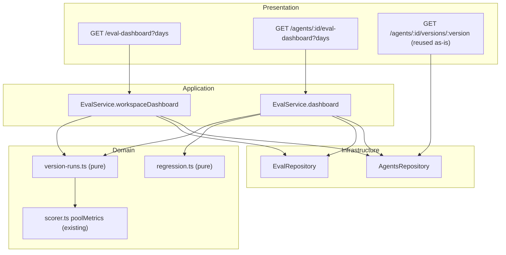

# Implementation Plan — Eval Dashboard
Spec: [SPEC-04-eval-dashboard](../../specs/SPEC-04-eval-dashboard.md) (finalized, 39 EARS acceptance criteria)

## Execution mode

**Single-agent (sequential).** One implementer executes **T1 → T28 in the listed order** — the
order is a valid topological sort, so the `(depends on: …)` notes are informational (they
explain *why* a task sits where it does), not a scheduling instruction. There is no
parallelization and no `[P]` marker in this plan; several tasks deliberately share a file
(T5/T6 both own `service.ts`; T15/T20/T23 all own `AgentEvalView.tsx`), which is safe precisely
because execution is serial.

**One out-of-band check:** the version-skew verification (step 5 of *End-to-end verification*)
is run **immediately after T15**, not at the end — see the callout under T15 for why.

## Context & module map

Two modules, no new package:

- **`server/` (`@devdigest/api`)** — the `eval` module (`server/src/modules/eval/`) gains a
  derived **version run** aggregation, a deterministic regression banner, a range filter, and
  one new workspace-scoped route. The `agents` module is **read-only reuse**:
  `GET /agents/:id/versions/:version` (`server/src/modules/agents/routes.ts:143-152`) already
  returns the config snapshot including `config.system_prompt`.
- **`client/` (`@devdigest/web`)** — two new App Router routes (`/eval-dashboard`,
  `/eval-dashboard/[agentId]`), a Compare modal, a sidebar entry, and reuse of the existing
  chart primitives.
- **`@devdigest/shared`** — vendored **twice**
  (`server/src/vendor/shared/contracts/eval-ci.ts`, `client/src/vendor/shared/contracts/eval-ci.ts`),
  no automated sync. Both copies are owned by one task (T1) so they cannot drift.
- `reviewer-core/` and `e2e/` are **not touched**.

### What already exists (verified, not aspirational)

| Thing | Evidence |
| --- | --- |
| `eval_runs` with `agent_version`, `cost_usd`, `ran_at` + the six raw counts | `server/src/db/schema/eval.ts:22-51` (`agentVersion:37`, `costUsd:36`, `matched…dropped:43-48`) |
| `poolMetrics()` — the one pooling function the live scorer uses | `server/src/modules/eval/scorer.ts:158`; `aggregateRunRows()` at `:219` already pools persisted rows through it |
| "latest run per case within one agent version" rule | `server/src/modules/eval/service.ts:119` (`deduplicateLatestPerCase`) |
| Agent dashboard route + service | `server/src/modules/eval/routes.ts:87`, `server/src/modules/eval/service.ts:365` |
| `alert` field on the contract, always `null` today | `server/src/vendor/shared/contracts/eval-ci.ts:163`; hard-coded `alert: null` at `service.ts:464` |
| Repo reads | `repository.ts:61` `listCasesForOwner`, `:174` `latestRunPerCase`, `:197` `runsForAgentVersion`, `:216` `distinctAgentVersionsWithRuns` |
| Version snapshots carry the system prompt | `server/src/modules/agents/repository.ts:170-190` (`config_json.system_prompt:180`); contract `AgentVersion` / `AgentVersionConfig` at `server/src/vendor/shared/contracts/knowledge.ts:251-270` |
| Chart primitives | `client/src/vendor/ui/charts/Sparkline.tsx`, `LineChart.tsx`, `MetricCard.tsx` |
| `activeKeyFor` already maps `/eval*` → `"eval"` | `client/src/components/app-shell/helpers.ts:36` — but `nav.ts` has **no** `eval` item (`client/src/vendor/ui/nav.ts:28-36`) |
| The client-driven per-case sweep pattern (the model for AC-35/36/37) | `client/src/app/agents/[id]/_components/AgentEditor/_components/EvalsTab/EvalsTab.tsx:145-165` |
| The disabled "View full dashboard →" placeholder this spec supersedes (SPEC-03 AC-37) | `client/src/app/agents/[id]/_components/AgentEditor/_components/EvalsTab/EvalsTabView.tsx:194-196` |
| i18n namespace `eval` | `client/messages/en/eval.json` (already has a `page.crumbEvalDashboard` key) |

### Gaps found during exploration (decide once, in T1/T2, not per task)

1. **No repository read spans a whole workspace.** `listCasesForOwner` requires one
   `ownerId` (`repository.ts:61`), and `runsForAgentVersion` requires one version
   (`:197`). The workspace route (AC-2) and the all-versions trend (AC-18) both need
   new reads. → T2.
2. **The workspace route needs an envelope shape** the spec does not name: it returns the
   agent summaries *and* the cross-agent run list. Plan decision: a third exported object,
   `EvalWorkspaceDashboard = { agents: EvalAgentSummary[], version_runs: EvalVersionRun[] }`.
   No new fields beyond what the spec's two tables define.
3. **No `GitCompare`/`Columns` icon exists** in `client/src/vendor/ui/icons.tsx` (checked
   the lucide import list, lines 4-83). Use a registered one — `Layers` or `Workflow` — for
   the Compare button; `Gauge:58` for the sidebar item, `Play:43` for Run, `Calendar:11` for
   the range picker.

## Requirements (WHAT & WHY)

A team lead opens **Eval Dashboard** from the sidebar and sees, in one place: every agent
that owns at least one eval case, its model, its last-measured metrics (explicitly labelled
with the version they were measured on), a recall sparkline, and a cross-agent list of recent
eval **version runs** with cost. Drilling into an agent gives metric cards with deltas, a
metric trend spanning all agent versions in range, a 7/30/90-day range picker, a
deterministic regression banner, and a Recent Runs table whose rows can be ticked two at a
time to open a **Compare** modal showing metric/cost deltas plus a line-level diff of the two
versions' system prompts. Evals can be re-run from the page — one agent or all agents — with
live per-case progress.

Why: SPEC-03's regression suite is only visible one agent at a time, only for the current
version, with no history and no way to attribute a regression to a prompt edit.

**Hard boundaries, already decided in the spec — do not re-litigate:**

- **No schema change, no migration.** A "run" is a *derived* eval **version run**: the pooled
  latest `eval_runs` row per case within one `agent_version`. `batch_id` was rejected.
- **No LLM call anywhere in this feature.** The banner is composed in code.
- **Run eval / Run all agents** = client-driven sequential loop over the existing per-case
  route `POST /agents/:id/eval-runs` with `{ case_ids: [one] }`. No server-side run-all route.
- **No Promote button**, no restore/promote route.
- One new route (`GET /eval-dashboard`), one extended (`GET /agents/:id/eval-dashboard`), one
  reused as-is (`GET /agents/:id/versions/:version`).
- The range picker filters the **trend and the run list only** — never the metric cards.

## Affected modules & files

**server/ — new**
- `server/src/modules/eval/version-runs.ts` — pure: version-run grouping, trend builder, range filter, delta selection
- `server/src/modules/eval/regression.ts` — pure: deterministic banner composer

**server/ — modified**
- `server/src/vendor/shared/contracts/eval-ci.ts` — `EvalVersionRun`, `EvalAgentSummary`, `EvalWorkspaceDashboard`; `EvalDashboard` gains `measured_version` + `version_runs`; `EvalTrendPoint` gains `agent_version`
- `server/src/modules/eval/repository.ts` — `listAgentCasesForWorkspace`, `runsForCases`
- `server/src/modules/eval/service.ts` — extend `dashboard()`, add `workspaceDashboard()`, add version-run DTO mappers
- `server/src/modules/eval/routes.ts` — `GET /eval-dashboard`; `days` query validation on both dashboard routes

**client/ — new**
- `client/src/app/eval-dashboard/page.tsx` + `_components/EvalDashboardView/**` (agent cards, cross-agent run list)
- `client/src/app/eval-dashboard/[agentId]/page.tsx` + `_components/AgentEvalView/**` (banner, metric cards, trend, Recent Runs, Compare modal)
- `client/src/app/eval-dashboard/_components/**` shared across the two routes (metric bar cell, version chip, range picker)
- `client/src/lib/hooks/eval-dashboard.ts` — workspace dashboard + agent version query hooks

**client/ — modified**
- `client/src/vendor/shared/contracts/eval-ci.ts` — mirror of the server contract change (T1)
- `client/src/vendor/ui/nav.ts` — `eval` item in `SKILLS LAB` + `g e` shortcut
- `client/src/lib/hooks/evals.ts` — `useEvalDashboard(agentId, days)`
- `client/messages/en/eval.json` — new `dashboardPage` / `agentScreen` / `compare` / `banner` keys
- `client/src/app/agents/[id]/_components/AgentEditor/_components/EvalsTab/EvalsTabView.tsx` — enable the "View full dashboard →" link

## Architecture & layer placement

Onion, server side:

- **Domain** — `@devdigest/shared` Zod contracts (`EvalVersionRun`, `EvalAgentSummary`,
  `EvalWorkspaceDashboard`) and the two new **pure** modules `version-runs.ts` and
  `regression.ts`. Both take plain rows/numbers in and return plain data — **no Drizzle, no
  Fastify, no container import**, exactly like `scorer.ts` (`server/src/modules/eval/scorer.ts:1-7`).
- **Application** — `EvalService.dashboard()` / `EvalService.workspaceDashboard()`: fetch via
  repo ports, call the pure helpers, map to DTOs. No SQL, no `reply`.
- **Infrastructure** — `EvalRepository` gains two reads; `AgentsRepository` is reused
  unchanged via `container.agentsRepo` (`server/src/platform/container.ts:109`).
- **Presentation** — `routes.ts`: `days` validated at the boundary with a Zod enum before it
  reaches the service (AC-21); workspace scoping via `getContext` exactly as every other route.

**Layer-boundary risks to watch:**
1. **DTO mapping is mandatory.** The service must never return raw Drizzle camelCase rows —
   `api.get<T>` on the client is an unchecked cast (server INSIGHTS + client INSIGHTS both
   record this exact SPEC-03 bug). Every version run leaves the service through a mapper,
   mirroring `toEvalRunRecord` (`service.ts:91`).
2. **`poolMetrics` must not be re-implemented** in `version-runs.ts` — import it from
   `scorer.ts` (AC-7). A second pooling implementation is the one way the dashboard number can
   drift from the post-run number.
3. The prompt **diff is client-side** (spec: "computed client-side") — a pure helper in the
   modal's folder, no server involvement.



## Insights to apply (from INSIGHTS.md)

- **[server]** *Raw Drizzle camelCase rows returned where the client types a snake_case
  contract typecheck clean and break at runtime* — `api.get<T>` is an unchecked cast and
  several contract fields are `z.unknown()`. Route every new service exit through a DTO
  mapper (the SPEC-03 fix was `toEvalCaseDto`, `service.ts:73`). Applies to T5, T6.
- **[server]** *A ratio cannot be re-aggregated — pool the raw counts.* The whole reason
  migration `0017` exists. `version-runs.ts` pools `matched`/`expected_total`/`produced`/
  `false_positives`/`kept`/`dropped` through `poolMetrics`, never averages `recall` columns.
  Applies to T3.
- **[server]** *Never re-derive a verdict the scorer already emitted.* `cases_passed` counts
  `eval_runs.pass === true`, never `recall > 0`. Applies to T3.
- **[server]** *Adding a required field to a vendored contract breaks fixtures outside `src/`* —
  grep the whole `server/` tree including `server/test/*.test.ts` for `EvalDashboard` /
  `EvalTrendPoint` before declaring "no construction sites". Applies to T1.
- **[client]** *Version skew is the normal state, not a bug.* Any agent config save except
  `enabled` bumps `agents.version`, so the current version usually has zero runs. The old
  Evals tab correctly painted `—`; SPEC-04's answer is the last-measured version + an explicit
  label. Do **not** relax the "count of observations" gate. Applies to T5, T15, T19.
- **[client]** *"No data" and "scored zero" must not share a glyph.* Gate the empty state on
  the count of runs behind the aggregate, never on `cases_total`. Applies to T15, T19 (AC-15).
- **[client]** *One `useMutation` instance's `isPending` broadcast to N triggers makes one
  action look like N.* Derive per-target pending state from the mutation's `variables`
  (`EvalsTab.tsx:162-165`). Applies to T22 (AC-37).
- **[client]** *Sidebar wiring is split across two files* — `activeKeyFor`
  (`helpers.ts:36`, already returns `"eval"`) and `nav.ts` (`NAV`, has no `eval` item). Only
  `nav.ts` makes the route clickable. Applies to T12.
- **[client]** *Plan-specified icon names are not guaranteed to exist* — grep
  `client/src/vendor/ui/icons.tsx`'s import list first. There is **no `GitCompare`**. Applies
  to T12, T20.
- **[client]** *Both vendored contract copies must change together* — server-only edits pass
  server typecheck and break client typecheck. Applies to T1.
- **[client]** *`api.post` sends no body at all when the body is falsy* — the per-case sweep
  must always pass `{ case_ids: [id] }` (truthy), never `undefined`. Applies to T22.
- **[client]** *Keep one render path; don't early-return a stripped layout for edge states* —
  vary only the content inside the card area. Applies to T14, T19.

## Task breakdown

### [x] T1 — Contracts: `EvalVersionRun`, `EvalAgentSummary`, `EvalWorkspaceDashboard` + `EvalDashboard` additions (module: shared/vendored, both copies)
> **Done.** Both vendored copies updated (byte-identical in the changed region); client typecheck clean, `server/test/contracts.test.ts` green (8/8). **Known transitional breakage:** adding the new *required* contract fields leaves `server` typecheck red at `service.ts:380,435,456` until **T5** rewrites those construction sites. Expected — T2/T3/T4 do not touch `service.ts`. Server typecheck must be green again at the end of T5; if it is not, stop.
- Scope: In **both** vendored copies, add `EvalVersionRun` (`agent_id`, `agent_name`,
  `agent_version`, `ran_at`, `recall`, `precision`, `citation_accuracy`, `cases_passed`,
  `cases_total`, `cost_usd: z.number().nullable()`), `EvalAgentSummary` (`agent_id`, `name`,
  `model`, `cases_total`, `current_version`, `measured_version: z.number().int().nullable()`,
  `latest: EvalVersionRun.nullable()`, `sparkline: z.array(z.number())`), and the envelope
  `EvalWorkspaceDashboard = { agents, version_runs }`. Extend `EvalDashboard` with
  `measured_version: z.number().int().nullable()` and `version_runs: z.array(EvalVersionRun)`.
  Add `agent_version: z.number().int()` to `EvalTrendPoint` (the trend is now one point per
  version). Do **not** touch `EvalDashboard.recent_runs` — SPEC-03's Evals tab depends on it.
  The two files must be byte-identical in the changed region.
- Files owned: `server/src/vendor/shared/contracts/eval-ci.ts`,
  `client/src/vendor/shared/contracts/eval-ci.ts`
- Skills to load: zod, typescript-expert
- Insights to apply: [client] both vendored copies or client typecheck breaks; [server] grep
  the whole `server/` tree — **including `server/test/*.test.ts`** — for `EvalDashboard` /
  `EvalTrendPoint` literal `.parse({…})` fixtures before adding a required field; add the new
  required keys to any fixture found.
- Tests owned by: test-writer (T25)
- Done when: `pnpm typecheck` clean in **both** `server/` and `client/`; existing
  `server/test/contracts.test.ts` still green.

### [x] T2 — Repository: workspace-wide case read + all-runs-for-cases read  (module: server)  (depends on: T1)
> **Done.** `listAgentCasesForWorkspace` + `runsForCases` added to `EvalRepository`; no existing method changed. No new typecheck errors (the 3 known `service.ts` ones remain, T5's job). Server suite: 252 passed, 12 skipped; the two failing `conventions` suites are a pre-existing bug already recorded in `server/INSIGHTS.md`, unrelated to this plan.
- Scope: Add to `EvalRepository`: (a) `listAgentCasesForWorkspace(workspaceId)` — every
  `eval_cases` row with `ownerKind = 'agent'` in the workspace (AC-2's source of "agents that
  have evals"); (b) `runsForCases(caseIds)` — **all** runs for those cases across **all**
  agent versions, ordered `ran_at DESC`, so the caller can group in memory (AC-18's "all
  versions", and the existing `eval_runs_case_id_idx` index covers the `inArray` filter).
  Do not add a `days` filter here — range filtering is a pure in-memory step (T3), which keeps
  the metric cards range-independent (AC-22). No new query for versions: `runsForCases`
  supersedes per-version fan-out for the dashboard paths; leave `runsForAgentVersion` and
  `distinctAgentVersionsWithRuns` in place (still used).
- Files owned: `server/src/modules/eval/repository.ts`
- Skills to load: drizzle-orm-patterns, postgresql-table-design, onion-architecture, typescript-expert
- Insights to apply: none task-specific
- Tests owned by: test-writer (T25)
- Done when: `pnpm typecheck` clean; server suite still green.

### [x] T3 — Pure `version-runs.ts`: grouping, pooling, trend, range, delta  (module: server)  (depends on: T1)
> **Done.** Pure module, imports only `./scorer.js` + `./types.js` (no Drizzle/Fastify/container). Raw counts pooled through the existing `poolMetrics`; `cases_passed` counts `pass === true`. Internal `VersionRun` carries `false_positives` for T4.
> **Plan contradiction resolved (confirmed by orchestrator):** the task named the signature `groupVersionRuns(rows, casesTotal)` but also required the null-`agent_version` fallback to the current version, while defining `cases_total` as "distinct cases folded in" — i.e. computed **per group**. Both cannot be the 2nd parameter. Implemented as `groupVersionRuns(rows, currentVersion)`, with `cases_total` derived per version group. T5/T6 must call it accordingly.
- Scope: New pure module (no Drizzle / Fastify / container imports — same constraints as
  `scorer.ts:1-7`). Exports:
  - `groupVersionRuns(rows: EvalRunRow[], casesTotal: number)` → one entry per `agent_version`:
    take the **latest run per case within that version** (reuse the dedupe rule at
    `service.ts:119`), `ran_at` = newest of those, `cost_usd` = sum of the non-null `cost_usd`
    (null when none reported — AC's "cost missing" edge case), metrics = **`poolMetrics()`
    imported from `./scorer.js`** over the pooled raw counts (AC-6, AC-7), `cases_passed` =
    count of `pass === true` among them, `cases_total` = number of distinct cases folded in.
    Rows with a null `agent_version` fall back to the caller-supplied current version. Result
    sorted **newest-first by `ran_at`** (AC-9) and **unique by version** (AC-23).
  - `filterByDays(versionRuns, days, now)` → range filter used for the trend and the run list
    only (AC-20).
  - `buildTrend(versionRuns)` → one point per version, ordered **chronologically ascending by
    `ran_at`** (AC-16, AC-17), each point carrying `agent_version`.
  - `measuredVersions(versionRuns)` → `{ measured, previous }`, the two most recently measured
    versions (AC-13, AC-14 — never a measured-vs-unmeasured-current delta).
  - `metricDelta(measured, previous)` → `{ recall, precision, citation_accuracy }` or `null`
    when there is no previous measured version.
  Not in scope: any DB access, the banner text, HTTP shapes.
- Files owned: `server/src/modules/eval/version-runs.ts`
- Skills to load: onion-architecture, typescript-expert, zod
- Insights to apply: [server] pool the **raw counts** through the existing `poolMetrics` —
  never average the stored `recall`/`precision` columns (a quotient can't be re-aggregated);
  [server] never re-derive pass/fail — count `pass === true`, do not infer it from metrics.
- Tests owned by: test-writer (T25)
- Done when: `pnpm typecheck` clean; the file imports nothing outside `./scorer.js`,
  `./types.js` and `@devdigest/shared`.

### [x] T4 — Pure `regression.ts`: deterministic banner composer  (module: server)  (depends on: T1)
> **Done.** `composeRegressionBanner({ measured, previous })`; only import is `./version-runs.js` — no LLM/Drizzle/Fastify/container. Compares metrics in **whole percentage points** (avoids float-epsilon compares), flags a regression at ≥1pt, appends the false-positive clause only when the pooled `false_positives` actually rose, names improved metrics, returns `null` when nothing regressed or there is no previous measured version.
- Scope: New pure module. `composeRegressionBanner({ measured, previous })` → `string | null`.
  Rules: a metric regressed when it is **≥ 1 percentage point below** the previous measured
  version (AC-30); the sentence names each regressed metric, the drop in points, and the
  version it regressed on; **if precision regressed AND `false_positives` on the measured
  version run exceeds the previous one, say so** using the persisted counter (AC-31 — so the
  grouping in T3 must carry the pooled `false_positives` through; add it to the internal
  version-run type, it is not part of the wire contract); improved metrics are named alongside
  (AC-32); returns `null` when nothing regressed or there is no previous measured version
  (AC-34). Template-composed in code — **no LLM, no `container.llm`, no prompt** (AC-33).
  Target shape (mock 02): `Precision dipped 2pts on v7 — a new false positive slipped in.
  Recall and citation both up.`
- Files owned: `server/src/modules/eval/regression.ts`
- Skills to load: onion-architecture, typescript-expert
- Insights to apply: none task-specific
- Tests owned by: test-writer (T25)
- Done when: `pnpm typecheck` clean; zero adapter/container imports in the file.

### [x] T5 — Service: extend `dashboard()` (measured_version, version_runs, trend, alert, days)  (module: server)  (depends on: T2, T3, T4)
> **Done — server typecheck back to GREEN (0 errors, verified independently by the orchestrator).** The T1→T5 contract transaction is closed. `toEvalVersionRunDto` added next to `toEvalRunRecord`; internal `false_positives` never reaches the wire. `current`/`delta`/`measured_version` derive from the latest **measured** version, independent of `days`; `version_runs`/`trend` are range-filtered; `alert` now composed by T4 instead of the old hard-coded `null`. `recent_runs` keeps its SPEC-03 per-case shape. Dead code removed (`aggregateRunRows` import, local `deduplicateLatestPerCase` — superseded by T3). Tests: 252 passed; the 2 failing `conventions` suites are the pre-existing `uuid: "system"` bug in `server/INSIGHTS.md`, unrelated.
- Scope: Rewrite `EvalService.dashboard(workspaceId, agentId, days)`:
  fetch cases → `runsForCases` → `groupVersionRuns` → `measuredVersions`. `current` +
  `delta` + `measured_version` come from the **latest measured version** and the previous
  measured one, **independently of `days`** (AC-11, AC-13, AC-14, AC-22). `version_runs` and
  `trend` come from `filterByDays(...)` + `buildTrend(...)` (AC-16/17/18/20). `alert` =
  `composeRegressionBanner(...)` (AC-30…34) — replaces the hard-coded `alert: null` at
  `service.ts:464`. `recent_runs` (per-**case** runs) keeps its current meaning and shape —
  SPEC-03's Evals tab reads it. Zero-case agent: unchanged early return, plus
  `measured_version: null`, `version_runs: []`. Add a `toEvalVersionRunDto(...)` mapper next to
  `toEvalRunRecord` (`service.ts:91`) and route **every** version run through it.
- Files owned: `server/src/modules/eval/service.ts` (T6 owns the same file — do T5 first, then
  T6; safe because execution is sequential)
- Skills to load: fastify-best-practices, onion-architecture, zod, security, typescript-expert
- Insights to apply: [server] DTO mapper between repository rows and the HTTP response — a
  raw camelCase row typechecks against the snake_case contract and breaks at runtime;
  [client/server] version skew is expected — the metrics reported are the last **measured**
  version's, labelled, never silently the current config's.
- Tests owned by: test-writer (T26)
- Done when: `pnpm typecheck` clean; server suite green; the agent dashboard route returns
  `measured_version` + `version_runs` + a version-per-point `trend`.

### [x] T6 — Service: `workspaceDashboard()` — agent summaries + cross-agent version runs  (module: server)  (depends on: T5)
> **Done.** Typecheck clean, suite at baseline (252 passed). Three reads total — agents + workspace cases in parallel, then one `runsForCases` over the union of case ids; all grouping in memory, no per-agent round trips. Only agents with ≥1 case are returned; never-run agents get `measured_version: null` / `latest: null` / empty sparkline. Every version run leaves through `toEvalVersionRunDto` — internal `false_positives` never crosses the wire.
- Scope: New `EvalService.workspaceDashboard(workspaceId, days)`. List the workspace's agents
  (`container.agentsRepo`), list all agent-owned eval cases
  (`listAgentCasesForWorkspace`), keep **only agents with ≥ 1 case** (AC-2 — an agent with zero
  cases is invisible), then one `runsForCases` over the union of case ids, grouped per agent by
  `groupVersionRuns`. Per agent produce an `EvalAgentSummary`: `current_version` =
  `agents.version`; `measured_version` + `latest` = the newest version run (both `null` when the
  agent has never been run — AC-4); `sparkline` = the in-range version runs' `recall` values in
  chronological order (empty array when none). The cross-agent `version_runs` list = every
  agent's in-range version runs, merged and sorted **newest-first by `ran_at`** (AC-8, AC-9),
  each carrying `agent_id` + `agent_name`. All output through the T5 DTO mapper.
- Files owned: `server/src/modules/eval/service.ts` (same file as T5 — sequential)
- Skills to load: fastify-best-practices, onion-architecture, zod, security, typescript-expert
- Insights to apply: [server] DTO mapper on every exit path; keep the read count small — one
  agents query, one cases query, one runs query, then in-memory grouping (the spec's < 300 ms
  p95 non-functional target).
- Tests owned by: test-writer (T26)
- Done when: `pnpm typecheck` clean; server suite green.

### [x] T7 — Routes: `GET /eval-dashboard` + `days` validation on both dashboard routes  (module: server)  (depends on: T5, T6)
> **Done — server side (T1–T7) complete.** Typecheck clean, suite at baseline. Verified with real curls against :3001 — `?days=30` and no-`days` → 200 with the same payload; `days=abc` and `days=9999` → **422 at the route boundary**, before any query. Response keys confirmed **snake_case** (the SPEC-03 camelCase leak did not recur; typecheck cannot catch that one).
- Scope: In `eval/routes.ts`: add `GET /eval-dashboard` (workspace-scoped via `getContext`,
  like every other route in the module) returning `EvalWorkspaceDashboard`; add a
  `DaysQuery = z.object({ days: z.coerce.number().int().pipe(z.union([z.literal(7), z.literal(30), z.literal(90)])).default(30) })`
  — or an equivalent explicit allow-list — to **both** dashboard routes, so an absent `days`
  yields the 30-day default and `days=abc` / `days=9999` are **rejected at the route boundary
  with a 4xx before reaching any query** (AC-21). Pass the validated `days` into the service.
  An agent id from another workspace must still resolve to 404 (the existing `NotFoundError`
  path in `service.dashboard` already does this — do not weaken it).
- Files owned: `server/src/modules/eval/routes.ts`
- Skills to load: fastify-best-practices, onion-architecture, zod, security, typescript-expert
- Insights to apply: none task-specific
- Tests owned by: test-writer (T26)
- Done when: `pnpm typecheck` clean; `curl "localhost:3001/eval-dashboard?days=30"` returns the
  envelope, `?days=abc` and `?days=9999` return 4xx, no `days` behaves as 30.

### [x] T8 — Client hooks: workspace dashboard, ranged agent dashboard, agent version  (module: client)  (depends on: T1, T7)
> **Done.** Client typecheck clean. `useEvalWorkspaceDashboard(days)`, `useAgentVersion(agentId, version)` (`retry: false`, error exposed so the Compare modal can degrade on 404 — AC-27), and `useEvalDashboard(agentId, days)` now range-aware. `days` defaults to **30** rather than being required, so SPEC-03's existing `EvalsTab.tsx:29` call site keeps compiling without editing a file outside this task's scope. Query keys are stable, prefix-compatible arrays.
- Scope: New `client/src/lib/hooks/eval-dashboard.ts`:
  `useEvalWorkspaceDashboard(days)` → `GET /eval-dashboard?days=`, key
  `["eval-workspace-dashboard", days]`; `useAgentVersion(agentId, version)` →
  `GET /agents/:id/versions/:version` (`AgentVersion` contract), `enabled` only when both are
  set, and **must not throw the page down on 404** — expose the error so the modal can degrade
  (AC-27). In `client/src/lib/hooks/evals.ts`, extend `useEvalDashboard(agentId, days)` to send
  `?days=` and include `days` in the query key. Every call goes through `src/lib/api.ts` — no
  bare `fetch`.
- Files owned: `client/src/lib/hooks/eval-dashboard.ts`, `client/src/lib/hooks/evals.ts`,
  `client/src/lib/hooks/index.ts`
- Skills to load: react-best-practices, react-component-architecture, next-best-practices, security, typescript-expert
- Insights to apply: [client] `api.get<T>` is an unchecked cast, not a boundary check — the
  first real browser/curl of the new endpoints' JSON is part of "done"; [client] query keys
  must be stable arrays so `invalidateQueries` after a run repaints the right cards.
- Tests owned by: test-writer (T27)
- Done when: `pnpm typecheck` clean in `client/`.

### [x] T9 — i18n: `eval.json` copy for the dashboard, agent screen, banner and compare modal  (module: client)  (depends on: none)
> **Done.** `overviewPage`, `agentScreen`, `compareModal` sections added to the existing `eval` namespace (+ a `table.version` header). **Banner is NOT localized by design:** the server composes the full sentence (T4) and the client renders it verbatim, so no banner fragment keys exist.
> **Orchestrator correction:** the implementer also added a `compareModal.promote` key — removed. `Promote` is an explicit **Non-goal**; leaving the key would invite T19 to render the forbidden button.
- Scope: Extend the existing `eval` namespace (do **not** create a new file — `page.crumbEvalDashboard`
  already exists there) with the copy the mocks show: page title + subtitle ("Regression harness
  across all reviewer agents · pick an agent to see its runs"), `AGENTS` / `RECENT EVAL RUNS ·
  ALL AGENTS` section labels, `Run all agents`, `Run eval`, the agent-screen subtitle, range
  options (7/30/90 days), column headers (`RAN AT`/`VERSION`/`RECALL`/`PRECISION`/`CITATION`/
  `PASS`/`COST`), `N selected`, `Compare`, the compare modal's title/subtitle/`Close`, `SYSTEM
  PROMPT DIFF`, `no prompt changes` (AC-26), `prompt unavailable` (AC-27), `last measured on
  v{version}` (AC-12), `not scored on the current version`, the empty states ("no runs in the
  last {days} days", the zero-agent empty state pointing at the Agent Editor's Evals tab), and
  the regression banner's composable fragments if the banner is localized (otherwise the server
  string is rendered verbatim — pick one and note it in the task's commit message).
- Files owned: `client/messages/en/eval.json`
- Skills to load: typescript-expert
- Insights to apply: none task-specific
- Tests owned by: n/a
- Done when: `pnpm build` in `client/` clean (no missing-key warnings from next-intl).

### [x] T10 — Shared route-local presentational primitives (metric bar cell, version chip, pass cell, cost cell)  (module: client)  (depends on: none)
- Scope: `client/src/app/eval-dashboard/_components/` — small presentational pieces used by
  **both** routes' run tables: `MetricBar` (a coloured horizontal bar + `NN%`, colours per the
  mock: recall blue, precision green, citation amber — reuse the existing shared recall/
  precision/citation colour tokens rather than inventing hex codes), `VersionChip` (blue text,
  **non-interactive** — no `href`, no `onClick`, AC-10), `PassCell` (`17/20`), `CostCell`
  (`$0.23`, renders `—` — never `$0.00` — when `cost_usd` is null). Presentational only: typed
  props, no hooks, no data fetching. Constants in `constants.ts`, styles in `styles.ts`
  (`satisfies CSSProperties`), barrel `index.ts` exporting only the components.
- Files owned: `client/src/app/eval-dashboard/_components/MetricBar/**`,
  `client/src/app/eval-dashboard/_components/VersionChip/**`,
  `client/src/app/eval-dashboard/_components/RunCells/**`
- Skills to load: react-best-practices, react-component-architecture, next-best-practices, security, typescript-expert
- Insights to apply: [client] never inline `style={{}}` objects in JSX — extract to `styles.ts`;
  [client] "no data" (`—`) and "scored zero" (`0%`) must not share a glyph.
- Tests owned by: test-writer (T27)
- Done when: `pnpm typecheck` clean.

### [x] T11 — Range picker component (7 / 30 / 90 days)  (module: client)  (depends on: T9)
- Scope: `client/src/app/eval-dashboard/_components/RangePicker/` — a controlled
  `{ value: 7|30|90, onChange }` picker with the `Calendar` icon (registered at
  `icons.tsx:11`), defaulting to 30 (AC-19). Presentational; the owning page holds the state
  (URL search param preferred — range is URL-dependent state per `react-best-practices`).
  Export the `EvalRangeDays` union type from its `constants.ts` for the pages to import.
- Files owned: `client/src/app/eval-dashboard/_components/RangePicker/**`
- Skills to load: react-best-practices, react-component-architecture, next-best-practices, typescript-expert
- Insights to apply: [client] verify every icon name against `client/src/vendor/ui/icons.tsx`'s
  import list before using it — there is no `GitCompare`; `Calendar`, `Play`, `Gauge`,
  `Layers`, `Workflow` all exist.
- Tests owned by: test-writer (T27)
- Done when: `pnpm typecheck` clean.

### [x] T12 — Sidebar: `Eval Dashboard` nav entry + shortcut  (module: client)  (depends on: none)
- Scope: Add `{ key: "eval", label: "Eval Dashboard", icon: "Gauge", href: "/eval-dashboard",
  gKey: "e" }` to the `SKILLS LAB` group in `client/src/vendor/ui/nav.ts` (after `conventions`,
  per the mock) and the matching `SHORTCUTS` entry (AC-1). **Verify — do not blindly re-add —**
  that `activeKeyFor` (`client/src/components/app-shell/helpers.ts:36`) already returns
  `"eval"` for `/eval-dashboard`; it does, so no change is needed there. Do **not** add the
  mock's `GLOBAL` group items (Memory, Multi-Agent Review, Agent Performance, CI Runs) — they
  are other lessons.
- Files owned: `client/src/vendor/ui/nav.ts`
- Skills to load: react-component-architecture, next-best-practices, typescript-expert
- Insights to apply: [client] sidebar wiring is split across **two** files and only `nav.ts`
  makes a route clickable — `activeKeyFor` alone leaves the page unreachable; confirm the `gKey`
  letter is not already taken (`p`/`s`/`a`/`c`/`x`/`,` are).
- Tests owned by: test-writer (T27)
- Done when: `pnpm typecheck` clean; the item is visible and clickable in the sidebar.

### [x] T13 — Agent card component (`EvalAgentCard`)  (module: client)  (depends on: T1, T9, T10)
- Scope: One row-card per agent (mock 01): name, monospace model chip, the secondary line
  `Last run v7 · 2026-05-29 09:14 · 17/20 pass`, a recall `Sparkline`
  (`client/src/vendor/ui/charts/Sparkline.tsx`), and the right-aligned `RECALL` / `PREC` /
  `CITE` readouts, chevron on the right; the whole card activates → navigate (AC-3, AC-5).
  **AC-4:** an agent with cases but **zero** runs (`measured_version === null` / `latest ===
  null`) renders **without metrics and without a sparkline**, showing a `Run eval` CTA instead.
  **AC-12:** when `measured_version !== current_version`, label the metrics `last measured on
  v{N}`. Presenter only — takes `EvalAgentSummary` + `onRun` + `runningCaseCount` props; no
  fetching, no mutation.
- Files owned: `client/src/app/eval-dashboard/_components/EvalAgentCard/**`
- Skills to load: react-best-practices, react-component-architecture, next-best-practices, security, typescript-expert
- Insights to apply: [client] unmeasured must not render as `0%` — gate on the presence of a
  version run, not on `cases_total`; [client] agent names and model strings are user-authored —
  render as text, never as markup.
- Tests owned by: test-writer (T27)
- Done when: `pnpm typecheck` clean.

### [x] T14 — Cross-agent run list + `/eval-dashboard` page (container + presenter)  (module: client)  (depends on: T8, T9, T10, T11, T13)
- Scope: `client/src/app/eval-dashboard/page.tsx` (thin) + `_components/EvalDashboardView/`
  (container: `useEvalWorkspaceDashboard(days)`, loading/empty/error inside a **single render
  path**; presenter: header + `Run all agents` button + `AGENTS` section of `EvalAgentCard`s +
  the `RECENT EVAL RUNS · ALL AGENTS` table). Table columns per mock 01 **plus the COST column**
  (a deliberate spec deviation): agent name · ran-at · non-interactive version chip · recall bar
  · precision bar · citation bar · pass count · cost (AC-8), newest-first (AC-9). Empty
  workspace (no agent has any case) → an empty state pointing at the Agent Editor's Evals tab,
  which is the only place a case can be created. `Run all agents` is **disabled while no listed
  agent has any eval case** (AC-39). The sweep itself lands in T22 — wire the button to a
  handler prop here.
- Files owned: `client/src/app/eval-dashboard/page.tsx`,
  `client/src/app/eval-dashboard/_components/EvalDashboardView/**`
- Skills to load: react-best-practices, react-component-architecture, next-best-practices, security, typescript-expert
- Insights to apply: [client] keep one render path — do not early-return a stripped layout for
  loading/empty/error, or the page chrome disappears; [client] container fetches, presenter
  renders.
- Tests owned by: test-writer (T27)
- Done when: `pnpm typecheck` + `pnpm build` clean; the page renders the three sections against
  a real server response.

### [x] T15 — Agent screen: metric cards + version-skew label + regression banner  (module: client)  (depends on: T8, T9, T10, T11)
- Scope: `client/src/app/eval-dashboard/[agentId]/page.tsx` (thin) +
  `_components/AgentEvalView/` shell: back link (`‹ All agents`), title + model chip, subtitle,
  range picker, `Run eval` button, then the **regression banner** (amber warning, rendered
  verbatim from `dashboard.alert`, hidden when `alert === null` — AC-34) and the three
  `MetricCard`s (recall / precision / citation, `client/src/vendor/ui/charts/MetricCard.tsx`)
  with their deltas (AC-11, AC-13 — **no delta element at all** when `delta` is absent, not a
  `0.00`). **AC-12:** when `measured_version !== agent.version`, render the `last measured on
  v{N}` label next to the cards. **AC-15:** an agent with no runs at all renders the cards as
  `—`, never `0%`. The trend, the runs table and the compare modal arrive in T16–T20 — leave
  clearly-named slots.
- Files owned: `client/src/app/eval-dashboard/[agentId]/page.tsx`,
  `client/src/app/eval-dashboard/[agentId]/_components/AgentEvalView/AgentEvalView.tsx`,
  `.../AgentEvalView/index.ts`, `.../AgentEvalView/styles.ts`, `.../AgentEvalView/constants.ts`
- Skills to load: react-best-practices, react-component-architecture, next-best-practices, security, typescript-expert
- Insights to apply: [client] version skew is the normal state — show the last-measured
  version's numbers **with the version named**, never as the current config's score; [client]
  "no data" ≠ "scored zero"; [client] `params` is async in Next 15 — `await params` in the page.
- Tests owned by: test-writer (T27)
- Done when: `pnpm typecheck` clean; banner + cards render against a real response.

> ### ✅ Gate PASSED — version-skew check run after T15 (2026-07-15)
>
> Verified via the Agent Editor's Evals tab (shares `measured_version`/`alert`/delta data with
> the T15 dashboard screen): after bumping an agent v9 → v10, the card showed **"Showing scores
> last measured on agent v9 — current config is v10"**, the amber banner named v10 and prompted
> a re-run, and metric deltas were `+22pp` only where the new version actually changed behavior
> (`0pp` on the other two) — not blanked, not silently attributed to v10. Data model (T3/T5)
> confirmed sound. Second confirmation from the `/eval-dashboard` cross-agent page (T14): the
> Security Reviewer card also shows `last measured on v9` (orange), a correct recall/precision/
> citation sparkline, and the Recent Eval Runs table lists v9/v8/v7 newest-first with per-run
> cost — so `measured_version` flows correctly through T5/T6 → T8 hooks → T14 UI too. Still not
> yet re-verified on the single-agent `/eval-dashboard/[agentId]` screen (T15) itself; do so in
> the T28 end-to-end pass.
>
> ### ⛔ Gate — run the version-skew check **here**, immediately after T15 (do not defer it to T28)
>
> Run **step 5 of *End-to-end verification*** now, before starting T16:
> edit an agent's system prompt in the Agent Editor (this bumps `agents.version` and creates a
> current version with **zero** runs), then reload its Eval Dashboard agent screen and card.
> They must show the **previous measured version's numbers labelled `last measured on v<N>`** —
> **not** `—` everywhere, and **not** those numbers silently attributed to the new config.
>
> **Why here and not at the end:** every other verification step checks the UI. This one is the
> only step that can falsify the **data model** — the whole "eval version run" derivation, the
> `measured_version` vs `agents.version` split (T5), and the AC-14 rule that a delta is always
> between two *measured* versions. If any of that is wrong, it is wrong in T3/T5 and every task
> from T16 onward is built on top of the mistake; caught here, the blast radius is two tasks.
> Version skew is also the **normal** state of this system (`client/INSIGHTS.md` records it as a
> live, confirmed footgun), not an edge case — so this is the check most likely to actually fire.
> If it fails, fix T3/T5 before continuing; do not paper over it in the T15 presenter.

### [ ] T16 — Metric Trend chart  (module: client)  (depends on: T1, T9)
- Scope: `_components/MetricTrend/` — wraps the existing `LineChart`
  (`client/src/vendor/ui/charts/LineChart.tsx`, y-domain 0.6–1.0 by default, which matches
  mock 02) with three series (Recall / Precision / Citation) built from `dashboard.trend`
  (already one point per agent version, chronological — AC-16/17/18) plus the legend.
  **Empty range → the copy "no runs in the last {N} days", not an empty chart frame** (spec
  edge case). No new charting dependency.
- Files owned: `client/src/app/eval-dashboard/[agentId]/_components/MetricTrend/**`
- Skills to load: react-best-practices, react-component-architecture, next-best-practices, typescript-expert
- Insights to apply: none task-specific
- Tests owned by: test-writer (T27)
- Done when: `pnpm typecheck` clean.

### [ ] T17 — Recent Runs table with row selection  (module: client)  (depends on: T10, T9)
- Scope: `_components/RecentRunsTable/` — columns per mock 02: checkbox · `RAN AT` · non-
  interactive `VERSION` chip · recall bar · precision bar · citation bar · `PASS` · `COST`
  (AC-8, AC-10), fed from `dashboard.version_runs` (already range-filtered and newest-first
  server-side — do not re-sort or re-filter client-side). Selection state (a `Set<number>` of
  agent versions, or of `agent_version` keys) is owned here or lifted to `AgentEvalView`;
  header shows `N selected` and the **Compare** button, **enabled iff exactly two rows are
  selected** (AC-23). Because a version appears exactly once in the list, two selected rows are
  two different versions by construction — no same-version guard is needed.
- Files owned: `client/src/app/eval-dashboard/[agentId]/_components/RecentRunsTable/**`
- Skills to load: react-best-practices, react-component-architecture, next-best-practices, security, typescript-expert
- Insights to apply: [client] no `GitCompare` icon exists — use a registered one (`Layers` /
  `Workflow`); [client] don't use the array index as a React `key` — key rows by
  `agent_version`.
- Tests owned by: test-writer (T27)
- Done when: `pnpm typecheck` clean; Compare is disabled at 0/1/3+ selections and enabled at 2.

### [ ] T18 — Pure system-prompt diff helper (line-level)  (module: client)  (depends on: none)
- Scope: `client/src/app/eval-dashboard/[agentId]/_components/CompareRunsModal/helpers.ts` —
  `diffPromptLines(oldPrompt: string, newPrompt: string): DiffLine[]` where
  `DiffLine = { kind: 'same' | 'add' | 'del'; text: string }`. A simple LCS or
  common-prefix/suffix + middle-block diff is sufficient — **no new dependency** unless one is
  already installed (grep `client/package.json` first; if a diff lib is already a dependency,
  reuse it). Pure functions only, no React imports (`helpers.ts` rule). Also export
  `promptsAreIdentical(old, new)` so the modal can render the "no prompt changes" state (AC-26)
  rather than an empty diff pane.
- Files owned: `client/src/app/eval-dashboard/[agentId]/_components/CompareRunsModal/helpers.ts`
- Skills to load: typescript-expert
- Insights to apply: none task-specific
- Tests owned by: test-writer (T27)
- Done when: `pnpm typecheck` clean; the file imports no React and no new package.

### [ ] T19 — Compare modal: metric + cost deltas, prompt diff, degraded states  (module: client)  (depends on: T8, T9, T17, T18)
- Scope: `_components/CompareRunsModal/CompareRunsModal.tsx` (+ `styles.ts`, `constants.ts`,
  `index.ts`). Opens with the two selected **version runs** (metrics and cost already loaded
  from the dashboard response — do not refetch them). Renders the four delta cards
  (`RECALL`, `PRECISION`, `CITATION`, `COST`) as `old → new` with the delta and its direction
  (AC-24), then fetches both versions' snapshots via `useAgentVersion(agentId, version)` and
  renders the **line-level system-prompt diff** (AC-25) as **plain text** — monospace `<pre>`/
  `<div>`, **never** through the shared `Markdown` component and **never**
  `dangerouslySetInnerHTML` (AC-28; system prompts are arbitrary text with code fences and
  angle brackets — data, not markup). Identical prompts → "no prompt changes" copy (AC-26). A
  404 (or any error) on either version → **still render the metric/cost deltas**, replace only
  the diff pane with "prompt unavailable" (AC-27). Footer: **`Close` only — no `Promote`
  button, and no promote/restore call anywhere** (AC-29).
- Files owned: `client/src/app/eval-dashboard/[agentId]/_components/CompareRunsModal/CompareRunsModal.tsx`,
  `.../CompareRunsModal/styles.ts`, `.../CompareRunsModal/constants.ts`,
  `.../CompareRunsModal/index.ts`
- Skills to load: react-best-practices, react-component-architecture, next-best-practices, security, typescript-expert
- Insights to apply: [client] untrusted-ish text (workspace-authored prompts) is rendered as
  text — the shared `Markdown` component exists and is safe, but AC-28 forbids it here;
  [client] trap focus + Escape + a visible Close in the modal; check `vendor/ui/kit/` for the
  existing `Modal` before building one.
- Tests owned by: test-writer (T27)
- Done when: `pnpm typecheck` clean; all four AC-24…AC-29 states reachable by hand.

### [ ] T20 — Wire the compare modal + trend + table into the agent screen  (module: client)  (depends on: T15, T16, T17, T19)
- Scope: Fill `AgentEvalView`'s slots: trend, Recent Runs table, and the modal's open/close +
  selected-pair plumbing. Range state lives in the URL search param and drives
  `useEvalDashboard(agentId, days)`, so changing it refetches and **both** the trend and the
  run list re-render, while the metric cards (server-computed, range-independent) stay put
  (AC-20, AC-22).
- Files owned: `client/src/app/eval-dashboard/[agentId]/_components/AgentEvalView/AgentEvalView.tsx`
  (same file as T15 — sequential after it)
- Skills to load: react-best-practices, react-component-architecture, next-best-practices, typescript-expert
- Insights to apply: [client] URL-dependent state (the range) belongs in search params, not
  component state; [client] `useSearchParams` needs a Suspense boundary in the App Router.
- Tests owned by: test-writer (T27)
- Done when: `pnpm typecheck` + `pnpm build` clean; changing the range visibly refilters the
  trend and the table while the cards stay populated.

### [ ] T21 — Agent selector dropdown on the agent screen  (module: client)  (depends on: T8, T13)
- Scope: The mock's `⚙ Security Reviewer ⌄` control: a dropdown listing the same agents the
  dashboard lists (those with ≥ 1 eval case), navigating to
  `/eval-dashboard/<agentId>` on select. Reuse the existing `Dropdown` from `vendor/ui/kit/`;
  no new fetch — reuse `useEvalWorkspaceDashboard`'s cached `agents`.
- Files owned: `client/src/app/eval-dashboard/[agentId]/_components/AgentSelector/**`
- Skills to load: react-best-practices, react-component-architecture, next-best-practices, typescript-expert
- Insights to apply: [client] check `vendor/ui/kit/` for an existing component before building
  a new one.
- Tests owned by: test-writer (T27)
- Done when: `pnpm typecheck` clean. (Wiring it into `AgentEvalView` happens in T20 if T21
  lands first; otherwise land it as a one-line prop addition in this task's final commit —
  coordinate with whoever owns `AgentEvalView.tsx`.)

### [ ] T22 — Run sweep hook: `Run eval` (one agent) and `Run all agents` (module: client)  (depends on: T8, T14)
- Scope: `client/src/app/eval-dashboard/_components/hooks/useEvalSweep.ts` — the client-driven
  sequential executor, modelled directly on the working
  `EvalsTab.handleRunAll` (`client/src/app/agents/[id]/.../EvalsTab/EvalsTab.tsx:145-165`):
  for each agent, for each of its case ids, `await` one
  `POST /agents/:id/eval-runs { case_ids: [oneId] }` (AC-35, AC-36 — agent by agent, case by
  case), with query invalidation after each case so the card/metrics repaint mid-sweep. A
  rejected case is **caught and skipped**, the sweep continues, and the failure is surfaced
  (AC-38). Progress state must be **per-target**: expose `runningAgentId` / `runningCaseId`
  derived from the in-flight identity — **never** wire one shared mutation's bare `isPending`
  into every card's `loading` prop. Needs the agents' case ids: fetch them per agent with the
  existing `useEvalCases(agentId)` (or add a lightweight per-agent case-id read) — do **not**
  add a server-side run-all endpoint.
- Files owned: `client/src/app/eval-dashboard/_components/hooks/useEvalSweep.ts`,
  `client/src/app/eval-dashboard/_components/hooks/index.ts`
- Skills to load: react-best-practices, react-component-architecture, next-best-practices, security, typescript-expert
- Insights to apply: [client] **one `useMutation`'s `isPending` broadcast to N triggers makes
  one action look like all N** — derive an identity-specific signal from the mutation's
  `variables` (AC-37); [client] `api.post` with a falsy body sends **no body at all** and 422s
  the route — always pass `{ case_ids: [id] }`.
- Tests owned by: test-writer (T27)
- Done when: `pnpm typecheck` clean; clicking one agent's `Run eval` spins only that agent.

### [ ] T23 — Wire the sweep into both pages  (module: client)  (depends on: T14, T20, T22)
- Scope: `Run all agents` (dashboard header) and `Run eval` (agent screen header + the zero-run
  agent card's CTA) call `useEvalSweep`. Per-agent/per-case progress renders **only** on the
  executing target (AC-37). `Run all agents` disabled when no listed agent has any case
  (AC-39). Failures surface without aborting (AC-38).
- Files owned: `client/src/app/eval-dashboard/_components/EvalDashboardView/EvalDashboardView.tsx`
  (same file as T14 — sequential), `client/src/app/eval-dashboard/[agentId]/_components/AgentEvalView/AgentEvalView.tsx`
  (same file as T15/T20 — sequential)
- Skills to load: react-best-practices, react-component-architecture, next-best-practices, typescript-expert
- Insights to apply: [client] per-target pending state, never a shared `isPending`.
- Tests owned by: test-writer (T27)
- Done when: `pnpm typecheck` + `pnpm build` clean; a real sweep repaints cards case by case.

### [ ] T24 — Enable the "View full dashboard →" link in the Agent Editor's Evals tab  (module: client)  (depends on: T12)
- Scope: The disabled placeholder at
  `client/src/app/agents/[id]/_components/AgentEditor/_components/EvalsTab/EvalsTabView.tsx:194-196`
  is exactly what SPEC-04 supersedes (SPEC-03 AC-37). Make it a real link to
  `/eval-dashboard/<agent.id>`. **Nothing else in the Evals tab moves** — eval-case CRUD stays
  there (spec Non-goals).
- Files owned: `client/src/app/agents/[id]/_components/AgentEditor/_components/EvalsTab/EvalsTabView.tsx`
- Skills to load: react-best-practices, react-component-architecture, next-best-practices, typescript-expert
- Insights to apply: none task-specific
- Tests owned by: test-writer (T27)
- Done when: `pnpm typecheck` clean; the button navigates.

### [ ] T25 — Tests for T1/T2/T3/T4 — server unit  (module: server)  (depends on: T1, T2, T3, T4)
- Scope: Unit tests per the ACs' own "Verify" clauses — `version-runs.ts`: grouping incl. a
  case run **twice at the same version** (AC-6), the dashboard aggregate **equalling the
  scorer's** for the same rows (AC-7), newest-first ordering (AC-9), uniqueness by version
  (AC-23), trend = one point per version carrying the newer numbers (AC-16) in chronological
  order (AC-17), delta = v6−v5 when the agent is at an unmeasured v7 (AC-14), no delta with no
  previous measured version (AC-13), cost `null` (not `0`) when no case run reported one.
  `regression.ts`: regression ≥ 1pt (AC-30), the false-positive sentence (AC-31), improved
  metrics named (AC-32), `null` when nothing regressed / no previous version (AC-34).
- Files owned: `server/src/modules/eval/version-runs.test.ts`,
  `server/src/modules/eval/regression.test.ts`
- Skills to load: (test-writer's own)
- Done when: suite green, real output shown.

### [ ] T26 — Tests for T5/T6/T7 — server integration  (module: server)  (depends on: T5, T6, T7)
- Scope: Integration tests on both dashboard routes: only agents with ≥ 1 case are listed
  (AC-2), both run lists carry version/ran_at/metrics/pass/cost (AC-8), the trend spans three
  versions when runs exist at three (AC-18), no `days` → 30-day window and `days=abc` /
  `days=9999` → 4xx (AC-21), runs only outside the range → cards populated + trend empty
  (AC-22), cards come from the most recently **measured** version (AC-11), and — with a mock
  provider — **zero model calls** across both routes (AC-33 / the "no model in the path"
  non-functional). Cross-workspace agent id → 404.
- Files owned: `server/test/eval-dashboard.it.test.ts`
- Skills to load: (test-writer's own)
- Done when: suite green, real output shown.

### [ ] T27 — Tests for the client — RTL  (module: client)  (depends on: T8…T24)
- Scope: RTL coverage per the ACs: the nav entry + route assertion (AC-1, and note `nav.ts` and
  `activeKeyFor` are two separate gates); agent card contents (AC-3), the zero-run card with a
  `Run eval` CTA and no sparkline (AC-4), card activation navigates (AC-5); the non-interactive
  version chip (AC-10); `last measured on v6` when the agent is at v7 (AC-12); `—` and not `0%`
  when never run (AC-15); the range picker's three options + 30 default (AC-19) and that
  changing it refilters trend + runs (AC-20); Compare enabled only at exactly two selections
  (AC-23); the compare modal's deltas (AC-24), prompt diff (AC-25), identical-prompt state
  (AC-26), 404-degraded state (AC-27), plain-text rendering / no raw-HTML path (AC-28), and the
  **absence** of a promote control (AC-29); banner rendered / not rendered (AC-30, AC-34); one
  call per case with a refetch between (AC-35), call order across two agents (AC-36), progress
  only on the executing target (AC-37), a rejecting second case not aborting the sweep (AC-38),
  `Run all agents` disabled with no cases (AC-39). Mock `AppShell` away in page-level tests
  (client INSIGHTS: `useRouter` invariant).
- Files owned: `client/src/app/eval-dashboard/**/*.test.tsx`,
  `client/src/app/eval-dashboard/**/*.test.ts`
- Skills to load: react-testing-library, (test-writer's own)
- Done when: suite green, real output shown.

### [ ] T28 — End-to-end verification pass  (module: server + client)  (depends on: all)
- Scope: Run the verification below by hand, against a real DB and a real (or mock-provider)
  run. Fix only what it breaks; no new features.
- Files owned: none (verification only)
- Skills to load: none
- Done when: every step below passes.

## Skills matrix (summary)

| Task | Module | Skills |
| --- | --- | --- |
| T1 | shared (both vendored copies) | zod, typescript-expert |
| T2 | server | drizzle-orm-patterns, postgresql-table-design, onion-architecture, typescript-expert |
| T3 | server | onion-architecture, typescript-expert, zod |
| T4 | server | onion-architecture, typescript-expert |
| T5, T6 | server | fastify-best-practices, onion-architecture, zod, security, typescript-expert |
| T7 | server | fastify-best-practices, onion-architecture, zod, security, typescript-expert |
| T8 | client | react-best-practices, react-component-architecture, next-best-practices, security, typescript-expert |
| T9 | client | typescript-expert |
| T10, T13, T14, T15, T17, T19, T22, T23 | client | react-best-practices, react-component-architecture, next-best-practices, security, typescript-expert |
| T11, T12, T16, T20, T21, T24 | client | react-best-practices, react-component-architecture, next-best-practices, typescript-expert |
| T18 | client | typescript-expert |
| T25, T26, T27 | server / client | test-writer's own (incl. react-testing-library) |

*(`postgresql-table-design` + `drizzle-orm-patterns` appear only on T2 — the sole task touching
`db/`-adjacent query code. There is **no migration** in this plan: `server/src/db/schema/**` and
`server/src/db/migrations/**` are **not** touched by any task.)*

## End-to-end verification

Run the stack from zero and exercise the full story:

```bash
./scripts/dev.sh                      # docker → migrate → seed → server :3001 + client :3000
cd server && pnpm test && pnpm typecheck
cd ../client && pnpm typecheck && pnpm test && pnpm build   # NOT while `pnpm dev` is live (client INSIGHTS)
```

Then, against the running stack:

1. `curl -s "localhost:3001/eval-dashboard?days=30" | jq` → an envelope with `agents[]`
   (only agents owning ≥ 1 eval case) and `version_runs[]` newest-first, each row carrying
   `agent_name`, `agent_version`, the three metrics, `cases_passed`/`cases_total`, `cost_usd`.
   **Eyeball the JSON keys — they must be snake_case**, not Drizzle camelCase (this is the
   SPEC-03 bug both INSIGHTS files record; typecheck cannot catch it).
2. `curl -s -o /dev/null -w '%{http_code}\n' "localhost:3001/eval-dashboard?days=abc"` → 4xx;
   same for `days=9999`; omitting `days` behaves as 30 (AC-21).
3. `curl -s "localhost:3001/agents/<id>/eval-dashboard?days=90" | jq '{measured_version, alert, trend: (.trend|length), version_runs: (.version_runs|length)}'`
   → `measured_version` set, one trend point **per agent version**, `alert` a real sentence when
   the latest measured version regressed ≥ 1pt (or `null` when it did not).
4. Open `http://localhost:3000` → **Eval Dashboard** is in the sidebar's `SKILLS LAB` group and
   navigates (AC-1). The agent cards, sparklines and cross-agent run list render (AC-2/3/8).
5. Edit an agent's system prompt in the Agent Editor (this bumps `agents.version` and creates
   an unmeasured current version) → its dashboard card now reads **`last measured on v<N>`**
   with the previous version's numbers, not `—` and not the current config's score (AC-12,
   G7). This is the single most important check in the whole feature — **it is run once
   already, immediately after T15** (see the gate under that task); this is the re-run on the
   finished feature.
6. Press **Run eval** on that agent → cases execute **one request per case**, only that agent's
   card shows progress (AC-35, AC-37), and the card repaints as each case finishes. Then press
   **Run all agents** → the sweep walks agent by agent (AC-36).
7. Open the agent screen → change the range 30 → 7: the **trend and the Recent Runs list**
   refilter, the **metric cards do not blank** (AC-20, AC-22). With a range narrower than the
   last measurement, the trend reads "no runs in the last 7 days" rather than showing an empty
   chart frame.
8. Tick exactly two run rows → **Compare** enables (AC-23) → the modal shows the four
   old → new delta cards and a line-level **system-prompt diff** rendered as plain text, with
   **no Promote button** (AC-24/25/28/29). Compare two versions whose prompts are identical
   (bump an agent by changing only its model) → "no prompt changes" (AC-26).

## Out of scope

- Any DB migration or schema change (`server/src/db/**` is untouched); no `batch_id`.
- A server-side "run all" endpoint; any change to `POST /agents/:id/eval-runs`, the scorer's
  matching rules, the runner, or the capture path.
- A `Promote` / restore / rollback action or route.
- Eval-case CRUD anywhere but the Agent Editor's Evals tab.
- Any LLM call, prompt, or model-written banner text.
- Skill-owned eval cases (`eval_cases.owner_kind` stays `'agent'`-only).
- Navigating from a version chip or a run row; comparing version runs **across** agents;
  blocking a PR/CI check on a regression.
- The mock's `GLOBAL` sidebar group (Memory, Multi-Agent Review, Agent Performance, CI Runs).
- Soft-deleting eval cases (the retroactive pass-count shift when a case is deleted is known
  and accepted).
- `e2e/` coverage and `reviewer-core/` changes.
