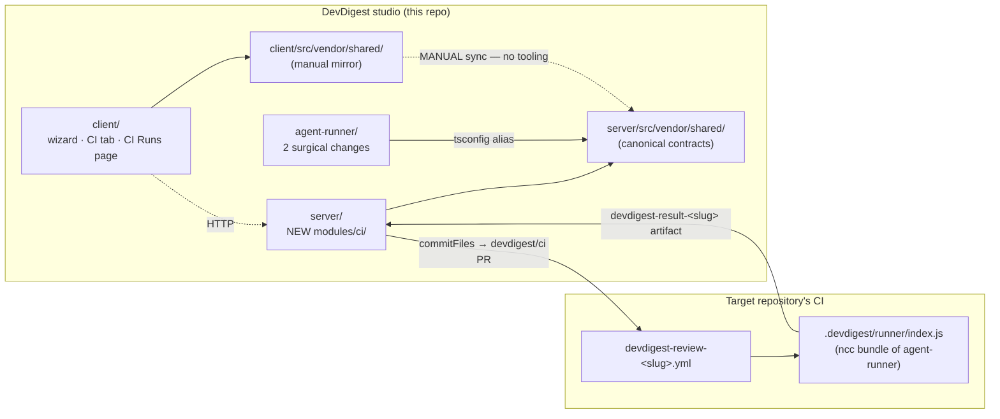

# Implementation Plan — Export agent to CI

Spec: [SPEC-05-export-to-ci](../../specs/SPEC-05-export-to-ci.md) (status: draft)

**Execution mode: single-agent, sequential.** Tasks run in order T1 → T36 by one
implementer. No `[P]` tags, no parallel waves — chosen by the user to conserve
tokens. Every task is a markdown task-list item starting `- [ ]`; the implementer
flips it to `- [x]` on completion.

---

## Context & module map

Four packages are touched. `@devdigest/shared` is not a package — it is a
vendored directory that exists **twice**, and `agent-runner` aliases the *server*
copy.



**Ahead-of-implementation vs. real — verified this session:**

| Thing | State | Evidence |
| --- | --- | --- |
| `server/src/modules/ci/` | **Does not exist.** Entirely new. | Glob over `server/src/modules/*` returns 21 modules, none named `ci`. `agent-runner/src/index.ts:5`, `manifest.ts:11`, `context.ts:11` all cite it in comments — those comments are aspirational. |
| `db/schema/ci.ts` | Real tables, ahead of use | `server/src/db/schema/ci.ts:4-26` — `ci_installations` + `ci_runs` exist; nothing reads or writes them. |
| `CiTarget`/`CiFile`/`AgentManifest`/`CiExportInput`/`CiRun`/`CiResultArtifact` | Real contracts, ahead of use | `server/src/vendor/shared/contracts/eval-ci.ts:250-356` |
| `buildRunTrace` / `emptyPromptAssembly` | Real, **zero consumers** | `server/src/platform/trace-builder.ts:37,60`. `run-executor.ts:340-361` hand-builds the trace literal instead. The spec's "nothing is rewired by the move" is confirmed. |
| `GitHubClient` Actions methods | **Absent** | `server/src/vendor/shared/adapters.ts:143-167` — pulls/reviews/comments/commits/PRs only. |
| `agents.slug` / `skills.slug` | **Do not exist** | `server/src/db/schema/agents.ts:9-38`, `skills.ts:6-23`. See Decision 1. |
| `agent_runs.source` enum `['local','ci']` | Real | `server/src/db/schema/runs.ts:24` |
| `RunTrace.config.source` enum `['local','ci']` | Real | `server/src/vendor/shared/contracts/trace.ts:81` |
| `GET /runs/:id/trace` | Real, reused as-is | `server/src/modules/reviews/routes.ts:121-126` |
| `adm-zip` + `extractFromArchive` precedent | Real | `server/package.json:27`, `server/src/modules/skills/helpers.ts:125-137` |
| `MockGitHubClient` recording `committed`/`openedPrs` | Real — AC-22/23 test seam already there | `server/src/adapters/mocks.ts:130-231` |
| `yaml` package on the server | **Absent** (present in agent-runner) | `server/package.json` has no `yaml`; `agent-runner/package.json:13` pins `yaml@^2.6.1`. See Decision 5. |

---

## Requirements (WHAT & WHY)

Serialise a debugged agent into a checked-in manifest plus a self-contained
GitHub Actions workflow, install it by **opening a PR** (so a human reviews the
configuration that grants an agent write access to their PRs), and pull the CI
results back so a CI review is a first-class run with a trace. A CRITICAL
finding can block a merge via exit code + branch protection, with no GitHub App.
CI and local stay in parity: one engine, one manifest, one grounding gate.

The 45 acceptance criteria in the spec are authoritative. This plan adds three
amendments (Decisions 2, 4, 5) — flagged as spec changes, not silent drift.

---

## Decisions settled before planning (record of the user's answers)

These close real gaps found while verifying the spec against the code. Where a
decision departs from the letter of SPEC-05, it is called out as an amendment
the spec must absorb (SPEC-05 is `draft`).

**Decision 1 — Slug derivation. No new column; plain slugify; collision aborts.**
Neither `agents` nor `skills` has a `slug` column, and the spec fixes the
migration budget, so the slug is **derived from `name`** by a slugify helper
owned by the `ci` module (`modules/ci/slug.ts`). It is *not* imported from
`modules/eval/run-log.ts:22` (`slugifyAgentName`) — that would create a
`ci → eval` module edge the architecture forbids; the ~6-line helper is
duplicated deliberately.
- **Chosen: no id-hash suffix.** Filenames stay readable
  (`.devdigest/agents/security-reviewer.yaml`), which matters because every
  export PR is read line-by-line by a human (the spec's Explainability
  non-functional).
- **Collision behaviour (explicit):** if two agents in the workspace slugify to
  the same string, the export **aborts** with a descriptive error naming both
  agents — the same fail-loudly posture as the missing-bundle path (AC-10). It
  never silently overwrites another agent's manifest/workflow. Same rule for two
  exported skills colliding.
- **Known limitation, accepted:** renaming an agent changes its slug, so the next
  "Update CI config" writes a *new* manifest + workflow and leaves the old pair
  behind. An id-hash suffix would not fix this either (the name segment still
  changes). The stale files are visible in the export PR diff and the human
  reviewer deletes them. Recorded here so it is a known cost, not a surprise.

**Decision 2 — Migration grows from two columns to five. [SPEC AMENDMENT]**
AC-37 requires per-severity finding counts on N13, and the mock shows the chips.
There is nowhere to put them: `ci_runs` has only `findings_count`
(`db/schema/ci.ts:22`), `agent_runs` has no severity split
(`db/schema/runs.ts:8-33`), `RunStats` carries only a `findings` total
(`contracts/trace.ts:63-70`), and ingest writes no `findings` rows (the artifact
carries counts, not findings — `contracts/eval-ci.ts:345-356`). So the spec's
"the whole migration is two nullable columns" makes the severity chips
unrenderable. Migration 0018 therefore adds **five** nullable columns to
`ci_runs`: `run_id`, `pr_title`, `critical`, `warning`, `suggestion`. The
justification is the spec's own rule — "every column above maps to something
visible on a screenshot" — and these three are on `06-ci-runs.png`. **SPEC-05
must be updated**: the `ci_runs extension` table gains three rows.

**Decision 3 — Ingest dedup key: `(ci_installation_id, github_url)`.**
No `workflow_run_id` column is added. `html_url` uniquely identifies an Actions
run, and each installation maps to exactly one slug-scoped workflow file, so the
pair is unique per ingested run (AC-33).

**Decision 4 — Manual workflow edits reach the install. [SPEC AMENDMENT]**
User decision, opposite to the plan author's reading. `CiExportInput` gains
`workflow_override: z.string().nullish()` (only the workflow is `editable`, per
AC-9). Three consequences the plan closes explicitly:
1. The contract change lands in **both** mirrors (T2) — `server/src/vendor/shared/`
   and `client/src/vendor/shared/` have no automated sync (`client/INSIGHTS.md`
   and `server/INSIGHTS.md` both record production bugs from exactly this drift).
2. **Conflict with AC-14** (returning to Configure regenerates file contents →
   clobbers the manual edit). **Resolution: regeneration wins, but never
   silently.** The wizard holds `workflowOverride: string | null`; when it is
   non-null and the author changes a Configure value, a confirmation modal states
   that regenerating discards the manual workflow edits — Confirm clears the
   override and regenerates (AC-14 holds literally, one source of truth), Cancel
   reverts the Configure change. **SPEC-05 must be updated**: AC-14 gains this
   clause, plus two new criteria — **AC-46** (a non-null `workflow_override`
   is the workflow content committed at Install) and **AC-47** (the server
   validates a submitted override before any write; see below).
3. **AC-44 must now be enforced on submitted text.** The server can no longer
   assume it authored the workflow it commits. T15 adds a dedicated server-side
   validator, and it is a security control, not a lint.

**Decision 5 — Add `yaml@^2.6.1` to `server/package.json`. [SPEC AMENDMENT]**
The manifest must round-trip through the runner's `loadAgentManifest`
(`agent-runner/src/manifest.ts:49-77`, AC-6), and it embeds `system_prompt` —
arbitrary multi-line author text that routinely contains quotes, colons and
backticks. Hand-rolling YAML emission for that is a correctness and injection
hazard, not a simplification. Use the same version `agent-runner` already
depends on (`agent-runner/package.json:13`), so the two ends serialise and parse
with one library. **SPEC-05 must note this one new server dependency** (it
currently names only `adm-zip` as "no new dependency").

**Decision 6 — CI Runs page scope: active repo by default, filter can widen.**
The user asked for active-repo scoping *if it does not add real complexity*.
Honest assessment: **it does not** — it costs one `repoId → owner/name` lookup
via `container.reposRepo` plus one optional `WHERE ci_installations.repo = ?`
clause, and it makes ingest *cheaper* (fewer installations per refresh, which
helps the p95-under-3s non-functional). But active-repo-only scoping would make
AC-38's repository filter vestigial. So: `GET /ci-runs` takes an **optional**
`repo` filter; the client defaults it to the active repo, and the filter's "All
repos" option clears it to workspace-wide. This satisfies the user's preference
and AC-38 at once, with no added machinery. Ingest follows the same scope as the
query.

---

## Affected modules & files

**Shared contracts (both mirrors — every edit is applied twice):**
- `server/src/vendor/shared/contracts/eval-ci.ts` + `client/src/vendor/shared/contracts/eval-ci.ts` — `CiResultArtifact` (+`pr_title`, +`trace`), `CiExportInput` (+`workflow_override`), `CiRun` (+`run_id`, `pr_title`, `repo`, severity counts), new `CiPreview`
- `server/src/vendor/shared/adapters.ts` + `client/src/vendor/shared/adapters.ts` — `CiWorkflowRun` type, `listWorkflowRuns`, `downloadRunArtifact` on `GitHubClient`
- `server/src/vendor/shared/trace-builder.ts` + `client/src/vendor/shared/trace-builder.ts` — **new**, moved from `server/src/platform/trace-builder.ts` (deleted)
- `server/src/vendor/shared/index.ts` + `client/src/vendor/shared/index.ts` — export the builder

**Server:**
- `server/package.json` — `yaml@^2.6.1`
- `server/src/db/schema/ci.ts` — five nullable columns on `ci_runs`
- `server/src/db/migrations/0018_*.sql` + `meta/_journal.json` — the migration
- `server/src/adapters/github/octokit.ts` — two Actions methods
- `server/src/adapters/mocks.ts` — two Actions methods on `MockGitHubClient`
- `server/src/modules/ci/{constants,slug,manifest,workflow,files,validate-workflow,verdict,repository,service,ingest,routes}.ts` — **all new**
- `server/src/platform/container.ts` — `ciRepo` getter
- `server/src/modules/index.ts` — register the `ci` plugin

**agent-runner (exactly two changes, no incidental refactoring):**
- `agent-runner/src/manifest.ts`, `src/run.ts`, `src/index.ts` — slug-aware resolution (AC-20)
- `agent-runner/src/artifact.ts`, `src/run.ts` — trace in the artifact (AC-21)

**Client:**
- `client/src/lib/hooks/ci.ts` — **new**
- `client/src/components/run-trace-drawer/**` — **new home** (promoted); `client/src/app/repos/[repoId]/pulls/[number]/_components/RunTraceDrawer/**` deleted, import updated in its caller
- `client/src/vendor/ui/nav.ts` — CI Runs nav item + shortcut
- `client/src/app/ci-runs/**` — **new** page + view + filters
- `client/src/app/agents/[id]/_components/AgentEditor/constants.ts` — CI tab
- `client/src/app/agents/[id]/_components/AgentEditor/_components/CiTab/**` — **new**
- `client/src/app/agents/[id]/_components/AgentEditor/_components/CiTab/ExportWizard/**` — **new** (4 steps)

---

## Architecture & layer placement

Onion, per the skill. The `ci` module is a standard module; the generator is
**one function producing one YAML string** — no provider registry, no strategy
objects (spec non-goal, honoured).

| Layer | File | Rule |
| --- | --- | --- |
| **Domain** | `@devdigest/shared` contracts; `modules/ci/slug.ts`, `verdict.ts` | Pure. `verdict.ts` = severity counts + `ci_fail_on` → status (AC-34); no I/O. |
| **Domain-ish pure generators** | `modules/ci/manifest.ts`, `workflow.ts`, `validate-workflow.ts` | Pure string in/out. **No `fs` here** — the bundle bytes are passed *in*. |
| **Application** | `modules/ci/service.ts`, `ingest.ts`, `files.ts` | Depends on ports (`GitHubClient`, `SecretsProvider`) + `CiRepository`. `files.ts` owns the only `fs.readFile` (the bundle) — see the boundary risk below. |
| **Infrastructure** | `modules/ci/repository.ts`, `adapters/github/octokit.ts`, `adapters/mocks.ts` | Drizzle + Octokit live here only. |
| **Presentation** | `modules/ci/routes.ts` | Fastify + Zod HTTP validation; imports only `service.ts` + `@devdigest/shared`. |
| **Composition root** | `platform/container.ts` | `ciRepo` lazy-singleton, mirroring `evalRepo` (`container.ts:143-145`). |

**Layer-boundary risks to watch:**
1. **`fs` in the Application layer.** Reading `agent-runner/dist/index.js` (AC-10)
   is a filesystem read with no existing port. Adding a port for one file read is
   over-engineering (spec non-goal). **Mitigation:** confine it to a single
   injectable function parameter in `files.ts` (`readBundle: () => Buffer`), so
   the pure generator stays testable and the real `fs` call is one line at the
   service boundary. Do **not** import `fs` in `service.ts` or `routes.ts`.
2. **DTO mapping is mandatory.** `server/INSIGHTS.md` records a real SPEC-03 bug:
   returning raw Drizzle camelCase rows while the client types the response as a
   snake_case contract typechecks on both sides and breaks at runtime
   (`api.get<T>` is an unchecked cast). Every `ci` service exit maps through an
   explicit `toCiRunDto` / `toCiInstallationDto`, like `toEvalCaseDto`
   (`modules/eval/service.ts:65`).
3. **No `ci → eval` / `ci → reviews` import edges.** Reuse `saveRunTrace` through
   `container.reviewRepo.saveRunTrace` (`modules/reviews/repository.ts:179`), which
   is the sanctioned cross-cutting-repository pattern — do not import
   `modules/reviews/run-executor.ts`.

Ingest is synchronous inside the `GET /ci-runs` request. No queue, worker, cron
or SSE (spec non-goal, honoured).

---

## Insights to apply (from INSIGHTS.md)

- **[server + client] The two `vendor/shared/` copies have no automated sync; TypeScript cannot see the drift** — each package resolves `@devdigest/shared` to its own copy, so both compile independently while disagreeing. This plan edits contracts in T1-T4; every one of those tasks owns *both* files. (`server/INSIGHTS.md` Codebase Patterns; `client/INSIGHTS.md` What Doesn't Work)
- **[server] Raw Drizzle camelCase rows returned where a snake_case contract is declared pass `tsc` and break at runtime** — mandatory DTO mappers on every `ci` service exit (see risk 2 above).
- **[server] `ReviewRepository` is a class wrapper over function-level repos; adding a field means editing both `repository/run.repo.ts` and `repository.ts`, and the type error surfaces at the call site, not the definition.** T16 adds a CI-run creation path — `createAgentRun` (`repository/run.repo.ts:148-171`) hardcodes `source: 'local'` and requires a non-null `prId`; ingest needs `source:'ci'` + nullable `prId`, so add a **separate** function rather than widening the local-review path.
- **[server] A `fastify-type-provider-zod` schema rejection is HTTP 422, not 400.** Any test asserting "rejected at the boundary" on `/ci-runs` query params or the export body must expect 422; hand-thrown `BadRequestError` is 400.
- **[server] `PostgresError: column already exists` after renumbering a migration** — the migrator compares `_journal.json`'s `when` against the last applied `created_at`, not just hashes. Migration 0018 must be generated, not hand-numbered; if it collides with a concurrent branch, copy the *original* `when`, never a fresh timestamp.
- **[server] Adding a required field to a vendored contract breaks literal fixtures outside `src/`** — `server/test/contracts.test.ts` builds contracts with `.parse({...})` object literals that `tsc` does not check. T1-T3 add only nullish fields (safe), but grep the whole `server/` tree (not `server/src/`) for `CiRun`/`CiResultArtifact` before declaring done.
- **[server] `tsx watch` does not reliably hot-reload `src/vendor/` changes** — after T1-T4, restart the dev server fully; a page refresh is not enough.
- **[client] `AppShell` calls `useRouter()`; rendering it in RTL crashes with "invariant expected app router to be mounted"** — the `/ci-runs` page test must `vi.mock` the shell away (pattern: `ConventionsView.test.tsx`).
- **[client] Do not early-return a stripped layout for loading/empty/error** — keep one render path with the chrome mounted and vary only the content (pattern: `ConventionsView.tsx`). Applies to the CI Runs table and the CI tab.
- **[client] One `useMutation` instance shared across N triggers broadcasts `isPending` to all N** — the wizard's Install step and the CI tab's per-installation actions must derive identity-specific pending state from `variables`, not wire a bare `isPending`.
- **[agent-runner] Truthiness does not narrow `RunCiSuccess | RunCiFailure`** — discriminate on `result.artifact === null`, not on `result.error`. T23 touches exactly this union.
- **[agent-runner] `pnpm typecheck` fails with "Cannot find module 'zod'" unless `reviewer-core/node_modules` exists** — this repo is not a workspace; run `cd reviewer-core && pnpm install` once before typechecking T22/T23.
- **[agent-runner] Its `insights/INSIGHTS.md` Open Question ("`AgentManifest` has no `post_as`; the workflow sets no equivalent env var") is closed by this plan** — `DEVDIGEST_POST_AS` (AC-16) is the answer; the frozen contract is not touched. T13 owns it.
- **[server] `error TS1160: Unterminated template literal` at EOF** — caused by `*` immediately followed by `/` inside a `/** */` block. The `ci` module's doc comments will describe glob paths like `.devdigest/**`; phrase around it.

---

## Task breakdown

Sequential. Each task ends with `pnpm typecheck` clean in its package and the
existing suites still green. Implementers never write tests (T34-T36 own those).

### Phase A — contracts + shared move (the serial choke point)

- [x] **T1 — Extend `CiResultArtifact` with `pr_title` + `trace`** (module: server contracts + client mirror)
  - Scope: add `pr_title: z.string().nullish()` and `trace: RunTrace.nullish()` to `CiResultArtifact`. Both **nullish** — an artifact written by an older bundle already sitting in a target repo must keep validating (AC-30). Import `RunTrace` from `./trace.js`. Do NOT touch `AgentManifest` (frozen — the post target travels as `DEVDIGEST_POST_AS`, AC-16).
  - Files owned: `server/src/vendor/shared/contracts/eval-ci.ts`, `client/src/vendor/shared/contracts/eval-ci.ts`
  - Skills to load: zod, typescript-expert
  - Insights to apply: both mirrors in one task — TypeScript cannot detect drift between them; nullish-only keeps `server/test/contracts.test.ts` literal fixtures valid.
  - Tests owned by: test-writer (T34)
  - Done when: both files carry identical additions; `cd server && pnpm typecheck` and `cd client && pnpm typecheck` clean.

- [x] **T2 — Extend `CiExportInput` with `workflow_override`; add `CiPreview`** (module: server contracts + client mirror)
  - Scope: (a) `CiExportInput` gains `workflow_override: z.string().nullish()` (Decision 4 — only the workflow is editable per AC-9); document in the schema's doc comment that it is **untrusted client input** validated server-side by AC-47. (b) New `CiPreview = z.object({ files: z.array(CiFile), total_bytes: z.number().int() })` — the response of the non-mutating preview endpoint (Decision 3 of the Q&A; also closes the "report the file set size before install" non-functional).
  - Files owned: `server/src/vendor/shared/contracts/eval-ci.ts`, `client/src/vendor/shared/contracts/eval-ci.ts`
  - Skills to load: zod, typescript-expert
  - Insights to apply: mirror both copies; keep `z.input<>` caller-facing type exports next to the schema, matching the file's existing `CiExportInputBody` convention.
  - Done when: both mirrors identical; both packages typecheck.

- [x] **T3 — Extend `CiRun` for the N13 row** (module: server contracts + client mirror)
  - Scope: add `run_id: z.string().nullable()` (null → inactive Trace affordance, AC-39), `pr_title: z.string().nullish()` (AC-35), `repo: z.string().nullish()` (the repository filter + column, AC-38), and `critical`/`warning`/`suggestion: z.number().int().nullish()` (AC-37 severity chips, Decision 2). `agent` and `duration_s` already exist (`eval-ci.ts:336-337`) — reuse them; duration is `agent_runs.durationMs / 1000`.
  - Files owned: `server/src/vendor/shared/contracts/eval-ci.ts`, `client/src/vendor/shared/contracts/eval-ci.ts`
  - Skills to load: zod, typescript-expert
  - Insights to apply: grep the whole `server/` tree (incl. `server/test/`) for `CiRun` before finishing — `.parse({...})` fixtures are not typechecked.
  - Done when: both mirrors identical; both packages typecheck.

- [x] **T4 — Move `buildRunTrace` + `emptyPromptAssembly` into `@devdigest/shared`** (module: server + client mirror)
  - Scope: create `server/src/vendor/shared/trace-builder.ts` with `BuildTraceInput`, `buildRunTrace`, `emptyPromptAssembly` copied byte-for-byte from `server/src/platform/trace-builder.ts:1-62` (only the import path changes: `@devdigest/shared` → `./contracts/trace.js`, to avoid a self-referencing alias). Export it from `server/src/vendor/shared/index.ts`. **Delete** `server/src/platform/trace-builder.ts` — it has zero consumers (verified: only its own definition matches a repo-wide grep; `run-executor.ts:340-361` hand-builds its trace literal and stays untouched). Mirror the new file + the index export into `client/src/vendor/shared/`.
  - Files owned: `server/src/vendor/shared/trace-builder.ts` (new), `server/src/vendor/shared/index.ts`, `server/src/platform/trace-builder.ts` (delete), `client/src/vendor/shared/trace-builder.ts` (new), `client/src/vendor/shared/index.ts`
  - Skills to load: zod, typescript-expert, onion-architecture
  - Insights to apply: the dependency edge already exists — `agent-runner/tsconfig.json` aliases `@devdigest/shared` → `../server/src/vendor/shared/index.ts`, so T23 can import the builder with no new package edge. Restart `tsx watch` after this — vendor edits do not hot-reload.
  - Done when: `server`, `client` and `agent-runner` all typecheck; no import of `platform/trace-builder` survives anywhere (grep).

- [x] **T5 — Add `yaml@^2.6.1` to the server** (module: server)
  - Scope: add the dependency (Decision 5) at the same version `agent-runner/package.json:13` pins, so both ends of the manifest use one library. `pnpm install`. Nothing else.
  - Files owned: `server/package.json`, `server/pnpm-lock.yaml`
  - Skills to load: typescript-expert
  - Insights to apply: none
  - Done when: `cd server && pnpm install` succeeds; `import { stringify } from 'yaml'` typechecks.

### Phase B — database

- [x] **T6 — `ci_runs`: five nullable columns** (module: server)
  - Scope: on `ciRuns` (`db/schema/ci.ts:14-26`) add `runId: uuid('run_id').references(() => agentRuns.id, { onDelete: 'set null' })` (nullable — a run with no artifact has no canonical run row, AC-31), `prTitle: text('pr_title')` (AC-35), and `critical`/`warning`/`suggestion: integer(...)` (Decision 2). Add an index on `run_id` (Postgres does not auto-index FKs) and on `(ci_installation_id, github_url)` for the AC-33 dedup lookup (Decision 3). **No columns on `ci_installations`** — installation status is derived at read time (AC-41).
  - Files owned: `server/src/db/schema/ci.ts`
  - Skills to load: postgresql-table-design, drizzle-orm-patterns, typescript-expert
  - Insights to apply: `ci.ts` must import `agentRuns` from `./runs` — use the arrow-function reference form to avoid a circular-init problem.
  - Done when: schema typechecks; `agent_runs` + `run_traces` remain the canonical run/trace, `ci_runs` stays thin CI metadata.

- [x] **T7 — Generate migration 0018** (module: server)
  - Scope: `pnpm db:generate` → `server/src/db/migrations/0018_*.sql` (next free index; 0017 is the current head) + the `meta/_journal.json` entry. Apply with `pnpm db:migrate` against local Postgres. Five `ALTER TABLE ci_runs ADD COLUMN` (all nullable, no volatile defaults → no table rewrite) + two `CREATE INDEX`.
  - Files owned: `server/src/db/migrations/0018_*.sql`, `server/src/db/migrations/meta/_journal.json`, `server/src/db/migrations/meta/0018_snapshot.json`
  - Skills to load: postgresql-table-design, drizzle-orm-patterns
  - Insights to apply: **generate, never hand-number.** If the index collides with another branch, do not regenerate the `when` timestamp when fixing `_journal.json` — copy the original, or the migrator re-runs applied `ADD COLUMN`s and errors with "column already exists".
  - Done when: `pnpm db:migrate` applies cleanly on a fresh DB *and* on an existing one; the SQL is shown before it is run.

### Phase C — GitHubClient port + adapters

- [x] **T8 — `GitHubClient` port: two Actions methods** (module: server contracts + client mirror)
  - Scope: add `CiWorkflowRun { id: string; conclusion: string | null; status: string | null; html_url: string; created_at: string; }` and two methods to the `GitHubClient` interface (`adapters.ts:143-167`): `listWorkflowRuns(repo: RepoRef, workflow: string): Promise<CiWorkflowRun[]>` and `downloadRunArtifact(repo: RepoRef, runId: string, name: string): Promise<Buffer | null>`. Nothing else — no generic Actions wrapper, no run-log or re-run surface (spec: "two methods are added, and nothing else"). Keep the port's conventions: `RepoRef` first, plain data out, zero Octokit types leaking.
  - Files owned: `server/src/vendor/shared/adapters.ts`, `client/src/vendor/shared/adapters.ts`
  - Skills to load: typescript-expert, zod, onion-architecture
  - Insights to apply: mirror both copies. Document on `downloadRunArtifact` that `null` means "no such artifact" — which covers both a hard-failed run and one past GitHub's 90-day retention window, indistinguishable and correctly so (AC-31).
  - Done when: both mirrors identical; `OctokitGitHubClient` and `MockGitHubClient` now fail to compile (fixed in T9/T10) — that is expected mid-sequence.

- [x] **T9 — `OctokitGitHubClient`: implement both methods** (module: server)
  - Scope: `listWorkflowRuns` → `octokit.rest.actions.listWorkflowRuns({ owner, repo, workflow_id: <filename>, per_page: 50 })`, mapped to `CiWorkflowRun`. `downloadRunArtifact` → `actions.listWorkflowRunArtifacts`, find the entry whose `name` matches exactly, then `actions.downloadArtifact({ archive_format: 'zip' })` → `Buffer`; return `null` when no artifact matches. Wrap both in the file's existing `withRetry`/`withTimeout` (`octokit.ts:15,37`). **Map a 403 to a typed error naming the missing `actions:read` scope** (AC-28) — the failure mode to avoid is silence.
  - Files owned: `server/src/adapters/github/octokit.ts`
  - Skills to load: fastify-best-practices, onion-architecture, zod, security, typescript-expert
  - Insights to apply: `octokit@^4.0.3` is already a dependency — no HTTP layer to write. The artifact endpoint answers with a 302 to a signed URL; Octokit follows it and hands back an ArrayBuffer — convert with `Buffer.from(res.data as ArrayBuffer)`.
  - Done when: server typechecks; no Octokit type appears in the method signatures.

- [x] **T10 — `MockGitHubClient`: implement both methods** (module: server)
  - Scope: add `workflowRuns?: CiWorkflowRun[]` and `artifacts?: Record<string, Buffer | null>` to `MockGitHubOptions` (`mocks.ts:122-128`) and implement both methods off them; add a `listWorkflowRunsCalls: { workflow: string }[]` recorder mirroring the existing `committed`/`openedPrs` recorders (`mocks.ts:131-134`). Add an opt-in `throwOnListRuns?: Error` so the AC-28 403 path is drivable. Every integration test drives this mock — same pattern as `modules/intent/intent.it.test.ts`.
  - Files owned: `server/src/adapters/mocks.ts`
  - Skills to load: onion-architecture, typescript-expert, zod
  - Insights to apply: **`server/INSIGHTS.md`: a mock more capable than the real adapter hides real bugs** (the `MockLLMProvider.complete()` incident). Keep this mock's behaviour narrow — `downloadRunArtifact` must return `null` for an unknown name, exactly like the real one, never an empty Buffer.
  - Done when: server typechecks; the existing suite is still green.

### Phase D — the `ci` module (onion)

- [x] **T11 — `modules/ci/constants.ts` + `slug.ts`** (module: server)
  - Scope: `constants.ts` — `BRANCH = 'devdigest/ci'`, `PR_TITLE = 'Add DevDigest CI review'`, path templates (`.devdigest/agents/<slug>.yaml`, `.devdigest/skills/<slug>.md`, `.devdigest/memory.jsonl`, `.devdigest/runner/index.js`, `.github/workflows/devdigest-review-<slug>.yml`), `RESULT_PATH_TEMPLATE = 'devdigest-result-<slug>.json'`, `ARTIFACT_NAME_TEMPLATE = 'devdigest-result-<slug>'`, `BUNDLE_PATH` (repo-relative path to `agent-runner/dist/index.js`), `MAX_WORKFLOW_OVERRIDE_BYTES`. `slug.ts` — a pure `slugify(name: string): string` (lowercase, non-alphanumerics → `-`, collapse/trim dashes, fallback `'agent'`) plus `assertUniqueSlugs(items: {id,name}[]): void` throwing a descriptive `BadRequestError` naming both colliding entities (Decision 1).
  - Files owned: `server/src/modules/ci/constants.ts`, `server/src/modules/ci/slug.ts`
  - Skills to load: onion-architecture, typescript-expert, security
  - Insights to apply: **do not import `slugifyAgentName` from `modules/eval/run-log.ts:22`** — the duplication is deliberate; a `ci → eval` edge is the wrong-direction import the intent architecture review already flagged once. Reuse `BadRequestError` from `platform/errors.ts` — do not reinvent a 400.
  - Done when: pure, no imports outside `platform/errors.js`; server typechecks.

- [x] **T12 — `modules/ci/manifest.ts` — agent → `AgentManifest` YAML** (module: server)
  - Scope: one pure function `agentYaml(input: { agent, skillSlugs }): string`. Build the object (`name`, `provider`, `model`, `system_prompt`, `skills`, `strategy`, `ci_fail_on` — AC-6), `AgentManifest.parse()` it so a malformed manifest fails at write time, then `stringify()` with `yaml` (T5). `ci_fail_on` comes straight from `agents.ciFailOn` (`db/schema/agents.ts:26`) — per-agent, no per-installation override (AC-42, spec's rejected alternative). Pure: the agent row and skill slugs are passed in.
  - Files owned: `server/src/modules/ci/manifest.ts`
  - Skills to load: zod, onion-architecture, typescript-expert, security
  - Insights to apply: the round-trip is the whole point — the emitted YAML must survive the runner's `loadAgentManifest` (`agent-runner/src/manifest.ts:49`) unchanged (AC-6). `system_prompt` is arbitrary multi-line text: let `yaml` choose the block scalar, never hand-quote.
  - Done when: pure (no fs, no db); server typechecks.

- [x] **T13 — `modules/ci/workflow.ts` — one function, one YAML string** (module: server)
  - Scope: `workflowYaml(input: { slug, triggers, postAs }): string`. **No abstraction over CI targets** — no registry, no strategy objects (spec non-goal). It must emit, and each of these is an AC:
    - `on: pull_request: types: [<configured triggers>]` (AC-14 — regenerated from configured values).
    - `permissions:` containing **exactly** `contents: read` + `pull-requests: write`, unconditionally, for every `post_as` value (AC-15). This is the core of the lesson — not configurable.
    - A **job-level fork condition** so the job is never scheduled when the PR head is a fork (AC-19). This is the *only* fork control — `agent-runner/src/context.ts:30-32` says `isFork` is informational and "the workflow itself is responsible for never scheduling this job for fork PRs".
    - `env:` exactly: `OPENROUTER_API_KEY` + `GITHUB_TOKEN` from `secrets.*` expressions, `GITHUB_REPOSITORY`, `PR_NUMBER`, `DEVDIGEST_POST_AS` (the configured value), `DEVDIGEST_AGENT` (the slug), `DEVDIGEST_RESULT_PATH` = `devdigest-result-<slug>.json` (AC-16, matching the contract table in `agent-runner/README.md:89-100`).
    - A direct `node .devdigest/runner/index.js` step — **no** `uses: devdigest/…` marketplace action (AC-18; the design's `uses:` line is a stale placeholder, divergence 4).
    - An upload-artifact step named `devdigest-result-<slug>` (AC-17), so ingest attributes the result to the right agent when several agents run on one repo.
    - Every line must be explainable to a human reader (non-functional: it is both a security artifact and the lesson's object of study).
  - Files owned: `server/src/modules/ci/workflow.ts`
  - Skills to load: security, onion-architecture, typescript-expert, zod
  - Insights to apply: this closes `agent-runner/insights/INSIGHTS.md`'s Open Question — `DEVDIGEST_POST_AS` is the answer, and `AgentManifest` stays frozen. Secrets appear **only** as `${{ secrets.NAME }}` expressions; no credential value is ever interpolated (AC-44). Divergence 3: it is `OPENROUTER_API_KEY`, not `OPENAI_API_KEY` — the runner reads the former (`agent-runner/src/index.ts:39`).
  - Done when: pure; server typechecks.

- [x] **T14 — `modules/ci/files.ts` — the six-file generator** (module: server)
  - Scope: `buildCiFiles(input, deps: { readBundle: () => Buffer })` → `CiFile[]`. Exactly six paths for a two-skill agent (AC-4): the manifest, one file per exported skill, `.devdigest/memory.jsonl`, the runner bundle, the workflow. Rules:
    - Slug-scoped per agent: `.devdigest/agents/<slug>.yaml`, `.github/workflows/devdigest-review-<slug>.yml`; **shared** per repo: `.devdigest/skills/`, `.devdigest/runner/index.js` (AC-5).
    - Only skills **linked AND enabled** (AC-7) — the same gate `run-executor.ts` applies.
    - `.devdigest/memory.jsonl` is an **empty** file (AC-8) — a placeholder for a later exercise; the runner never reads it.
    - `editable: true` on the workflow only; every other file `editable: false` (AC-9).
    - **Missing bundle → abort** with a descriptive "run `pnpm build`" error and **zero files returned** (AC-10). Never build implicitly, never emit five files and a dangling `node` invocation. `dist/` is git-ignored, so a fresh clone hits this.
    - Also return `total_bytes` for the preview (non-functional: report the file-set size before install; the bundle is a review burden on every export PR).
  - Files owned: `server/src/modules/ci/files.ts`
  - Skills to load: onion-architecture, security, typescript-expert, zod
  - Insights to apply: `readBundle` is an **injected function**, not a direct `fs` import — keeps the Application layer clean and the generator hermetically testable (see architecture risk 1). Beware `TS1160`: do not write `.devdigest/` followed by a star-slash inside a `/** */` doc comment.
  - Done when: pure but for the injected reader; server typechecks.

- [x] **T15 — `modules/ci/validate-workflow.ts` — validate the submitted override (AC-44, new AC-47)** (module: server)
  - Scope: **A security control, not a lint** (Decision 4.3 — the server no longer authored the text it is about to commit to someone else's repo). `validateWorkflowOverride(yaml: string, deps: { secretValues: string[] }): void`, throwing `BadRequestError` with a specific reason. Reject when:
    1. it exceeds `MAX_WORKFLOW_OVERRIDE_BYTES`;
    2. it does not parse as YAML (`yaml` from T5);
    3. it contains any configured secret **value** verbatim — pass in the values resolved from `SecretsProvider` (`GITHUB_TOKEN`, `OPENROUTER_API_KEY`, `OPENAI_API_KEY`, `ANTHROPIC_API_KEY`); this is AC-44's literal check;
    4. it matches a secret-shaped pattern: `gh[ps]_[A-Za-z0-9]{36,}`, `sk-[A-Za-z0-9]{20,}`, `AKIA[0-9A-Z]{16}`, `AIza[0-9A-Za-z_-]{35}`, `-----BEGIN .* PRIVATE KEY-----`;
    5. its `permissions:` block is not exactly `contents: read` + `pull-requests: write` — an override must never widen the write channel (AC-15 says "regardless of configuration");
    6. the job-level fork condition is absent (AC-19) — that condition is the *only* thing stopping a fork PR from reaching the agent's write access.
  - Files owned: `server/src/modules/ci/validate-workflow.ts`
  - Skills to load: security, zod, typescript-expert, onion-architecture
  - Insights to apply: never log the offending text (it may contain the secret you just detected) — the error names the *rule* that failed, not the match. Reuse `BadRequestError` from `platform/errors.ts`.
  - Done when: pure but for injected secret values; server typechecks.

- [x] **T16 — `modules/ci/verdict.ts` — deterministic status** (module: server)
  - Scope: `ciRunStatus(counts: { critical, warning, suggestion }, failOn: CiFailOn): CiRunStatus` — derived **only** from severity counts + the agent's `ci_fail_on`, never from a model-reported verdict (AC-34, and the spec's "The verdict is never the model's"). Zero findings → `'no_findings'` (a valid review, not an error — the all-dropped-by-grounding case). Cover the whole `never`/`critical`/`warning`/`any` × severity matrix.
  - Files owned: `server/src/modules/ci/verdict.ts`
  - Skills to load: onion-architecture, typescript-expert, zod
  - Insights to apply: pure domain function — no db, no I/O. Mirrors the runner's own gate (`agent-runner/src/run.ts:130-138`), so the studio's status and CI's exit code cannot disagree.
  - Done when: pure; server typechecks.

- [x] **T17 — `modules/ci/repository.ts`** (module: server)
  - Scope: Drizzle only, class shape `constructor(private db: Db)` matching the other seven repositories. Methods: `createInstallation`/`upsertInstallation` (AC-25); `listInstallations(workspaceId, repo?)` joined to `agents` for workspace scoping (AC-32) and the optional active-repo filter (Decision 6); `listCiRuns(workspaceId, filters)` joined `ci_runs → ci_installations → agents` + left-joined `agent_runs` for `durationMs`/`costUsd`, filtered by time range / agent / repo / status / source (AC-38), **excluding local runs** (AC-36); `existingRunKeys(installationId)` for AC-33 dedup on `(ci_installation_id, github_url)`; `latestRunPerInstallation()` for the CI tab's derived status (AC-41); and `ingestRun(...)` — **one transaction** writing `agent_runs(source:'ci', prId:null, workspaceId from the installation's agent)` + the trace via `container.reviewRepo.saveRunTrace` + `ci_runs(run_id)` (AC-29), or `ci_runs(status:'failed', run_id:null)` when there is no artifact (AC-31).
  - Files owned: `server/src/modules/ci/repository.ts`
  - Skills to load: drizzle-orm-patterns, postgresql-table-design, onion-architecture, typescript-expert, security
  - Insights to apply: **`createAgentRun` (`repository/run.repo.ts:148-171`) hardcodes `source:'local'` and takes a non-null `prId`** — add a *separate* CI insert here rather than widening the local-review path (the `ReviewRepository` wrapper insight: a signature change there surfaces as a type error at `run-executor.ts`, not at the definition). `agent_runs.prId` is nullable by design — the PR may never have been polled into `pull_requests`, which is exactly why the title rides on `ci_runs.pr_title` (AC-35). Pass the transaction handle into `saveRunTrace`'s call path so the AC-29 failure-injection test sees no partial write.
  - Done when: no Drizzle import leaks outside this file; server typechecks.

- [x] **T18 — `modules/ci/ingest.ts`** (module: server)
  - Scope: Application layer. For each in-scope installation: `listWorkflowRuns(repo, 'devdigest-review-<slug>.yml')` using the existing `GITHUB_TOKEN` from `SecretsProvider` (`adapters.ts:293`); skip already-ingested runs via the `(ci_installation_id, github_url)` key (AC-33); for each new run call `downloadRunArtifact(repo, runId, 'devdigest-result-<slug>')`; when a Buffer comes back, unzip with `adm-zip`, read **only** the one expected `devdigest-result.json` entry and ignore every other entry, then `CiResultArtifact.safeParse` **before any persistence** (AC-27, AC-45); derive the status via T16; write via T17's transaction. Artifact absent → the AC-31 status-only row, status derived from the Actions API `conclusion`. A **malformed artifact writes no row and does not stop the other runs** from ingesting (AC-27). A 403 from the list call surfaces the explicit "token is missing actions:read" error and is **not** reported as an empty/unchanged success (AC-28). No timers, no background refetch (AC-26).
  - Files owned: `server/src/modules/ci/ingest.ts`
  - Skills to load: security, onion-architecture, zod, typescript-expert, fastify-best-practices
  - Insights to apply: **the ingested artifact is foreign data** from a repo DevDigest does not control — `safeParse` at the boundary, never executed, never interpolated into a prompt; its rendered fields are escaped by React downstream. Follow `modules/skills/helpers.ts:125-137` (`extractFromArchive`) for the read-one-named-entry-out-of-a-Buffer pattern — no new dependency. Batch the per-installation work rather than a single unbounded `Promise.all` (p95 < 3s for 10 installations).
  - Done when: no Drizzle/Octokit import here — ports only; server typechecks.

- [x] **T19 — `modules/ci/service.ts`** (module: server)
  - Scope: Application layer; depends on ports + `CiRepository` only. Use cases:
    - `preview(agentId, input)` → `CiPreview` — resolve agent + linked/enabled skills, slugify (T11, aborting on collision), generate files (T14), sum bytes. **No GitHub call, no db write** (AC-12's spirit: the wizard makes no GitHub request to determine secret state).
    - `export(agentId, input)` — regenerate the file set; when `workflow_override` is non-null, validate it (T15) and substitute it for the generated workflow (new AC-46); then branch on `action`: `'open_pr'` → `commitFiles` onto `devdigest/ci` as **one atomic commit**, never the base branch (AC-22), then `findOpenPr('devdigest/ci')` — an open PR gets the commit added, else `openPullRequest` (AC-23; `commitFiles` is documented idempotent, `adapters.ts:157-160`); `'files'` → build the zip **on the server** with `adm-zip` and perform **zero** mutating GitHub calls (AC-24 — the client has no zip library and shall not gain one). Persist the `ci_installations` row on completion of either action (AC-25).
    - `listRuns(workspaceId, filters)` — ingest (T18) then read (T17). Same scope for both (Decision 6).
    - `listInstallations(agentId)` — with status derived from each installation's most recent CI run, not a stored column (AC-41).
  - Files owned: `server/src/modules/ci/service.ts`
  - Skills to load: fastify-best-practices, onion-architecture, zod, security, typescript-expert
  - Insights to apply: **map every exit through an explicit DTO** (`toCiRunDto`, `toCiInstallationDto`) — returning raw camelCase Drizzle rows against a snake_case contract typechecks and breaks at runtime (the SPEC-03 incident). No `fs` import here — the bundle reader is injected into T14. No `fastify` import here.
  - Done when: imports only ports, contracts, `CiRepository`, and the pure `ci` helpers; server typechecks.

- [x] **T20 — `modules/ci/routes.ts`** (module: server)
  - Scope: Fastify plugin, Zod-validated, following the module conventions (`withTypeProvider<ZodTypeProvider>`, `getContext(container, req)` for workspace resolution):
    - `POST /agents/:id/export-ci/preview` → `CiPreview`. Non-mutating.
    - `POST /agents/:id/export-ci` → `CiExport` JSON for `action:'open_pr'`; for `action:'files'` reply `application/zip` with the Buffer (AC-24).
    - `GET /ci-runs` → `CiRun[]`. Querystring: optional `repo`, `days`, `agent_id`, `status`, `source` (AC-38, Decision 6). Ingest runs synchronously inside this request (AC-26).
    - `GET /agents/:id/ci-installations` → `CiInstallation[]` + derived status (AC-40, AC-41).
  - Files owned: `server/src/modules/ci/routes.ts`
  - Skills to load: fastify-best-practices, onion-architecture, zod, security, typescript-expert
  - Insights to apply: a Zod querystring/body rejection is **422**, not 400 — relevant to T34's boundary tests. No `drizzle-orm` import in a route. **No new trace endpoint** — `GET /runs/:id/trace` already serves CI runs, because a CI run *is* an `agent_runs` row.
  - Done when: route file imports only `service.ts` + `@devdigest/shared`; server typechecks.

- [x] **T21 — Wire the module** (module: server)
  - Scope: add a `ciRepo` lazy-singleton getter to `Container` mirroring `evalRepo` (`platform/container.ts:143-145`), and register the plugin in `modules/index.ts` — one import + one entry in the `modules` record (`modules/index.ts:31-47`).
  - Files owned: `server/src/platform/container.ts`, `server/src/modules/index.ts`
  - Skills to load: onion-architecture, fastify-best-practices, typescript-expert
  - Insights to apply: registration is static on purpose — dynamic `import()` of `.ts` is not portable across tsx/bundler/vitest.
  - Done when: the server boots; `GET /ci-runs` responds; existing suite green.

### Phase E — agent-runner (exactly two changes; no incidental refactoring)

- [x] **T22 — Change 1 of 2: slug-aware manifest resolution (AC-20)** (module: agent-runner)
  - Scope: `findManifestPath(devdigestDir, deps, slug?)` — **with** a slug, resolve `.devdigest/agents/<slug>.yaml` directly; **without** one, preserve the existing exactly-one-manifest rule **byte for byte** (`manifest.ts:25-46`), so repositories installed before this change keep working unchanged. Thread the optional slug from `DEVDIGEST_AGENT` through `index.ts` → `runCi` → `loadManifest`. Nothing else in this package changes.
  - Files owned: `agent-runner/src/manifest.ts`, `agent-runner/src/index.ts`, `agent-runner/src/run.ts`
  - Skills to load: typescript-expert, zod
  - Insights to apply: the existing `agent-runner/src/manifest.test.ts` cases must stay green **untouched** — that is the AC's own proof that the fallback is preserved. Run `cd reviewer-core && pnpm install` first or typecheck fails with a misleading "Cannot find module 'zod'".
  - Done when: `pnpm typecheck` + `pnpm test` + `pnpm build` green in `agent-runner`; the existing manifest tests unmodified.

- [x] **T23 — Change 2 of 2: trace in the result artifact (AC-21)** (module: agent-runner)
  - Scope: stop discarding the outcome. `run.ts:142-148` currently takes only `costUsd` from `ReviewOutcome` — build a `RunTrace` with the **same `buildRunTrace` the studio uses** (now importable from `@devdigest/shared` after T4) and carry it on the artifact, plus `pr_title` from `ctx.title` (`context.ts:27`). Mapping, per the spec's table: `config` = agent name + model + provider from the manifest, `pr` from the CI context, `source: 'ci'`; `stats` = `duration_ms`/`tokens_in`/`tokens_out`/findings count/`grounding`/`cost_usd` from the outcome; `prompt_assembly` = `outcome.assembly`; `tool_calls` = `outcome.chunks`; `raw_output` = `outcome.raw`; `log` collected via `onEvent` (`reviewer-core/src/review/run.ts:93`); `memory_pulled` and `specs_read` **empty** — neither exists in CI. Extend `buildResultArtifact` (`artifact.ts:32-54`) to accept and validate them.
  - Files owned: `agent-runner/src/artifact.ts`, `agent-runner/src/run.ts`
  - Skills to load: typescript-expert, zod
  - Insights to apply: **discriminate the `RunCiSuccess | RunCiFailure` union on `result.artifact === null`, never on truthiness of `error`** (`insights/INSIGHTS.md`, `index.ts:52`) — this task touches that union. Do not weaken the hard-fail path: a failure upstream of "we have a grounded review" still produces nothing — no artifact, no post. `ReviewOutcome` already returns exactly the trace's inputs (`reviewer-core/src/review/run.ts:102-120`); nothing new is gathered.
  - Done when: `pnpm typecheck` + `pnpm test` + `pnpm build` green; `dist/index.js` still has zero runtime `@devdigest/*` imports (`grep -c "^import\|require(" dist/index.js` → 0).

### Phase F — client

- [x] **T24 — `client/src/lib/hooks/ci.ts`** (module: client)
  - Scope: React Query hooks, all server calls through `src/lib/api.ts` (never a bare `fetch`): `useCiPreview` (mutation), `useCiExport` (mutation), `useCiRuns(filters)` (query — **no `refetchInterval`, no timer-driven refetch**, AC-26; the mock's "auto-refresh on" indicator is divergence 10 and is not implemented), `useCiInstallations(agentId)` (query), and a `ciFailOn` mutation reusing the existing agents update hook (AC-42). `queryKey`s as `["ci-runs", filters]` / `["ci-installations", agentId]` so `invalidateQueries` works.
  - Files owned: `client/src/lib/hooks/ci.ts`, `client/src/lib/hooks/index.ts`
  - Skills to load: react-best-practices, react-component-architecture, next-best-practices, security, typescript-expert
  - Insights to apply: **`api.get<T>` does not validate against the contract — the generic is documentation, not a boundary check.** Curling the real JSON shape of each new endpoint is part of "done", not polish (the SPEC-03 lesson). Refresh is an explicit `refetch()`, never a timer.
  - Done when: client typechecks; no `fetch`/`axios` import in the file.

- [x] **T25 — Promote `RunTraceDrawer` to a shared component** (module: client)
  - Scope: move `client/src/app/repos/[repoId]/pulls/[number]/_components/RunTraceDrawer/**` → `client/src/components/run-trace-drawer/**` unchanged (it is now reused by a second route, which is exactly the promotion trigger in the component-architecture convention), and update the import in its current caller on the PR-detail page. Behaviour identical; `RunTraceDrawerProps` unchanged (`runId` + optional `agentName`/`prNumber`/`findings`/`running`).
  - Files owned: `client/src/components/run-trace-drawer/**` (new), `client/src/app/repos/[repoId]/pulls/[number]/_components/RunTraceDrawer/**` (delete), the PR-detail file that imports it
  - Skills to load: react-component-architecture, react-best-practices, next-best-practices, typescript-expert
  - Insights to apply: `index.ts` re-exports only the main component — do not leak internals. The existing `RunTraceDrawer.test.tsx` moves with it and must stay green.
  - Done when: client typechecks + builds; the PR-detail drawer still opens; no import path to the old location survives (grep).

- [x] **T26 — Nav entry for CI Runs** (module: client)
  - Scope: add `{ key: "ci-runs", label: "CI Runs", icon: "GitBranch", href: "/ci-runs", gKey: "i" }` to the existing **SKILLS LAB** group in `client/src/vendor/ui/nav.ts:29-37` (per the user's decision — **not** a new GLOBAL section; nothing else the mock draws in GLOBAL exists), plus the matching `SHORTCUTS` entry. Pick an `IconName` that exists in the kit.
  - Files owned: `client/src/vendor/ui/nav.ts`
  - Skills to load: react-component-architecture, typescript-expert, next-best-practices
  - Insights to apply: `client/src/vendor/ui/` has only one copy (verified) — unlike `vendor/shared/`, no mirroring needed here.
  - Done when: the item renders and navigates; `g i` works.

- [x] **T27 — `/ci-runs` page + container/presenter** (module: client)
  - Scope: `app/ci-runs/page.tsx` + `_components/CiRunsView/` (container: fetches via T24, owns loading/error/empty) and `CiRunsTable` (presenter: typed props only). Columns per AC-37: timestamp, PR number + title, agent, source, duration, per-severity finding counts, cost, status, Trace. Duration from `agent_runs.durationMs`; title from `ci_runs.pr_title` when no local `pull_requests` row exists (AC-35). Only CI runs — never local (AC-36). **No CircleCI rows will ever appear** (divergence 6): the source filter stays but only GitHub Actions can produce runs. Trace opens the promoted `RunTraceDrawer` (T25); when `run_id` is null the affordance is **inactive** (AC-39) — that is the no-artifact row, dashes in duration/findings/cost.
  - Files owned: `client/src/app/ci-runs/page.tsx`, `client/src/app/ci-runs/_components/CiRunsView/**`
  - Skills to load: react-best-practices, react-component-architecture, next-best-practices, security, typescript-expert
  - Insights to apply: **keep one render path with the chrome mounted** — do not early-return a stripped layout for loading/empty/error (the `ConventionsView` lesson). "No data" and "zero" must not share a glyph: a null duration/cost renders `—`, a real `0` renders `0`. React escapes the artifact-supplied agent name and PR title on display (AC-45).
  - Done when: client typechecks + builds; the page renders against a real server response.

- [x] **T28 — CI Runs filter row** (module: client)
  - Scope: filters for time range (default "Last 7 days" — comfortably inside GitHub's 90-day artifact retention window), agent, repository, status and source (AC-38). The repository filter defaults to the **active repo** and offers "All repos" to widen to workspace-wide (Decision 6). Filter state belongs in URL search params, not component state.
  - Files owned: `client/src/app/ci-runs/_components/CiRunsView/_components/FilterRow/**`, `client/src/app/ci-runs/_components/CiRunsView/constants.ts`
  - Skills to load: react-best-practices, react-component-architecture, next-best-practices, typescript-expert
  - Insights to apply: `useSearchParams` needs a Suspense boundary in the App Router. The active repo comes from `useActiveRepo()` (`client/src/lib/repo-context.tsx:58`).
  - Done when: each filter round-trips to the server query and back.

- [x] **T29 — Agent CI tab** (module: client)
  - Scope: add `{ key: "ci", labelKey: "editor.tabs.ci", icon: "GitBranch" }` to `TABS` (`AgentEditor/constants.ts:12-17`) and build `CiTab/`: the count of repositories the agent is installed in, one row per installation with repository + target + relative time (AC-40), status **derived from that installation's most recent CI run** (AC-41), a "Fail CI on" selector persisting to `agents.ciFailOn` which reaches CI through the manifest's `ci_fail_on` (AC-42 — the mock omits this control, divergence 7; the spec adds it), "Add to CI" / "+ Add repository" opening the wizard (T30), and "Update CI config" re-exporting. **No CI run history on this tab** (AC-43) — that is what `/ci-runs` is for.
  - Files owned: `client/src/app/agents/[id]/_components/AgentEditor/constants.ts`, `.../AgentEditor/_components/CiTab/**`
  - Skills to load: react-best-practices, react-component-architecture, next-best-practices, security, typescript-expert
  - Insights to apply: **do not wire one shared mutation's bare `isPending` into every per-installation button** — derive identity-specific pending state from `variables` (the EvalsTab bug, where clicking one card spun them all). Changing `ciFailOn` bumps the agent version through the existing agents path — do not re-implement versioning here.
  - Done when: client typechecks + builds; the tab renders against two installations.

- [x] **T30 — Export wizard container + Target step** (module: client)
  - Scope: `CiTab/ExportWizard/` — a four-step wizard in the order **Target → Preview → Configure → Install** (AC-1). All wizard state is **client state**; the server sees one POST at Install (spec non-goal: no export state in the database, no draft rows). Target step: GitHub Actions is the only selectable target; CircleCI, Jenkins and Generic CLI render **disabled** (AC-2) — `CiTarget` enumerates them (`eval-ci.ts:250`) but the runner resolves its context exclusively from GitHub Actions env vars (`agent-runner/src/context.ts:67-84`), so it cannot run anywhere else. The target repository resolves from the **active workspace repository selector** — never prompt for one inside the wizard (AC-3). Wizard state includes `workflowOverride: string | null` (Decision 4).
  - Files owned: `client/src/app/agents/[id]/_components/AgentEditor/_components/CiTab/ExportWizard/{ExportWizard.tsx,constants.ts,styles.ts,index.ts,hooks/useExportWizard.ts}`
  - Skills to load: react-best-practices, react-component-architecture, next-best-practices, typescript-expert, security
  - Insights to apply: multi-state wizard state belongs in a `useReducer`-shaped hook, not six `useState`s; the container fetches, the steps are presenters.
  - Done when: the wizard opens, steps in order, disabled cards are genuinely disabled.

- [x] **T31 — Preview step** (module: client)
  - Scope: render the six files from `useCiPreview` (AC-4) — the mock shows five; the runner bundle `.devdigest/runner/index.js` is the sixth (divergence 1). The workflow is editable, everything else read-only (AC-9). Show the total file-set size (non-functional). Editing the workflow sets `workflowOverride` (Decision 4). **The AC-14 conflict resolution lives here:** when `workflowOverride !== null` and the author changes a Configure value, show a confirmation modal stating that regenerating discards the manual workflow edits — Confirm clears the override and regenerates from the configured values (AC-14 holds literally); Cancel reverts the Configure change. Never discard silently. The workflow filename carries the agent slug (divergence 9).
  - Files owned: `.../ExportWizard/_components/PreviewStep/**`
  - Skills to load: react-best-practices, react-component-architecture, next-best-practices, security, typescript-expert
  - Insights to apply: sample values on the mock (repo names, PR numbers, counts, costs) are mock data, not requirements (divergence 8). Preview shows defaults; Configure narrows them (divergence 5).
  - Done when: editing the workflow then changing a trigger raises the confirmation; Cancel restores both.

- [x] **T32 — Configure step** (module: client)
  - Scope: trigger chips with `opened` + `synchronize` **pre-enabled** and `reopened` **off** by default (AC-11; the mock's YAML includes `reopened`, `04`'s chip does not — `04` wins, divergence 5). The expected-secret table is **static explanatory content**: zero fetch calls, no GitHub request to determine secret state (AC-12) — a genuinely absent secret fails at the first model call in CI and ingests as a failed run with no trace (AC-31), which is the expected shape of that mistake. Post target radio: GitHub review / PR comment / none, defaulting to **GitHub review** (AC-13). The table says `OPENROUTER_API_KEY`, not `OPENAI_API_KEY` (divergence 3).
  - Files owned: `.../ExportWizard/_components/ConfigureStep/**`
  - Skills to load: react-best-practices, react-component-architecture, next-best-practices, security, typescript-expert
  - Insights to apply: static content means static — do not add a "check secrets" convenience call; AC-12 is asserted by a zero-fetch test.
  - Done when: defaults match AC-11/AC-13; no network call originates from this step.

- [x] **T33 — Install step** (module: client)
  - Scope: render the active repo's **full name** (AC-3). "Open a PR with these files" → `useCiExport({ action: 'open_pr', workflow_override })`, then surface the returned PR url (new or re-used — a second export adds a commit to the open PR rather than opening a rival one, AC-23). "Copy files as a zip" → `action: 'files'`, download the server-built archive (AC-24 — the client has no zip library and does not gain one). Surface a server validation rejection of the override (T15) as a readable error naming the failed rule.
  - Files owned: `.../ExportWizard/_components/InstallStep/**`
  - Skills to load: react-best-practices, react-component-architecture, next-best-practices, security, typescript-expert
  - Insights to apply: derive per-action pending state from the mutation's `variables`, not a shared `isPending`. The mock's "the 5 generated files" copy is wrong — it is six (divergence 1).
  - Done when: both actions work end-to-end against `MockGitHubClient`-backed local dev; client typechecks + builds.

### Phase G — tests (test-writer, not the implementer)

- [ ] **T34 — Server tests** (module: server) *(depends on: T1-T21)*
  - Scope: per test-writer's contract, covering AC-4/5/6/7/8/9/10 (generators), AC-15/16/17/18/19 (workflow), AC-22/23/24/25 (install, via `MockGitHubClient`), AC-26/27/28/29/30/31/32/33/34/35 (ingest, incl. the malformed-artifact, traceless-artifact, no-artifact, 403-scope and failure-injection/no-partial-write cases), AC-44/47 (the override validator, incl. a secret-pattern scan and a permissions/fork-condition rejection), and the slug-collision abort (Decision 1).
  - Files owned: `server/src/modules/ci/*.test.ts`, `server/src/modules/ci/ci.it.test.ts`
  - Skills to load: (test-writer's own routing)
  - Done when: suite green, real output shown.

- [ ] **T35 — Client tests** (module: client) *(depends on: T24-T33)*
  - Scope: AC-1/2/3/11/12/13 (wizard), AC-26 (advance timers → no additional fetch), AC-37/38/39 (CI Runs row, filters, both Trace fixtures — active and inactive), AC-40/43 (CI tab), and the AC-14 regenerate-confirmation flow (Decision 4).
  - Files owned: `client/src/app/ci-runs/**/*.test.tsx`, `client/src/app/agents/[id]/_components/AgentEditor/_components/CiTab/**/*.test.tsx`
  - Skills to load: react-testing-library (test-writer's own routing)
  - Insights to apply: `vi.mock` the `AppShell` away in the page test or `useRouter()` blows up.
  - Done when: suite green, real output shown.

- [ ] **T36 — agent-runner tests** (module: agent-runner) *(depends on: T22-T23)*
  - Scope: AC-20 both ways (slug set → direct resolve; slug unset → existing exactly-one-manifest rule, with the pre-existing `manifest.test.ts` cases untouched and green), AC-21 (`runCi` → `artifact.trace` is `RunTrace`-valid and matches a stubbed outcome).
  - Files owned: `agent-runner/src/manifest.test.ts` (additive only), `agent-runner/src/run.test.ts`
  - Done when: suite green, real output shown; `pnpm build` still emits a self-contained bundle.

---

## Skills matrix (summary)

| Task | Module | Skills |
| --- | --- | --- |
| T1, T2, T3 | shared contracts | zod, typescript-expert |
| T4 | shared contracts | zod, typescript-expert, onion-architecture |
| T5 | server | typescript-expert |
| T6, T7 | server (schema/migrations) | postgresql-table-design, drizzle-orm-patterns, typescript-expert |
| T8 | shared contracts | zod, typescript-expert, onion-architecture |
| T9 | server (adapter) | fastify-best-practices, onion-architecture, zod, security, typescript-expert |
| T10 | server (adapter) | onion-architecture, zod, typescript-expert |
| T11, T12, T13, T14, T15, T16 | server (ci pure) | onion-architecture, zod, security, typescript-expert |
| T17 | server (repository) | drizzle-orm-patterns, postgresql-table-design, onion-architecture, security, typescript-expert |
| T18, T19, T20 | server (ci app/presentation) | fastify-best-practices, onion-architecture, zod, security, typescript-expert |
| T21 | server (composition) | onion-architecture, fastify-best-practices, typescript-expert |
| T22, T23 | agent-runner | typescript-expert, zod |
| T24, T27, T28, T29, T30, T31, T32, T33 | client | react-best-practices, react-component-architecture, next-best-practices, security, typescript-expert |
| T25, T26 | client | react-component-architecture, react-best-practices, next-best-practices, typescript-expert |
| T34, T35, T36 | tests | test-writer's own routing (incl. react-testing-library) |

---

## End-to-end verification

Run verbatim after T33 (T34-T36 add the automated proof):

```bash
# 0. Prerequisite — the bundle must exist on disk or export aborts by design (AC-10)
cd agent-runner && pnpm install && pnpm build && ls -lh dist/index.js

# 1. Full stack from zero (docker → migrate → seed → server + client)
cd .. && ./scripts/dev.sh

# 2. Typecheck every touched package (contract mirrors drift silently otherwise)
cd server && pnpm typecheck && cd ../client && pnpm typecheck && cd ../agent-runner && pnpm typecheck

# 3. Export path — preview returns exactly 6 files for a two-skill agent (AC-4)
curl -s -X POST localhost:3001/agents/<agentId>/export-ci/preview \
  -H 'content-type: application/json' \
  -d '{"repo":"owner/name","target":"gha"}' | jq '.files | length, .[].path'

# 4. The generated manifest round-trips through the runner's own loader (AC-6)
#    and the workflow carries exactly the required permissions (AC-15)
curl -s -X POST localhost:3001/agents/<agentId>/export-ci/preview \
  -H 'content-type: application/json' -d '{"repo":"owner/name"}' \
  | jq -r '.files[] | select(.path | endswith(".yml")) | .contents' \
  | grep -A2 'permissions:'

# 5. Ingest path — no timers, explicit call only (AC-26); returns CI runs, never local (AC-36)
curl -s 'localhost:3001/ci-runs?days=7' | jq '.[] | {pr_number, pr_title, agent, run_id, critical, warning, suggestion, status}'

# 6. A CI run's trace is served by the EXISTING endpoint — no CI-specific trace path
curl -s localhost:3001/runs/<run_id>/trace | jq '.config.source'   # → "ci"
```

**Expected:** step 3 prints `6` and the six paths; step 4 prints exactly
`contents: read` + `pull-requests: write`; step 5 returns rows whose `run_id` is
null exactly for artifact-less runs; step 6 prints `"ci"`. Then, in the browser:
`/ci-runs` lists the runs with working filters and an inactive Trace on the
null-`run_id` row; the agent's CI tab shows the installation count and derived
status; the wizard runs Target → Preview → Configure → Install and opens a PR
whose diff a human can read line by line.

---

## Spec amendments this plan requires (SPEC-05 is `draft`)

Fold these back into `specs/SPEC-05-export-to-ci.md` — they are decisions, not drift:

1. **`ci_runs` migration is five nullable columns, not two** — `run_id`, `pr_title`, `critical`, `warning`, `suggestion`. Without the three severity columns, AC-37's chips (drawn on `06-ci-runs.png`) cannot be rendered from anything that exists. (Decision 2)
2. **`CiExportInput` gains `workflow_override`**, and **AC-14 gains a clause**: regeneration from configured values discards a manual workflow edit only behind an explicit confirmation. Two new criteria: **AC-46** (a non-null override is what gets committed) and **AC-47** (the server validates a submitted override — size, YAML parse, secret-value match, secret-pattern scan, exact `permissions:`, fork condition — before any write). AC-44 now applies to submitted text, not only generated text. (Decision 4)
3. **One new server dependency: `yaml@^2.6.1`** — the spec claims "no new dependency" (true of `adm-zip`) but the server has no YAML library, and hand-emitting a manifest containing an arbitrary `system_prompt` is a correctness/injection hazard. Same version `agent-runner` already pins, so both ends of the manifest share one library. (Decision 5)
4. **Slug provenance is unspecified in the spec and now decided:** derived by slugify from `name` (no `slug` column, no id-hash suffix), collisions abort the export loudly, renaming an agent leaves stale files that the export PR's human reviewer deletes. (Decision 1)
5. **`CiRun` contract extension** (`run_id`, `pr_title`, `repo`, three severity counts) — implied by AC-35/37/38/39 but not listed in `Data contracts`. (T3)
6. **`GET /ci-runs` takes an optional `repo` filter**, defaulted by the client to the active repository and widened to workspace-wide by AC-38's "All repos" option. (Decision 6)

---

## Out of scope

- The multi-run service and the PR feed — untouched.
- Reviewing the agent's own exported files — `agent-runner/src/diff.ts:21` already strips `.devdigest` and the workflows directory; without it the minified bundle triggers a GitHub 422 that fails the whole review.
- Memory — `.devdigest/memory.jsonl` ships as an empty placeholder; the runner does not read it (verified: no reference anywhere in `agent-runner/src/`).
- A GitHub App, a marketplace action, or any DevDigest-hosted ingress. The workflow is self-contained; the runner travels in the same PR.
- **Any abstraction over CI targets** — one function, one YAML string. Generalise when CircleCI actually arrives.
- **Any new infrastructure** — no queue, worker, cron, SSE, background polling, or auto-refresh (the `06` indicator is divergence 10). No new trace endpoint.
- **Any export state in the database** — the wizard is client state; no draft/pending export rows.
- Editing `agent-runner` beyond T22 and T23. No incidental refactoring.
- Per-installation `fail_on` override, or any new column on `ci_installations` — `agents.ciFailOn` is per-agent and reused as-is; installation status is derived at read time.
- Webhook ingest — rejected: DevDigest is local-first and exposes no inbound surface, which is itself a security control, not just a constraint.
- Committing `agent-runner/dist/` — git-ignored, regenerated by `pnpm build`; the `ci` module reads it and fails loudly if absent.
- Runs whose artifacts have passed GitHub's 90-day retention window — permanently unreachable, ingested as status-only rows. Accepted, not a bug to chase.
