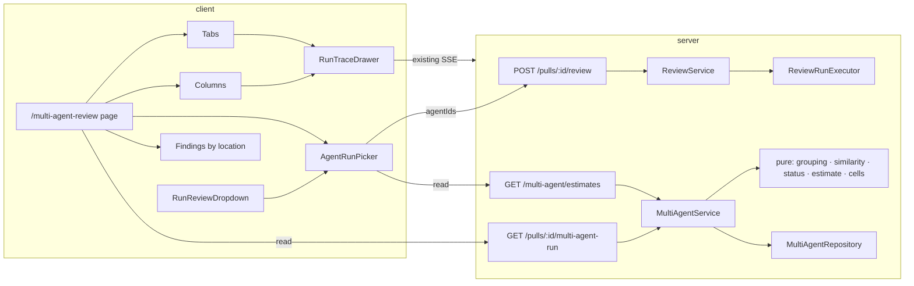
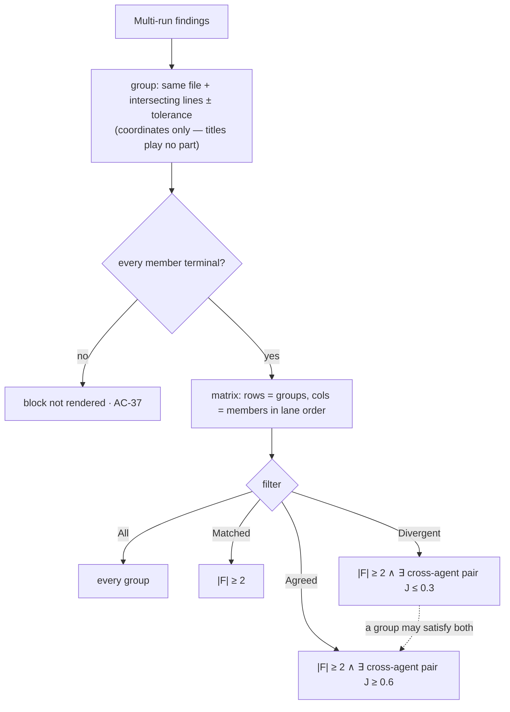

# Implementation Plan — Multi-Agent Review
Spec: [SPEC-05-multi-agent-review](../../specs/SPEC-05-multi-agent-review.md)

> **Execution mode: SINGLE-AGENT / SEQUENTIAL.** One implementer works through
> T-01 → T-29 **in order**. No parallel waves, no worktree isolation, no `[P]`
> markers. Every task's `Depends on` line is a hard ordering constraint: do not
> start a task before its dependencies are ✅.
>
> **The implementer MUST flip each task's marker as it completes** — update both
> the checkbox in the task heading (`### [ ] T-01` → `### [x] T-01`) and the
> `**Status:**` line (⬜ Not started → 🟨 In progress → ✅ Done), and mirror it in
> the Progress table below. The plan is the live checklist; a finished task with
> a stale marker is an unfinished task.

## Progress

| Task | Module | Title | Status |
| --- | --- | --- | --- |
| T-01 | server | `agent_runs.multi_agent_run_id` column + index | ⬜ Not started |
| T-02 | server | Generate + apply migration 0018 | ⬜ Not started |
| T-03 | server | Extract the shared coordinate rule into `_shared/finding-location.ts` | ⬜ Not started |
| T-04 | server | Pure grouping: findings → location groups | ⬜ Not started |
| T-05 | server | Pure similarity: Jaccard + Matched/Divergent/Agreed predicates | ⬜ Not started |
| T-06 | server | Pure derived multi-run status | ⬜ Not started |
| T-07 | server | Pure estimate: per-agent medians + selection totals | ⬜ Not started |
| T-08 | server | Pure cell builder (severity / did not flag / failed) | ⬜ Not started |
| T-09 | shared | Contracts: `RunRequest.agentIds`, `MultiAgentRunView`, `AgentEstimate` | ⬜ Not started |
| T-10 | server | `MultiAgentRepository` (create + latest-for-PR + estimate rows) | ⬜ Not started |
| T-11 | server | `createAgentRun` accepts `multiAgentRunId` | ⬜ Not started |
| T-12 | server | `ReviewService`: resolve `agentIds` + create/bind the multi-run | ⬜ Not started |
| T-13 | server | `MultiAgentService.latestForPull` (assemble members + groups) | ⬜ Not started |
| T-14 | server | `MultiAgentService.estimates` | ⬜ Not started |
| T-15 | server | `modules/multi-agent/routes.ts` + plugin registration | ⬜ Not started |
| T-16 | server | Container wiring: `multiAgentRepo` | ⬜ Not started |
| T-17 | server | `POST /pulls/:id/review` accepts `agentIds` | ⬜ Not started |
| T-18 | client | Mirror the contracts into the client's vendored copy | ⬜ Not started |
| T-19 | client | `lib/hooks/multi-agent.ts` + `useRunReview({ agentIds })` | ⬜ Not started |
| T-20 | client | Promote `RunTraceDrawer` to `src/components/` | ⬜ Not started |
| T-21 | client | `AgentRunPicker` shared component | ⬜ Not started |
| T-22 | client | `RunReviewDropdown` renders the picker | ⬜ Not started |
| T-23 | client | Sidebar: `GLOBAL` group + Multi-Agent Review item | ⬜ Not started |
| T-24 | client | `/multi-agent-review` route: empty state + Configure run | ⬜ Not started |
| T-25 | client | Results — Columns mode (lanes) | ⬜ Not started |
| T-26 | client | Results — Tabs mode + finding detail + actions | ⬜ Not started |
| T-27 | client | "Findings by location" matrix + 4-state filter | ⬜ Not started |
| T-28 | client | i18n `multiAgent.json` | ⬜ Not started |
| T-29 | both | End-to-end verification pass | ⬜ Not started |

---

## Context & module map

Two of the five modules are touched: **`server/`** (`@devdigest/api`) and
**`client/`** (`@devdigest/web`), plus the **vendored `@devdigest/shared`**
contracts — which exist in *two* unsynced copies
(`server/src/vendor/shared/contracts/`, `client/src/vendor/shared/contracts/`).
`reviewer-core/` and `e2e/` are **not** touched: the spec's Non-goals forbid
promoting the grouping rule into `reviewer-core`, and this feature makes zero
model calls, so the engine is untouched.



### What is real vs. ahead-of-implementation

Verified against the code — every claim below carries a `path:line`:

| Thing | Status | Evidence |
| --- | --- | --- |
| `multi_agent_runs` table | **Real but a stub** — `id`, `workspace_id`, `pr_id`, `ran_at`; no reader, no writer | `server/src/db/schema/runs.ts:43-52`; grep for `multiAgentRuns` finds only the schema barrel `server/src/db/schema.ts:39,82` |
| `agent_runs.multi_agent_run_id` | **Does not exist** — this plan adds it | `server/src/db/schema/runs.ts:8-33` |
| `ReviewRunExecutor.executeRuns` + `failAll` | Real; all-or-nothing pre-work, per-agent isolation on the review call | `server/src/modules/reviews/run-executor.ts:55-135`; `failAll` at `:75-93` |
| `POST /pulls/:id/review` with `{agentId}`/`{all:true}` | Real | `server/src/modules/reviews/routes.ts:27-44`; `RunRequest` contract at `server/src/vendor/shared/contracts/platform.ts:273-277` |
| `matchesExpectation` | Real; identical file + intersecting ranges, produced side widened by `LINE_TOLERANCE` | `server/src/modules/eval/scorer.ts:31,45-56` |
| `selectSessionWindow` / `SESSION_WINDOW_MS` | Real — the `_shared/` pure-module precedent this plan follows | `server/src/modules/_shared/session-window.ts:14-25` |
| `RunReviewDropdown` | Real; currently "Run all enabled agents" + one item per agent | `client/src/app/repos/[repoId]/pulls/[number]/_components/RunReviewDropdown/RunReviewDropdown.tsx:63-82` |
| `RunTraceDrawer` | Real; already has the `running` prop that defaults it to the Live-log tab | `client/src/app/repos/[repoId]/pulls/[number]/_components/RunTraceDrawer/RunTraceDrawer.tsx:36-49` |
| `activeKeyFor("/multi-agent…")` → `"multi-agent"` | **Already pre-wired** (course scaffolding) | `client/src/components/app-shell/helpers.ts:28` |
| Sidebar `GLOBAL` group | **Does not exist.** `NAV` has only `WORKSPACE` and `SKILLS LAB` | `client/src/vendor/ui/nav.ts:21-38` |
| Eval-capture path ("Turn into eval case") | Real — `writeEvalPrefill` + `router.push("/agents/:id?tab=evals&prefill=1")`, **not** a modal | `client/src/app/repos/[repoId]/pulls/[number]/_components/FindingsPanel/FindingsPanel.tsx:113-144`; shared helpers at `client/src/lib/eval-capture.ts` |
| Migration tip | `0017_mushy_dust.sql` → next free index is **0018** | `server/src/db/migrations/` |

### Three spec/code mismatches the implementer must know (none block work)

1. **AC-28 says "the sidebar's GLOBAL group"; that group does not exist.**
   `NAV` (`client/src/vendor/ui/nav.ts:21-38`) has `WORKSPACE` and `SKILLS LAB`
   only. The mock (`design/multi-agent-review/02-configure-run-empty.png`) shows a
   `GLOBAL` group containing Memory / Multi-Agent Review / Agent Performance / CI
   Runs. **Resolution: T-23 creates the `GLOBAL` group with the Multi-Agent Review
   item only.** Memory / Agent Performance / CI Runs are other lessons' routes and
   are out of scope — do not add dead links.
2. **AC-23's verification text is wrong about the mechanism.** It says "RTL test
   asserting the shared modal mounts", but the PR page's real eval-capture path
   writes a prefill and *navigates* to the Agent Editor
   (`FindingsPanel.tsx:126-143`). The AC's *requirement* ("open the existing path
   rather than a new one") is unambiguous and is what T-26 implements; the test
   asserts `writeEvalPrefill` + the `router.push` target, not a modal.
3. **AC-8 says "icon" and "one-line gist"; agents have neither field.**
   `Agent` (`server/src/vendor/shared/contracts/knowledge.ts:215-237`) has
   `description`, no icon. Use `description` as the gist and the static `Cpu`
   icon the existing dropdown already uses
   (`RunReviewDropdown.tsx:57`). No contract change for this.

### The open `[NEEDS CLARIFICATION]` — copy only, must not block

The spec leaves the block's title open (spec:534-545). **Working title:
"Findings by location"**, shipped as a single i18n key
(`multiAgent.byLocation.title`, T-28). It is copy: no AC depends on it, no
behaviour branches on it. **Do not stall on it, do not ask about it mid-task, and
do not invent a second key or a fallback.** Renaming it later is a one-line JSON
edit.

## Requirements (WHAT & WHY)

A reviewer can pick an explicit set of agents to run on a PR — from the PR page's
existing Run Review dropdown or a dedicated Configure-run page — and see each
agent's typical time/cost and a selection total *before* paying for the run. The
resulting runs are bound to one recorded multi-agent run rather than
re-associated by a timestamp heuristic. The result reads as one page in two modes
(a live column per agent, a detail tab per agent), each linking to the existing
Run Trace. Below them, a matrix of every code location × every member agent shows
who flagged what and who stayed silent, with a four-state filter (All / Matched /
Divergent / Agreed) so the reader can separate duplication from genuine
disagreement.

**Why:** running four agents today produces four unrelated flat lists; the same
bug reported thrice looks like three bugs, and silence is invisible — which is
the entire reason to run more than one agent.

**Zero model calls anywhere in this feature.** Estimates are arithmetic over past
runs; grouping and classification are deterministic pure functions.

## Affected modules & files

### server/ — new
- `server/src/modules/_shared/finding-location.ts` — the shared coordinate rule (pure)
- `server/src/modules/multi-agent/grouping.ts` — findings → location groups (pure)
- `server/src/modules/multi-agent/similarity.ts` — Jaccard + filter predicates + thresholds (pure)
- `server/src/modules/multi-agent/status.ts` — derived multi-run status (pure)
- `server/src/modules/multi-agent/estimate.ts` — medians + totals (pure)
- `server/src/modules/multi-agent/cells.ts` — per-agent cell states (pure)
- `server/src/modules/multi-agent/types.ts` — module-local types
- `server/src/modules/multi-agent/repository.ts` — Drizzle reads/writes
- `server/src/modules/multi-agent/service.ts` — the two reads
- `server/src/modules/multi-agent/routes.ts` — the two endpoints
- `server/src/db/migrations/0018_*.sql` + `meta/0018_snapshot.json` — generated

### server/ — modified
- `server/src/db/schema/runs.ts` — `agentRuns.multiAgentRunId` + index
- `server/src/modules/eval/scorer.ts` — `matchesExpectation` delegates to the shared rule; **behaviour unchanged**
- `server/src/modules/reviews/repository/run.repo.ts` — `createAgentRun` takes `multiAgentRunId`
- `server/src/modules/reviews/repository.ts` — the class wrapper's matching signature
- `server/src/modules/reviews/service.ts` — `resolveTargets` + `runReview` binding
- `server/src/modules/reviews/routes.ts` — pass `agentIds` through
- `server/src/platform/container.ts` — `multiAgentRepo` getter
- `server/src/app.ts` (or wherever route plugins register) — register `multiAgentRoutes`
- `server/src/vendor/shared/contracts/platform.ts` — `RunRequest.agentIds`
- `server/src/vendor/shared/contracts/review-api.ts` — `MultiAgentRunView`, `AgentEstimate`

### client/ — new
- `client/src/components/RunTraceDrawer/**` — moved from the PR route (AC-27)
- `client/src/components/agentRunPicker/**` — `AgentRunPicker`, `constants.ts`, `helpers.ts`, `styles.ts`, `index.ts`
- `client/src/lib/hooks/multi-agent.ts`
- `client/src/app/multi-agent-review/page.tsx` + `_components/**`
  (`ConfigureRun/`, `ResultsColumns/`, `ResultsTabs/`, `FindingsByLocation/`)
- `client/messages/en/multiAgent.json`

### client/ — modified
- `client/src/vendor/shared/contracts/platform.ts` + `review-api.ts` — mirror of T-09
- `client/src/vendor/ui/nav.ts` — `GLOBAL` group + item + `g m` shortcut
- `client/src/lib/hooks/reviews.ts` — `useRunReview` accepts `agentIds`
- `client/src/app/repos/[repoId]/pulls/[number]/_components/RunReviewDropdown/**`
- `client/src/app/repos/[repoId]/pulls/[number]/page.tsx` — `RunTraceDrawer` import path

## Architecture & layer placement

Onion, dependencies inward only (`routes.ts → service.ts → port → repository.ts`):

| Piece | Layer | Where | Why |
| --- | --- | --- | --- |
| `RunRequest.agentIds`, `MultiAgentRunView`, `AgentEstimate` | **Domain** | vendored `@devdigest/shared` | Zod contracts are the domain vocabulary both packages share |
| coordinate rule, grouping, similarity, status, estimate, cells | **Application (pure)** | `modules/_shared/`, `modules/multi-agent/*.ts` | No I/O, no framework. Follows the `session-window.ts` / `pulls/classifier.ts` / `eval/scorer.ts` precedent |
| `MultiAgentRepository` | **Infrastructure** | `modules/multi-agent/repository.ts` | Drizzle lives here and nowhere else |
| `MultiAgentService` | **Application** | `modules/multi-agent/service.ts` | Fetch → delegate to the pure functions → map to DTO |
| `multiAgentRoutes` | **Presentation** | `modules/multi-agent/routes.ts` | Fastify + `getContext` only |
| `container.multiAgentRepo` | **Composition root** | `platform/container.ts` | Cross-entity repo, per `server/CLAUDE.md` |

**Layer-boundary risks to watch:**

- **`server/INSIGHTS.md` (What Doesn't Work):** a service returning raw Drizzle
  camelCase rows while the client types the response as a snake_case contract
  **typechecks and breaks at runtime** — `api.get<T>` is an unchecked cast. Every
  `MultiAgentService` exit goes through an explicit DTO mapper (like
  `toEvalCaseDto`), never a `$inferSelect` row.
- **`server/INSIGHTS.md` (Codebase Patterns):** do **not** put the grouping rule
  inside `repository.ts`. The 60s session-window review flagged exactly that
  ("prefer keeping the window *rule* in a pure application function, not inside a
  `repository.ts`"). Repository returns rows; the pure functions decide.
- Do not import `PinoLike`'s duplicate `Logger` from `modules/reviews/run-executor`
  into the new module — that creates a wrong-direction `module → reviews` edge.
  Import `PinoLike` from `platform/run-logger` if a logger is ever needed.

### The grouping predicate must be symmetric — and one-sided widening already is

Grouping is commutative or AC-30's determinism is a lie (groups would depend on
iteration order). The shared rule widens **one** side by the tolerance:

```
[a1,a2] vs [b1-t, b2+t] intersect  ⟺  a1 ≤ b2+t ∧ b1-t ≤ a2
swap a/b:                          ⟺  b1 ≤ a2+t ∧ a1-t ≤ b2
```

These are algebraically identical (`a1 ≤ b2+t ⟺ a1-t ≤ b2`), so one-sided
widening **is** symmetric. This is why `matchesExpectation` can keep its
deliberate expected-side asymmetry *and* share the same helper. Do not "fix" it
into two-sided widening — that silently doubles the tolerance.



## Insights to apply (from INSIGHTS.md)

- **[server]** *Raw Drizzle rows leak through unchecked `api.get<T>` casts.* Every
  new service exit needs a DTO mapper between repository and HTTP — typecheck will
  not catch this. → T-13, T-14.
- **[server]** *Typecheck does not catch a dropped tenancy clause* — `noUnusedLocals`
  is off, so deleting `eq(t.x.workspaceId, workspaceId)` from a `.where` stays
  green. Diff for `workspaceId` in every new `.where`. → T-10, AC-16.
- **[server]** *`ReviewRepository` is a class wrapper over `repository/run.repo.ts`* —
  adding a field to `createAgentRun` means editing **both** signatures; the TS
  error surfaces at the `run-executor.ts`/`service.ts` call site, not the
  definition. → T-11.
- **[server]** *Adding a required field to a vendored contract breaks literal
  fixtures outside `src/`* — grep the whole `server/` tree incl. `test/`, not just
  `server/src`. New contract fields here are **optional/additive** for exactly this
  reason. → T-09.
- **[server]** *Migration risk:* a stale snapshot makes `db:generate` emit a wrong
  migration. Tip is `0017_mushy_dust.sql`; expect `0018`. Diff the generated SQL —
  if it mentions tables you didn't touch, inspect `meta/0017_snapshot.json` first. → T-02.
- **[server]** *`MockLLMProvider`'s constructor id is typed `'openai' | 'anthropic'`
  only* — to spy on an openrouter-backed path, construct with `'openai'` and
  register it under the real key: `overrides.llm = { openrouter: mock, openai: mock,
  anthropic: mock }`. `container.llm(p)` looks up by map key. → T-14, T-15 (AC-12, AC-30).
- **[server]** *A `.it.test.ts` that fails only in the full suite is usually
  Testcontainers contention* — re-run the full suite once before calling it a
  regression.
- **[client]** *The client's vendored contracts are a manual, un-synced mirror* —
  server-only edits pass server typecheck and break the client. → T-18.
- **[client]** *Sidebar wiring is two files.* `activeKeyFor` only *highlights*;
  `vendor/ui/nav.ts`'s `NAV` array is what makes a route clickable. `activeKeyFor`
  is already done here — `nav.ts` is not. → T-23 (AC-28).
- **[client]** *`@testing-library/user-event` is not a dependency* — importing it
  takes the whole test file down at resolve time. Use `fireEvent`. → every RTL test.
- **[client]** *`AppShell` calls `useRouter()` internally and crashes RTL* — mock it
  away: `vi.mock("…/components/app-shell", () => ({ AppShell: ({children}) => <>{children}</> }))`. → T-24..T-27.
- **[client]** *Keep one render path; don't early-return a stripped layout for
  loading/empty/error states* — it makes the page chrome vanish. → T-24, T-25.
- **[client]** *Plan-specified icon names are not guaranteed to exist* — grep
  `client/src/vendor/ui/icons.tsx`'s export list before wiring any `Icon.X`/`icon="X"`. → T-21, T-23.
- **[client]** *`@devdigest/ui`'s `Markdown` renders to React elements, never
  `dangerouslySetInnerHTML`* — it is the required renderer for agent-authored
  prose (finding explanations, suggested fix). → T-26.
- **[client]** *One `useMutation` instance shared across N buttons broadcasts
  `isPending` to all N* — derive per-target pending from the mutation's
  `variables`. → T-21, T-25.
- **[client]** *`api.post` sends no body at all when the body is falsy*, which 422s
  an all-optional Zod object schema. Send `{}`, never `undefined`. → T-19.
- **[client]** *Old-file vs new-file line numbers are different coordinate spaces* —
  findings are always new-file-anchored. Never `??`-fall-back `oldNo` into anything
  compared against review data. → T-27.
- **[reviewer-core]** No lesson applies — the package is untouched. Do not import
  from it beyond the existing `Finding` type surface.

---

## Task breakdown

> Ordering: schema/migration (T-01→T-02) → shared pure functions (T-03→T-08) →
> contracts (T-09) → server infrastructure/application (T-10→T-14) →
> routes/wiring (T-15→T-17) → client (T-18→T-28) → verification (T-29).
>
> **Tests:** this repo's `implement-plan` flow does **not** run `test-writer`. Each
> task names the tests its ACs demand so they can be added — by the implementer if
> cheap, or filed as follow-ups. "Done when" never *requires* the new test to
> exist, but always requires existing tests + `tsc` to stay green.

### [ ] T-01 — `agent_runs.multi_agent_run_id` column + index  (module: server)
**Status:** ⬜ Not started · **Satisfies:** AC-13 · **Depends on:** —
- **Scope:** Add `multiAgentRunId: uuid('multi_agent_run_id').references(() => multiAgentRuns.id, { onDelete: 'set null' })` to `agentRuns`, plus an index on it (the per-PR read filters by it; Postgres does **not** auto-index FK columns). Nullable — single-agent and CI runs carry no membership. **Do not** touch `multiAgentRuns`' columns: the spec pins it to its current stub shape and derives status on read. Declare the reference with an arrow function (`() => multiAgentRuns.id`) — `multiAgentRuns` is declared *below* `agentRuns` in the same file, so a direct reference is a TDZ error.
- **Files owned:** `server/src/db/schema/runs.ts`
- **Skills to load:** `postgresql-table-design`, `drizzle-orm-patterns`, `typescript-expert`
- **Insights to apply:** none specific — but do not edit `db/migrations/*` by hand here (`server/CLAUDE.md`: change the schema, then generate).
- **Tests the ACs demand:** none directly (T-13's integration test reads the column back).
- **Done when:** `cd server && pnpm typecheck` clean; the schema declares the column + index; no other table changed.

### [ ] T-02 — Generate + apply migration 0018  (module: server)
**Status:** ⬜ Not started · **Satisfies:** AC-13 · **Depends on:** T-01
- **Scope:** `cd server && pnpm db:generate`, then `pnpm db:migrate` against the local Postgres (`./scripts/dev.sh --db-only` if it isn't up). **Read the generated SQL before applying it.** It must contain exactly one `ALTER TABLE "agent_runs" ADD COLUMN "multi_agent_run_id" uuid`, one FK constraint with `ON DELETE set null`, and one `CREATE INDEX`. If it mentions any other table/column, stop and inspect `meta/0017_snapshot.json` — that is the stale-snapshot failure, not a code problem.
- **Files owned:** `server/src/db/migrations/0018_*.sql`, `server/src/db/migrations/meta/0018_snapshot.json`, `server/src/db/migrations/meta/_journal.json`
- **Skills to load:** `drizzle-orm-patterns`, `postgresql-table-design`
- **Insights to apply:** `server/INSIGHTS.md` — (a) *a stale snapshot makes `db:generate` emit a wrong migration*; tip is `0017_mushy_dust.sql`, so the next index is **0018**. (b) If you ever hand-edit `_journal.json` after a rename, copy the **original** `when` timestamp — a fresh one makes the migrator re-run applied `ALTER TABLE`s and throw `column already exists`.
- **Tests the ACs demand:** none.
- **Done when:** `pnpm db:migrate` applies cleanly; `\d agent_runs` shows the column, the FK, and the index; the generated SQL touches nothing else.

### [ ] T-03 — Extract the shared coordinate rule into `_shared/finding-location.ts`  (module: server)
**Status:** ⬜ Not started · **Satisfies:** AC-29 (foundation) · **Depends on:** T-02
- **Scope:** New pure module `modules/_shared/finding-location.ts`, following the `session-window.ts` precedent (pure, no I/O, no framework, module-local types only). Export `LINE_TOLERANCE` (**keep the current value `10` verbatim** — `eval/scorer.ts:31`) and a `sameLocation(a, b)` predicate: identical `file` **and** intersecting `[start_line, end_line]` ranges with `b`'s range widened by `±LINE_TOLERANCE`. Then refactor `matchesExpectation` (`eval/scorer.ts:45-56`) to delegate to it, passing `expected` as `a` and `produced` as `b` so the widening still applies to the produced side **only**. Document the symmetry proof (see "Architecture") in the module header, and that grouping relies on it. **`matchesExpectation`'s observable behaviour must not change** — SPEC-03/SPEC-04 metrics must not shift. Keep the `end_line ?? start_line` normalization in the scorer where it is; it is an `ExpectedFinding` concern, not a coordinate concern.
- **Files owned:** `server/src/modules/_shared/finding-location.ts`, `server/src/modules/eval/scorer.ts`
- **Skills to load:** `onion-architecture`, `typescript-expert`
- **Insights to apply:** `server/INSIGHTS.md` — *never widen `expected`; keep the asymmetry if extending tolerance.* `LINE_TOLERANCE` stays **`10`** everywhere — in the scorer and in the new shared helper alike (decided by the requester). Changing the value would shift SPEC-03/SPEC-04 eval metrics. (An earlier draft of this plan claimed the comment above the constant says "±3" while the value is `10`; that is **false** — `eval/scorer.ts:14,37` both say `±LINE_TOLERANCE`. There is no drift to carry across or correct.)
- **Tests the ACs demand:** unit tests for `sameLocation` (same file/intersecting, same file/disjoint, different file, boundary-touching, tolerance edges) + a symmetry test (`sameLocation(a,b) === sameLocation(b,a)`). The **existing** `eval/scorer` tests are the regression guard for `matchesExpectation`.
- **Done when:** `pnpm typecheck` clean; the full existing `server` suite is green — in particular every `eval/scorer` test, unchanged.

### [ ] T-04 — Pure grouping: findings → location groups  (module: server)
**Status:** ⬜ Not started · **Satisfies:** AC-29, AC-30, AC-32 · **Depends on:** T-03
- **Scope:** New `modules/multi-agent/grouping.ts` + `modules/multi-agent/types.ts`. `groupByLocation(findings: AttributedFinding[]): LocationGroup[]` where `AttributedFinding` carries the finding **plus its `agentId` and `runId`** (AC-32 — attribution must survive into the grouped output). Grouping is **coordinates only** via T-03's `sameLocation` — title similarity plays **no** part (AC-29). Transitive/union-find chaining (A~B, B~C ⇒ one group) is the rule; document it. Output order must be **stable and deterministic** for identical input (AC-30): sort groups by `(file, min start_line, min end_line)` and findings within a group by `(start_line, end_line, id)` — never rely on `Map` insertion order surviving a repository row-order change. No LLM, no embedding, no DB, no adapter import.
- **Files owned:** `server/src/modules/multi-agent/grouping.ts`, `server/src/modules/multi-agent/types.ts`
- **Skills to load:** `onion-architecture`, `typescript-expert`
- **Insights to apply:** keep the rule in a pure application function, **not** in `repository.ts` (`server/INSIGHTS.md`, the session-window architecture finding).
- **Tests the ACs demand:** AC-29 — two same-location findings with **unrelated titles** land in **one** group (this is the case the retired Jaccard-in-grouping rule made unreachable). AC-30 — repeated calls return identical groups in identical order; and a shuffled-input test producing the same output. AC-32 — every grouped finding carries its `agentId`. Plus: the mock's two `ratelimit.ts:52` findings are **one** group, not two.
- **Done when:** `pnpm typecheck` clean; the module imports nothing outside `@devdigest/shared` types + `_shared/finding-location.js`.

### [ ] T-05 — Pure similarity: Jaccard + Matched/Divergent/Agreed predicates  (module: server)
**Status:** ⬜ Not started · **Satisfies:** AC-40, AC-41, AC-42, AC-43 · **Depends on:** T-04
- **Scope:** New `modules/multi-agent/similarity.ts`. (a) `titleTokens(title)` → case-folded, punctuation-stripped token **set**. (b) `jaccard(a, b)` → `|a∩b| / |a∪b|`; define and document the empty/empty case explicitly (both empty ⇒ return `0`, i.e. no evidence of agreement — do not return `1`). (c) Named constants `DIVERGENT_MAX_J = 0.3` and `AGREED_MIN_J = 0.6` living **next to the predicates**, not at call sites — the spec is explicit that they are guesses expected to be tuned. (d) `isMatched(g)` = `|F| ≥ 2`; `isDivergent(g)` = `|F| ≥ 2 ∧ ∃ cross-agent pair with J ≤ 0.3`; `isAgreed(g)` = `|F| ≥ 2 ∧ ∃ cross-agent pair with J ≥ 0.6`. **`F` = the set of agents contributing ≥1 finding to the group** — an agent contributing two findings counts **once** (AC-35). Pairs are **cross-agent only**: two findings from the same agent never form a pair (AC-35). Divergent/Agreed are **existential over pairs, never aggregate** — a group may satisfy both and appear under both filters (AC-43); do not add a mutual-exclusivity tie-break.
- **Files owned:** `server/src/modules/multi-agent/similarity.ts`
- **Skills to load:** `onion-architecture`, `typescript-expert`, `security`
- **Insights to apply:** finding titles are **model output** (spec's Untrusted inputs). They are tokenised for arithmetic only — never interpolated into SQL, never sent to a model, never `eval`'d. Worst case a hostile title mis-classifies its own group; it cannot affect grouping (coordinates only).
- **Tests the ACs demand:** AC-40 — `|F| ≥ 2` predicate. AC-41/AC-42 — just-above and just-below **each** threshold (`J = 0.3` is Divergent, `0.30001` is not; `J = 0.6` is Agreed, `0.59999` is not — the comparisons are `≤` and `≥`). AC-43 — a three-finding / two-agent fixture whose cross-agent pairwise J spans both thresholds (e.g. `{1.0, 0.077, 0.077}`) shows under **both** Divergent and Agreed. Plus the deliberate `0.3 < J < 0.6` band: Matched only, neither Divergent nor Agreed — **this is correct, not a gap to close.**
- **Done when:** `pnpm typecheck` clean; both thresholds are exported named constants; zero call-site literals.

### [ ] T-06 — Pure derived multi-run status  (module: server)
**Status:** ⬜ Not started · **Satisfies:** AC-15, AC-34 · **Depends on:** T-05
- **Scope:** New `modules/multi-agent/status.ts`. `deriveStatus(members: { status: string | null }[]) : 'running' | 'done' | 'partial' | 'failed'`. Rules: `running` while **any** member is still running; `done` when every member is `'done'`; `partial` when every member finished and ≥1 failed **and** ≥1 succeeded; `failed` when every member failed. `'cancelled'` and reaped-orphan rows (`ReviewService.reapStaleRuns` rewrites them to `'failed'`, `run.repo.ts:136-143`) are **terminal-and-not-`done`**, i.e. they count as failed members (AC-34). Decide and document the zero-members case (return `'failed'`; a multi-run with no members cannot be `done`). Treat any status that is neither `'running'` nor `'done'` as failed rather than enumerating — new statuses must not silently read as success.
- **Files owned:** `server/src/modules/multi-agent/status.ts`
- **Skills to load:** `onion-architecture`, `typescript-expert`
- **Insights to apply:** `server/INSIGHTS.md` — *if a pure function already decides a verdict, never recompute it downstream from its outputs* (the eval `pass` lesson). The client renders `deriveStatus`'s answer; it does not re-derive it from the lanes.
- **Tests the ACs demand:** AC-15 — one fixture per branch (any-running, all-done, mixed, all-failed). AC-34 — a `cancelled` member counts as failed for the derived status.
- **Done when:** `pnpm typecheck` clean; pure, no imports beyond types.

### [ ] T-07 — Pure estimate: per-agent medians + selection totals  (module: server)
**Status:** ⬜ Not started · **Satisfies:** AC-9, AC-10, AC-11 · **Depends on:** T-06
- **Scope:** New `modules/multi-agent/estimate.ts`. (a) `estimateForAgent(rows)` — median `duration_ms` and median `cost_usd` over that agent's **last 5 completed (`status = 'done'`) runs**; the repository (T-10) does the workspace-scoped `WHERE`/`ORDER BY`/`LIMIT 5`, this function is pure arithmetic over the rows it is handed. Define the median precisely: sort ascending, odd ⇒ middle, even ⇒ mean of the two middles; compute `duration` and `cost` medians **independently** (they need not come from the same run). Handle `null` `cost_usd` (an unknown-price run) explicitly — exclude nulls from the cost median rather than coercing them to `0`; a run with a duration but no cost still contributes its duration. (b) `estimateTotals(estimates)` — **max** of durations, **sum** of costs. (c) Zero completed runs ⇒ **no estimate** (`null`), which the UI renders as "no history yet", excludes from both totals, and which flips the total's prefix from `≈` to `≥` (AC-11) — return that prefix decision as data (e.g. `{ approx: boolean }`), do not leave it to the UI to re-derive. Fewer than 5 completed runs ⇒ median over what exists; **only zero** triggers the no-history path.
- **Files owned:** `server/src/modules/multi-agent/estimate.ts`
- **Skills to load:** `onion-architecture`, `typescript-expert`
- **Insights to apply:** `server/INSIGHTS.md` — *an agent with history only from failed runs has no estimate*, because the median is over `done` runs only. Also the "sum of latest per agent" / session-window saga: this estimate is deliberately **per-agent over its own last 5 done runs**, not a session rollup — do not reuse `selectSessionWindow` here.
- **Tests the ACs demand:** AC-9 — median over fixture rows (odd/even counts, `<5` runs, failed runs excluded). AC-10 — totals are max-duration / sum-cost. AC-11 — a no-history agent yields `null`, is excluded from both totals, and flips `approx` to false.
- **Done when:** `pnpm typecheck` clean; pure.

### [ ] T-08 — Pure cell builder (severity / did not flag / failed)  (module: server)
**Status:** ⬜ Not started · **Satisfies:** AC-33, AC-34, AC-35, AC-36 (data side) · **Depends on:** T-07
- **Scope:** New `modules/multi-agent/cells.ts`. `buildCells(group, members)` → **one cell per member agent of the multi-run, in the members' order** (the same order as the lanes/tabs — the whole value of a matrix is that the reader doesn't re-map columns per row), each in **exactly one of three states**: (a) the agent's severity at that location; (b) `did_not_flag` when that agent's run reached a **terminal** state and contributed no finding to the group; (c) `failed` when its run did not complete successfully — including `cancelled` and reaped orphans (AC-34: **no fourth cell vocabulary**). Two-or-more findings from one agent in one group ⇒ **highest** severity in the cell (AC-35); define the severity ordering as a named constant (`CRITICAL > WARNING > SUGGESTION`) rather than relying on string sort. **No rationale/explanation field exists on a `did_not_flag` cell** (AC-36) — do not add a nullable one "for later"; the spec forbids reserving the space. Grounding-gate-dropped findings are a deliberate Non-goal: such an agent reads `did_not_flag`.
- **Files owned:** `server/src/modules/multi-agent/cells.ts`
- **Skills to load:** `onion-architecture`, `typescript-expert`
- **Insights to apply:** none specific.
- **Tests the ACs demand:** AC-33 — a fixture with one flagging, one silent, and one failed agent produces the three states in member order. AC-34 — a `cancelled` row renders as `failed`, not a new label. AC-35 — a two-findings-one-agent fixture shows the **higher** severity and counts once in `F`.
- **Done when:** `pnpm typecheck` clean; the cell type is a three-member discriminated union — not a string with optional extras.

### [ ] T-09 — Contracts: `RunRequest.agentIds`, `MultiAgentRunView`, `AgentEstimate`  (module: shared → server copy)
**Status:** ⬜ Not started · **Satisfies:** AC-5, AC-6, AC-14, AC-9 · **Depends on:** T-08
- **Scope:** Edit **`server/src/vendor/shared/contracts/`** only (T-18 mirrors to the client — deliberately a separate task so the mirror can't be forgotten). (a) `platform.ts:273-277` — add `agentIds: z.array(z.string()).optional()` to `RunRequest`. **Optional and additive**: `{agentId}` and `{all:true}` must keep working byte-for-byte (AC-6). (b) `review-api.ts` — add `MultiAgentRunView` (`id`, `pr_id`, `ran_at`, derived `status`, `members[]`, `groups[]`) where a member carries agent identity (`agent_id` nullable — `agent_runs.agent_id` is `on delete set null`, `runs.ts:13`), `agent_name` nullable, `status`, `score`, `duration_ms`, `cost_usd`, `error`, `run_id`, `findings[]` (AC-14); and a group carries `file`, `start_line`, `end_line`, `label`, `findings[]` (each with its `agent_id` — AC-32) and `cells[]`. (c) `AgentEstimate` (`agent_id`, `duration_ms: nullable`, `cost_usd: nullable`) + the totals shape. **snake_case throughout** — these are wire contracts. Every new field on an existing contract must be `.optional()`/`.nullish()`.
- **Files owned:** `server/src/vendor/shared/contracts/platform.ts`, `server/src/vendor/shared/contracts/review-api.ts`
- **Skills to load:** `zod`, `typescript-expert`
- **Insights to apply:** `server/INSIGHTS.md` — *adding a **required** field to a vendored contract breaks literal fixtures outside `src/`* (e.g. `server/test/contracts.test.ts` builds `.parse({...})` literals that typecheck can't guard). Grep the **whole `server/` tree**, `test/` included, for each contract name before finishing. Also: *a `.default(0)` field is still **required** in `z.infer`* — prefer `.nullable()` over `.default()` for new DTO fields, or you break fixtures in both packages.
- **Tests the ACs demand:** AC-6 is verified at T-17/T-12 (integration). Here: make sure `server/test/contracts.test.ts` still passes.
- **Done when:** `cd server && pnpm typecheck` clean **and** `pnpm test` green (contract fixtures included). Do **not** touch the client copy in this task.

### [ ] T-10 — `MultiAgentRepository` (create + latest-for-PR + estimate rows)  (module: server)
**Status:** ⬜ Not started · **Satisfies:** AC-14, AC-16, AC-31 · **Depends on:** T-09
- **Scope:** New `modules/multi-agent/repository.ts`, class shape `constructor(private db: Db)` mirroring `ReviewRepository`. Three methods: (a) `create(workspaceId, prId)` → insert one `multi_agent_runs` row, return its id. (b) `latestForPull(workspaceId, prId)` → the newest `multi_agent_runs` row for that PR **and** its member `agent_runs` (left-joined to `agents` for the name — the agent may be deleted), each member's `reviews` row and its `findings` (the join chain is `findings.review_id → reviews.id → reviews.run_id`; **`agent_runs` has no direct FK to `findings`** — `server/INSIGHTS.md`). (c) `doneRunsForEstimate(workspaceId, agentIds)` → per agent, the last 5 rows with `status = 'done'`, ordered `ran_at DESC`, returning `duration_ms` + `cost_usd`. **Every method's `.where` must carry `eq(t.<table>.workspaceId, workspaceId)`** (AC-16). Rows out, decisions **not** made here — no grouping, no status derivation, no median (those are T-04..T-08). **No writes to any groups table — groups are computed on read and never persisted (AC-31); do not add a table.**
- **Files owned:** `server/src/modules/multi-agent/repository.ts`
- **Skills to load:** `drizzle-orm-patterns`, `postgresql-table-design`, `onion-architecture`, `typescript-expert`, `security`
- **Insights to apply:** `server/INSIGHTS.md` — (a) **typecheck does not catch a dropped tenancy clause**; `noUnusedLocals` is off, so a `workspaceId` param can go unused with a green build. Manually diff for `workspaceId` in each new `.where`. (b) *Don't copy `pulls/service.ts`'s direct-Drizzle style* — the repository is the only place Drizzle appears in this module. (c) The findings join chain has no shortcut via `agent_runs`.
- **Tests the ACs demand:** AC-16 — an integration test requesting another workspace's PR gets a not-found (lands at T-15 once the route exists).
- **Done when:** `pnpm typecheck` clean; every `.where` in the file names `workspaceId`; no `multi_agent_runs.status` column is read or written.

### [ ] T-11 — `createAgentRun` accepts `multiAgentRunId`  (module: server)
**Status:** ⬜ Not started · **Satisfies:** AC-13 · **Depends on:** T-10
- **Scope:** Add an optional `multiAgentRunId?: string | null` to `createAgentRun`'s `values` in `repository/run.repo.ts:148-171` and write it on insert. Then add the **matching signature to the `ReviewRepository` class wrapper** in `modules/reviews/repository.ts` — the two are independent declarations and a mismatch errors at the *call site*, not the definition. Default `null` so existing callers (CI runs, single-agent runs) are unchanged (AC-6/AC-13: runs not started from the picker carry no membership).
- **Files owned:** `server/src/modules/reviews/repository/run.repo.ts`, `server/src/modules/reviews/repository.ts`
- **Skills to load:** `drizzle-orm-patterns`, `onion-architecture`, `typescript-expert`
- **Insights to apply:** `server/INSIGHTS.md` — *`ReviewRepository` is a class wrapper around the function-level repos; you must update **both** signatures* — this is the exact bug that insight documents.
- **Tests the ACs demand:** covered by T-12's integration test.
- **Done when:** `pnpm typecheck` clean; existing `run-executor-*.it.test.ts` still green.

### [ ] T-12 — `ReviewService`: resolve `agentIds` + create/bind the multi-run  (module: server)
**Status:** ⬜ Not started · **Satisfies:** AC-5, AC-6, AC-13, AC-26 · **Depends on:** T-11
- **Scope:** (a) `resolveTargets` (`service.ts:46-57`) gains an `agentIds?: string[]` branch: fetch each agent by id **workspace-scoped** (`this.agents.getById(workspaceId, id)`), preserving the requested order, `NotFoundError` on any miss. Precedence: `agentIds` (non-empty) wins; `all` and `agentId` keep their exact current behaviour; the existing `invalid_run_request` 400 still fires when nothing is provided. (b) `runReview` gains an optional `multiAgent: boolean` (or takes a pre-created id): when the run came from the picker, create **one** `multi_agent_runs` row via `container.multiAgentRepo.create(workspaceId, prId)` **before** the `createAgentRun` loop, and pass its id into every `createAgentRun` call. **N = 1 is still a multi-agent run of one** (AC-5). Legacy `{agentId}`/`{all:true}` bodies create **no** multi-run and bind nothing (AC-6). Everything else is untouched: fan-out, per-agent contexts, the fire-and-forget `executeRuns`, the SSE bus. **Do not touch `ReviewRunExecutor`** — `failAll`'s all-or-nothing pre-work behaviour is deliberately specified-as-is (AC-26); every member lane failing together is the *correct* outcome and needs no code, only the derived status from T-06.
- **Files owned:** `server/src/modules/reviews/service.ts`
- **Skills to load:** `fastify-best-practices`, `onion-architecture`, `zod`, `security`, `typescript-expert`
- **Insights to apply:** the workspace-scoped `getById` **is** the tenancy check for `agentIds` — an id from another workspace must 404, not run. Typecheck will not tell you if you drop it.
- **Tests the ACs demand:** AC-5 — `fastify.inject` with N ≥ 1 `agentIds` creates one multi-run and exactly N bound `agent_runs` (incl. the N = 1 case). AC-6 — both legacy bodies still succeed and leave `multi_agent_run_id` null. AC-13 — read the row back. AC-26 — force a diff-load failure and assert every member fails and the derived status is `failed`.
- **Done when:** `pnpm typecheck` clean; full `server` suite green (re-run once if a Testcontainers `.it.test.ts` flakes — see the insight).

### [ ] T-13 — `MultiAgentService.latestForPull` (assemble members + groups)  (module: server)
**Status:** ⬜ Not started · **Satisfies:** AC-14, AC-15, AC-30, AC-31, AC-32, AC-33, AC-35 · **Depends on:** T-12
- **Scope:** New `modules/multi-agent/service.ts`. `latestForPull(workspaceId, prId)`: fetch via `MultiAgentRepository.latestForPull` → derive status (T-06) → flatten members' findings into `AttributedFinding[]` → `groupByLocation` (T-04) → `buildCells` per group (T-08) → classify each group's `matched`/`divergent`/`agreed` flags (T-05) → **map everything through an explicit DTO mapper to the snake_case `MultiAgentRunView`** and return. The PR must be workspace-scoped (`NotFoundError` otherwise, AC-16). A group's `label` is the shortest/first finding title in the group — a display convenience with no AC riding on it; do **not** invent a synthesised label and do **not** call a model for one. Nothing is persisted (AC-31). If the PR has no multi-agent run: return "no run" cleanly (null/404 — pick one and put it in the contract); **do not fall back to unrelated single-agent runs from the PR's history.**
- **Files owned:** `server/src/modules/multi-agent/service.ts`
- **Skills to load:** `fastify-best-practices`, `onion-architecture`, `zod`, `security`, `typescript-expert`
- **Insights to apply:** `server/INSIGHTS.md` — **the DTO-mapper rule**: returning raw Drizzle camelCase rows here would typecheck on both sides and be `undefined` at runtime in the client, because `api.get<T>` is an unchecked cast. Every exit path goes through one mapper. Also: the pure functions decide, the service only fetches and delegates — do not inline grouping logic here.
- **Tests the ACs demand:** AC-14 — `fastify.inject` returns every member's identity/status/score/duration/cost/error/run id/findings (lands at T-15). AC-31 — repeated reads agree and no new table is written. AC-32 — every grouped finding carries its agent id.
- **Done when:** `pnpm typecheck` clean; grep the file for `$inferSelect` / raw table rows on a return path → zero hits.

### [ ] T-14 — `MultiAgentService.estimates`  (module: server)
**Status:** ⬜ Not started · **Satisfies:** AC-9, AC-10, AC-11, AC-12 · **Depends on:** T-13
- **Scope:** Add `estimates(workspaceId, agentIds?)` to `MultiAgentService`: fetch the done-run rows (T-10c, workspace-scoped) → `estimateForAgent` per agent (T-07) → map to the snake_case `AgentEstimate[]` DTO. Return an estimate entry for **every** requested/workspace agent, with `null` duration/cost for the no-history case (AC-11) — do not omit the entry, the UI needs the row to render "no history yet". Totals (AC-10) are computed **client-side from the selection** (the selection lives in the UI and changes per checkbox click; a round trip per tick would be absurd) using the same pure rule — so T-07's `estimateTotals` must be reachable from the client too, or reimplemented once in `client/.../helpers.ts` and unit-tested there. **Choose the second**: the server module is not importable from the client (it isn't `shared`), so mirror the max/sum rule in a client helper and test it there. **Zero model calls** (AC-12): this method touches only the DB.
- **Files owned:** `server/src/modules/multi-agent/service.ts` (append)
- **Skills to load:** `fastify-best-practices`, `onion-architecture`, `zod`, `security`, `typescript-expert`
- **Insights to apply:** the DTO-mapper rule again. And the no-history entry must be `{ duration_ms: null, cost_usd: null }` — **not** `0`; `client/INSIGHTS.md`'s *"no data" and "scored zero" must not share a glyph* is exactly this trap, and `0` is a legitimate value here.
- **Tests the ACs demand:** AC-12 — an integration test registering a spy `MockLLMProvider` **under every provider key** and asserting zero calls after hitting the estimate endpoint (lands at T-15).
- **Done when:** `pnpm typecheck` clean; no `container.llm` reference anywhere in `modules/multi-agent/`.

### [ ] T-15 — `modules/multi-agent/routes.ts` + plugin registration  (module: server)
**Status:** ⬜ Not started · **Satisfies:** AC-14, AC-16, AC-12, AC-30 · **Depends on:** T-14
- **Scope:** New `modules/multi-agent/routes.ts`, mirroring `reviews/routes.ts`'s shape (`withTypeProvider<ZodTypeProvider>`, `getContext(container, req)` first line of every handler, `IdParams` from `_shared/schemas.js`). **Exactly two read endpoints — the spec caps it at two:**
  - `GET /pulls/:id/multi-agent-run` → `MultiAgentService.latestForPull`. The **latest** run only; **no** `?runId=`, no list, no history param (Non-goal).
  - `GET /multi-agent/estimates` → `MultiAgentService.estimates`.
  Route-naming note: do **not** mount the estimates read under `/agents/...`. It is owned by this module, and `/agents/estimates` would sit ambiguously next to the agents module's `/agents/:id`. Also rejected by the spec: folding estimates into `GET /agents` (it would put a median query behind every agents-list fetch and change a contract consumed across the client). Register the plugin next to the other module plugins in the app bootstrap. Reads only — no rate-limit override needed (the tight limit on `POST /pulls/:id/review` stays as-is).
- **Files owned:** `server/src/modules/multi-agent/routes.ts`, `server/src/app.ts` (registration line only)
- **Skills to load:** `fastify-best-practices`, `onion-architecture`, `zod`, `security`, `typescript-expert`
- **Insights to apply:** `server/INSIGHTS.md` — *a `fastify-type-provider-zod` schema rejection returns **422**, not 400.* Any test asserting "rejected at the boundary" must expect `422` (or `>=400 && <500`), never `400`.
- **Tests the ACs demand:** AC-14 — the read returns members with identity/status/score/duration/cost/error/run id/findings. AC-16 — another workspace's PR → not-found. AC-12 + AC-30 — a spy mock registered under **every** provider key (`overrides.llm = { openai: spy, anthropic: spy, openrouter: spy }`) records **zero** calls after hitting both endpoints.
- **Done when:** `pnpm typecheck` clean; `curl localhost:3001/pulls/<id>/multi-agent-run` returns real snake_case JSON (**not** just a green typecheck — the insight above is explicit that the first real-JSON inspection is part of "done").

### [ ] T-16 — Container wiring: `multiAgentRepo`  (module: server)
**Status:** ⬜ Not started · **Satisfies:** AC-14 (enabler) · **Depends on:** T-15
- **Scope:** Add `private _multiAgentRepo?: MultiAgentRepository` + a lazy getter `get multiAgentRepo()` to `platform/container.ts`, exactly mirroring `evalRepo`/`briefRepo`/`intentRepo` (`container.ts:140-144`). This is the cross-entity repository pattern from `server/CLAUDE.md` — `ReviewService` (T-12) reaches it via `container.multiAgentRepo` rather than importing another module's folder. Verify T-12's call site now resolves against the real getter rather than any placeholder.
- **Files owned:** `server/src/platform/container.ts`
- **Skills to load:** `onion-architecture`, `typescript-expert`
- **Insights to apply:** `server/CLAUDE.md` — cross-entity repositories live on the container, not inside another module's folder.
- **Tests the ACs demand:** none.
- **Done when:** `pnpm typecheck` clean; full `server` suite green.

### [ ] T-17 — `POST /pulls/:id/review` accepts `agentIds`  (module: server)
**Status:** ⬜ Not started · **Satisfies:** AC-5, AC-6 · **Depends on:** T-16
- **Scope:** In `reviews/routes.ts:27-44`, thread `body.agentIds` into `service.resolveTargets` and signal `runReview` that this is a picker-started run. Keep the handler's tolerant body parse exactly as it is (`RunRequest.parse(req.body ?? {})`, both legacy fields still optional, empty body still OK) and the existing per-route rate limit (`max: 10, timeWindow: '1 minute'`) untouched — one call can still fan out to N expensive LLM runs. The route stays the **only** run trigger: **do not add a separate "start multi-agent run" route** (explicitly rejected by the spec — it would duplicate target resolution and fan-out for no behavioural gain).
- **Files owned:** `server/src/modules/reviews/routes.ts`
- **Skills to load:** `fastify-best-practices`, `onion-architecture`, `zod`, `security`, `typescript-expert`
- **Insights to apply:** none specific.
- **Tests the ACs demand:** AC-5 — `inject` with `{agentIds:[a,b]}` → one multi-run, two bound runs. AC-6 — `{agentId}` and `{all:true}` both still succeed with `multi_agent_run_id` null.
- **Done when:** `pnpm typecheck` clean; full `server` suite green; **the server half of the plan is complete and independently verifiable via `curl` before any client work starts.**

### [ ] T-18 — Mirror the contracts into the client's vendored copy  (module: client)
**Status:** ⬜ Not started · **Satisfies:** AC-5, AC-14, AC-9 (enablers) · **Depends on:** T-17
- **Scope:** Copy T-09's contract additions **verbatim** into `client/src/vendor/shared/contracts/platform.ts` and `review-api.ts`. This is a mechanical mirror; the two vendored copies must not diverge.
- **Files owned:** `client/src/vendor/shared/contracts/platform.ts`, `client/src/vendor/shared/contracts/review-api.ts`
- **Skills to load:** `zod`, `typescript-expert`
- **Insights to apply:** `client/INSIGHTS.md` — *the client's vendored copy is **not** auto-synced; adding a field to the server copy alone passes server typecheck and breaks client typecheck.* Also: if anything ever imports a **value** (a Zod schema, not just a type) from the client's vendored barrel, that's the `extensionAlias` trap — the app dies on **every** route while typecheck stays green. This feature should need **type-only** imports; if you find yourself writing a value import, load the app in a browser before calling it done.
- **Tests the ACs demand:** none.
- **Done when:** `cd client && pnpm typecheck` clean; `diff` of the two vendored contract files shows no drift in the touched schemas.

### [ ] T-19 — `lib/hooks/multi-agent.ts` + `useRunReview({ agentIds })`  (module: client)
**Status:** ⬜ Not started · **Satisfies:** AC-5, AC-14, AC-9, AC-24 (enablers) · **Depends on:** T-18
- **Scope:** (a) New `client/src/lib/hooks/multi-agent.ts`: `useLatestMultiAgentRun(prId)` → `api.get<MultiAgentRunView>('/pulls/:id/multi-agent-run')`, and `useAgentEstimates()` → `api.get<AgentEstimate[]>('/multi-agent/estimates')`. `queryKey`s are `["multi-agent-run", prId]` / `["agent-estimates"]` — the `["resource-type", id]` convention so `invalidateQueries` works. (b) Extend `useRunReview` (`lib/hooks/reviews.ts:136-148`) with `agentIds?: string[]`, spread the same omit-when-empty way as the existing fields; invalidate `["multi-agent-run", prId]` on success alongside `["reviews", prId]`. **No polling**: `useLatestMultiAgentRun` must **not** set `refetchInterval` — live lane status comes from the existing SSE stream (`useRunEvents`), per the Non-functional requirement. All calls go through `src/lib/api.ts`; never `fetch` in a component.
- **Files owned:** `client/src/lib/hooks/multi-agent.ts`, `client/src/lib/hooks/reviews.ts`
- **Skills to load:** `react-best-practices`, `react-component-architecture`, `next-best-practices`, `security`, `typescript-expert`
- **Insights to apply:** `client/INSIGHTS.md` — (a) *`api.post` sends **no body at all** when the body is falsy*, which 422s an all-optional Zod object; if you ever post an empty selection, send `{}`. (b) *`api.get<T>` is documentation, not a boundary check* — the first real-JSON curl/browser check of these two endpoints is part of "done", not polish.
- **Tests the ACs demand:** none directly (the hooks are exercised by T-24..T-27's RTL tests with mocked responses).
- **Done when:** `pnpm typecheck` clean; grep the new hook file for `refetchInterval` → zero hits.

### [ ] T-20 — Promote `RunTraceDrawer` to `src/components/`  (module: client)
**Status:** ⬜ Not started · **Satisfies:** AC-27 · **Depends on:** T-19
- **Scope:** Move the whole `RunTraceDrawer/` folder from `app/repos/[repoId]/pulls/[number]/_components/` to `client/src/components/RunTraceDrawer/` and update every import (the PR page at `app/repos/[repoId]/pulls/[number]/page.tsx`, and its co-located test). This is `client/CLAUDE.md`'s promotion rule: `_components/` is route-private, and the drawer is about to be used from a second, unrelated route. **A move and nothing else** — the drawer is otherwise **unmodified** (explicit Non-goal). It already does everything AC-27 needs: the `running` prop defaults it to the Live-log tab (`RunTraceDrawer.tsx:45`).
- **Files owned:** `client/src/components/RunTraceDrawer/**` (moved), `client/src/app/repos/[repoId]/pulls/[number]/page.tsx` (import line)
- **Skills to load:** `react-component-architecture`, `next-best-practices`, `typescript-expert`
- **Insights to apply:** `client/INSIGHTS.md` — *promotion yields to "no refactor beyond what the task requires"*, but this case **is** the trigger: a second unrelated route consumes it. Move it; don't cross-import from `_components/`.
- **Tests the ACs demand:** the existing `RunTraceDrawer.test.tsx` moves with it and must stay green — it is the regression guard proving the move changed nothing.
- **Done when:** `pnpm typecheck` + `pnpm build` clean; `RunTraceDrawer.test.tsx` green at its new path; `git diff` shows **only** path/import changes inside the moved folder.

### [ ] T-21 — `AgentRunPicker` shared component  (module: client)
**Status:** ⬜ Not started · **Satisfies:** AC-1, AC-2, AC-3, AC-4, AC-8, AC-11 · **Depends on:** T-20
- **Scope:** New `client/src/components/agentRunPicker/` (`AgentRunPicker.tsx`, `constants.ts`, `helpers.ts`, `styles.ts`, `index.ts` — barrel re-exports the main component only). Shared from the start: both the PR dropdown (T-22) and Configure run (T-24) render it. Renders **one checkbox per workspace agent**, each with name + time hint from `useAgentEstimates` (AC-1); a **"Clear"** action unchecking everything (AC-3); a primary button labelled **"Run multi-agent review (N)"**, **disabled while N = 0** (AC-2); a **"Configure agents…"** footer link. **No "run all" and no single-agent action anywhere** (AC-4) — running one agent is checking one box. `helpers.ts` holds the pure `estimateTotals` mirror (max duration / sum cost, AC-10) + the `≈`/`≥` prefix rule (AC-11) with **unit tests** — it is the client-side twin of T-07 and the only place those two rules live client-side. A checked agent with no history renders "no history yet" and is excluded from both totals (AC-11). Zero agents in the workspace → the existing "No agents yet — create one" affordance (`RunReviewDropdown.tsx:61`), not an empty checkbox list. Selection state is the picker's own; the parent gets `agentIds` via callback. Icon: use the existing static `Cpu` — **grep `client/src/vendor/ui/icons.tsx`'s export list before wiring any icon name.**
- **Files owned:** `client/src/components/agentRunPicker/**`
- **Skills to load:** `react-best-practices`, `react-component-architecture`, `next-best-practices`, `security`, `typescript-expert`
- **Insights to apply:** `client/INSIGHTS.md` — (a) *one `useMutation` shared across N buttons broadcasts `isPending` to all N*; if the picker ever renders per-agent actions, derive per-target pending from `variables`. (b) *plan-specified icon names are not guaranteed to exist* — `GitFork` didn't. (c) *no data ≠ zero* — "no history yet" must not render as `0s · $0.00`. (d) Extract magic values (thresholds, labels) to `constants.ts`; styles to `styles.ts` as `satisfies CSSProperties`; never inline `style={{}}` in JSX.
- **Tests the ACs demand:** AC-1 — a checkbox per agent, with name + time hint, plus Clear and the Configure-agents link. AC-2 — the label reads "(N)" and the button is disabled at N = 0. AC-3 — Clear unchecks everything. AC-4 — **assert no "run all" / single-agent control renders** (a negative assertion). AC-11 — a no-history agent shows "no history yet" and the total is prefixed `≥`. Unit-test `estimateTotals` in `helpers.ts` (AC-10). **Use `fireEvent`, never `user-event`** — it isn't a dependency and takes the whole file down at resolve time.
- **Done when:** `pnpm typecheck` + `pnpm build` clean; `grep -ri "run all" client/src/components/agentRunPicker/` → zero hits.

### [ ] T-22 — `RunReviewDropdown` renders the picker  (module: client)
**Status:** ⬜ Not started · **Satisfies:** AC-1, AC-2, AC-3, AC-4, AC-5 · **Depends on:** T-21
- **Scope:** Replace the dropdown's **contents** (`RunReviewDropdown.tsx:63-82` — the "Run all enabled agents" item + the per-agent item list) with `<AgentRunPicker/>`. **The trigger button is unchanged**: same label, same position, no second run affordance next to the existing one. On run, call `useRunReview({ prId, agentIds })` and keep handing `runIds` up via the existing `onRunsStarted` so the parent's SSE subscription keeps working untouched. Keep the `warnMerged` muted-warning row. The `kick({all:true})` and `kick({agentId})` paths disappear **from this component** — the server still accepts both (AC-6), they simply have no UI here any more.
- **Files owned:** `client/src/app/repos/[repoId]/pulls/[number]/_components/RunReviewDropdown/**`
- **Skills to load:** `react-best-practices`, `react-component-architecture`, `next-best-practices`, `security`, `typescript-expert`
- **Insights to apply:** `client/INSIGHTS.md` — *a prop tested in isolation doesn't mean it's wired at the real call site* (the `AgentCard.skillCount` dead-prop bug). After wiring, click the real dropdown in the browser, don't just trust `RunReviewDropdown.test.tsx`.
- **Tests the ACs demand:** the existing `RunReviewDropdown.test.tsx` must be **updated** — it asserts the old "Run all" item and will now fail correctly. New assertions: AC-1/2/3/4 through the dropdown, and that starting a run posts `agentIds`.
- **Done when:** `pnpm typecheck` + `pnpm build` clean; `RunReviewDropdown.test.tsx` green against the new contents; the dropdown opens and starts a 2-agent run in the browser.

### [ ] T-23 — Sidebar: `GLOBAL` group + Multi-Agent Review item  (module: client)
**Status:** ⬜ Not started · **Satisfies:** AC-28 · **Depends on:** T-22
- **Scope:** Add a **new `GLOBAL` section** to `NAV` (`client/src/vendor/ui/nav.ts:21-38`) — it does not exist today — containing **one** item: `{ key: "multi-agent", label: "Multi-Agent Review", icon: <verified name>, href: "/multi-agent-review", gKey: "m" }`. Add the matching `g m` entry to `SHORTCUTS`. **Only this item.** The mock's `GLOBAL` group also shows Memory / Agent Performance / CI Runs — those are other lessons and out of scope; adding them would ship dead links. `activeKeyFor` already returns `"multi-agent"` for `/multi-agent…` (`app-shell/helpers.ts:28`) — **verify it, don't duplicate it.** Confirm the icon name exists in `client/src/vendor/ui/icons.tsx`'s export list before wiring it (`Users` is the mock's shape; `Cpu`/`Workflow` are known-registered fallbacks).
- **Files owned:** `client/src/vendor/ui/nav.ts`
- **Skills to load:** `react-component-architecture`, `next-best-practices`, `typescript-expert`
- **Insights to apply:** `client/INSIGHTS.md` — **this is the exact documented trap**: *"Sidebar wiring is split across TWO separate files, and only one of them makes a route clickable"* — `activeKeyFor` only highlights; `nav.ts`'s `NAV` array is what renders the link. A plan task naming only `activeKeyFor` leaves the page unreachable. Here `activeKeyFor` is already done and `nav.ts` is the missing half. Also: *grep `icons.tsx` before trusting any icon name.*
- **Tests the ACs demand:** AC-28 is verified by **manual click-through from the sidebar** (per the AC itself).
- **Done when:** `pnpm build` clean; clicking **Multi-Agent Review** in the sidebar lands on `/multi-agent-review` and the item highlights.

### [ ] T-24 — `/multi-agent-review` route: empty state + Configure run  (module: client)
**Status:** ⬜ Not started · **Satisfies:** AC-7, AC-8, AC-11, AC-17, AC-18 · **Depends on:** T-23
- **Scope:** New `client/src/app/multi-agent-review/page.tsx` + `_components/ConfigureRun/`. The page is **global but always PR-scoped**: `/multi-agent-review?pr=<id>`. No `?pr` → the **"Pick a pull request first"** empty state, a PR picker, **no agent list, no estimate, no run button** (AC-7, AC-17). PR chosen → `<AgentRunPicker/>` (T-21) with icon, name, one-line gist (= `Agent.description`), checkbox, estimate, plus a **"Select all"** action (AC-8) — note this is Configure-run's own affordance, distinct from the forbidden "run all" *run* action (AC-4). With a `?pr` present, render the **latest** multi-agent run (AC-18) and offer **no navigation to earlier runs** — no history list, no run switcher (Non-goal). PR has no multi-run yet → an empty state pointing at Configure run; **never** fall back to unrelated single-agent runs from the PR's history. Next.js 15: `searchParams` is **async** in server components; this page is a client component (`"use client"`) using `useSearchParams`, which **requires a `<Suspense>` boundary** or the route bails out to CSR.
- **Files owned:** `client/src/app/multi-agent-review/page.tsx`, `client/src/app/multi-agent-review/_components/ConfigureRun/**`
- **Skills to load:** `react-best-practices`, `react-component-architecture`, `next-best-practices`, `security`, `typescript-expert`
- **Insights to apply:** `client/INSIGHTS.md` — (a) *keep one render path; don't early-return a stripped layout per edge state* — vary only the content inside the card area, or the page chrome vanishes. (b) *`AppShell` calls `useRouter()` and crashes RTL* — mock it away in the test file. (c) *check `helpers.ts` and `messages/en/` before wiring a new route* — `activeKeyFor` is already pre-wired here (T-23), which is exactly that pattern. (d) Container/Presenter split is mandatory for data-fetching components: container fetches + guards, presenter takes typed props.
- **Tests the ACs demand:** AC-7 — no PR selected ⇒ empty state and **no agent list**. AC-8 — PR selected ⇒ every agent with gist/checkbox/estimate + "Select all". AC-11 — RTL for the no-history agent. AC-17 — no `?pr` ⇒ "Pick a pull request first". AC-18 — RTL + manual: latest run renders, no earlier-run navigation exists.
- **Done when:** `pnpm typecheck` + `pnpm build` clean; both states render in the browser; no `useSearchParams` Suspense warning in the console.

### [ ] T-25 — Results — Columns mode (lanes)  (module: client)
**Status:** ⬜ Not started · **Satisfies:** AC-19, AC-20, AC-24, AC-25, AC-27 · **Depends on:** T-24
- **Scope:** New `_components/ResultsColumns/`. A **two-mode switcher** (Columns | Tabs) over the **same** `MultiAgentRunView` data (AC-19). Columns: **one column per member agent** — header with score ring + duration + cost, a stack of finding cards (severity icon, title, `file.ts:line` monospace, severity-coloured left border), footer with **"View trace"** + the finding count (AC-20). Header shows **live status while in flight, from the existing SSE stream via `useRunEvents` — no polling loop** (AC-24). A **failed** member: status failed + the run's recorded `error` text, **no score ring**, **keeps "View trace"**, and the other lanes are visually unaffected (AC-25). A member whose agent was deleted (`agent_id` null) renders from the run row's own persisted provider/model/score, labelled as a removed agent — **do not crash on a null agent**. "View trace" mounts the **unmodified** promoted `RunTraceDrawer` (T-20) with that member's `runId` and `running={status === 'running'}` so it defaults to Live log while in flight (AC-27). Context strip: agent count · total duration · total cost — **not** the mock's "fan-out via worktrees" (runs fan out in-process; no worktree is involved).
- **Files owned:** `client/src/app/multi-agent-review/_components/ResultsColumns/**`
- **Skills to load:** `react-best-practices`, `react-component-architecture`, `next-best-practices`, `security`, `typescript-expert`
- **Insights to apply:** `client/INSIGHTS.md` — (a) *no polling*; the SSE replay buffer restores the log on reload, so re-subscribing to still-running members on mount is all that's needed. (b) *derive, don't store*: lane status/duration/cost are computed during render from props + events, never mirrored into `useState` + `useEffect`. (c) *never use array index as a key* for lanes/cards — use `run_id`/finding `id`. (d) *keep one render path* for loading/empty/error.
- **Tests the ACs demand:** AC-19 — both modes render from one fixture. AC-20 — a lane's ring/duration/cost/cards/footer. AC-24 — RTL with a **mocked event stream** shows live status. AC-25 — RTL: failed lane shows the error, no ring, keeps View trace; + an integration test that siblings still complete. AC-27 — RTL asserting the shared drawer mounts **with the run's id**.
- **Done when:** `pnpm typecheck` + `pnpm build` clean; **the network panel shows no repeated fetch while a run is in flight** (the Non-functional live-updates check).

### [ ] T-26 — Results — Tabs mode + finding detail + actions  (module: client)
**Status:** ⬜ Not started · **Satisfies:** AC-21, AC-22, AC-23, AC-27 · **Depends on:** T-25
- **Scope:** New `_components/ResultsTabs/`. **One tab per member agent** with a score badge; the active tab shows an **agent summary card** (score ring, name, prose verdict, "View trace" + duration/cost) and **finding cards expandable to their confidence and suggested fix** (AC-21). An expanded finding renders **exactly three actions — Accept, Dismiss, "Turn into eval case"** — and renders **neither `Learn` nor "Reply to author"** in **any** state: **not disabled, not "coming soon", absent from the DOM entirely** (AC-22). `actOnFinding` supports only accept/dismiss and throws `invalid_action` for anything else; there is no backend for the other two. Accept/Dismiss reuse the existing `useFindingAction` routes. "Turn into eval case" reuses the **existing capture path** (AC-23), not a new one: `writeEvalPrefill(...)` + `router.push("/agents/:agentId?tab=evals&prefill=1")` with the shared helpers from `client/src/lib/eval-capture.ts` (`slugifyTitle` / `sliceDiffToFile` / `expectedFromFinding`) — see `FindingsPanel.tsx:113-144` for the exact shape, including its **fail-closed** guard (no handler when the agent no longer exists). **Agent-authored prose (explanation, suggested fix) renders through `@devdigest/ui`'s shared `Markdown`** — never `dangerouslySetInnerHTML`.
- **Files owned:** `client/src/app/multi-agent-review/_components/ResultsTabs/**`
- **Skills to load:** `react-best-practices`, `react-component-architecture`, `next-best-practices`, `security`, `typescript-expert`
- **Insights to apply:** `client/INSIGHTS.md` — (a) *`Markdown` (`vendor/ui/primitives/Markdown.tsx`) is the existing, already-safe renderer* — it renders React elements, so it stays safe for untrusted model output; don't hand-roll one. (b) *shared pure capture transforms live in `lib/`* — import `lib/eval-capture.ts`; do **not** deep-import the PR route's `_components/`, that was flagged High by architecture-reviewer. (c) *`getByRole("button", {name:"Close"})` collides with the kit `Modal`'s header X* — use `getByText` in any modal test.
- **Tests the ACs demand:** AC-21 — a tab's badge/summary card/expandable finding with confidence + suggested fix. AC-22 — **assert `Learn` and `Reply to author` are absent from the DOM** in both collapsed and expanded states (a negative assertion, and the AC names it explicitly). AC-23 — activating it calls the shared capture path with the right prefill + push target. AC-27 — the drawer mounts with the run id.
- **Done when:** `pnpm typecheck` + `pnpm build` clean; `grep -ri "Learn\|Reply to author" client/src/app/multi-agent-review/` → zero rendering hits.

### [ ] T-27 — "Findings by location" matrix + 4-state filter  (module: client)
**Status:** ⬜ Not started · **Satisfies:** AC-33, AC-36, AC-37, AC-38, AC-39, AC-40, AC-41, AC-42, AC-43 · **Depends on:** T-26
- **Scope:** New `_components/FindingsByLocation/`, rendered under **both** modes. It is a **matrix**: one row per location group, **one column per member agent, in the same order as the lanes/tabs above** (AC-33) — the server already sends cells in member order (T-08); render them in the order received, do **not** re-sort or build a per-group column set. Each cell shows exactly one of three states: severity · "did not flag" · "failed" (AC-33/AC-34). **No explanatory sentence beneath a "did not flag" cell** — the cell contains only the label; **reserve no space and no nullable field** (AC-36). **The block does not render at all while any member run is non-terminal**; it renders once every member has finished with **any** status (AC-37) — and **only this block waits**; the lanes above keep streaming throughout. A **four-state filter — All · Matched · Divergent · Agreed** (AC-38), replacing the mock's two-state "Show only conflicts" toggle. **All is the default** and shows every group (AC-39); the block is **not** pre-filtered to disagreement. Matched/Divergent/Agreed read the server-computed flags (T-05) — **do not reimplement Jaccard client-side**. A group may appear under **both** Divergent and Agreed (AC-43) — that is honest, not a bug to dedupe. Groups whose only cross-agent pairs sit at `0.3 < J < 0.6` appear under **Matched only** — deliberate, **do not widen a threshold to close the band**. Empty states: all members done with zero findings ⇒ the block's empty state; one member checked ⇒ every group has `|F| = 1`, so Matched/Divergent/Agreed are all empty and only All shows rows — **correct, not a bug.** Block heading = the single i18n key from T-28.
- **Files owned:** `client/src/app/multi-agent-review/_components/FindingsByLocation/**`
- **Skills to load:** `react-best-practices`, `react-component-architecture`, `next-best-practices`, `security`, `typescript-expert`
- **Insights to apply:** `client/INSIGHTS.md` — (a) *filter badge counts must come from the raw unfiltered array, not the filtered result*, or the counts jump around as you filter (`FindingsPanel.tsx:32-39`). (b) *old-file vs new-file line numbers are different coordinate spaces* — findings are always new-file-anchored; never `??`-fall-back an `oldNo`. (c) *derive, don't store* — the filtered rows are computed during render from `filter` + `groups`, never a `useState` + `useEffect` mirror. (d) *URL-dependent state belongs in search params* — the filter is transient UI state, local `useState` is right here.
- **Tests the ACs demand:** AC-33 — column order matches the lanes; the three cell states from a one-flagging/one-silent/one-failed fixture. AC-36 — the cell contains **only** the label. AC-37 — RTL with **one member still running** ⇒ the block is absent from the DOM. AC-38/39 — the four-state filter; All shows every group. AC-40/41/42/43 — the predicates are unit-tested server-side (T-05); here assert the filter **routes rows by the server's flags**, incl. a group appearing under both Divergent and Agreed.
- **Done when:** `pnpm typecheck` + `pnpm build` clean; `grep -ri "jaccard\|0\.3\|0\.6" client/src/app/multi-agent-review/_components/FindingsByLocation/` → zero threshold literals (they live server-side next to the predicate).

### [ ] T-28 — i18n `multiAgent.json`  (module: client)
**Status:** ⬜ Not started · **Satisfies:** AC-1..AC-43 (copy) · **Depends on:** T-27
- **Scope:** New `client/messages/en/multiAgent.json` with every string this feature introduces: the picker (header, Clear, "Run multi-agent review (N)", "Configure agents…", "no history yet"), Configure run ("Run a Multi-Agent Review", "Pick a pull request first", "Select all"), the results page (Columns/Tabs, "View trace", failed/removed-agent labels), and the block (**`byLocation.title` = "Findings by location"**, All/Matched/Divergent/Agreed, "did not flag", "failed", empty state). **The block's title is the open `[NEEDS CLARIFICATION]` — one key, copy only, no behaviour.** Ship the working title; renaming it later is a one-line JSON edit. **Do not** add a second key, a fallback, or a TODO branch for it. Register the namespace wherever the other `messages/en/*.json` files are registered. Note the real path is `client/messages/en/`, **not** `client/src/messages/en/`.
- **Files owned:** `client/messages/en/multiAgent.json` (+ the namespace registration file)
- **Skills to load:** `next-best-practices`, `react-component-architecture`, `typescript-expert`
- **Insights to apply:** `client/INSIGHTS.md` — (a) *the real i18n file lives at `client/messages/en/`, no `src/`* — a plan-specified path was wrong before; `ls` it first. (b) *a component pulling from two `useTranslations` namespaces is an accepted pattern here* — reuse `prReview`/`runs` keys rather than duplicating them under new names.
- **Tests the ACs demand:** none.
- **Done when:** `pnpm build` clean; **no raw literal UI copy remains** in the new components (`grep` for hardcoded English in `app/multi-agent-review/` and `components/agentRunPicker/`); every key resolves in the browser (no `multiAgent.x.y` placeholders rendered).

### [ ] T-29 — End-to-end verification pass  (module: server + client)
**Status:** ⬜ Not started · **Satisfies:** the whole plan · **Depends on:** T-28
- **Scope:** Run the End-to-end verification below verbatim and record the result. Fix only what it breaks — no scope creep, no "while I'm here" refactors. If anything fails, fix it in the owning task's files and re-flip that task's marker.
- **Files owned:** none (verification only; fixes land in the owning task's files)
- **Skills to load:** as needed per the failing area
- **Insights to apply:** `server/INSIGHTS.md` — *a `.it.test.ts` that fails only in the full suite is usually Testcontainers contention; re-run the full suite once before calling it a regression.* And *don't run `pnpm build` on the client while `pnpm dev` is live on it* — it corrupts the shared `.next/` and the symptom looks like a runtime crash.
- **Done when:** every check below passes and every task above is ✅.

---

## Skills matrix (summary)

| Task | Module | Skills |
| --- | --- | --- |
| T-01 | server (schema) | postgresql-table-design, drizzle-orm-patterns, typescript-expert |
| T-02 | server (migration) | drizzle-orm-patterns, postgresql-table-design |
| T-03 | server (pure) | onion-architecture, typescript-expert |
| T-04 | server (pure) | onion-architecture, typescript-expert |
| T-05 | server (pure) | onion-architecture, typescript-expert, security |
| T-06 | server (pure) | onion-architecture, typescript-expert |
| T-07 | server (pure) | onion-architecture, typescript-expert |
| T-08 | server (pure) | onion-architecture, typescript-expert |
| T-09 | shared (contracts) | zod, typescript-expert |
| T-10 | server (infra) | drizzle-orm-patterns, postgresql-table-design, onion-architecture, typescript-expert, security |
| T-11 | server (infra) | drizzle-orm-patterns, onion-architecture, typescript-expert |
| T-12 | server (app) | fastify-best-practices, onion-architecture, zod, security, typescript-expert |
| T-13 | server (app) | fastify-best-practices, onion-architecture, zod, security, typescript-expert |
| T-14 | server (app) | fastify-best-practices, onion-architecture, zod, security, typescript-expert |
| T-15 | server (presentation) | fastify-best-practices, onion-architecture, zod, security, typescript-expert |
| T-16 | server (composition root) | onion-architecture, typescript-expert |
| T-17 | server (presentation) | fastify-best-practices, onion-architecture, zod, security, typescript-expert |
| T-18 | client (contracts) | zod, typescript-expert |
| T-19 | client | react-best-practices, react-component-architecture, next-best-practices, security, typescript-expert |
| T-20 | client | react-component-architecture, next-best-practices, typescript-expert |
| T-21 | client | react-best-practices, react-component-architecture, next-best-practices, security, typescript-expert |
| T-22 | client | react-best-practices, react-component-architecture, next-best-practices, security, typescript-expert |
| T-23 | client | react-component-architecture, next-best-practices, typescript-expert |
| T-24 | client | react-best-practices, react-component-architecture, next-best-practices, security, typescript-expert |
| T-25 | client | react-best-practices, react-component-architecture, next-best-practices, security, typescript-expert |
| T-26 | client | react-best-practices, react-component-architecture, next-best-practices, security, typescript-expert |
| T-27 | client | react-best-practices, react-component-architecture, next-best-practices, security, typescript-expert |
| T-28 | client | next-best-practices, react-component-architecture, typescript-expert |
| T-29 | server + client | as needed |

## AC → task coverage (AC-1 … AC-43)

| AC | Task(s) | AC | Task(s) |
| --- | --- | --- | --- |
| AC-1 | T-21, T-22 | AC-23 | T-26 |
| AC-2 | T-21, T-22 | AC-24 | T-25 |
| AC-3 | T-21, T-22 | AC-25 | T-25 |
| AC-4 | T-21, T-22 | AC-26 | T-12 (executor unchanged) |
| AC-5 | T-12, T-17, T-22 | AC-27 | T-20, T-25, T-26 |
| AC-6 | T-09, T-12, T-17 | AC-28 | T-23 |
| AC-7 | T-24 | AC-29 | T-03, T-04 |
| AC-8 | T-21, T-24 | AC-30 | T-04, T-15 |
| AC-9 | T-07, T-14 | AC-31 | T-10, T-13 |
| AC-10 | T-07, T-21 | AC-32 | T-04, T-13 |
| AC-11 | T-07, T-21, T-24 | AC-33 | T-08, T-27 |
| AC-12 | T-14, T-15 | AC-34 | T-06, T-08, T-27 |
| AC-13 | T-01, T-02, T-11, T-12 | AC-35 | T-05, T-08 |
| AC-14 | T-09, T-10, T-13, T-15 | AC-36 | T-08, T-27 |
| AC-15 | T-06, T-13 | AC-37 | T-27 |
| AC-16 | T-10, T-15 | AC-38 | T-27 |
| AC-17 | T-24 | AC-39 | T-27 |
| AC-18 | T-24 | AC-40 | T-05, T-27 |
| AC-19 | T-25 | AC-41 | T-05, T-27 |
| AC-20 | T-25 | AC-42 | T-05, T-27 |
| AC-21 | T-26 | AC-43 | T-05, T-27 |
| AC-22 | T-26 | | |

All 43 ACs are covered. AC-34's spec text is filed under "Cells" but is a status
concern too (a `cancelled` member is a failed member) — hence T-06 **and** T-08.

## End-to-end verification

The single check that proves the whole change. Run it verbatim.

**1 — Static + unit + integration (both packages):**
```bash
cd server && pnpm typecheck && pnpm test
cd ../client && pnpm typecheck && pnpm test && pnpm build
```
Expected: typecheck clean in both. `server` suite green (re-run **once** if a
`.it.test.ts` fails only in the full run — Testcontainers contention, not a
regression). `client` suite green; `build` clean. **Stop the client dev server
before `pnpm build`** — concurrent `.next/` writes corrupt it.

**2 — Tenancy diff (typecheck cannot catch this):**
```bash
grep -n "\.where(" server/src/modules/multi-agent/repository.ts
```
Expected: **every** `.where` names `workspaceId`. A missing clause compiles green
and leaks another workspace's data.

**3 — Zero model calls:**
```bash
grep -rn "container.llm\|completeStructured\|\.complete(" server/src/modules/multi-agent/
```
Expected: **zero hits.** Backed by the AC-12/AC-30 integration test that registers
a spy mock under **every** provider key and asserts 0 calls after both reads.

**4 — Live, from zero:**
```bash
./scripts/dev.sh
```
Then, in the browser:
1. Open a PR → **Run Review** ⌄. The dropdown shows **one checkbox per agent** with a time hint, **Clear**, **Configure agents…**, and **no "run all" item**. With 0 checked the button reads `Run multi-agent review (0)` and is **disabled** (AC-1..AC-4).
2. Check **exactly two** agents → the button reads `(2)` → click it.
3. Sidebar → **GLOBAL → Multi-Agent Review** → the page opens and highlights (AC-28).
4. With `?pr=<that PR>`: **Columns** mode shows **two lanes** streaming live status. Open the **network panel** — **no repeated fetch** while in flight (AC-24 + the no-polling requirement). The **"Findings by location" block is absent** while either lane is still running (AC-37).
5. Both lanes terminal → the block **appears**, defaulting to **All**, one row per location, **one column per member in lane order** (AC-33/AC-38/AC-39). Cycle **Matched / Divergent / Agreed**.
6. **View trace** on a lane → the existing drawer opens on that run (AC-27).
7. **Tabs** mode → expand a finding → **exactly Accept · Dismiss · Turn into eval case**; **no `Learn`, no `Reply to author`** (AC-22). Click **Turn into eval case** → lands on `/agents/:id?tab=evals&prefill=1` with the case prefilled (AC-23).
8. **Verify the binding is a fact, not a heuristic:**
   ```sql
   SELECT ar.id, ar.status, ar.multi_agent_run_id
   FROM agent_runs ar
   WHERE ar.pr_id = '<pr-id>'
   ORDER BY ar.ran_at DESC LIMIT 5;
   ```
   Expected: the **two** runs from step 2 share **one non-null** `multi_agent_run_id`; any older single-agent/CI run has `NULL` (AC-13/AC-6).

**5 — Legacy bodies still work (AC-6):**
```bash
curl -sS -XPOST localhost:3001/pulls/<pr-id>/review -H 'content-type: application/json' -d '{"all":true}'
curl -sS -XPOST localhost:3001/pulls/<pr-id>/review -H 'content-type: application/json' -d '{"agentId":"<agent-id>"}'
```
Expected: both succeed; both leave `multi_agent_run_id` **null** on the runs they create.

**6 — Real JSON shape (the unchecked-cast trap):**
```bash
curl -sS localhost:3001/pulls/<pr-id>/multi-agent-run | jq '.status, .members[0], .groups[0].cells'
curl -sS localhost:3001/multi-agent/estimates | jq '.'
```
Expected: **snake_case** throughout, `members[0].agent_id` populated, an agent with
no history reporting `duration_ms: null` / `cost_usd: null` (**not** `0`). A
camelCase key here means a missing DTO mapper — typecheck will never tell you.

## Out of scope

Everything the spec lists as a Non-goal, restated so no task drifts into it:

- **Multi-run history** — only the latest multi-run per PR is readable. No list, no comparison, no navigation to earlier runs, no `?runId=` param.
- **Per-Agent Stats / Agent Performance** — per-finding attribution is kept in the data as raw material; no aggregate screen.
- **The `ci/` and `agent-runner/` engine** — untouched.
- **Compose Review drawer** — a different feature; not modified.
- **Changing how runs execute** — parallel fan-out, per-agent contexts, the SSE bus + replay buffer, `RunTraceDrawer`, `LiveLogStream` are reused **exactly** as they are. `RunTraceDrawer` is **moved** (T-20), not modified.
- **Per-agent isolation of shared pre-work** — `failAll`'s all-or-nothing behaviour is deliberately specified-as-is (AC-26). Do not "fix" it.
- **`Learn` and `Reply to author`** — no backend exists; not rendered at all — not disabled, not "coming soon".
- **Rationale text under "did not flag"** — no agent produces it and no field holds it. No space, no nullable field reserved.
- **Severity disagreement between agents** — not a filter state, not a badge. Divergence is measured on **titles**; severity only ever appears as a cell's own value.
- **Grounding-gate-dropped findings** — deferred, not overlooked. Such an agent reads "did not flag".
- **Promoting the grouping rule into `reviewer-core`**, or generalising it beyond this page.
- **A groups table / persisted groups** — computed on read, never stored (AC-31). No migration, no invalidation problem.
- **A `status` column on `multi_agent_runs`** — derived on read (AC-15). The table keeps its four stub columns.
- **A separate "start multi-agent run" route** — the trigger stays `POST /pulls/:id/review`.
- **Folding estimates into `GET /agents`** — rejected; it would put a median query behind every agents-list fetch.
- **Sidebar Memory / Agent Performance / CI Runs items** — the mock's `GLOBAL` group shows them; they are other lessons. T-23 adds **only** Multi-Agent Review.
- **Renaming/"fixing" `LINE_TOLERANCE`'s value or `matchesExpectation`'s behaviour** — would shift SPEC-03/SPEC-04 metrics.
- **Widening the `0.3 < J < 0.6` band** — deliberate; Matched is the wider net that already catches it.
