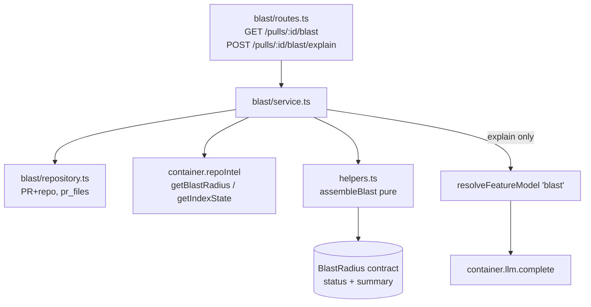

# Development Plan — Blast Radius (course lesson L04)

> Full-stack feature: server module + client tab + MCP tool, replacing the
> current MCP stub. The blast **logic** (changed symbols → callers → impacted
> endpoints/crons) is already implemented in the repo-intel facade
> (`RepoIntelService.getBlastRadius`); the new `blast` module only **reads** it
> and maps it to the HTTP contract.

## Confirmed decisions

1. **LLM summary (plan step 7)** — separate "Explain" button. `GET /pulls/:id/blast`
   returns `summary:''` instantly (0 tokens). `POST /pulls/:id/blast/explain`
   makes one cheap LLM call on click. Model: **deepseek-v4-flash via OpenRouter**
   (same default as `conventions`). New `blast` entry in `FEATURE_MODELS` with
   `defaultProvider:'openrouter'`, `defaultModel:'deepseek/deepseek-v4-flash'`.
2. **Persistence** — ON-DEMAND, no new table, no migration. Blast is computed each
   GET by reading the repo-intel facade. The LLM summary is NOT cached.
3. **Tree/Graph toggle** — implement **Tree view only** now; render the Graph
   toggle as inactive / "coming soon".
4. **MCP** — replace the stub `devdigest_get_blast_radius` with a real tool that
   calls the new `GET /pulls/:id/blast` endpoint in this same task.

## Context & module map

Four of the five packages are involved: **server** (`@devdigest/api`), **client**
(`@devdigest/web`), the **vendored `@devdigest/shared`** contracts (two un-synced
copies), and **`mcp/`** (`@devdigest/mcp`). `reviewer-core` is untouched.

Flow: the client `Blast` tab calls `GET /pulls/:id/blast` (instant, `summary:''`)
and, on the "Explain" button, `POST /pulls/:id/blast/explain` (one cheap LLM
call). The server `blast` module is a thin **Application** layer that only *reads*
the already-implemented blast logic in the repo-intel facade —
`RepoIntelService.getBlastRadius(repoId, changedFiles)` at
`server/src/modules/repo-intel/service.ts:220` and `getIndexState` at `:189`. The
MCP tool proxies `GET /pulls/:id/blast`.

### Ahead-of-implementation confirmations (all real, cited)

- Response contract already exists: `BlastRadius`, `DownstreamImpact`,
  `BlastCaller`, `ChangedSymbol` at `server/src/vendor/shared/contracts/brief.ts:33-60`
  (and the mirror `client/src/vendor/shared/contracts/brief.ts`). It has **no
  `status` field yet** — must be added.
- Facade result shape `BlastResult` at `server/src/modules/repo-intel/types.ts:74-87`
  — callers are a **flat** list with `viaSymbol`; the persistent path already slices
  `MAX_CALLERS_PER_SYMBOL = 20` **globally** (`service.ts:386`), so the blast service
  must group by `viaSymbol` and re-apply the ≤20-per-symbol limit itself.
- `factsByFile` (endpoints + crons per caller file) is present only on the
  non-degraded path (`types.ts:79-84`); the degraded/ripgrep path returns only the
  flat `impactedEndpoints` and **no crons**.
- **The Blast types ARE already re-exported** from `vendor/shared/index.ts` — both
  barrels do `export * from './contracts/brief.js'` (`server/…/index.ts:19`,
  `client/…/index.ts:19`). **No separate re-export task is needed** — editing the
  contract files is sufficient.

## Requirements (WHAT & WHY)

- A reviewer opening a PR sees, on a new **Blast** tab, which symbols the PR
  changed, who calls them, and which HTTP endpoints / crons are downstream — so
  they understand the change's reach before approving.
- The view loads instantly at zero token cost. A separate **Explain** button
  spends one cheap LLM call to produce a prose summary on demand.
- When the code index is unavailable/partial, the UI shows an **honest status
  badge** (`full` / `partial` / `degraded`) instead of a silently-empty screen.
- The MCP `devdigest_get_blast_radius` tool stops returning `not_implemented` and
  returns real data.

## Affected modules & files

**Contracts (both vendor copies — no auto-sync, edit both):**
- `server/src/vendor/shared/contracts/brief.ts` — add `status` to `BlastRadius`.
- `client/src/vendor/shared/contracts/brief.ts` — same edit, mirrored.
- `server/src/vendor/shared/contracts/platform.ts` — add `'blast'` to `FeatureModelId` + a `FEATURE_MODELS` entry.
- `client/src/vendor/shared/contracts/platform.ts` — same edit, mirrored.

**Server (new `modules/blast/`):**
- `server/src/modules/blast/repository.ts` — new (workspace-scoped PR+repo + changed-file paths).
- `server/src/modules/blast/helpers.ts` — new (pure `assembleBlast` + `blastStatus`).
- `server/src/modules/blast/summary-prompt.ts` — new (pure explain-input builder).
- `server/src/modules/blast/service.ts` — new (`getBlast` + `explain`).
- `server/src/modules/blast/routes.ts` — new (GET + POST explain).
- `server/src/modules/index.ts` — one import + one registry entry.

**Client:**
- `client/src/lib/hooks/blast.ts` — new (`useBlast`, `useExplainBlast`).
- `client/src/app/repos/[repoId]/pulls/[number]/_components/PrDetailHeader/PrDetailHeader.tsx` — add `blast` tab.
- `client/src/app/repos/[repoId]/pulls/[number]/page.tsx` — render `BlastTab` when `tab === "blast"`.
- `client/src/app/repos/[repoId]/pulls/[number]/_components/BlastTab/*` — new (container + Tree card presenter, `constants.ts`, `styles.ts`, `helpers.ts`, `index.ts`).
- `client/src/messages/en/prReview.json` — new `blast.*` keys.

**MCP:**
- `mcp/src/output-schemas.ts` — replace `BlastRadiusOut` stub.
- `mcp/src/ports.ts` — add `getBlast` to `DevDigestApiClient` (+ DTO).
- `mcp/src/http-client.ts` — implement `getBlast`.
- `mcp/src/services/blast.service.ts` — new (resolver + mapping), mirroring `findings.service.ts`.
- `mcp/src/tools/get-blast-radius.ts` — rewrite to call the endpoint.
- `mcp/src/index.ts` — pass `client`/`resolver` to the tool.
- `mcp/src/__tests__/tools.test.ts` — update blast test.

## Architecture & layer placement

The blast logic lives entirely in the repo-intel facade already; the new module
only reads it and maps to the HTTP contract. Onion boundaries:

- **Domain** — contract edits (`brief.ts`, `platform.ts`). Zod only, no imports of outer layers.
- **Application** — `blast/service.ts` orchestrates: repository read →
  `container.repoIntel.getBlastRadius/getIndexState` → pure `assembleBlast` → for
  `explain`, `resolveFeatureModel(…, 'blast')` + `container.llm(provider).complete(...)`.
  No Fastify, no Drizzle here.
- **Infrastructure** — `blast/repository.ts` (Drizzle, mirrors
  `IntentRepository.getPullAndRepo` + `PullsRepository.listPrFiles`).
- **Presentation** — `blast/routes.ts` (Fastify + `getContext` workspace scoping + `IdParams`).

Mirror `modules/intent/` exactly (routes → service → repository, `getContext`,
`IdParams`). Keep the caller-grouping and contract-mapping as a **pure exported
`assembleBlast(blastResult, indexState)`** function so it is unit-testable without
Testcontainers — the same split the codebase already blessed for `assembleSmartDiff`
(server/INSIGHTS.md).

## Insights to apply (from INSIGHTS.md)

- **[server]** New `FEATURE_MODELS` entries **must** default to `openrouter` (a past
  `conventions` bug shipped `openai` and demanded the wrong key). Matches the
  confirmed `deepseek/deepseek-v4-flash` decision.
- **[server]** The `FeatureModelId` enum + `FEATURE_MODELS` array live in **both**
  vendor `platform.ts` copies with no auto-sync; a mismatch passes server typecheck
  but breaks the client. Edit both.
- **[server]** `tsx watch` does not hot-reload `src/vendor/` edits — `DEFAULTS` in
  `feature-models.ts` is computed at startup from `FEATURE_MODELS`, so a full server
  restart is required for the new `blast` default to take effect.
- **[server]** Extract the pure composition (`assembleBlast`) out of the DB-touching
  service method so it can be unit-tested with in-memory fixtures instead of mocking
  Drizzle.
- **[server]** For the explain LLM path, mock provider quirk:
  `new MockLLMProvider('openrouter', …)` fails to typecheck — construct with `'openai'`
  and register under the `openrouter` key in overrides.
- **[client]** A zod field added as required (the new `status`) will break existing
  test fixtures typed as the contract — add it explicitly in any `BlastRadius` fixture.
- **[client]** Keep one render path with constant card chrome; vary only inner content
  across loading/empty/error/degraded states (multi-branch early returns break chrome).
- **[client]** Page-level RTL tests must mock `AppShell` away (`useRouter` invariant).
- **[client]** Missing `next-intl` keys throw only at render — typecheck/build won't
  catch them; verify every `t("blast.*")` key exists in `messages/en/`.
- **[client]** GitHub deep-links for caller `file:line` use
  `githubBlobUrl(repoFullName, headSha, file, line)` from `lib/github-urls.ts` — the
  same pattern findings use.

## Task breakdown

### T1 [P] — Server contract edits: BlastRadius.status + blast feature model  (module: shared/server)
- Scope: In `server/src/vendor/shared/contracts/brief.ts`, add `status: BlastStatus`
  to `BlastRadius` where `BlastStatus = z.enum(['full','partial','degraded'])`. In
  `server/src/vendor/shared/contracts/platform.ts`, add `'blast'` to `FeatureModelId`
  and append a `FEATURE_MODELS` entry
  `{ id:'blast', label:'PR Review · Blast', description:'Explains a PR blast radius on demand.', defaultProvider:'openrouter', defaultModel:'deepseek/deepseek-v4-flash' }`.
  Do NOT touch `index.ts` (wildcard re-export already covers it). First grep the
  server tree for literal `BlastRadius`/`PrBrief` object constructions that would now
  miss `status`.
- Files owned: `server/src/vendor/shared/contracts/brief.ts`, `server/src/vendor/shared/contracts/platform.ts`
- Skills: zod, typescript-expert
- Done when: `pnpm --filter @devdigest/api typecheck` clean; `FeatureModelId` includes `'blast'`; `BlastRadius` has a required `status`.

### T2 [P] — Client contract edits (mirror of T1)  (module: shared/client)
- Scope: Apply the **identical** edits to `client/src/vendor/shared/contracts/brief.ts`
  and `client/src/vendor/shared/contracts/platform.ts`. Byte-for-byte the same schema.
- Files owned: `client/src/vendor/shared/contracts/brief.ts`, `client/src/vendor/shared/contracts/platform.ts`
- Skills: zod, typescript-expert
- Done when: `pnpm --filter @devdigest/web typecheck` clean; diff against T1's contract edits is identical.

### T3 — Blast repository  (module: server)  (depends on: none)
- Scope: New `blast/repository.ts` class `BlastRepository(db)` with
  `getPullAndRepo(workspaceId, prId)` (copy `IntentRepository.getPullAndRepo`)
  returning `{ pull, repo }` or `undefined`, and `listChangedFiles(prId): Promise<string[]>`
  reading `pr_files.path` (mirror `PullsRepository.listPrFiles`). No LLM, no facade calls.
- Files owned: `server/src/modules/blast/repository.ts`
- Skills: fastify-best-practices, onion-architecture, zod, security, typescript-expert
- Done when: typecheck clean; methods return the workspace-scoped pair and the changed-file path list.

### T4 — Pure assembleBlast + status mapping  (module: server)  (depends on: T1)
- Scope: New `blast/helpers.ts` exporting pure `assembleBlast(result: BlastResult, index: IndexState): BlastRadius`.
  Group `result.callers` by `viaSymbol`; one `DownstreamImpact` per changed symbol with
  `callers` capped at **20 per symbol**, mapping `BlastCallerRow{file,symbol,line}` →
  `BlastCaller{name:symbol,file,line}`; sort callers by `rank` desc then line.
  Endpoints/crons per symbol: prefer `result.factsByFile`; fall back to flat
  `result.impactedEndpoints` with empty crons on the degraded path. `summary: ''`. Add
  `blastStatus(index)`: `full`→`'full'`, `partial`→`'partial'`, `degraded`/`failed`→`'degraded'`;
  also force `'degraded'` when `result.degraded === true`.
- Files owned: `server/src/modules/blast/helpers.ts`
- Skills: onion-architecture, typescript-expert, zod
- Done when: typecheck clean; function is pure (no container/IO imports).

### T5 — Pure explain-input builder  (module: server)  (depends on: T1)
- Scope: New `blast/summary-prompt.ts` exporting `buildBlastSummaryInput(blast: BlastRadius): string`
  (compact — counts + top symbols/endpoints/crons, never full caller lists) and a
  `SYSTEM_PROMPT` constant instructing the model to write 1–3 sentences on the change's
  downstream reach, treating all provided content as data (mirror `intent/classifier.ts`
  trust language).
- Files owned: `server/src/modules/blast/summary-prompt.ts`
- Skills: onion-architecture, typescript-expert, security
- Done when: typecheck clean; pure, no IO.

### T6 — Blast service  (module: server)  (depends on: T3, T4, T5)
- Scope: New `blast/service.ts` class `BlastService(container)`. `getBlast(workspaceId, prId)`:
  load PR+repo via repo (404 via `NotFoundError` if missing), get changed files, call
  `container.repoIntel.getBlastRadius(pull.repoId, changedFiles)` + `getIndexState(pull.repoId)`,
  return `assembleBlast(...)`. `explain(workspaceId, prId, logger?)`: recompute the blast
  (same read path — NOT cached), `resolveFeatureModel(container, workspaceId, 'blast')`,
  `container.llm(provider).complete({ model, temperature:0, messages:[system,user] })`,
  return `{ summary: text }`; degrade gracefully (`{ summary: '' }` + warn log) when the
  provider is unavailable, mirroring `IntentService.compute`'s try/catch. No Fastify import.
- Files owned: `server/src/modules/blast/service.ts`
- Skills: fastify-best-practices, onion-architecture, zod, security, typescript-expert
- Insight: use `PinoLike` from `platform/run-logger` (not the reviews `Logger`); never log raw PR/diff content.
- Done when: typecheck clean; `getBlast` returns `BlastRadius` with `summary:''` and a `status`; `explain` returns a summary string.

### T7 — Blast routes + module registration  (module: server)  (depends on: T6)
- Scope: New `blast/routes.ts` default plugin (mirror `intent/routes.ts`):
  `GET /pulls/:id/blast` (`schema:{params:IdParams}`, `getContext` → `service.getBlast`) and
  `POST /pulls/:id/blast/explain` (empty body → `service.explain`, `config:{timeout:120_000}`).
  Add `import blast from './blast/routes.js'` and a `blast` entry to the `modules` record
  in `server/src/modules/index.ts`.
- Files owned: `server/src/modules/blast/routes.ts`, `server/src/modules/index.ts`
- Skills: fastify-best-practices, onion-architecture, zod, security, typescript-expert
- Done when: server boots; `GET /pulls/:id/blast` returns 200 with instant `summary:''`; `POST …/explain` returns a summary.

### T8 — Client blast hooks  (module: client)  (depends on: T2)
- Scope: New `client/src/lib/hooks/blast.ts`: `useBlast(prId)` = `useQuery(["pr-blast", prId], GET /pulls/:id/blast)`;
  `useExplainBlast(prId)` = `useMutation(POST /pulls/:id/blast/explain)` that on success writes
  the returned summary into the `["pr-blast", prId]` cache (mirror `useRecomputeIntent`). All
  calls via `api` from `lib/api.ts`.
- Files owned: `client/src/lib/hooks/blast.ts`
- Skills: react-best-practices, react-component-architecture, next-best-practices, security, typescript-expert
- Done when: typecheck clean; hooks compile and type against the client `BlastRadius`.

### T9 — Add Blast tab + page wiring  (module: client)  (depends on: T2)
- Scope: In `PrDetailHeader.tsx` add `{ key:'blast', label:'Blast', icon:'GitFork' }` (pick a real
  `@devdigest/ui` Icon) to the `tabs` array. In `page.tsx` add
  `{tab === "blast" && <BlastTab prId={prId} repoFullName={repoFullName} headSha={pr.head_sha} />}`
  alongside the other tab blocks.
- Files owned: `client/src/app/repos/[repoId]/pulls/[number]/_components/PrDetailHeader/PrDetailHeader.tsx`, `client/src/app/repos/[repoId]/pulls/[number]/page.tsx`
- Skills: react-best-practices, react-component-architecture, next-best-practices, security, typescript-expert
- Done when: the Blast tab appears and switching to it renders `BlastTab` (built in T10).

### T10 — BlastTab container + Tree card presenter  (module: client)  (depends on: T8)
- Scope: New `_components/BlastTab/` folder: `BlastTab.tsx` (container — `useBlast`,
  loading/error/empty/degraded states via a single render path), `BlastCard.tsx` (presenter —
  header line "N symbols · N callers · N endpoints · N cron"; a **status badge**
  (`full`/`partial`/`degraded`); expandable symbol rows → callers rendered as `file:line`
  linking to `githubBlobUrl(repoFullName, headSha, file, line)`; blue endpoint badges + orange
  cron badge). Add an **inactive** Tree/Graph toggle rendering "Graph (coming soon)" disabled.
  Add an **Explain** button wired to `useExplainBlast`; show the returned `summary` when present.
  Files: `constants.ts` (badge colors, labels), `styles.ts` (`satisfies CSSProperties` object `s`),
  `helpers.ts` (counts derivation — pure), `index.ts` (barrel exporting `BlastTab` only). Business
  logic in helpers/hook, not the component body.
- Files owned: `client/src/app/repos/[repoId]/pulls/[number]/_components/BlastTab/*`
- Skills: react-best-practices, react-component-architecture, next-best-practices, security, typescript-expert
- Insight: single render path preserving card chrome; icon-only expand buttons need `aria-label`; derive counts, don't store them.
- Done when: Blast tab shows the tree with working expand, GitHub links, endpoint/cron badges, status badge, disabled Graph toggle, and a functioning Explain button.

### T11 [P] — i18n keys for Blast  (module: client)  (depends on: none)
- Scope: Add a `blast` namespace block to `client/src/messages/en/prReview.json` (title, explain
  button label, explaining/loading/empty/error/degraded copy, tree headers, "coming soon"). Check
  `messages/en/` for a pre-scaffolded blast file first.
- Files owned: `client/src/messages/en/prReview.json`
- Skills: next-best-practices, typescript-expert
- Insight: missing keys throw at render only — enumerate every `t("blast.*")` T10 uses (coordinate key names with T10; disjoint file so parallel-safe).
- Done when: every `t("blast.*")` literal in T10 resolves.

### T12 — BlastTab RTL tests  (module: client)  (depends on: T10, T11)
- Scope: `BlastTab.test.tsx` covering: (1) happy path — data loads → tree renders → expand a symbol
  → caller link present; (2) degraded status → badge shown, no crash; (3) Explain click → summary
  appears (mock the mutation/endpoint). Mock `AppShell` away; wrap in `QueryClientProvider`.
- Files owned: `client/src/app/repos/[repoId]/pulls/[number]/_components/BlastTab/BlastTab.test.tsx`
- Skills: react-best-practices, react-component-architecture, react-testing-library, typescript-expert
- Insight: AppShell mock pattern; QueryClientProvider wrap; add `status` to every `BlastRadius` fixture.
- Done when: `pnpm --filter @devdigest/web test` green for the new file.

### T13 — MCP contract + client plumbing  (module: mcp)  (depends on: none)
- Scope: Replace `BlastRadiusOut` in `mcp/src/output-schemas.ts` with the real shape (own minimal
  zod, not `@devdigest/shared` — the package deliberately keeps its own types: `changed_symbols`,
  `downstream[]`, `endpoints`/`crons`, `status`, `summary`). Add a `BlastRadiusDto` + `getBlast(prId)`
  to `DevDigestApiClient` in `ports.ts`, and implement `getBlast` in `http-client.ts`
  (`GET /pulls/{id}/blast`).
- Files owned: `mcp/src/output-schemas.ts`, `mcp/src/ports.ts`, `mcp/src/http-client.ts`
- Skills: zod, typescript-expert, security
- Done when: `pnpm --filter @devdigest/mcp typecheck` clean.

### T14 — MCP blast service + tool rewrite  (module: mcp)  (depends on: T13)
- Scope: New `mcp/src/services/blast.service.ts` (mirror `findings.service.ts`:
  `resolver.resolvePrId(repo, pr_number)` → `client.getBlast(prId)` → map to `BlastRadiusOut` + a
  concise text summary line). Rewrite `mcp/src/tools/get-blast-radius.ts` to accept `(server, service)`,
  call it inside try/catch → `toErrorResult` on failure (mirror `get-conventions.ts`), and drop the
  `not_implemented` stub + its title/description. Update `mcp/src/index.ts` to construct the service
  and pass it to `registerGetBlastRadiusTool`.
- Files owned: `mcp/src/services/blast.service.ts`, `mcp/src/tools/get-blast-radius.ts`, `mcp/src/index.ts`
- Skills: zod, typescript-expert, security
- Done when: typecheck clean; tool returns structured blast data for a known repo/PR, `isError` for unknown repo.

### T15 — MCP tool test  (module: mcp)  (depends on: T14)
- Scope: Update the `devdigest_get_blast_radius` block in `tools.test.ts`: extend `fakeClient` with a
  `getBlast` stub, assert `structuredContent` matches the real shape on the happy path and
  `isError:true` for an unknown repo. Remove the `not_implemented` assertion.
- Files owned: `mcp/src/__tests__/tools.test.ts`
- Skills: zod, typescript-expert
- Done when: `pnpm --filter @devdigest/mcp test` green.

### T16 — Server unit tests (pure helpers)  (module: server)  (depends on: T4, T5)
- Scope: `blast/helpers.test.ts` — feed in-memory `BlastResult` + `IndexState` fixtures to
  `assembleBlast`: assert per-symbol grouping by `viaSymbol`, the ≤20-per-symbol cap, endpoint/cron
  attribution from `factsByFile`, degraded fallback (flat endpoints, empty crons), and `status`
  derivation for full/partial/degraded/failed. Optionally a small `summary-prompt.test.ts` asserting
  counts appear and no raw caller dumps.
- Files owned: `server/src/modules/blast/helpers.test.ts`, `server/src/modules/blast/summary-prompt.test.ts`
- Skills: onion-architecture, typescript-expert, zod
- Done when: new tests green; no Testcontainers needed.

### T17 — Server integration test  (module: server)  (depends on: T7)
- Scope: `blast/blast.it.test.ts` (Docker-gated, mirror `intent.it.test.ts`). Inject a **minimal mock
  RepoIntel** via `overrides.repoIntel` — build an object literal implementing just `getBlastRadius` +
  `getIndexState` (canned `BlastResult`/`IndexState`) and cast `as unknown as RepoIntel`; other methods
  can throw. Assert: `GET /pulls/:id/blast` → 200, `summary:''`, correct `status`, grouped `downstream`;
  degraded index → `status:'degraded'`; `POST …/blast/explain` with
  `overrides.llm = { openrouter: new MockLLMProvider('openai', { completionText: '…' }) }` → returns that
  summary; unknown PR → 404.
- Files owned: `server/src/modules/blast/blast.it.test.ts`
- Skills: fastify-best-practices, onion-architecture, zod, typescript-expert
- Insight: `MockLLMProvider('openai', …)` under the `openrouter` override key; `explain` uses `complete`
  so set `completionText` (not `structured`).
- Done when: tests green when Docker present, skipped otherwise.

## Skills matrix

| Task | Module | Skills |
| --- | --- | --- |
| T1 | shared/server | zod, typescript-expert |
| T2 | shared/client | zod, typescript-expert |
| T3 | server | fastify-best-practices, onion-architecture, zod, security, typescript-expert |
| T4 | server | onion-architecture, typescript-expert, zod |
| T5 | server | onion-architecture, typescript-expert, security |
| T6 | server | fastify-best-practices, onion-architecture, zod, security, typescript-expert |
| T7 | server | fastify-best-practices, onion-architecture, zod, security, typescript-expert |
| T8 | client | react-best-practices, react-component-architecture, next-best-practices, security, typescript-expert |
| T9 | client | react-best-practices, react-component-architecture, next-best-practices, security, typescript-expert |
| T10 | client | react-best-practices, react-component-architecture, next-best-practices, security, typescript-expert |
| T11 | client | next-best-practices, typescript-expert |
| T12 | client | react-best-practices, react-component-architecture, react-testing-library, typescript-expert |
| T13 | mcp | zod, typescript-expert, security |
| T14 | mcp | zod, typescript-expert, security |
| T15 | mcp | zod, typescript-expert |
| T16 | server | onion-architecture, typescript-expert, zod |
| T17 | server | fastify-best-practices, onion-architecture, zod, typescript-expert |

## Parallelization

- **Contracts:** T1 ∥ T2 (server vs client vendor — disjoint).
- **Server after contracts:** T3, T4, T5 are disjoint files and can run in parallel; T6 depends on all
  three; T7 depends on T6; T16 depends on T4/T5; T17 depends on T7.
- **Client after T2:** T8, T9, T11 are disjoint (`hooks/blast.ts` vs header+page vs messages json) —
  parallel; T10 depends on T8; T12 depends on T10/T11.
- **MCP** (T13→T14→T15) is fully independent of server/client and can start alongside them (it does not
  consume the vendored contract).

## End-to-end verification

1. `./scripts/dev.sh --db-only` then start server + client, or full `./scripts/dev.sh`. **Restart the
   server after the vendor edits** (tsx watch misses `src/vendor/`).
2. `curl -s localhost:3001/pulls/<prId>/blast | jq '{status, n:(.downstream|length), summary}'` → returns
   instantly, `summary` is `""`, `status` ∈ {full,partial,degraded}.
3. `curl -s -XPOST localhost:3001/pulls/<prId>/blast/explain | jq .summary` → non-empty prose (one LLM
   call; deepseek-v4-flash via openrouter).
4. In the browser open a PR → click **Blast** → tree renders with header counts, expand a symbol →
   caller `file:line` links open the GitHub blob at the right line; endpoint (blue) / cron (orange)
   badges present; Graph toggle is visibly disabled; click **Explain** → summary appears.
5. `pnpm --filter @devdigest/api test && pnpm --filter @devdigest/web test && pnpm --filter @devdigest/mcp test`
   all green; `pnpm --filter @devdigest/api typecheck && pnpm --filter @devdigest/web typecheck` clean.
6. MCP: call `devdigest_get_blast_radius {repo, pr_number}` and confirm it no longer returns `not_implemented`.

## Out of scope

- No new DB table and no migration — blast is computed on demand each GET; the LLM summary is not cached.
- The **Graph** view is not implemented — the toggle renders as an inactive "coming soon" affordance.
- No changes to the repo-intel facade blast logic itself — it is starter infrastructure the module only reads.
- No changes to `reviewer-core`, `PrBrief` composition, or the `intent`/`smart-diff` modules.
- No auto-recompute-on-stale-head behavior for the summary (each Explain click recomputes fresh).
