# Implementation Plan — Live context docs at eval-run time + version bump on context-doc edit
Spec: none — this is a post-SPEC-03 follow-up decision (originating spec: `specs/SPEC-03-agent-evals.md`). The gap is documented in `server/INSIGHTS.md` "What Doesn't Work" (line 30) and Session Notes 2026-07-15.

## Context & module map
Only the **server** (`@devdigest/api`) module changes, plus the vendored `@devdigest/shared` contract (mirrored in **client**, per the vendoring-drift gotcha). No client UI work.

Two independent problems, both analogous to the already-fixed SKILLS behaviour:

1. **Version bump gap.** Editing an agent's `contextDocs` does not bump `agents.version`. `isConfigChange` (`server/src/modules/agents/helpers.ts:65-90`) enumerates every versioned field *except* `contextDocs`; `AgentsService.setContextDocs` (`service.ts:201-208`) routes through `repo.update({ contextDocs })` (`repository.ts:133-168`) which calls `isConfigChange`, so a context-doc-only edit never bumps and never snapshots. This collapses before/after eval runs into one version bucket (same failure the skills fix cured — `INSIGHTS.md:30`).

2. **Frozen vs live docs at eval time.** The eval runner reads context-doc **content** from the frozen snapshot `EvalCaseInputMeta.enrichment.context_docs` (`server/src/vendor/shared/contracts/eval-ci.ts:68-70`), built once at capture from `trace.specs_read` (`capture.ts:31-54`, `service.ts:614-628`) and injected via `caseToReviewInputs` → `specs` (`prompt-inputs.ts:53-72`, line 61). It never consults the live agent record. Skills, by contrast, are re-read live every run from Postgres (`runner.ts:52-53`).

**Ahead-of-implementation / real check:** everything here is real, wired code (verified line-by-line) — not aspirational schema. `context_docs` is a JSONB sub-field of `eval_cases.input_meta`, **not** a DB column, so no migration is required for any option below.

## Requirements (WHAT & WHY)
Make an agent's context docs behave like its skills for eval consistency:
1. Editing/removing an agent's context docs bumps `agents.version` + snapshots `agent_versions`, so eval runs before/after the edit land in distinct version buckets and the dashboard/Compare can show a difference.
2. At eval-run time, context docs are resolved **live** from the agent's current config (mirroring what a review run does) rather than from the frozen per-case snapshot.
3. Accepted tradeoff (already agreed with the user): this breaks strict per-case reproducibility for context docs, exactly as already accepted for skills. The frozen `context_docs` field becomes historical/read-only.

## Affected modules & files
- `server/src/modules/agents/helpers.ts` — add `contextDocs` to `ConfigChangePatch` + `isConfigChange` (order-sensitive, reuse `sameOrderedIds`).
- `server/src/modules/agents/service.ts` / `repository.ts` — no logic change expected; verified the bump falls out of the `helpers.ts` change (both `setContextDocs` and Agent-editor PATCH go through `repo.update` → `isConfigChange`; `snapshotVersion` already records `context_docs`). Task T2 confirms this and adds a service-layer guard only if a real gap is found.
- `server/src/modules/eval/prompt-inputs.ts` — stop deriving `specs` from `enrichment.context_docs` (lines 61, 70).
- `server/src/modules/eval/runner.ts` — resolve + inject live context docs; update the module contract docstring (`runner.ts:11-14`). **Gated on the I/O decision (T3).**
- `server/src/vendor/shared/contracts/eval-ci.ts` + `client/src/vendor/shared/contracts/eval-ci.ts` — re-document `context_docs` as historical/read-only (both copies; no shape change).
- `server/src/modules/eval/capture.ts` / `types.ts` — unchanged code; capture keeps populating `context_docs` for audit/display (documented, not removed).

## Architecture & layer placement (onion)
- **Part 1 (version bump)** is entirely Application/Infrastructure inside `agents/`. `isConfigChange` is a pure Domain-ish helper; the bump + snapshot already live correctly in the repository. Clean, no boundary risk.
- **Part 2 (live docs)** is the architecturally significant change. The eval runner (`runner.ts`) is deliberately **Application layer with zero Infrastructure I/O** — no Drizzle, no Fastify, and critically **no `container.git`** (AC-16, `runner.ts:11-14`). Review runs resolve docs in `run-executor.ts` (Presentation/orchestration layer) which *does* own git I/O: `checkoutPullHead` then `resolveAttachedDocPaths(agent.contextDocs, linked)` + `git.readFile` per path (`run-executor.ts:162-229`). Reusing that exact resolution path in the eval runner means importing git I/O into a module that promised not to have it. **This is a real layer-contract change, surfaced as decision gate T3 below — do not implement T4/T5 until it is resolved.**

```mermaid
flowchart TD
    subgraph review["Review run (run-executor.ts — has git I/O)"]
        R1[checkoutPullHead] --> R2["resolveAttachedDocPaths(agent.contextDocs, linked)"]
        R2 --> R3["git.readFile per path"] --> R4["specs into reviewPullRequest"]
    end
    subgraph evalNow["Eval run TODAY (runner.ts — zero git)"]
        E1["frozen enrichment.context_docs"] --> E2["caseToReviewInputs → specs"]
    end
    subgraph evalNew["Eval run PROPOSED (Option A)"]
        N1["reviewRepo.getPull/getRepo (source.pr_id)"] --> N2[checkoutPullHead]
        N2 --> N3["resolveAttachedDocPaths(agent.contextDocs, linked)"]
        N3 --> N4["git.readFile per path — REINTRODUCES git into runner"]
        N4 --> N5["specs into reviewPullRequest"]
    end
```

## DECISION GATE (T3) — how to resolve live docs without silently breaking the eval runner's contract
The user asked this be flagged, not silently chosen. Three options:

- **Option A — Mirror review exactly (reintroduce git into the runner).** In `runner.ts`, resolve the source PR's repo via `container.reviewRepo.getPull(agent.workspaceId, meta.source.pr_id)` → `getRepo(pull.repoId)`, `container.git.checkoutPullHead(...)`, then `resolveAttachedDocPaths(agent.contextDocs, linked)` + `git.readFile` per path — byte-identical to `run-executor.ts:213-229`.
  - Pros: truest production fidelity; both the path set *and* content are fully live; reuses the one canonical resolver (no parallel path).
  - Cons: **breaks AC-16** (eval was "Postgres + one model call"); adds git dependency, per-case `checkoutPullHead` latency, and new failure modes; introduces non-determinism (the source PR head may have moved or the clone may be out of sync between capture and eval); a sweep over N cases now does N checkouts against possibly-different PRs. The runner's module docstring contract must change.
- **Option B — Live path list, frozen content (no git).** Keep the runner git-free; use the agent's *current* `contextDocs` paths but reuse frozen content only where the path still matches. **Recommend rejecting:** editing a doc's *content* (the common case) does not change its path, so this yields identical input and does **not** achieve skills-parity — it looks fixed but isn't.
- **Option C — Materialise doc content into Postgres, read live there (no git in runner).** Resolve + store doc content when the agent is saved (a git read at *save* time, in `agents/`), then have the eval runner read live content from Postgres — mirroring how skills are live-from-Postgres. Keeps the eval runner pure and deterministic-per-version, and is the closest true analogue to skills.
  - Cons: larger change (new persistence + a resolve-on-save path); "live at eval time" then means "as of last agent save," not "as of this instant."

**Recommendation:** The user's stated decision ("eval runner should mirror whatever review already does") points at **Option A**, and this plan is written for Option A. If preserving the runner's pure-Postgres contract matters more than literal review-fidelity, **Option C** is the more architecturally consistent match to skills — flag this to the user before T4/T5 are implemented. **T5's shape changes materially depending on A vs C; do not start T5 until this is confirmed.**

## Insights to apply (from INSIGHTS.md)
- [server] Anything the runner reads at eval/review time (skills, context docs, prompt, model, strategy) must bump the agent version, or the version-run dashboard can't represent the change (`INSIGHTS.md:30`) — the whole point of Part 1.
- [server] Any edit to a `@devdigest/shared` contract file must be applied to **both** vendor copies; `tsc` will not catch drift (`INSIGHTS.md:40`). Applies to T7/T8.
- [server] `GitClient.readFile` reads the clone's **current checkout**, not a pinned sha — you must `checkoutPullHead`/sync first or you silently read the wrong commit's docs (`INSIGHTS.md:44`, and the exact reason `run-executor.ts:162-166` syncs before reading). Directly relevant to Option A in T5.
- [server] A `.it.test.ts` that fails only in the full suite is likely a Testcontainers contention flake — re-run the full suite before calling it a regression (`INSIGHTS.md:59`). Relevant to T-11.
- [server] When a new/edited service exposes a vendored snake_case contract, route through a DTO mapper — not relevant to new fields here (no shape change), but keep in mind if T7 tempts a shape change.

## Task breakdown
Execution mode assumed **single-agent, sequential** (matches how SPEC-03/SPEC-02 were run per Session Notes, and most tasks share `runner.ts` / `agents/` files with hard serial deps — little safe parallelism). No `[P]` markers. Confirm before execution; if multi-agent is wanted, only T1, T7, T-10 are safely disjoint.

### [ ] T1 — Add `contextDocs` to the version-bump rule  (module: server)
- Scope: In `agents/helpers.ts`, add `contextDocs?: string[]` to `ConfigChangePatch`; add `contextDocs` to the `Pick<AgentRow, ...>` in `isConfigChange`'s `existing` param; add a branch `(patch.contextDocs !== undefined && !sameOrderedIds(existing.contextDocs ?? [], patch.contextDocs))`. Order-sensitive by design — doc order drives prompt order (`resolveAttachedDocPaths`). Do NOT touch skills logic.
- Files owned: `server/src/modules/agents/helpers.ts`
- Skills to load: onion-architecture, typescript-expert
- Insights to apply: "must bump the agent version" (`INSIGHTS.md:30`)
- Tests owned by: test-writer (task T-10)
- Done when: `pnpm typecheck` clean; a context-doc-only patch now returns `true` from `isConfigChange`, a no-op (same ordered docs) returns `false`.

### [ ] T2 — Verify both edit entry points bump + snapshot  (module: server)  (depends on: T1)
- Scope: Confirm `AgentsService.setContextDocs` (`service.ts:201-208`) and the Agent-editor PATCH (`service.ts:94-113`) both bump `agents.version` and write an `agent_versions` snapshot after T1, since both go through `repo.update` → `isConfigChange`, and `snapshotVersion` already records `context_docs` (`repository.ts:208`). Add a service-layer guard mirroring `setSkills` ONLY if a real gap is found (expected: none — no code change). Do NOT duplicate the bump (avoid double-increment).
- Files owned: `server/src/modules/agents/service.ts`, `server/src/modules/agents/repository.ts` (edit only if a gap is confirmed)
- Skills to load: fastify-best-practices, onion-architecture, drizzle-orm-patterns, typescript-expert
- Insights to apply: snapshot already carries `context_docs` — do not re-add it.
- Tests owned by: test-writer (task T-10)
- Done when: manual trace (or a scratch assertion) shows one version increment + one snapshot per real context-doc change, zero for a no-op; no double-bump.

### [ ] T3 — DECISION GATE: resolve the I/O approach (Option A vs C)  (module: n/a — user decision)
- Scope: User confirms Option A (git into runner, this plan's default) or Option C (materialise content to Postgres). Blocks T4/T5. Not a code task.
- Done when: choice recorded; if C, T5's scope is rewritten before implementation.

### [ ] T4 — Stop feeding frozen docs into the eval prompt  (module: server)  (depends on: T3)
- Scope: In `eval/prompt-inputs.ts`, remove the `specs` derivation from `enrichment.context_docs` (drop line 61's `specs` and the `...(specs.length ? { specs } : {})` spread at line 70). Keep the function pure (no I/O) and leave every other field (diff, task, callers, repoMap, intent, prDescription) untouched. `specs` will now be supplied by the runner (Option A) — or by a Postgres read (Option C).
- Files owned: `server/src/modules/eval/prompt-inputs.ts`
- Skills to load: onion-architecture, typescript-expert
- Insights to apply: none
- Tests owned by: test-writer (task T-11)
- Done when: `pnpm typecheck` clean; `caseToReviewInputs` no longer references `context_docs`.

### [ ] T5 — Resolve + inject LIVE context docs in the runner (Option A)  (module: server)  (depends on: T3, T4)
- Scope (Option A): In `runner.ts::runCase`, after resolving skills, resolve the source PR's repo via `container.reviewRepo.getPull(agent.workspaceId, meta.source.pr_id)` then `getRepo(pull.repoId)`; `await container.git.checkoutPullHead({owner,name}, pull.number)` (best-effort, wrapped — never fail the run on a sync hiccup, per `run-executor.ts:162-166`); compute `resolveAttachedDocPaths(agent.contextDocs, linked)` and `git.readFile` per path, omitting unreadable docs (never throw); pass `...(specs.length ? { specs } : {})` into `reviewPullRequest`. **Update the module docstring `runner.ts:11-14`** to reflect that AC-16 no longer holds (git is now used for live docs) — do not leave a stale "zero container.git" contract. If T3 chose Option C, this task instead reads materialised content from Postgres and keeps the git-free docstring.
- Files owned: `server/src/modules/eval/runner.ts`
- Skills to load: fastify-best-practices, onion-architecture, drizzle-orm-patterns, security, typescript-expert
- Insights to apply: `readFile` reads current checkout — sync first or read the wrong commit (`INSIGHTS.md:44`); reuse the single `resolveAttachedDocPaths` resolver, don't fork it ("linked skills reach a run ONLY through one path", `INSIGHTS.md:38`); path-safety on `readFile` (traversal) already enforced in the adapter — do not bypass it.
- Tests owned by: test-writer (task T-11)
- Done when: `pnpm typecheck` clean; server suite at baseline; an eval run injects live doc content (verified in T-11 / E2E), and a doc edit changes the prompt.

### [ ] T7 — Re-document the frozen `context_docs` field as historical (server contract)  (module: server)  (depends on: T5)
- Scope: In `server/src/vendor/shared/contracts/eval-ci.ts`, update the `context_docs` field in `EvalCaseInputMeta` (lines 68-70) with a comment marking it **historical/read-only** — captured for audit/display, no longer consumed by the runner. Keep the shape (no removal — existing cases retain it, and capture keeps populating it). No migration (JSONB sub-field).
- Files owned: `server/src/vendor/shared/contracts/eval-ci.ts`
- Skills to load: zod, typescript-expert
- Insights to apply: contract edits must hit both vendor copies (`INSIGHTS.md:40`) — mirrored in T8.
- Tests owned by: test-writer (n/a — comment-only)
- Done when: `pnpm typecheck` clean; comment states the field is historical.

### [ ] T8 — Mirror the contract comment in the client vendor copy  (module: client)  (depends on: T7)
- Scope: Apply the identical `context_docs` comment change to `client/src/vendor/shared/contracts/eval-ci.ts` so the two vendored copies do not drift.
- Files owned: `client/src/vendor/shared/contracts/eval-ci.ts`
- Skills to load: zod, typescript-expert
- Insights to apply: vendoring drift is invisible to `tsc` (`INSIGHTS.md:40`).
- Tests owned by: test-writer (n/a — comment-only)
- Done when: client typecheck clean; both copies read identically.

### [ ] T9 — Confirm capture disposition (keep populating for audit)  (module: server)  (depends on: T3)
- Scope: Confirm `buildEnrichment` (`capture.ts:31-54`) and `captureEnrichment` (`service.ts:614-628`) STILL populate `context_docs` from `trace.specs_read` — kept as an audit/display record even though the runner no longer reads it. Expected: no code change. Add a one-line comment noting the field is now write-for-audit-only. Do NOT remove capture (it feeds any future historical display).
- Files owned: `server/src/modules/eval/capture.ts` (comment only)
- Skills to load: onion-architecture, typescript-expert
- Insights to apply: eval capture rules (`INSIGHTS.md:35`) — do not alter the intent/callers/rank_note sourcing.
- Tests owned by: test-writer (n/a)
- Done when: capture behaviour unchanged; comment documents the field's new status.

### [ ] T-10 — Tests for the version-bump rule (T1/T2)  (module: server)  (depends on: T1, T2)
- Scope: Unit-test `isConfigChange` for the `contextDocs` branch (add/remove/reorder → bump; identical order → no bump) and an integration test that `setContextDocs` produces exactly one `agents.version` increment + one `agent_versions` snapshot per real change and none for a no-op. See test-writer's contract.
- Files owned: `server/src/modules/agents/helpers.test.ts` (or existing agents test file), `server/test/*context-docs*.it.test.ts`
- Skills to load: (test-writer's skills)
- Done when: suite green, real output shown.

### [ ] T-11 — Tests for live-doc resolution in the runner (T4/T5)  (module: server)  (depends on: T4, T5)
- Scope: Test that `caseToReviewInputs` no longer emits `specs`; and (Option A) that `runner.runCase` reads live doc content via a mocked `container.git` (checkout + readFile), injects it as `specs`, and degrades gracefully on unreadable docs / missing source PR without failing the run. Use the existing eval runner test harness + `MockLLMProvider`.
- Files owned: `server/src/modules/eval/prompt-inputs.test.ts`, `server/src/modules/eval/runner.it.test.ts`
- Skills to load: (test-writer's skills)
- Insights to apply: re-run the FULL suite before calling an `.it.test.ts` failure a regression (`INSIGHTS.md:59`).
- Done when: suite green, real output shown.

## Skills matrix (summary)
| Task | Module | Skills |
| --- | --- | --- |
| T1 | server | onion-architecture, typescript-expert |
| T2 | server | fastify-best-practices, onion-architecture, drizzle-orm-patterns, typescript-expert |
| T4 | server | onion-architecture, typescript-expert |
| T5 | server | fastify-best-practices, onion-architecture, drizzle-orm-patterns, security, typescript-expert |
| T7 | server | zod, typescript-expert |
| T8 | client | zod, typescript-expert |
| T9 | server | onion-architecture, typescript-expert |
| T-10 | server | (test-writer) |
| T-11 | server | (test-writer) |

## End-to-end verification
Run against the live stack (Postgres up; `./scripts/dev.sh --db-only` + `pnpm dev`), and per the user's memory **ask before triggering any eval run**:
1. Pick a seeded agent with ≥1 context doc and ≥1 eval case captured from a real review. Note its `version`.
2. Run the eval case once — record the resulting `eval_runs.agent_version` and the injected prompt (`EVAL_LOG_PROMPT=true` shows `specs`).
3. Edit that context doc's content in the repo/clone (Option A) or via the Agent editor (Option C) and save; confirm `agents.version` incremented by 1 and a new `agent_versions` row exists (`SELECT version FROM agents WHERE id=...` + `SELECT version FROM agent_versions WHERE agent_id=... ORDER BY version DESC LIMIT 2`).
4. Re-run the same eval case; confirm the new `eval_runs` row carries the **bumped** `agent_version` AND the injected `specs` reflect the edited content (not the frozen snapshot).
5. Confirm a no-op save (no doc change) does NOT bump the version.
Expected: distinct version buckets before/after the edit, and live doc content in the second run's prompt.

## Out of scope
- Any DB migration (none needed — `context_docs` is a JSONB sub-field).
- Removing the frozen `context_docs` field or back-filling existing cases (kept as historical/read-only).
- Client UI changes (the Context tab and eval display are unaffected; field stays for display).
- Changing skills behaviour, the scorer, or the dashboard aggregation.
- Deciding Option A vs C for the implementer — that is user decision T3.
