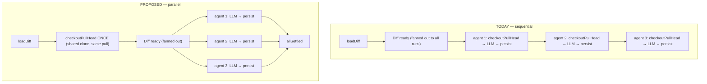

# Implementation Plan — Parallel (unbounded) agent fan-out in the review executor
Spec: none — post-SPEC-05 defect follow-up. Surfaced 2026-07-17 from a live 3-agent run on `/multi-agent-review/results`: two of three lanes sat on the shared "Diff ready — 3 changed file(s)" status line while only the first agent showed its own progress.

## Context & module map
Only **server** (`@devdigest/api`) changes — one file plus one test. No schema, no migration, no `@devdigest/shared` contract edit, no client work.

**The defect.** `ReviewRunExecutor.executeRuns` runs agents strictly sequentially:

```ts
for (const { agent, runId } of jobs) {           // run-executor.ts:107
  ...
  const outcome = await this.runOneAgent(...);   // :114  ← blocks the next agent
}
```

Agent 2 does not start until agent 1's LLM call resolves. `git log -L 107,110` on this range returns only the squashed snapshot commit — the loop predates the multi-agent feature, from when a "run" meant one or two agents and serialization was invisible.

**Why it went unnoticed.** The parallelism claim entered the codebase as an *assertion*, never an implementation:
- `client/messages/en/multiAgent.json:33` — `"… · parallel"` is a hardcoded literal, derived from nothing.
- `server/src/modules/multi-agent/estimate.ts:96-110` — `estimateTotals` rolls duration up as **max** (not sum), i.e. it prices a parallel fan-out.
- `server/src/modules/multi-agent/estimate.test.ts:58` — the test comment reads *"AC-10 — the runs fan out in parallel, so duration is max, cost is sum."* The suite **encodes** the assumption rather than checking it, so the false belief shipped with a green test defending it.

The live symptom is camouflaged: each lane's subtitle is the last SSE event for its run (`lastEventMessage`, `ResultsColumns/helpers.ts:33` → `Lane.tsx:82`). The `"Diff ready …"` line is fanned out to *every* run by a shared `RunLogger` (`run-executor.ts:63`, emitted `:105`), so a not-yet-started agent still shows it. Staggered subtitles read as ordinary progress, not as a stalled queue.

**Ahead-of-implementation check:** everything referenced here is real, wired code, verified line-by-line. Nothing in this plan depends on aspirational schema.

## Requirements (WHAT & WHY)
1. Selected agents execute concurrently, so a multi-agent run takes as long as its slowest member rather than the sum of all members.
2. `"… · parallel"` and `estimateTotals`' max-duration rule become **true statements about the system** rather than aspirations.
3. Per-agent failure isolation is preserved exactly: one agent failing/cancelling must not affect its siblings.
4. Concurrency is **unbounded** — one in-flight LLM call per agent, N agents ⇒ N concurrent calls. (Decision below.)
5. No behaviour change to the status model, the SSE contract, or any client component.

## Affected modules & files
- `server/src/modules/reviews/run-executor.ts` — the whole change: hoist `checkoutPullHead` into `executeRuns`, replace the loop with `Promise.allSettled`.
- `server/test/reviews.it.test.ts` — new overlap test (Docker-gated; already exercises the real route → service → executor → Postgres path).
- **Not changed, deliberately:** `estimate.ts` (already max/sum — correct *once* the executor is parallel), `multiAgent.json` (label becomes true), `status.ts` / `laneState` / `runningMemberIds` / the reaper (see "unbounded" decision).

## Architecture & layer placement (onion)
The change is confined to `run-executor.ts`, which is the orchestration layer that legitimately owns I/O (git, LLM resolution, persistence). `reviewer-core` stays pure and untouched. No new dependency, no layer crossed, no port widened. `p-queue` is **not** introduced (see decision).

Hoisting `checkoutPullHead` slightly *improves* layering: shared per-run prework (diff load, head checkout) moves next to its sibling prework in `executeRuns`, leaving `runOneAgent` to own only per-agent concerns.



## Why the checkout hoist is load-bearing (not a tidy-up)
`checkoutPullHead` is the **one real blocker** to a naive `Promise.all`. It is `fetch` + `reset --hard` against the *shared* clone at `server/clones/<owner>/<name>` (`adapters/git/simple-git.ts:78-86`). N concurrent invocations on one directory means `.git/index.lock` contention — and worse, the context-doc `readFile` immediately after (`run-executor.ts:~220`) reads the **current working tree**, so an agent could read a half-reset tree. That trap is already recorded (`server/INSIGHTS.md:45`: `GitClient.readFile` reads the current checkout, never a pinned sha).

It is safe to hoist because **every job in one `executeRuns` targets the same `pull`** — all N checkouts are the identical operation performed N times. Hoisting is simultaneously the correctness fix and the removal of N-1 redundant fetch/reset cycles.

**Semantic change to name explicitly:** today each agent re-checks-out immediately before its own doc reads, so a long sequential run re-syncs between agents. After the hoist there is one checkout per run. This is the intent, but it is a real change, not a refactor.

## What was verified as already concurrency-safe
- `RunBus` keys emitters / buffers / seq / cancellation by `runId` (`platform/sse.ts:19-22`) — safe under concurrent publish.
- `RunLogger.forRun(runId)` narrows per run (`platform/run-logger.ts:45`) — safe.
- One in-flight LLM call **per agent**: `reviewer-core`'s map-reduce loop is itself sequential (`review/run.ts:169`), so N agents ⇒ N concurrent requests, not N×files.
- 429/5xx degrade rather than explode: `withRetry` wraps the OpenAI adapter (`adapters/llm/openai.ts:56`); OpenRouter relies on the OpenAI SDK's own backoff (`reviewer-core/src/llm/openrouter.ts:32`).
- DB pool is `max: 10` (`db/client.ts:18`); each agent fires a few short queries at startup and holds **no** transaction across the LLM call — transient contention at the front at N≈9, not deadlock.

## Decisions made (with the user)
**Unbounded, not bounded-at-3.** Bounding was considered and rejected. The decisive point: bounding requires a real `'queued'` state, because `createAgentRun` inserts every row with `status: 'running'` **before any work starts** (`modules/reviews/repository/run.repo.ts:169`). Under sequential execution that value is simply false for agents 2..N. Unbounded makes it true (every agent starts at once), so the existing status model stays correct untouched. Bounding would instead require introducing `'queued'` into five independently fail-closed consumers — `deriveStatus` (`multi-agent/status.ts:41`, would derive `partial` while agents wait), `laneState` (client `helpers.ts:18`, would render queued lanes as **failed**), `runningMemberIds` (`helpers.ts:41`, would never subscribe queued lanes to SSE), `activeRunsForPull` (`run.repo.ts:28`) and `reapStaleRunningRuns` (`run.repo.ts:140`, queued orphans become permanent zombies). That is a disproportionate state machine for the benefit.

**No `p-queue` config knob.** `p-queue` is already a server dep (`platform/jobs.ts:40`, concurrency 3) and a bound is ~3 lines to add later. Shipping a concurrency limiter configured to "no limit" is dead code with a config surface. Add it if the pool ever thrashes or someone selects 30 agents.

## Out of scope — accepted, not fixed
- **Cancel remains a no-op for in-flight agents.** `checkCancelled` only fires *before* each LLM call (`reviewer-core/src/review/run.ts:171`) and single-pass has exactly one, so a started agent cannot be interrupted. Unbounded makes this true for **all** agents immediately rather than just the current one: today, cancelling during agent 1 saves agents 2..N; after this change it saves nothing. Accepted — a nine-agent run costs ~$0.012 (`server/INSIGHTS.md:109`), so this is worth a cent, not a state machine. It remains relevant for killing a *stuck* run and can be revisited independently.
- **`container.llm()` can double-construct.** Concurrent agents on the same provider both miss `llmCache` and both call `buildLlm` (`platform/container.ts:243-251`); one wins the cache. Harmless (two valid clients, one redundant secret read); fixable by caching the promise rather than the resolved value. Not coupled to this change.
- **Repo-intel may re-checkout the same clone concurrently** (`modules/repo-intel/service.ts:151` does its own `git.sync`). Pre-existing race, unchanged by this plan.

## Insights to apply (from INSIGHTS.md)
- [server] `GitClient.readFile` reads the clone's **current checkout**, not a pinned sha — sync first or silently read the wrong commit's docs (`INSIGHTS.md:45`). This is the entire justification for T1 and the reason a naive `Promise.all` is unsafe.
- [server] `test/reviews.it.test.ts` runs the **real** route → service → repository → Postgres path with only the LLM mocked, so assertions about real behaviour there are free and permanent — do not write something off as "needs a paid live run" without grepping this file first (`INSIGHTS.md:14`). Directly why T3 is cheap.
- [server] Mocks more capable than the real adapter hide bugs (`INSIGHTS.md:104`) — T3 injects a *gated* provider via `container.overrides.llm` (`platform/container.ts:245`) rather than widening the shared `MockLLMProvider`.
- [server] A `.it.test.ts` failing only in the **full** suite is likely a Testcontainers contention flake — re-run the full suite before calling it a regression (`INSIGHTS.md:60`). Especially relevant now: T2 makes the executor genuinely concurrent, which makes flake-vs-regression harder to eyeball.
- [server] In this worktree, plain `pnpm <script>` offers to purge the symlinked `node_modules` and would wipe the **main checkout's** deps for every worktree. Always `pnpm --config.verify-deps-before-run=false <script>`; never `pnpm install` here (`INSIGHTS.md:70-71`).

## Task breakdown
Execution mode: **single-agent, sequential**. T1 and T2 edit the same function in the same file and are hard-serial; T3 must observe the finished behaviour. No `[P]` markers, no worktree isolation.

> **Tests:** this repo's `implement-plan` flow does not run `test-writer`. T3 is the plan's own test task and is **required**, not optional — without it nothing prevents a silent regression to sequential, which is exactly how this defect survived.

### [ ] T1 — Hoist `checkoutPullHead` into `executeRuns`  (module: server)
- Scope: Move the `checkoutPullHead` try/catch out of `runOneAgent` (~`run-executor.ts:150-159`) up into `executeRuns`, placed after `loadDiff` (~`:96`) and **before** the `"Diff ready …"` line (`:105`). Keep it best-effort: a sync hiccup must never fail the run, and the existing `runLog.info('context docs: checkout PR head failed — …')` message is preserved verbatim, now emitted via the fanned-out `runLog` so every lane records it. Delete the per-agent call and its now-stale comment; `runOneAgent` keeps its `parentLog.forRun(runId)` narrowing untouched.
- Files owned: `server/src/modules/reviews/run-executor.ts`
- Skills to load: onion-architecture, typescript-expert
- Done when: `pnpm --config.verify-deps-before-run=false typecheck` clean in `server/`; existing suite green; exactly one `checkoutPullHead` call site remains in the file.

### [ ] T2 — Replace the sequential loop with `Promise.allSettled`  (module: server)
- Scope: Lift the body of the `for…of` at `run-executor.ts:107-133` verbatim into a per-job async closure and join with `Promise.allSettled(jobs.map(...))`. The body's existing `try/catch` already isolates per-agent failure and cancellation (`RunCancelledError`), so no task ever rejects — `allSettled` is a belt-and-braces join, chosen over `Promise.all` so a future refactor that lets a task throw cannot silently abandon its siblings. Keep `const agentStart = Date.now()` and both `logger?.info` calls **inside** the closure so per-agent timing stays per-agent. Do not introduce `p-queue`. Do not touch `runOneAgent`'s internals beyond T1.
- Files owned: `server/src/modules/reviews/run-executor.ts`
- Skills to load: onion-architecture, typescript-expert
- Done when: typecheck clean; existing server suite green (no test currently asserts ordering, so a green suite here is necessary but **not** sufficient — T3 is what proves the change).

### [ ] T3 — Integration test: agents actually overlap  (module: server)
- Scope: In `server/test/reviews.it.test.ts`, add a test that POSTs a multi-agent run with ≥2 agents and asserts **peak concurrent in-flight LLM calls == agent count**. Inject a gated provider through `container.overrides.llm` (`platform/container.ts:245`) whose `completeStructured` increments an in-flight counter, awaits a barrier released only once all agents have entered, then resolves — a counter alone can pass by luck under a fast mock, the barrier cannot. Guard the barrier with a timeout so a regression to sequential **fails** rather than hangs the suite. Assert on peak concurrency, never on wall-clock duration (timing assertions flake under Testcontainers contention).
- Files owned: `server/test/reviews.it.test.ts`
- Skills to load: typescript-expert
- Done when: the new test **fails against pre-T2 code** (peak = 1 / barrier timeout) and passes after — state this mutation check explicitly in the report, per this repo's precedent (`INSIGHTS.md:110`). Full suite re-run once before declaring any unrelated failure a regression (`INSIGHTS.md:60`).

### [ ] T4 — Live verification on a real 3-agent run  (module: server + client)
- Scope: Re-run the screenshot's scenario (PR #59, 3 agents) via `./scripts/dev.sh` and confirm at `/multi-agent-review/results`: (a) all three lanes leave `"Diff ready …"` for their own `"Reviewing all files in one pass"` within ~1s of each other — the original reported symptom; (b) wall-clock ≈ slowest agent, not the sum; (c) one `checkoutPullHead` in the server log for the run, not three; (d) a deliberately-failing agent still leaves its siblings green.
- Files owned: none (verification only)
- Skills to load: —
- Done when: all four observations confirmed. **Ask before starting any paid run** — no live/eval run is to be started without explicit permission.

## Verification
- `cd server && pnpm --config.verify-deps-before-run=false typecheck`
- `cd server && pnpm --config.verify-deps-before-run=false vitest run` (Docker required for `.it.test.ts`; re-run the full suite once before treating any failure as a regression)
- T4's live check (with permission)

## Follow-ups this plan deliberately does not take
- Make cancellation effective for in-flight agents (needs a checkpoint inside the provider call, or request abort).
- Cache the promise in `container.llm()` to remove the double-construct race.
- `estimateTotals` is duplicated: `modules/multi-agent/estimate.ts:110` (zero callers — dead) and `client/src/components/agentRunPicker/helpers.ts:29` (live). Pre-existing, owner undecided (`INSIGHTS.md:110`).
