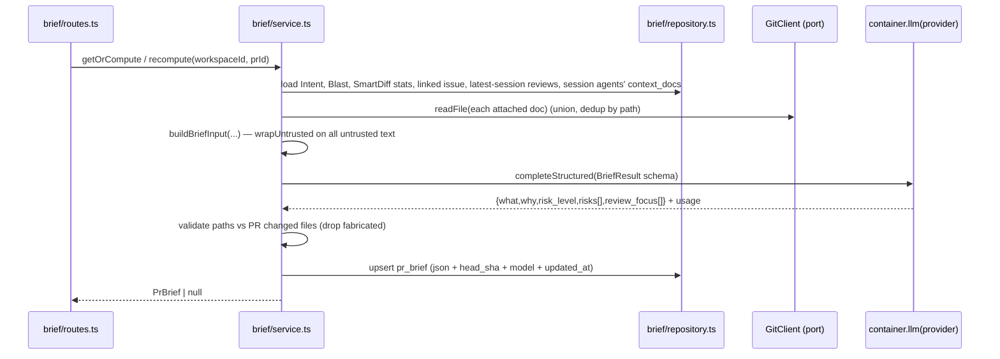

# Implementation Plan — PR Brief (SPEC-02)

Spec: `specs/SPEC-02-pr-brief.md`.

## Context & module map

Two modules: **server** (`@devdigest/api`) and **client** (`@devdigest/web`), plus the twice-vendored `@devdigest/shared` contract that must be edited in both copies. PR Brief is a new **additive** server module `modules/brief/` following the exact shape of `modules/intent/` and `modules/blast/`, plus UI on the Overview tab. Tasks were executed **single-agent, sequentially T1→T17** (dependencies encoded in `depends on:` lines).

Ahead-of-implementation reality confirmed before the run:
- `PrBrief` contract existed but was only `{intent, blast, risks, history}` — no producer computed it.
- `pr_brief` table existed but was only `{prId, json}` — no `head_sha`/`model`/`updated_at`.
- `risk_brief` FEATURE_MODELS entry existed but was unused and defaulted to `openai`/`gpt-4.1`.
- `brief.json` i18n keys `unavailable`/`unavailableHint` existed but were unused.
- No `modules/brief/` server folder and no `PrBriefCard` client component existed.

## Requirements (WHAT & WHY)

Give reviewers a single "read-this-first" card on the PR Overview tab: `what`/`why`/`risk_level` plus a prioritized `review_focus[]` (deep-linking to exact GitHub file+line) and `risks[]` ("Risk Areas"), produced by one structured LLM call over the PR's intent, blast summary, Smart Diff group stats (never diff bodies), linked issue, latest completed review session's findings/verdict, and any Project Context docs attached to that session's agents. Cached per-PR like `pr_intent` (GET compute-if-empty, POST recompute), with the Brief call's own token/cost accounting shown separately from the review run's cost.

## Affected modules & files

**Server (new):**
- `server/src/modules/brief/service.ts` — application layer (getOrCompute/recompute/compute)
- `server/src/modules/brief/repository.ts` — `pr_brief` get/upsert + session-window reviews + attached-doc resolution reads
- `server/src/modules/brief/input-builder.ts` — pure LLM-input assembly (no patch bodies; wrapUntrusted)
- `server/src/modules/brief/brief-prompt.ts` — SYSTEM_PROMPT + `BriefResult` structured schema
- `server/src/modules/brief/validate.ts` — pure output validation (drop fabricated paths)
- `server/src/modules/brief/routes.ts` — `GET /pulls/:id/brief`, `POST /pulls/:id/brief/recompute`

**Server (edit):**
- `server/src/vendor/shared/contracts/brief.ts` — `RiskLevel`, `ReviewFocusItem`, extend `PrBrief`
- `server/src/vendor/shared/contracts/platform.ts` — `risk_brief` default provider
- `server/src/db/schema/reviews.ts` — add `headSha`/`model`/`updatedAt` to `prBrief`
- `server/src/db/migrations/*` — generated migration (0015)
- `server/src/platform/container.ts` — `briefRepo` getter (mirror `intentRepo`)
- `server/src/modules/index.ts` — register `brief` module

**Client (edit/new):**
- `client/src/vendor/shared/contracts/brief.ts` — identical mirror of the server contract edit
- `client/src/vendor/shared/contracts/platform.ts` — identical mirror
- `client/src/lib/hooks/brief.ts` — `usePrBrief` / `useRecomputeBrief`
- `client/messages/en/brief.json` — new i18n keys
- `client/src/app/repos/[repoId]/pulls/[number]/_components/PrBriefCard/*` — new card
- `client/src/app/repos/[repoId]/pulls/[number]/_components/ReviewFocus/*` — new full-width section
- `client/src/app/repos/[repoId]/pulls/[number]/_components/IntentCard/IntentCard.tsx` — Risk Areas section
- `client/src/app/repos/[repoId]/pulls/[number]/_components/OverviewTab/OverviewTab.tsx` — wire card + section
- `client/src/app/repos/[repoId]/pulls/[number]/page.tsx` — thread `repoFullName`/`head_sha`

## Architecture & layer placement (onion)

- **Domain**: `RiskLevel`, `ReviewFocusItem`, extended `PrBrief` in vendored `@devdigest/shared` — pure Zod, no I/O.
- **Application**: `brief/service.ts` orchestrates and depends only on the container's ports (`container.github()`, `container.git`, `container.llm(provider)`, repos). No Fastify, no direct Drizzle. `input-builder.ts` and `validate.ts` are pure functions taking plain data.
- **Infrastructure**: `brief/repository.ts` (Drizzle over `pr_brief`/`reviews`/`findings`/`agent_runs`/`agents`), and doc reads via the `GitClient` port (`container.git.readFile`) — never direct `fs`.
- **Presentation**: `brief/routes.ts` (Fastify) imports only the service + `@devdigest/shared`.

## Task breakdown (as executed)

| Task | Module | Summary | Status |
| --- | --- | --- | --- |
| T1 | server | Extend `PrBrief` contract (`RiskLevel`, `ReviewFocusItem`, `what/why/risk_level/review_focus/tokens_in/tokens_out/cost_usd`) | ✅ merged |
| T2 | server | `pr_brief` schema columns (`head_sha`/`model`/`updated_at`) + migration | ✅ merged |
| T3 | server | `risk_brief` FEATURE_MODELS → `openrouter`/`deepseek/deepseek-v4-flash` (both vendor copies) | ✅ merged |
| T4 | server | `brief/input-builder.ts` — pure `buildBriefInput`, no diff bodies ever, `wrapUntrusted` on all untrusted text | ✅ merged |
| T5 | server | `brief/brief-prompt.ts` — `SYSTEM_PROMPT` + `BriefResult` Zod schema | ✅ merged |
| T6 | server | `brief/validate.ts` — `validateBriefOutput` anti-hallucination gate (drops fabricated `file_refs`/`review_focus` paths) | ✅ merged |
| T7 | server | `brief/repository.ts` — `BriefRepository` (get/upsert full-conflict-set, getPullAndRepo, latestSessionReviews 60s window, sessionAgents) | ✅ merged |
| T8 | server | `brief/service.ts` — `BriefService` (getOrCompute cached-forever, recompute throws if no session, compute orchestration) | ✅ merged |
| T9 | server | `brief/routes.ts` — `GET /pulls/:id/brief`, `POST /pulls/:id/brief/recompute`, 120s timeout | ✅ merged |
| T10 | server | `container.briefRepo` getter + `modules/index.ts` registration | ✅ merged, live-verified |
| T11 | client | Mirror `PrBrief` contract (byte-identical to server) | ✅ merged |
| T12 | client | `brief.json` i18n keys (riskAreas/noRiskAreas/reviewFocus/noReviewFocus/regenerate/regenerating/error/retry) | ✅ merged |
| T13 | client | `usePrBrief`/`useRecomputeBrief` React Query hooks | ✅ merged |
| T14 | client | `PrBriefCard` component (verdict+score header, cost badge, what/why, regenerate, error+retry keeps prior content) | ✅ merged |
| T15 | client | Risk Areas block in `IntentCard` (GitHub-linked `file_refs`, kind-based icons) | ✅ merged |
| T16 | client | `ReviewFocus` full-width section (GitHub line-range links, shared severity colors) | ✅ merged |
| T17 | client | Wire `PrBriefCard`/Risk Areas/`ReviewFocus` into `OverviewTab`/`page.tsx` | ✅ merged |

## Deferred

- **Tests**: test-writer was not invoked (out of scope for `/implement-plan`). No unit/integration/RTL tests exist yet for `modules/brief/*` or the new client components.
- **plan-verifier / architecture-reviewer**: run as the next step after this plan's tasks completed — see the session's final report for their verdicts.
- **Live browser verification** of the actual UI (PrBriefCard/Risk Areas/ReviewFocus rendering) was not performed — only typecheck + build were used as evidence for client tasks.
- `pr_brief.json` column is untyped `jsonb` (no `$type<PrBrief>()`), forcing a cast at the `getOrCompute` read boundary (flagged by T8, not fixed).

## Out of scope (per spec)

- No new nav-level "Review Focus" tab (Overview-tab section only).
- No relevance-ranking/search over Project Context docs (only docs already attached to the session's agents).
- No change to `reviewer-core`'s `assemblePrompt` or the review-run engine.
- No server-side lock/dedup for concurrent Regenerate (client button-disable only).
- No full diff-body input ever, regardless of PR size.
