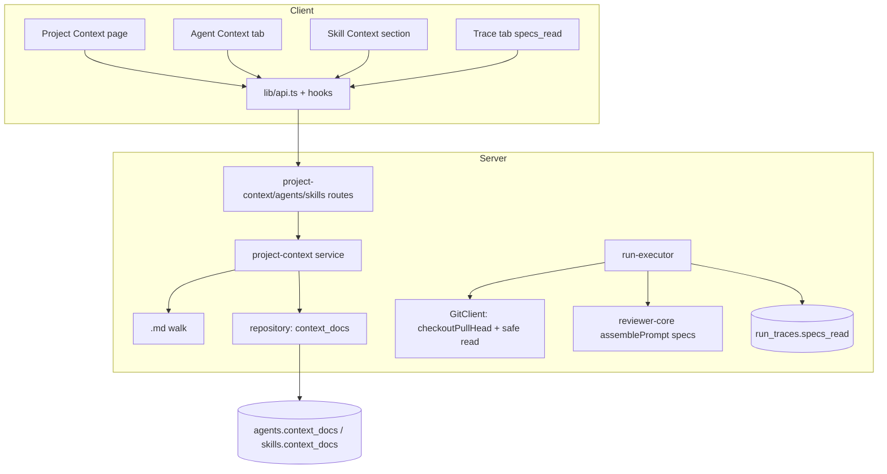

# Implementation Plan — Project Context (SPEC-01-project-context)

Source spec: `specs/SPEC-01-project-context.md`
Execution mode: **single-agent** (sequential T1 → T25, no `[P]` markers)
Clone-sync decision: add `checkoutPullHead(repo, n)` to the `GitClient` interface + `simple-git.ts`

## Context & module map

Cross-module feature: **server** (contracts, DB schema/migration, a new `project-context` module, git adapter, run-executor wiring, trace-builder) and **client** (vendored contract mirror, a new Project Context page, an Agent "Context" tab, a Skill "Project context to use" section, Trace tab). `reviewer-core` is **not touched** — verified that `assemblePrompt` (`reviewer-core/src/prompt.ts:119`) and `reviewPullRequest` (`reviewer-core/src/review/run.ts:60,141`) already accept and thread `specs?: string[]`; the server only supplies the array.

Verified "ahead-of-implementation" scaffolding that this feature finally populates:
- `PromptAssembly.specs` — `server/src/vendor/shared/contracts/trace.ts:42` (+ client mirror `:43`). Rendered as `## Project context` block via `wrapUntrusted('spec-N', …)` at `reviewer-core/src/prompt.ts:128-131,153`.
- `RunTrace.specs_read` — currently `z.array(z.string())` at `server/.../trace.ts:88` and `client/.../trace.ts:87`. **Shape change required in both** (vendored, no auto-sync).
- run-executor currently hardcodes `specs_read: []` (`run-executor.ts:316,465`) and never passes `specs`.

Confirmed gaps the plan must close (not pre-existing):
- **No clone-sync in the review path.** `loadDiff` (`diff-loader.ts`) works on git refs + falls back to `pr_files`; only repo-intel calls `git.sync`. `GitClient.readFile` (`simple-git.ts:129-130`, interface `adapters.ts:226`) reads the **current working-tree checkout with no head-pinning and no path-traversal guard**. Resolution (user-approved Option A): add `checkoutPullHead(repo, n)` built on existing `fetchPullHead` (`simple-git.ts:72-75`).
- Neither `context_docs` nor a Project Context page exists anywhere yet.

## Requirements (WHAT & WHY)

Give users a first-class, manual, auditable way to attach repo markdown docs to a reviewer Agent (a "Context" tab) or Skill (a "Project context to use" section). Attached docs are discovered by a repo-wide `.md` scan, stored as ordered repo-relative **paths only**, read fresh from the PR-head clone at run time, injected into the reviewer prompt as untrusted (delimiter-wrapped) content, and fully recorded per run (path + exact injected text) so past traces remain inspectable even after the source changes. Stale attachments warn but never block runs. No new LLM calls; live token counts are never cached. Must stay fully independent of the Intent Layer (`spec-resolver.ts`).

## Affected modules & files

**Server — contracts (Domain):**
- `server/src/vendor/shared/contracts/knowledge.ts` — add `context_docs: z.array(z.string()).default([])` to `Agent`, `AgentVersionConfig`, and `Skill`.
- `server/src/vendor/shared/contracts/trace.ts` — change `specs_read` from `z.array(z.string())` to `z.array(z.object({ path: z.string(), content: z.string().nullable() }))`; add a new discovery DTO (`ContextDoc { path, size_bytes, used_by_count }`).

**Server — DB (Infrastructure):**
- `server/src/db/schema/agents.ts` — add `contextDocs: jsonb('context_docs').$type<string[]>()` to `agents`.
- `server/src/db/schema/skills.ts` — add same to `skills`.
- `server/src/db/migrations/**` — generated migration adding both columns (default `[]`).

**Server — new module `modules/project-context/` (all layers):**
- `walk.ts` — `.md`-only recursive walk (Infrastructure; reuses `EXCLUDED_DIRS`).
- `service.ts` — discovery + used-by counting + attached-doc resolution (Application).
- `repository.ts` — read agents'/skills' `context_docs`, cross-reference (Infrastructure).
- `routes.ts` — list/preview/token endpoints (Presentation).
- `constants.ts`, `helpers.ts` (token estimate, path-safety).

**Server — infra + wiring:**
- `server/src/vendor/shared/adapters.ts` + `server/src/adapters/git/simple-git.ts` — add `checkoutPullHead` + a path-traversal-safe read helper.
- `server/src/platform/container.ts` — register the new repository/service.
- `server/src/modules/agents/{repository.ts,service.ts,routes.ts}` — persist/read agent `context_docs`.
- `server/src/modules/skills/{repository.ts,service.ts,routes.ts}` — persist/read skill `context_docs`.
- `server/src/modules/reviews/run-executor.ts` — resolve attached paths (agent + inherited via linked/enabled skills), sync clone to PR head, read fresh, pass `specs`, record `specs_read`.
- `server/src/platform/trace-builder.ts:33` — update `specsRead` type.

**Client — contracts mirror + UI:**
- `client/src/vendor/shared/contracts/trace.ts` and `.../knowledge.ts` — mirror the server contract edits exactly.
- `client/src/lib/api.ts`, `client/src/lib/hooks/*` — endpoints + hooks (discovery, token count, `context_docs` mutations).
- `client/src/app/project-context/**` (new page) + sidebar wiring in `components/app-shell/helpers.ts` + `client/messages/en/*`.
- `client/src/app/agents/[id]/_components/AgentEditor/AgentEditor.tsx` (+ new `_components/ContextTab/`).
- `client/src/app/skills/_components/SkillEditor/` (+ new Context section component).
- `client/src/app/repos/[repoId]/pulls/[number]/_components/RunTraceDrawer/_components/TraceBody/TraceBody.tsx` (+ specs_read openable UI).

## Architecture & layer placement

- **Domain**: `context_docs` field + new `ContextDoc` DTO + `specs_read` shape live in `@devdigest/shared` contracts (Zod). No logic.
- **Application**: discovery orchestration, used-by counting, attached-doc resolution live in `modules/project-context/service.ts`. The run-time union+resolution of agent + inherited-skill docs lives in `run-executor.ts` (already the sole place skills reach a run — `server/INSIGHTS.md`). Both depend only on port interfaces (`GitClient`, repositories).
- **Infrastructure**: the `.md` walk, the path-safe read, `checkoutPullHead`, and Drizzle reads/writes of `context_docs`. The git additions go on the `GitClient` port (`adapters.ts`) + its `simple-git.ts` implementation.
- **Presentation**: Fastify routes (`project-context/routes.ts`, extended agents/skills routes) with Zod validation; React components on the client.

Layer-boundary risks to watch: keep the walk/read out of `service.ts` bodies (inject via port); do **not** call into or import `modules/intent/spec-resolver.ts` from the new module (spec Non-goal + edge case — two independent readers of the same files).

## Insights to apply (from INSIGHTS.md)

- **[server] Vendored `@devdigest/shared` has NO auto-sync; TS won't catch drift.** Every contract edit (`trace.ts`, `knowledge.ts`) must be applied to **both** `server/src/vendor/shared/` and `client/src/vendor/shared/` in the same change (`server/INSIGHTS.md` Codebase Patterns).
- **[server] Adding a required field to a vendored contract breaks `.parse()` fixtures OUTSIDE `src/`.** Grep the **whole** `server/` package (incl. `server/test/contracts.test.ts`) for `RunTrace`/`Agent`/`Skill` construction sites — a `.default([])` field is still required in the `z.infer` output type used by hand-built fixtures (`server/INSIGHTS.md` Recurring Errors + the `skill_count` precedent).
- **[server] `GitClient.readFile` reads the current checkout, not a sha — sync first.** The run-executor must `checkoutPullHead` before reading attached docs, or `specs_read` reflects the wrong commit (`server/INSIGHTS.md` Codebase Patterns — the explicit `spec-resolver` caveat).
- **[server] Skills reach a run ONLY via `run-executor.ts`, gated `linked AND skill.enabled`** (`run-executor.ts:191-192`). Inherited `context_docs` must use the same gate and the same `agent_skills.order`.
- **[server] `*/` inside a `/** */` block comment causes a phantom `TS1160` at EOF** — avoid literal glob paths in doc comments in the new module (`server/INSIGHTS.md` Recurring Errors).
- **[server] `tsx watch` does not hot-reload `src/vendor/` edits** — a server restart is required after editing the vendored contracts before manual verification (`server/INSIGHTS.md` Tool & Library Notes).
- **[server] `ReviewRepository` is a class wrapping function-repos** — a signature change (e.g. new read for context docs) must update both the function repo and the class method or you get a confusing call-site TS error.
- **[client] Vendored contracts also un-synced client-side** — mirror `trace.ts`/`knowledge.ts` here too (`client/INSIGHTS.md` What Doesn't Work).
- **[client] Adding a `nullable()` contract field breaks `Partial<T>` test fixtures** (`client/INSIGHTS.md` Recurring Errors — `RunHistory.test.tsx`); the `specs_read` shape change will hit `RunTraceDrawer.test.tsx`.
- **[client] Use `useActiveRepo()` from `lib/repo-context.tsx`** for the repo-scoped Project Context page (never `useRepos()[0]`); skeleton while `!reposLoaded`, empty state when `!repoId` (`client/INSIGHTS.md`).
- **[client] Course-lesson scaffolding may already exist** — check `components/app-shell/helpers.ts:activeKeyFor` and `client/messages/en/` for a pre-wired `/project-context` key/i18n file before creating new ones.
- **[client] A prop tested in isolation isn't proof it's wired** — grep real call sites (the `skillCount` bug); verify `context_docs` actually flows editor → API → run.
- **[client] Keep one render path for edge states** (don't branch the whole layout for empty/loading) — matters for the empty-repo Project Context state (AC-3).

## Task breakdown

> Single-agent execution: run T1 → T25 in order. No `[P]` markers. Contract/schema tasks (T1–T4) are foundational and must land first; the rest build on them. Test tasks are owned by `test-writer`, not the implementer.

### ✅ T1 — Server contracts: `context_docs` + `specs_read` shape  (module: server)
- Scope: In `server/src/vendor/shared/contracts/knowledge.ts` add `context_docs: z.array(z.string()).default([])` to `Agent`, `AgentVersionConfig`, and `Skill`. In `server/src/vendor/shared/contracts/trace.ts` change `specs_read` to `z.array(z.object({ path: z.string(), content: z.string().nullable() }))` and add `ContextDoc = z.object({ path: z.string(), size_bytes: z.number().int(), used_by_count: z.number().int() })` (export schema + `z.infer` type). Do NOT touch `PromptAssembly.specs` (already correct). Do NOT edit client copies here (T2).
- Files owned: `server/src/vendor/shared/contracts/knowledge.ts`, `server/src/vendor/shared/contracts/trace.ts`
- Skills to load: zod, typescript-expert
- Insights to apply: `.default([])` is still required in the inferred type; export both schema and type; avoid `*/` in doc comments.
- Tests owned by: test-writer (T21)
- Done when: `pnpm --filter @devdigest/api typecheck` surfaces only the expected downstream breaks (trace-builder, run-executor, contracts.test fixtures) — those are fixed in later tasks.

### ✅ T2 — Client contracts mirror  (module: client)
- Scope: Apply the exact same edits from T1 to `client/src/vendor/shared/contracts/knowledge.ts` and `client/src/vendor/shared/contracts/trace.ts`. Byte-for-byte equivalent schemas.
- Files owned: `client/src/vendor/shared/contracts/knowledge.ts`, `client/src/vendor/shared/contracts/trace.ts`
- Skills to load: zod, typescript-expert
- Insights to apply: vendored copies are not auto-synced — this mirror is mandatory or client typecheck diverges silently.
- Tests owned by: test-writer (T24 covers UI fixtures)
- Done when: client typecheck surfaces only expected UI-fixture breaks (fixed in T15/T24).

### ✅ T3 — DB schema: `context_docs` columns  (module: server)
- Scope: Add `contextDocs: jsonb('context_docs').$type<string[]>()` (nullable at DB level, defaulted to `[]` in the app layer) to both `agents` (`db/schema/agents.ts`) and `skills` (`db/schema/skills.ts`), mirroring the existing `evidenceFiles` jsonb precedent (`skills.ts:19`). No index (arrays queried in-app, not by containment).
- Files owned: `server/src/db/schema/agents.ts`, `server/src/db/schema/skills.ts`
- Skills to load: postgresql-table-design, drizzle-orm-patterns, typescript-expert
- Insights to apply: follow the `jsonb().$type<string[]>()` codebase precedent rather than introducing `text[]`.
- Tests owned by: covered indirectly by T22 integration tests
- Done when: schema compiles; `$inferSelect` on both tables includes `contextDocs`.

### ✅ T4 — Generate + apply migration  (module: server)
- Scope: Run the project's Drizzle generate step to produce the migration adding both `context_docs` columns (default `'[]'::jsonb` so existing rows backfill without a table rewrite — non-volatile default). Show the generated SQL before applying (per user's global rule). Apply via the existing migrate path (`./scripts/dev.sh --db-only`).
- Files owned: `server/src/db/migrations/**` (generated files only)
- Skills to load: drizzle-orm-patterns, postgresql-table-design
- Insights to apply: non-volatile default avoids full-table rewrite; migrations follow the repo's generate+migrate flow.
- Tests owned by: n/a (schema verified via T22)
- Done when: migration applies cleanly on a fresh DB and re-run is idempotent; both columns present with default `[]`.

### ✅ T5 — Git adapter: `checkoutPullHead` + path-safe read  (module: server)
- Scope: Add `checkoutPullHead(repo: RepoRef, n: number): Promise<{ head: string }>` to the `GitClient` interface (`vendor/shared/adapters.ts`) and implement in `simple-git.ts` building on `fetchPullHead` (`fetch pull/<n>/head:pr-<n>` then `reset --hard pr-<n>`, return HEAD sha). Add a `readFileSafe(repo, relPath)` helper (or guard inside `readFile`) that resolves the target with `path.resolve` and refuses paths escaping `clonePathFor(repo)` (Path-traversal edge case). Mirror the interface change into the client vendored `adapters.ts` if one exists (verify; the client may not import GitClient — do not add if absent).
- Files owned: `server/src/vendor/shared/adapters.ts`, `server/src/adapters/git/simple-git.ts`
- Skills to load: onion-architecture, security, typescript-expert, zod
- Insights to apply: readFile reads current checkout — this is the capability that lets the run-executor pin to PR head; vendored adapters.ts also needs mirroring if referenced client-side.
- Tests owned by: test-writer (T22)
- Done when: typecheck clean; `checkoutPullHead` moves the worktree to the PR head sha; the safe reader rejects `../` escapes.

### ✅ T6 — project-context module: `.md` discovery walk  (module: server)
- Scope: New `modules/project-context/walk.ts` — a recursive `.md`-only walk modeled on `repo-intel/pipeline/walk.ts` (skip symlinks; reuse `EXCLUDED_DIRS` imported from `repo-intel/constants.ts`; **no** `MAX_INDEXED_FILES`/size caps — spec Non-functional). Return repo-relative, forward-slash-normalized paths + `size_bytes` per file (from `stat`). Do not depend on the repo-intel pipeline objects; only import the `EXCLUDED_DIRS` constant.
- Files owned: `server/src/modules/project-context/walk.ts`, `server/src/modules/project-context/constants.ts`
- Skills to load: onion-architecture, typescript-expert, security
- Insights to apply: AC-1/AC-2 — repo-wide, excluded dirs, no symlink follow.
- Tests owned by: test-writer (T21)
- Done when: over a fixture tree, returns all `.md` at any depth, excludes `node_modules`/`dist`/etc., ignores symlinks; each entry carries `size_bytes`.

### ✅ T7 — project-context repository + service  (module: server)
- Scope: `repository.ts` — read every agent's and skill's `context_docs` for a workspace (for used-by counting and footer). `service.ts` — orchestrate: (a) run the walk for the active repo clone; (b) compute per-doc `used_by_count` = number of **agents** with that path attached (AC-4, agents only); (c) resolve a single doc's content for preview (path-safe read); (d) a deterministic token estimate from `size_bytes` in `helpers.ts` (e.g. `ceil(bytes/4)` — document the heuristic; no LLM, no cache). Service depends only on the `GitClient` port + repository. Keep resolution logic separate from the run-time injector (that lives in run-executor, T13).
- Files owned: `server/src/modules/project-context/service.ts`, `server/src/modules/project-context/repository.ts`, `server/src/modules/project-context/helpers.ts`
- Skills to load: onion-architecture, typescript-expert, zod, security
- Insights to apply: do not import/couple to `spec-resolver.ts`; extract pure token/used-by logic as testable functions (the `assembleSmartDiff` pure-split pattern).
- Tests owned by: test-writer (T21, T22)
- Done when: service returns discovery list with `path`/`size_bytes`/`used_by_count`; preview returns exact file content; token estimate is deterministic and cache-free.

### ✅ T8 — project-context routes + container wiring  (module: server)
- Scope: `routes.ts` — `GET /repos/:repoId/context-docs` (discovery list + scan-summary footer data: total discovered count + summed token total across docs attached to ≥1 agent **or** skill, per AC-4a), `GET /repos/:repoId/context-docs/preview?path=…` (read-only content + token count, AC-9). Zod-validate params/query; reject non-`.md` and path-escaping inputs. Register the service/repository on `platform/container.ts`. Register the route plugin in the app's route list.
- Files owned: `server/src/modules/project-context/routes.ts`, `server/src/platform/container.ts` (+ route registration file)
- Skills to load: fastify-best-practices, onion-architecture, zod, security, typescript-expert
- Insights to apply: footer token total counts agents-OR-skills (AC-4a) while used_by_count is agents-only (AC-4) — implement the split exactly.
- Tests owned by: test-writer (T22)
- Done when: endpoints return validated payloads; footer token total excludes unattached docs; container resolves the service.

### ✅ T9 — Agents: persist/read `context_docs`  (module: server)
- Scope: Extend `agents/repository.ts` (`InsertAgent`/`UpdateAgent` + `snapshotVersion`'s `configJson` to include `context_docs`), `agents/service.ts`, and `agents/routes.ts` (`UpdateAgentBody` gains `context_docs?: z.array(z.string())`; a set/reorder path mirroring the immediate-persist Skills behavior). Storing the ordered array replaces it wholesale on save (AC-6/AC-8/AC-14 — paths only, order preserved).
- Files owned: `server/src/modules/agents/repository.ts`, `server/src/modules/agents/service.ts`, `server/src/modules/agents/routes.ts`
- Skills to load: fastify-best-practices, onion-architecture, drizzle-orm-patterns, zod, security, typescript-expert
- Insights to apply: config change bumps agent version + snapshots — include `context_docs` in the snapshot like `skills`.
- Tests owned by: test-writer (T22)
- Done when: PUT persists ordered `context_docs`; GET returns them; version snapshot captures them.

### ✅ T10 — Skills: persist/read `context_docs`  (module: server)
- Scope: Same as T9 for the skills module (`skills/repository.ts`, `service.ts`, `routes.ts`): update/create bodies accept `context_docs`, persisted on the `skills` row, returned on read. Follow the module's existing repository pattern.
- Files owned: `server/src/modules/skills/repository.ts`, `server/src/modules/skills/service.ts`, `server/src/modules/skills/routes.ts`
- Skills to load: fastify-best-practices, onion-architecture, drizzle-orm-patterns, zod, security, typescript-expert
- Insights to apply: mirror agents; keep DB access in repository (don't copy the `pulls/service.ts` direct-Drizzle exception).
- Tests owned by: test-writer (T22)
- Done when: skill create/update persists `context_docs`; read returns them.

### ✅ T11 — trace-builder: `specs_read` type  (module: server)
- Scope: Update `platform/trace-builder.ts:33` `specsRead: string[]` → `{ path: string; content: string | null }[]`; keep `RunTraceSchema.parse` validation. Fix any other constructors of an empty trace to use `[]` (still valid).
- Files owned: `server/src/platform/trace-builder.ts`
- Skills to load: typescript-expert, zod, onion-architecture
- Insights to apply: buildRunTrace validates at write-time — the new shape must parse.
- Tests owned by: test-writer (T22)
- Done when: typecheck clean; empty and populated traces both parse.

### ✅ T12 — run-executor: resolve attached docs + sync + inject  (module: server)
- Scope: In `runOneAgent` (`run-executor.ts`), before assembling the prompt: (1) `await this.container.git.checkoutPullHead(repo, pull.number)` (best-effort, logged; on failure fall back to current checkout without failing the run); (2) compute the ordered union of `agent.contextDocs` + each linked-AND-enabled skill's `contextDocs` (reuse `this.agents.linkedSkills(agent.id)` + `l.skill.enabled` gate, preserving `agent_skills.order`; dedup by path, first occurrence wins, agent's own docs first); (3) for each path, path-safe read the clone — resolved → push content into a `specs: string[]`; unreadable/missing → omit from `specs` (AC-19) but still record `{ path, content: null }`; (4) pass `...(specs.length ? { specs } : {})` into `reviewPullRequest`; (5) build `specsRead: { path, content }[]` and set it on the trace (replace `specs_read: []` at `run-executor.ts:316`). No new LLM calls (AC-18). Update the failure-path trace (`traceFromBuffer`, `:465`) to keep `specs_read: []`.
- Files owned: `server/src/modules/reviews/run-executor.ts`
- Skills to load: fastify-best-practices, onion-architecture, security, typescript-expert
- Insights to apply: sync-before-read (readFile is checkout-relative); skills gate is linked AND enabled; omit-when-empty keeps no-docs prompts byte-identical to baseline.
- Tests owned by: test-writer (T22)
- Done when: a run with attached docs populates `PromptAssembly.specs` (wrapped) and `specs_read` (path+content); a missing path yields `content: null` in trace and absence from `specs`, run still completes.

### ✅ T13 — Client api + hooks  (module: client)
- Scope: Add to `lib/api.ts`/`lib/hooks/*`: discovery query (`["context-docs", repoId]`), preview query, agent `context_docs` set mutation, skill `context_docs` set mutation. **No `staleTime`/cache for the live token count** (AC-10/AC-13, Non-functional) — the token count derives from the freshly-fetched discovery/preview payloads, recomputed on load. Follow the `useAgentSkills`/`useSetAgentSkills` React Query pattern.
- Files owned: `client/src/lib/api.ts`, `client/src/lib/hooks/context-docs.ts` (new)
- Skills to load: react-best-practices, react-component-architecture, next-best-practices, typescript-expert, security
- Insights to apply: all server calls through `lib/api.ts`; consistent `queryKey`; do not add caching for the token count specifically.
- Tests owned by: test-writer (T24)
- Done when: hooks compile and expose typed data; no cache/staleTime on the token-count path.

### ✅ T14 — Project Context list page  (module: client)  ⚠ nav.ts sidebar entry still missing — see final report
- Scope: New `app/project-context/` page (repo-scoped via `useActiveRepo()`): one render path (skeleton while `!reposLoaded`, "Connect a repo first" when `!repoId`, empty state — folder icon + "No spec files yet", **no** create/upload/attach action — when zero docs, AC-3). Otherwise a list of discovered docs showing full repo-relative path + "Used by N agents" (AC-4); when N>0 the count is a control opening the agent list, each entry deep-linking to that agent's Context tab with the doc highlighted (Edge case). Scan-summary footer: total discovered count + attached-doc token total + "scanned just now" indicator (AC-4a). Wire sidebar key in `app-shell/helpers.ts` and i18n in `messages/en/` (check for pre-existing scaffolding first). Container/presenter split; styles in `styles.ts`; constants in `constants.ts`.
- Files owned: `client/src/app/project-context/**`, `client/src/components/app-shell/helpers.ts`, `client/messages/en/projectContext.json` (new)
- Skills to load: react-best-practices, react-component-architecture, next-best-practices, security, typescript-expert
- Insights to apply: `useActiveRepo()`; single render path for edge states; check `activeKeyFor`/`messages` before creating; no coverage% and no upload action (Non-goals).
- Tests owned by: test-writer (T23)
- Done when: page renders discovery list, footer, and empty state per AC-3/AC-4/AC-4a; deep-link control present only when N>0.

### ✅ T15 — Agent "Context" tab  (module: client)
- Scope: New `AgentEditor/_components/ContextTab/` mirroring `SkillsTab` (drag handle + checkbox + path + "Preview" per row — AC-5; "N of M attached" header — AC-7; toggle persists immediately via the T13 mutation — AC-6; drag reorder persists order that drives prompt order — AC-8; Preview opens read-only rendered markdown without attaching — AC-9; live token count recomputed on load, no cache — AC-10; stale badge on rows whose path no longer resolves, without removing the attachment or blocking — AC-24). Wire the new tab into `AgentEditor.tsx` (extend the `tab === "skills" ? … : …` switch and `TABS`).
- Files owned: `client/src/app/agents/[id]/_components/AgentEditor/AgentEditor.tsx`, `client/src/app/agents/[id]/_components/AgentEditor/_components/ContextTab/**`, `AgentEditor/constants.ts`
- Skills to load: react-best-practices, react-component-architecture, next-best-practices, security, typescript-expert
- Insights to apply: mirror the SkillsTab native-HTML5-DnD pattern (helpers hold pure ordering logic); render preview as read-only untrusted text.
- Tests owned by: test-writer (T23)
- Done when: all AC-5–AC-10 + AC-24 behaviors render and persist; reorder order matches the run-time `specs` order.

### ✅ T16 — Skill "Project context to use" section  (module: client)
- Scope: New Context section in `SkillEditor` reusing the ContextTab row pattern (drag/checkbox/path/Preview + live token count — AC-11/AC-13) with copy "Any agent using this skill inherits these documents." Add a live "SERIALIZES AS" preview reproducing the exact prompt-block text (heading + one entry per attached path, in order) for the current set — AC-12; it must match the server-computed block. Extract the block-rendering into a shared client helper so it stays consistent with the server's `## Project context` assembly.
- Files owned: `client/src/app/skills/_components/SkillEditor/**` (Context section + helpers)
- Skills to load: react-best-practices, react-component-architecture, next-best-practices, security, typescript-expert
- Insights to apply: the "SERIALIZES AS" string must equal what the server builds — derive it from a single shared helper, don't hand-format twice (the Smart Diff "rule applied in one place only" lesson).
- Tests owned by: test-writer (T23)
- Done when: section renders per AC-11/AC-13; "SERIALIZES AS" matches server block for the same set (AC-12).

### ✅ T17 — Trace tab: openable `specs_read`  (module: client)
- Scope: Update `TraceBody.tsx` Configuration section (`:38-50`) for the new `specs_read` shape: list each `{ path }`; each path is individually openable to display the exact stored `content` (not a live re-read) — AC-22; a `content: null` entry shows an "unavailable" state (AC-21). The `PromptAssembly.specs` PromptBlock row (`:84-86`) already exists — confirm it still expands+copies for a non-empty `specs` block (AC-23). Reuse the existing `PromptModalBody`/modal pattern for the open-content view.
- Files owned: `client/src/app/repos/[repoId]/pulls/[number]/_components/RunTraceDrawer/_components/TraceBody/TraceBody.tsx` (+ a small `SpecsReadRow` subcomponent if it exceeds ~150 lines)
- Skills to load: react-best-practices, react-component-architecture, next-best-practices, security, typescript-expert
- Insights to apply: display stored content, never re-read; render as read-only untrusted text.
- Tests owned by: test-writer (T24)
- Done when: opening a `specs_read` entry shows the trace's stored content independent of current disk state; null entries render as attempted-but-unavailable.

### ✅ T18 — Fix server contract-construction fixtures  (module: server)
- Scope: Repair non-UI construction sites broken by T1's contract changes — notably `server/test/contracts.test.ts` (whole-package grep for `RunTrace`/`Agent`/`Skill` literal `.parse({...})`), adding the now-required `context_docs`/new `specs_read` shape. This is production-adjacent glue, not new behavior tests (those are test-writer's).
- Files owned: `server/test/contracts.test.ts` (+ any other non-`src` fixture the grep finds)
- Skills to load: zod, typescript-expert
- Insights to apply: grep the whole `server/` package, not just `src/`; `.default([])` fields are still required in literal fixtures.
- Tests owned by: n/a (this fixes existing fixtures; new tests are T21–T24)
- Done when: `pnpm --filter @devdigest/api test` compiles and the contracts suite is green.

### ✅ T19 — Server end-to-end wiring verification  (module: server)
- Scope: Non-code verification task — run server typecheck + full server suite; confirm no cross-layer import leaked (no `fastify` in service, no `spec-resolver` import in the new module), and that a no-attached-docs run still produces a byte-identical prompt (omit-when-empty). Restart the dev server (vendored edits don't hot-reload) before any manual curl.
- Files owned: none (verification only)
- Skills to load: onion-architecture, typescript-expert
- Insights to apply: `tsx watch` misses vendor edits — restart; verify independence from Intent Layer.
- Tests owned by: n/a
- Done when: `pnpm --filter @devdigest/api typecheck` + suite green; independence confirmed by grep.

### ✅ T20 — Client typecheck/build verification  (module: client)
- Scope: Verification only — client typecheck + build; confirm the mirrored contracts and all four UI touchpoints compile; confirm sidebar/i18n wiring resolves.
- Files owned: none
- Skills to load: next-best-practices, typescript-expert
- Insights to apply: don't run `pnpm build` while `pnpm dev` is live on the same package (`.next` corruption).
- Tests owned by: n/a
- Done when: client typecheck + build clean.

### T21 — Tests: discovery walk + contracts + token/used-by  (module: server) (depends on: T6, T7, T1)
- Scope: Unit tests for the `.md` walk (fixture tree, depth, excluded dirs, symlink skip — AC-1/AC-2), the pure token estimate + used-by counting helpers, and contract schema round-trips for the new `context_docs`/`specs_read` shapes.
- Files owned: `server/src/modules/project-context/walk.test.ts`, `.../service.test.ts` (pure parts), `server/test/*` as needed — disjoint from implementer files.
- Skills to load: typescript-expert
- Done when: suite green, real output shown.

### T22 — Tests: server integration (storage, run-time injection, trace, git)  (module: server) (depends on: T4, T5, T9, T10, T12, T11)
- Scope: Integration tests (Docker-gated, `MockLLMProvider`): AC-14 (paths-only persisted), AC-15 (fresh read after on-disk edit), AC-16 (`specs` populated for agent+inherited skill docs, in order — AC-8 order assertion), AC-17 (`<untrusted source="spec-N">` wrapping), AC-18 (no new LLM call), AC-19 (deleted path omitted, run completes), AC-20/AC-21 (`specs_read` path+content, null when unresolved), `checkoutPullHead` + path-traversal rejection.
- Files owned: `server/src/modules/project-context/*.it.test.ts`, `server/src/modules/reviews/*context*.it.test.ts` — disjoint from implementer files.
- Skills to load: typescript-expert
- Insights to apply: `MockLLMProvider` id is `'openai'|'anthropic'` only — register openrouter mocks under the key, construct with `'openai'`.
- Done when: suite green, real output shown.

### T23 — Tests: client Project Context page + Agent/Skill Context  (module: client) (depends on: T14, T15, T16)
- Scope: RTL tests: AC-3 (empty state, no action), AC-5/AC-7/AC-9 (row elements, "N of M", read-only preview), AC-6 (toggle persists), AC-8 (drag reorder persists order), AC-10/AC-13 (token recompute on toggle, no cache consulted), AC-11 (skill section rows + copy), AC-12 ("SERIALIZES AS" equals server block for same set), AC-24 (stale badge, row stays toggleable).
- Files owned: `client/src/app/project-context/**/*.test.tsx`, `client/src/app/agents/[id]/_components/AgentEditor/_components/ContextTab/*.test.tsx`, `client/src/app/skills/_components/SkillEditor/*.test.tsx` — disjoint from implementer files.
- Skills to load: react-testing-library, typescript-expert
- Insights to apply: mock `AppShell` for page-level tests (router invariant).
- Done when: suite green, real output shown.

### T24 — Tests: client Trace tab specs_read + contract fixtures  (module: client) (depends on: T17, T2)
- Scope: RTL tests: AC-22 (open a `specs_read` entry, displayed text equals stored `content` regardless of disk), AC-21 (null-content entry state), AC-23 (`PromptBlock` specs row expand+copy with a non-empty `specs` case). Repair `RunTraceDrawer.test.tsx` fixtures for the new `specs_read` shape.
- Files owned: `client/src/app/repos/[repoId]/pulls/[number]/_components/RunTraceDrawer/**/*.test.tsx`
- Skills to load: react-testing-library, typescript-expert
- Insights to apply: a new `nullable()` contract field breaks `Partial<T>` fixtures — add explicit values in factories.
- Done when: suite green, real output shown.

### T25 — Tests: AC-25 end-to-end invariant demo  (module: e2e/server) (depends on: T12, T22)
- Scope: End-to-end test: attach a fixture spec stating "module `api/` does not import `db/` directly" to a reviewer agent, submit a fixture PR whose diff violates it, assert (a) the resulting finding's message references the invariant/spec, and (b) the run trace's `specs_read` contains the spec's path with its injected content. Use a deterministic mock model returning a finding that cites the injected spec.
- Files owned: `server/src/modules/reviews/*ac25*.it.test.ts` (or `e2e/` flow if a browser path is preferred) — disjoint from implementer files.
- Skills to load: typescript-expert
- Done when: test green with real output; finding cites the spec and trace shows the path.

## Skills matrix (summary)

| Task | Module | Skills |
| --- | --- | --- |
| T1 | server | zod, typescript-expert |
| T2 | client | zod, typescript-expert |
| T3 | server | postgresql-table-design, drizzle-orm-patterns, typescript-expert |
| T4 | server | drizzle-orm-patterns, postgresql-table-design |
| T5 | server | onion-architecture, security, zod, typescript-expert |
| T6 | server | onion-architecture, security, typescript-expert |
| T7 | server | onion-architecture, zod, security, typescript-expert |
| T8 | server | fastify-best-practices, onion-architecture, zod, security, typescript-expert |
| T9 | server | fastify-best-practices, onion-architecture, drizzle-orm-patterns, zod, security, typescript-expert |
| T10 | server | fastify-best-practices, onion-architecture, drizzle-orm-patterns, zod, security, typescript-expert |
| T11 | server | zod, onion-architecture, typescript-expert |
| T12 | server | fastify-best-practices, onion-architecture, security, typescript-expert |
| T13 | client | react-best-practices, react-component-architecture, next-best-practices, security, typescript-expert |
| T14 | client | react-best-practices, react-component-architecture, next-best-practices, security, typescript-expert |
| T15 | client | react-best-practices, react-component-architecture, next-best-practices, security, typescript-expert |
| T16 | client | react-best-practices, react-component-architecture, next-best-practices, security, typescript-expert |
| T17 | client | react-best-practices, react-component-architecture, next-best-practices, security, typescript-expert |
| T18 | server | zod, typescript-expert |
| T19 | server | onion-architecture, typescript-expert |
| T20 | client | next-best-practices, typescript-expert |
| T21 | server | typescript-expert (test-writer) |
| T22 | server | typescript-expert (test-writer) |
| T23 | client | react-testing-library, typescript-expert (test-writer) |
| T24 | client | react-testing-library, typescript-expert (test-writer) |
| T25 | server/e2e | typescript-expert (test-writer) |

## Implement-plan run result (2026-07-10)

✅ T1–T20 merged into `lesson-05`. plan-verifier: INCOMPLETE (3/45 unmet — see final report). architecture-reviewer: sound-with-risks → 1 High finding fixed (fix-loop iter 1/2) → re-reviewed clean (only Medium/Low remain, acceptable). See chat for full final report.

## End-to-end verification

Single command sequence a human/agent runs verbatim:

1. `./scripts/dev.sh --db-only` then restart the API + web (vendored edits don't hot-reload).
2. `pnpm --filter @devdigest/api typecheck && pnpm --filter @devdigest/api test` — green (incl. T22 integration + T25 AC-25 demo).
3. `pnpm --filter @devdigest/web typecheck && pnpm --filter @devdigest/web test` — green (T23/T24).
4. Manual: open Project Context page for an active repo → discovered `.md` list + footer "scanned just now"; attach `specs/SPEC-01-project-context.md` to a reviewer agent's Context tab (token count updates, no cache); run a review on a PR; open the run's Trace tab → `specs_read` lists the path, opening it shows the exact injected content; the Prompt-assembly "Project context" block is `<untrusted source="spec-0">`-wrapped.

Expected result: AC-1 through AC-25 all satisfied; a no-attached-docs run produces a byte-identical prompt to the pre-feature baseline (omit-when-empty).

## Out of scope

- Auto-selection / flash-selector, coverage% indicator, upload/create-from-empty-state, vector/embedding/chunk metrics, folder-category badges, configurable scan root (all spec Non-goals).
- Any change to `reviewer-core`'s `assemblePrompt` signature or rendering (reused as-is).
- Any unification with or dependency on `modules/intent/spec-resolver.ts` (must stay independent).
- New LLM calls; any cache/staleTime on the live token count.
- Writing new tests as an implementer task — all test authorship (T21–T25) is owned by `test-writer`.

## Key evidence files

- `reviewer-core/src/prompt.ts`, `reviewer-core/src/review/run.ts`
- `server/src/vendor/shared/contracts/trace.ts`, `.../knowledge.ts`, `.../adapters.ts`
- `client/src/vendor/shared/contracts/trace.ts`, `.../knowledge.ts`
- `server/src/db/schema/agents.ts`, `.../skills.ts`
- `server/src/adapters/git/simple-git.ts`
- `server/src/modules/reviews/run-executor.ts`, `.../diff-loader.ts`
- `server/src/modules/repo-intel/pipeline/walk.ts`, `.../constants.ts`
- `server/src/modules/agents/repository.ts`, `.../routes.ts`
- `server/src/platform/trace-builder.ts`
- `client/src/app/agents/[id]/_components/AgentEditor/AgentEditor.tsx`, `.../_components/SkillsTab/SkillsTab.tsx`
- `client/src/app/repos/[repoId]/pulls/[number]/_components/RunTraceDrawer/_components/TraceBody/TraceBody.tsx`
</content>
