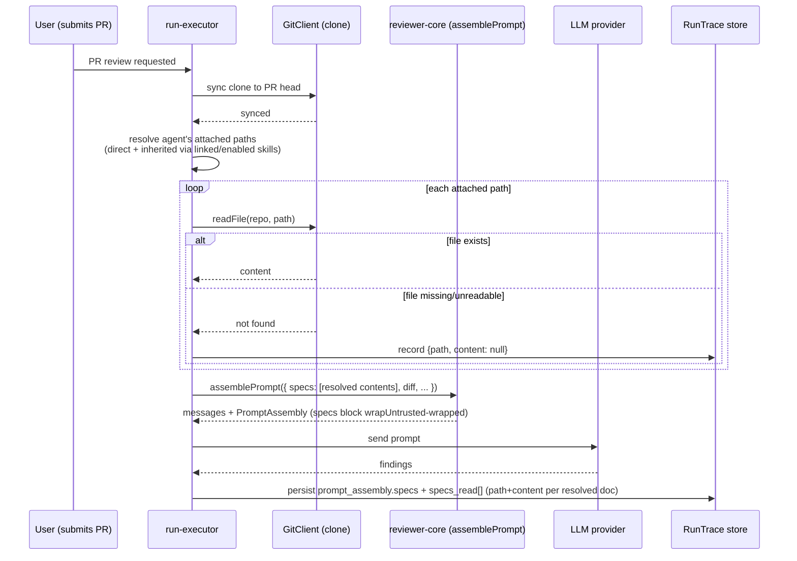

# Spec: Project Context  |  Spec ID: SPEC-01-project-context  |  Status: draft
Affected modules: cross-module (server, client; reviewer-core/shared contracts touched only where noted)

## Problem & why

Any markdown file in a repo (a spec, an ADR, an onboarding doc, an insights
log) is currently either invisible to a review agent or gets pulled in
indirectly and opaquely through the unrelated Intent Layer (`spec-resolver.ts`
scanning a PR body for `.md` links, feeding the *intent classifier*). There is
no first-class, user-controlled way to say "when Agent X reviews a PR, always
give it the contents of `docs/architecture.md`."

`reviewer-core`'s `assemblePrompt` (`reviewer-core/src/prompt.ts`) and the
`PromptAssembly`/`RunTrace` contracts (`server/src/vendor/shared/contracts/trace.ts`)
already have a `## Project context` slot and `specs`/`specs_read` fields —
built ahead of any producer, per this project's course-lesson convention
(`CLAUDE.md` gotcha: "schema/contract exists, the feature may not"). Nothing
today populates them. The moment a markdown doc is attached this way, it
stops being documentation "for humans" and starts actively steering reviewer
behavior — which means it must be treated with the same prompt-injection
discipline as a PR diff or PR body: read as data, delimiter-wrapped, never
trusted as instructions, and fully auditable per run.

This spec covers **discovery of repo markdown files + manual attach UI (agent
and skill level) + storage of the attachment + wiring the run-executor to
populate the already-scaffolded `specs`/`specs_read` fields**. It does not
invent new prompt-assembly mechanics and does not add any automatic
selection.

## Goals / Non-goals

**Goals**
- Discover every `.md` file anywhere in a repo's clone (no folder
  restriction) and list it on a "Project Context" screen.
- Show a scan-summary footer on the Project Context list page: total
  discovered file count, total token footprint of the docs currently
  attached to at least one agent/skill, and that this reflects the page's
  own just-completed live scan (not a cached/background job).
- Let a user manually attach/detach/reorder these docs on an Agent (a
  "Context" tab) and on a Skill (a "Project context to use" section), with a
  live token count and a preview of exact rendered content.
- Persist only the ordered list of attached **paths** on the agent/skill
  config — never a copy of the doc text.
- At run time, read the attached docs fresh from the clone and feed them into
  `reviewer-core`'s existing `specs` prompt-assembly input, wrapped as
  untrusted content exactly like today's `wrapUntrusted` mechanism.
- Record, per run, the exact path + exact content that was injected, so a
  past run's trace remains individually inspectable even if the source doc
  later changes or is deleted.
- Surface a stale-attachment warning when a previously attached doc no longer
  exists at its stored path, without blocking the run.

**Non-goals**
- Auto-selection / a "flash-selector" that picks relevant docs per PR
  automatically — a distinct, deferred future feature. This spec is manual
  attach only.
- Any unification with `server/src/modules/intent/spec-resolver.ts`. That
  module feeds the *intent classifier* from PR-body-referenced text
  (automatic scan, triggered per-PR, ephemeral per-run resolution, capped at
  a 30 KB budget). Project Context is a *different consumer* (the reviewer
  prompt), a *different trigger* (explicit user attach, not a PR-body scan),
  and a *different storage model* (persisted ordered attachment on
  agent/skill config, not resolved-and-discarded per run). The two systems
  read the same kind of raw material (repo markdown) but must stay
  independent — do not attempt to share resolution code or storage between
  them.
- An aggregate "coverage %" indicator on the Project Context list page
  (present in early mockups, explicitly dropped).
- An "Add a spec file" / upload / create action from the empty state
  (present in early mockups, explicitly dropped — the empty state is
  informational only).
- Vector indexing / embedding / a chunk-count metric — no "chunks" concept
  exists in this feature. The list page does show a scan-summary footer (see
  AC-4a), but it reports file count + attached-doc token total, not an
  embedding/indexing pipeline status.
- Folder-name-based scan restriction or a configurable root-folder setting —
  the scan is always repo-wide across all `.md` files.
- Any change to `reviewer-core`'s `assemblePrompt` signature or its
  `## Project context` rendering logic — both already exist and are reused
  as-is (see Inputs (provenance)).

**Constraints & tradeoffs considered**
- *Folder-based categorization badge (e.g. "specs" / "docs" / "insights")
  was considered and rejected.* Once the scan is repo-wide, a folder name is
  no longer a filter, and different repos use wildly different folder
  conventions (`specs/`, `docs/`, `adr/`, top-level `README.md`,
  `INSIGHTS.md`), so a fixed category taxonomy would either be wrong for most
  repos or need per-repo configuration this feature explicitly excludes.
  Decision: no category badge. The list page instead shows each doc's full
  repo-relative path (which already conveys its location) and a per-doc
  "Used by N agents" count (a real, always-accurate signal, unlike a fixed
  taxonomy) — see Edge cases.
- *Storing paths only, never doc text, on agent/skill config* was chosen over
  snapshotting content at attach time, so a repo doc edit is reflected on the
  very next run without a re-attach step — the tradeoff is the stale-path
  edge case (doc deleted/moved after attach), handled explicitly below.
- *Discovery is a live filesystem walk over the clone* (same pattern as
  `repo-intel/pipeline/walk.ts`), not a persisted "documents" table — avoids
  a new sync/invalidation problem between DB rows and the actual repo
  content, at the cost of a walk on each Project Context list / editor load
  (acceptable: `.md`-only, same excluded-dirs precedent as `walk.ts`).
- *`RunTrace.specs_read` changes shape* (`string[]` → structured
  `{ path, content }[]`) to satisfy the "openable, exact injected text"
  requirement. This is the one place this feature touches a shared contract;
  `reviewer-core`'s `assemblePrompt` itself needs **no** signature change — it
  already accepts `specs?: string[]` and already returns the joined,
  wrapped `PromptAssembly.specs` block. The server is purely responsible for
  (a) building that `string[]` from attached paths' content to pass in, and
  (b) separately recording the structured `specs_read` array on the trace
  for observability. Both are additive, server-side population of existing
  scaffolding.

## User stories

- As a repo maintainer, I open the Project Context screen for my repo and see
  every markdown file discovered in the clone, so I know what's available to
  attach.
- As an agent author, I open an Agent's "Context" tab, check the docs I want
  always included in that agent's reviews, drag them into the order I want
  them read, preview each one's rendered content, and see a live token count
  for what I've selected.
- As a skill author, I open a Skill's "Project context to use" section, so
  that any agent using this skill inherits the same attached docs, and I can
  see exactly how the block will be serialized into the prompt before saving.
- As a reviewer/auditor, I open a past run's trace, see which doc paths were
  attached, and open any one of them to read the *exact* text that was
  injected for that specific run — even if the source file has since
  changed or been deleted.
- As the demo scenario for this feature: I attach a spec containing the
  invariant "module `api/` does not import `db/` directly" to a reviewer
  agent, submit a PR that violates it, and the reviewer's finding cites that
  spec as justification.

```mermaid
flowchart TD
  A[Open Project Context list] --> B{Any .md files discovered?}
  B -- No --> C[Empty state: folder icon, "No spec files yet" — no action button]
  B -- Yes --> D[List of discovered docs + path + "Used by N agents"]
  D --> E[Click a doc's "used by" link]
  E --> F[Deep-link into that agent's Context tab, doc pre-highlighted]
  D --> G[Open an Agent editor directly]
  G --> H[Context tab: checkbox to attach/detach]
  H --> I[Drag handle to reorder attached docs]
  I --> J[Preview button shows rendered content]
  H --> K[Live token count recomputed on load]
  L[Open a Skill editor] --> M["Project context to use" section]
  M --> N[Same attach/reorder/preview/token-count pattern]
  M --> O["SERIALIZES AS" preview of the exact prompt block]
```

## Acceptance criteria (EARS)

**Discovery**
- AC-1: The system shall recursively scan the entire repo clone for `.md`
  files, applying no folder-name restriction and no configurable root. (Verify:
  unit test over a fixture clone tree with `.md` files at multiple depths,
  including outside any `specs/`/`docs/` folder.)
- AC-2: WHEN the discovery scan runs, the system shall exclude the same
  non-content directories `repo-intel/pipeline/walk.ts` already excludes
  (`node_modules`, `dist`, `build`, `.git`, etc.) and never follow symlinks.
  (Verify: unit test asserting excluded dirs are skipped.)
- AC-3: WHEN a repo has zero discoverable `.md` files, the system shall
  render an empty state (folder icon, "No spec files yet", helper copy) with
  no create/upload/attach action. (Verify: RTL test for the empty-repo case.)
- AC-4: The Project Context list page shall show, for every discovered doc,
  its full repo-relative path and a count of agents that currently have it
  attached ("Used by N agents"), computed by cross-referencing the discovered
  path set against every agent's stored attachment list. (Verify: integration
  test — attach a doc to 2 agents, assert the list page shows "Used by 2".)
- AC-4a: The Project Context list page shall show a scan-summary footer with
  (a) the total count of discovered `.md` files, (b) the total token count
  summed across only the docs currently attached to at least one agent or
  skill ("Used by N agents" > 0 in AC-4), computed fresh from the same live
  scan as AC-1/AC-4 — never cached, and (c) an indication that the count
  reflects this page load (e.g. "scanned just now"), since discovery has no
  persisted timestamp to report. (Verify: integration test — attach a doc to
  1 agent, leave another unattached; assert the footer's token total matches
  only the attached doc's token count and excludes the unattached one.)

**Manual attach — Agent Context tab**
- AC-5: The Agent editor shall expose a "Context" tab styled like the
  existing Skills tab, listing every discovered doc as a row with a drag
  handle, a checkbox, the doc's path, and a "Preview" button. (Verify: RTL
  component test asserting all four elements render per row.)
- AC-6: WHEN a user toggles a doc's checkbox in the Context tab, the system
  shall persist the updated ordered list of attached paths immediately,
  matching the Skills tab's toggle-persists-immediately behavior. (Verify:
  RTL test asserting the persistence call fires on toggle.)
- AC-7: The Context tab header shall display "N of M attached" reflecting the
  live count of checked vs. total discovered docs. (Verify: RTL test with a
  partial selection.)
- AC-8: WHEN a user drags an attached doc's row to a new position, the system
  shall persist the new order and that order shall determine the sequence in
  which docs appear in the assembled `## Project context` prompt block
  (earlier row = earlier in the block). (Verify: RTL drag-and-drop test
  asserting persisted order, plus a reviewer-core/server test asserting
  `assemblePrompt`'s `specs` array is built in that same order.)
- AC-9: WHEN a user clicks a doc row's "Preview" button, the system shall
  show that doc's full rendered markdown content without attaching or
  detaching it. (Verify: RTL test asserting preview opens read-only.)
- AC-10: WHILE the Context tab is open, the system shall display a running
  token count for the currently-attached set, computed fresh from the sizes
  of the attached docs on that page load — never served from a cache.
  (Verify: RTL test asserting the token count recomputes after toggling
  attachment, and an integration test asserting no cache header/store is
  consulted.)

**Manual attach — Skill Context section**
- AC-11: The Skill editor shall expose a "Project context to use" section
  using the same row pattern (drag handle, checkbox, path, Preview) as the
  Agent Context tab, with copy noting "Any agent using this skill inherits
  these documents." (Verify: RTL component test.)
- AC-12: The Skill editor's Context section shall show a live "SERIALIZES
  AS" preview reproducing exactly the prompt-block text that will be added
  for the currently-attached set (heading + one entry per attached path, in
  order). (Verify: RTL test comparing the preview string to the
  server-computed block for the same attachment set.)
- AC-13: WHILE the Skill editor's Context section is open, the system shall
  display a running token count for the currently-attached set, computed
  fresh on load. (Verify: RTL test, same pattern as AC-10.)

**Storage**
- AC-14: The system shall store only the ordered list of attached repo-
  relative paths on the agent's/skill's config — never the doc's text
  content. (Verify: integration test inspecting the persisted row/config
  after an attach, asserting no doc body is present.)
- AC-15: WHEN an agent or skill is loaded for review/editing, the system
  shall resolve each attached path's content by reading the repo clone
  fresh at that time, not from any snapshot taken at attach time. (Verify:
  integration test — edit a doc's on-disk content between attach and a
  subsequent read, assert the newer content is returned.)

**Run-time injection**
- AC-16: WHEN a review run executes for an agent with one or more attached
  context docs (inherited from the agent directly and/or via its linked,
  enabled skills), the system shall read each attached doc's content from
  the repo clone and pass the resulting list into `reviewer-core`'s existing
  `assemblePrompt` `specs` input, in the agent's/skills' persisted order.
  (Verify: server integration test asserting `PromptAssembly.specs` is
  populated and non-null for such a run.)
- AC-17: The system shall wrap every attached doc's content using the
  existing `wrapUntrusted` mechanism before it reaches the model, identical
  to how the diff and PR description are wrapped today. (Verify: unit test
  on the assembled prompt asserting each spec block is delimited via
  `<untrusted source="spec-N">`.)
- AC-18: The system shall introduce zero additional LLM calls to populate or
  render attached context docs — content is read from disk/clone and string-
  concatenated only. (Verify: integration test asserting no new LLM provider
  invocation occurs solely due to attached docs being present.)
- AC-19: IF an attached doc's path does not resolve to a readable file in the
  repo clone at run time, THEN the system shall omit that doc from the
  assembled prompt and continue the run without failing it. (Verify:
  integration test — attach a path, delete the file, run a review, assert
  the run completes and the missing doc is absent from `PromptAssembly.specs`.)

**Observability / run trace**
- AC-20: WHEN a review run completes, the system shall record, per attached
  doc that was resolved, both its path and its exact injected content on the
  persisted `RunTrace.specs_read` field. (Verify: integration test reading
  back a completed run's trace and asserting `specs_read` entries carry both
  fields.)
- AC-21: IF an attached doc could not be resolved at run time (AC-19), THEN
  its `specs_read` entry shall still be recorded with its path and a null
  content, so the trace shows it was attempted but unavailable rather than
  silently absent. (Verify: integration test for the deleted-file case,
  asserting the entry exists with `content: null`.)
- AC-22: The run detail Trace tab's Configuration section shall list every
  `specs_read` path for that run, and each listed path shall be individually
  openable to display the exact `content` recorded for that run (not a
  live re-read of the current repo state). (Verify: RTL test opening a
  `specs_read` entry and asserting the displayed text matches the trace's
  stored `content`, independent of the doc's current on-disk state.)
- AC-23: The existing "Prompt assembly" accordion's "Project context —
  attached specs (untrusted)" row shall continue to support expand + copy,
  unchanged in mechanism, for the block built from these attached docs.
  (Verify: existing RTL coverage for `PromptBlock`/`TraceBody` extended with
  a non-empty `specs` case.)

**Stale-doc handling**
- AC-24: IF a doc previously attached to an agent or skill no longer exists
  at its stored path when that agent/skill is opened for editing, THEN the
  system shall display a warning badge on that row in the Context tab/section
  without removing the attachment or blocking any run. (Verify: RTL test —
  render the Context tab with an attachment referencing a nonexistent path,
  assert the warning badge renders and the row remains present/toggleable.)

**Demo / invariant scenario**
- AC-25: WHEN a spec document stating an invariant (e.g. "module `api/` does
  not import `db/` directly") is attached to a reviewer agent and a
  submitted PR's diff violates that invariant, the system shall produce a
  review finding whose rationale cites the attached spec as justification
  (the finding text references the spec content/path that was injected).
  (Verify: end-to-end test — attach a fixture spec, submit a fixture PR
  violating it, assert the resulting finding's message references the
  invariant and the run trace shows the spec's path in `specs_read`.)

## Edge cases

- **PR-head vs. current-checkout mismatch.** `GitClient.readFile` reads the
  clone's *current working-tree checkout*, not a sha-pinned read (documented
  gotcha in `server/INSIGHTS.md`: "`modules/intent/spec-resolver.ts` reads
  repo `.md` from the current checkout, which is not guaranteed to be the PR
  head"). The run-executor must sync the clone to the review's target head
  (the same sync step the review diff/repo-intel paths already require)
  before reading attached context docs, so `specs_read` reflects the PR
  under review, not an unrelated later/earlier commit on disk.
- **Very large individual docs / token budget.** An attached doc could be
  large enough to meaningfully affect the prompt's token budget. Unlike the
  PR description (`MAX_PR_DESCRIPTION_CHARS` truncation in `prompt.ts`),
  attached context docs are user-curated (the user explicitly chose to
  attach them), so this spec does not introduce a silent truncation — the
  live token count (AC-10/AC-13) is the user-facing signal for "this is
  getting expensive," and the user is expected to detach docs themselves.
  No new truncation mechanic is added.
- **Doc path collision across repos.** Discovery and attachment are always
  scoped to the active repo (mirroring `useActiveRepo()`'s existing
  repo-scoping pattern on the client); an attached path is only meaningful
  relative to the repo it was attached from.
- **Path traversal.** Discovered/attached paths must resolve within the
  clone root; the run-executor's read must reject or refuse any path that
  escapes it (defense-in-depth even though discovery itself only ever
  produces paths found by the walk).
- **Independence from the Intent Layer.** A repo doc can simultaneously be
  (a) referenced in a PR body and pulled into `spec-resolver.ts`'s ephemeral
  intent-classification context, and (b) manually attached here to an agent.
  These are two unrelated code paths reading the same file for two different
  purposes; neither should call into or depend on the other's resolution
  logic or storage.
- **Cross-navigation from the list page.** The simplest reasonable
  interaction: each doc row's "Used by N agents" is itself a control that,
  when N > 0, opens a small list of the agents using it; each entry deep-
  links to that agent's Context tab (with the doc's row scrolled into view /
  highlighted). When N = 0, the row has no such control — the user attaches
  it from an Agent's or Skill's own Context tab/section instead. No separate
  bulk-attach action exists on the list page itself.



New/changed data shapes this feature introduces (paths reference the
existing vendored files; only genuinely new fields are shown):

**`Agent` and `Skill` contracts** (`server/src/vendor/shared/contracts/knowledge.ts`
and its client mirror) — add one new field to each, following the existing
`skills: string[]` pattern on `AgentVersionConfig`:

| field | type | required | direction |
|---|---|---|---|
| `context_docs` | `string[]` — ordered, repo-relative paths | no (defaults to `[]`) | stored on agent/skill config; read by editor UI and by run-executor |

**`RunTrace.specs_read`** (`server/src/vendor/shared/contracts/trace.ts`) —
upgraded from `z.array(z.string())` to a structured array. Per the
documented contract-drift gotcha in `server/INSIGHTS.md` ("`@devdigest/shared`
is vendored in two places with no automated sync... any edit to a contract
file must be applied to both directories"), this change must land in
**both** `server/src/vendor/shared/contracts/trace.ts` and
`client/src/vendor/shared/contracts/trace.ts` in the same change:

| field | type | required | direction |
|---|---|---|---|
| `specs_read[].path` | `string` | yes | server writes at run completion; client reads in Trace tab |
| `specs_read[].content` | `string \| null` | yes (nullable when unresolved, AC-21) | server writes at run completion; client reads in Trace tab |

**Discovery list item** (new, server → client, not persisted — computed live
per Project Context list / editor load):

| field | type | required | direction |
|---|---|---|---|
| `path` | `string` (repo-relative) | yes | server → client |
| `size_bytes` | `number` | yes | server → client (drives live token estimate) |
| `used_by_count` | `number` | yes, list page only | server → client |

## Non-functional

- **Untrusted content.** Every attached doc's content is repo-authored text,
  reachable by anyone with repo write access (or, transitively, by a PR that
  edits/adds a markdown file the doc-attacher didn't anticipate). It must
  always be wrapped via `wrapUntrusted` before reaching the model — the same
  discipline as the diff and PR description — and never treated as an
  instruction to the reviewer or to any tooling. (Verify: unit test as in
  AC-17; code review checklist item for this module.)
- **Zero added LLM calls.** This feature is pure discovery + string
  assembly; it must not introduce any new model invocation. (Verify: AC-18.)
- **Live token computation, no caching.** Both Context UIs must recompute
  the attached-set token count on every load, per explicit requirement — do
  not introduce a cache/staleTime for this specific count even though other
  parts of the client do use React Query caching. (Verify: AC-10/AC-13.)
- **Repo-wide scan performance.** The discovery walk should follow
  `repo-intel/pipeline/walk.ts`'s existing precedent (excluded dirs, no
  symlink following) to stay bounded on large repos; unlike the code
  indexer's `MAX_INDEXED_FILES`, `.md` files are typically few enough per
  repo that no additional cap is introduced by this spec, but the same
  excluded-directory list keeps `node_modules`/`dist`/etc. out of scan cost.
- Accessibility: not specified beyond parity with the existing Skills tab's
  drag-and-drop pattern (native HTML5 DnD, no dedicated keyboard-reorder
  affordance) — this spec does not add a new accessibility requirement
  beyond that existing precedent.

## Inputs (provenance)

- `reviewer-core`'s `assemblePrompt` `specs?: string[]` input and its
  `## Project context` rendering + `wrapUntrusted('spec-N', …)` wrapping —
  `[reused: existing, reviewer-core/src/prompt.ts]`. No signature or
  behavior change.
- `PromptAssembly.specs` / `RunTrace.specs_read` fields on
  `server/src/vendor/shared/contracts/trace.ts` — `[reused: existing
  scaffolding]` for `PromptAssembly.specs`; `[new: shape change]` for
  `specs_read` (see Edge cases data table).
- Discovery walk pattern — `[deterministic: fs walk, modeled on
  server/src/modules/repo-intel/pipeline/walk.ts]`. No new LLM calls.
- Token count — `[deterministic: computed from attached docs' byte/char
  size]`, not an LLM estimate.
- Agent/skill inheritance of attached docs — `[reused: existing
  agent_skills linkage + order, server/src/db/schema/agents.ts]`; a skill's
  `context_docs` are unioned into the agent's own attached set at run time
  via the same "linked AND enabled" gate `server/INSIGHTS.md` documents for
  skill bodies.

## Untrusted inputs

- **Every attached document's content** is external, repo-authored markdown
  and must be handled as data, never as instructions, for both the reviewer
  prompt (via `wrapUntrusted`, AC-17) and any UI rendering (Preview /
  "SERIALIZES AS" panels render it as read-only text, not as executable
  markup beyond standard markdown rendering).
- This is explicitly the same trust boundary the project already applies to
  the PR diff and PR description in `reviewer-core/src/prompt.ts`'s
  `INJECTION_GUARD` — attaching a doc here does not create a new kind of
  trust boundary, it extends the existing one to a new content source.
