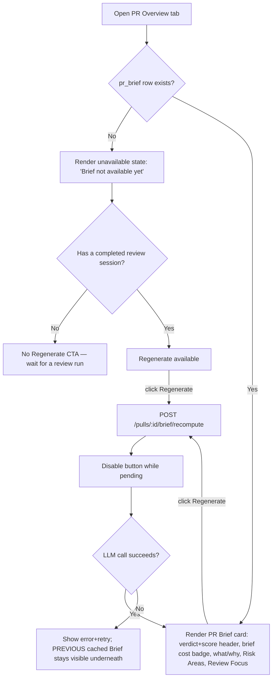
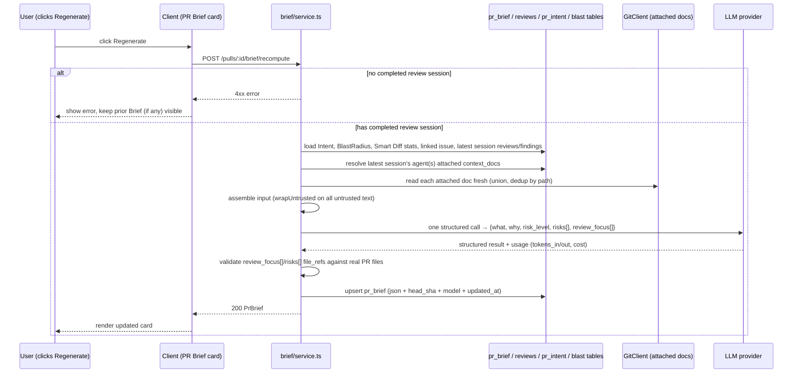

# Spec: PR Brief  |  Spec ID: SPEC-02-pr-brief  |  Status: draft
Affected modules: cross-module (server, client)

## Problem & why

Today, understanding a PR on DevDigest requires visiting three separate,
independently-loading places: the Intent card (what/in-scope/out-of-scope),
the Blast Radius tab (callers/endpoints/crons), and the Findings tab's
`VerdictBanner` inside a specific review run's accordion (verdict/score/
findings count/cost). There is no single "read this first" surface that
tells a reviewer *why this PR is risky* and *which exact lines to open
first*, backed by the PR's own review history, its declared intent, its
blast radius, and any project docs the reviewing agent was actually given.

This spec adds **PR Brief**: a single structured-LLM-call summary
(`what`/`why`/`risk_level`/`risks[]`/`review_focus[]`) rendered as a card
on the Overview tab, extending the existing `PrBrief` contract
(`server/src/vendor/shared/contracts/brief.ts` / its client mirror) rather
than replacing it. It reuses the existing `Intent` (already computed by the
Intent Layer, `SPEC` n/a — shipped) and `BlastRadius` (Blast Radius feature)
building blocks that `PrBrief` already composes, and additionally consumes
the **latest completed review session's** findings/verdict/summary (the
"conclusions of the last agent run") plus **Smart Diff group statistics**
(no full file diffs — a deliberate cost control) as fresh LLM input to
produce the `risks[]` (reusing the existing `Risk`/`RiskSeverity` shape) and
the new `review_focus[]` list, each item deep-linking to a real file/line on
GitHub — mirroring `BlastCard`'s existing `githubBlobUrl` pattern.

"Context Folder" in the initial ask refers to the already-specified
**Project Context** feature (`SPEC-01-project-context.md`): a repo-wide
`.md` discovery + manual attach-to-agent mechanism. PR Brief does not invent
a new "relevant specs" search — it reuses whatever docs are **already
attached** to the agent(s) whose run is being summarized, read fresh via the
same `GitClient`/`resolveAttachedDocPaths` path the run-executor already
uses (`server/INSIGHTS.md`).

## Goals / Non-goals

**Goals**
- Add `what` (string), `why` (string), `risk_level` (new enum), and
  `review_focus[]` (new, GitHub-linkable items) fields to the existing
  `PrBrief` Zod contract, in both vendored copies
  (`server/src/vendor/shared/contracts/brief.ts` and
  `client/src/vendor/shared/contracts/brief.ts`). `risks` stays typed as
  the existing `Risks`/`Risk` shape (already has `kind`/`title`/
  `explanation`/`severity`/`file_refs` — the "Risk Areas" content from the
  reference mockup) — not a new shape.
- Add brief-generation's own token/cost accounting (`tokens_in`,
  `tokens_out`, `cost_usd`) on `PrBrief`, following the exact naming/shape
  precedent already used for review-run cost tracking
  (`server/src/db/schema/runs.ts`: `tokensIn`/`tokensOut`/`costUsd`;
  `server/src/vendor/shared/contracts/trace.ts`: `tokens_in`/`tokens_out`/
  `cost_usd`) — a **separate** accounting from the review run's own cost,
  because generating the Brief is its own LLM call, distinct from the
  review run whose conclusions it consumes.
- One structured LLM call per Brief generation, assembling only: the
  existing `Intent`, the existing `BlastRadius` summary, Smart Diff
  **group-level statistics** (`SmartDiffGroup`/`split_suggestion` — no file
  bodies), the linked issue (`IssueMeta`, already resolved by the Intent
  Layer's `gh.getPullRequest(...).linked_issue` path), and the **latest
  completed review session's** persisted `reviews`/`findings` (verdict,
  summary, score, findings) plus any Project-Context docs already attached
  to that session's agent(s).
- Persist the result per-PR (`pr_brief` table), following the exact
  cache/recompute pattern already implemented for `pr_intent`: `GET
  /pulls/:id/brief` computes only when no row exists; `POST
  /pulls/:id/brief/recompute` always recomputes and overwrites. Add
  `headSha`, `model`, `updatedAt` columns to `pr_brief` (currently only
  `pr_id`+`json`), mirroring `pr_intent`'s columns.
- Render a **PR Brief card on the Overview tab** (not a new nav-level tab)
  containing: a verdict+score header (duplicated visual pattern from
  `VerdictBanner`, sourced from the same latest review session's
  verdict/score/findings/blockers — reused display data, not recomputed),
  the Brief's own `tokens_in`→`tokens_out`/`cost_usd` badge (the new,
  separate accounting above — shown next to, not instead of, the review
  session's own cost elsewhere in the app), a `what`/`why` summary, a
  Regenerate button (mirrors `IntentCard`'s recompute button/loading
  pattern), a "Risk Areas" section inside/alongside the existing Intent
  card content (reusing `risks[]`), and a full-width "Review Focus" section
  listing `review_focus[]` items, each linking to the real file+line range
  on GitHub (same `githubBlobUrl` pattern as `BlastCard`).
- Every `risks[]`/`review_focus[]` item that references a file/line must be
  anchored to real repo content — no fabricated paths/lines.

**Non-goals**
- No new nav-level "Review Focus" tab — despite the word "вкладка" in the
  initial ask, the confirmed UI (interview point 1) is a section on the
  Overview tab, matching the reference mockup's layout.
- No automatic "relevant specs" search/ranking over the repo-wide Project
  Context discovery list — PR Brief only reads docs **already attached** to
  the summarized session's agent(s) (interview point 5); building a
  relevance-ranking mechanism is explicitly out of scope here.
- No change to `reviewer-core`'s `assemblePrompt` or the review-run engine
  itself — PR Brief is a separate, additive LLM call/module
  (`modules/brief/`), following the same shape as `modules/blast/` and
  `modules/intent/`.
- No server-side lock/deduplication for concurrent Regenerate clicks —
  client-side button-disable-while-pending (mirroring `IntentCard`'s
  `recompute.isPending`) is sufficient (interview point 9).
- No silent truncation of Smart Diff group stats or other assembled input —
  full file diff **bodies** are categorically never included (not even for
  a "too_big" PR); only Smart Diff's existing group-level statistics travel
  into the prompt, regardless of PR size.
- No reuse of the per-finding `Verdict` enum (`request_changes`/`approve`/
  `comment`) for `risk_level` — a distinct PR-level enum is introduced (see
  Acceptance criteria) because `Verdict` describes a *review recommendation*,
  not an aggregate *risk magnitude*, and conflating them would make a
  `comment`-verdict PR with a leaked secret impossible to flag as
  `critical`.

**Constraints & tradeoffs considered**
- *Which agent's attached Project Context docs to use when the latest
  review session has multiple agents* (e.g. General + Security run
  together): resolved by **unioning the attached `context_docs` across
  every agent in the latest session**, deduplicated by path — the same
  60-second session-window definition already established for PR-list cost
  aggregation (`server/INSIGHTS.md`, `modules/pulls/routes.ts`) and for
  linked-skill resolution, reused here rather than inventing a new
  "session" concept. Not explicitly asked in the interview; called out here
  as a derived design decision, not a deferred question.
- *Brief requires at least one completed review run to exist* — `GET
  /pulls/:id/brief` returns `null` (rendered via the already-scaffolded
  `unavailable`/`unavailableHint` i18n keys in `client/messages/en/
  brief.json`, currently unused) when no completed session exists yet, since
  the Brief's `what`/`why`/`risk_level` are explicitly derived in part from
  review conclusions (interview point 6), not computable before any review
  has run. This was not stated as a constraint by the user but is implied
  directly by their answer to point 6 and by the pre-existing, currently-dead
  i18n copy that already describes exactly this state.
- *`pr_brief` cache/recompute mirrors `pr_intent` 1:1* (interview point 8)
  was chosen over inventing a bespoke caching scheme, for consistency with
  the one other per-PR LLM-derived cache already in the codebase.

## User stories

- As a reviewer opening a PR's Overview tab, I see a PR Brief card
  summarizing what the PR does, why it matters, an overall risk level, and
  a prioritized list of exactly which files/lines to read first — without
  visiting the Findings tab or Blast Radius tab separately.
- As a reviewer, I click "Review Focus" items and land on the exact
  file+line range on GitHub, the same way Blast Radius callers already
  deep-link today.
- As a reviewer who disagrees with a stale Brief (e.g. after a new commit
  or a new review run), I click Regenerate and get a freshly computed
  Brief reflecting the latest review session, intent, and blast radius.
- As a cost-conscious workspace owner, I can see, on the Brief card itself,
  how many tokens and how much the Brief-generation call itself cost —
  separately from the review run's own cost shown elsewhere (PR list COST
  column, `RunHistory`, `VerdictBanner`).

## Acceptance criteria (EARS)

**Contract & storage**
- AC-1: The system shall extend the existing `PrBrief` Zod contract with
  `what: string`, `why: string`, `risk_level: RiskLevel`,
  `review_focus: ReviewFocusItem[]`, `tokens_in: number | null`,
  `tokens_out: number | null`, and `cost_usd: number | null`, applied
  identically to both `server/src/vendor/shared/contracts/brief.ts` and
  `client/src/vendor/shared/contracts/brief.ts`. (Verify: unit test —
  `PrBrief.parse()` a fixture object containing all new fields succeeds in
  both vendored copies; a contract-drift check per `docs/skills/
  contract_breach.md` passes.)
- AC-2: The system shall define `RiskLevel = z.enum(['critical', 'high',
  'medium', 'low'])` as a new export in `brief.ts`, distinct from the
  existing `Verdict` and `RiskSeverity` enums. (Verify: unit test asserting
  `RiskLevel` rejects any `Verdict`-only value like `'request_changes'`.)
- AC-3: WHEN a Brief is generated, the system shall persist it to the
  `pr_brief` table with `head_sha`, `model`, and `updated_at` columns
  populated, mirroring `pr_intent`'s existing columns. (Verify: integration
  test — generate a Brief, read the row back, assert all three columns are
  non-null.)

**Compute / cache lifecycle**
- AC-4: WHEN `GET /pulls/:id/brief` is called and no `pr_brief` row exists
  for that PR AND at least one completed review session exists, the system
  shall compute and persist a new Brief and return it. (Verify: integration
  test — no prior row, one completed review present, assert a 200 with a
  populated body and a new persisted row.)
- AC-5: WHEN `GET /pulls/:id/brief` is called and no `pr_brief` row exists
  AND no completed review session exists for that PR, the system shall
  return `null` without invoking the LLM. (Verify: integration test — no
  reviews, assert `null` response and zero LLM provider calls.)
- AC-6: WHEN `GET /pulls/:id/brief` is called and a `pr_brief` row already
  exists, the system shall return the cached row as-is, regardless of
  `head_sha` staleness, matching `pr_intent`'s `getOrCompute` semantics.
  (Verify: integration test — persist a row with a stale `head_sha`, GET,
  assert the stale cached content is returned unchanged.)
- AC-7: WHEN `POST /pulls/:id/brief/recompute` is called, the system shall
  always recompute and overwrite the existing `pr_brief` row, regardless of
  whether one already exists. (Verify: integration test — persist a row,
  POST recompute, assert the row's `updated_at`/content changed.)
- AC-8: IF `POST /pulls/:id/brief/recompute` is called and no completed
  review session exists for that PR, THEN the system shall return a 4xx
  error and not overwrite any existing cached row. (Verify: integration
  test — no reviews present, POST recompute, assert error response and
  unchanged/absent `pr_brief` row.)

**LLM input assembly**
- AC-9: WHEN a Brief is computed, the system shall assemble its LLM input
  from exactly: the PR's current `Intent`, `BlastRadius` summary, Smart
  Diff `SmartDiffGroup`/`split_suggestion` statistics (no file patch
  bodies), the linked issue (if any), and the latest completed review
  session's `reviews`/`findings` (verdict, summary, score, findings),
  using the same 60-second session-window definition already implemented
  in `modules/pulls/routes.ts`. (Verify: unit test on the pure input-
  assembly function asserting no `patch`/diff-body field is ever present in
  the assembled input, using a fixture PR with multi-agent same-session
  reviews.)
- AC-10: WHEN a Brief is computed for a PR whose latest review session's
  agent(s) have one or more Project Context docs attached (directly or via
  linked+enabled skills), the system shall read each attached doc's content
  fresh via the existing `GitClient`/attached-doc-resolution path and
  include it in the LLM input, unioned and deduplicated by path across all
  agents in that session. (Verify: integration test — two agents in the
  same session with overlapping and distinct attached docs, assert the
  assembled input contains each distinct path's content exactly once.)
- AC-11: The system shall wrap every untrusted text source in the assembled
  input (issue body, review/finding text, attached Project Context docs)
  using the existing `wrapUntrusted` mechanism before it reaches the model.
  (Verify: unit test on the assembled prompt asserting each such block is
  delimited via `wrapUntrusted`.)
- AC-12: WHEN Smart Diff's `split_suggestion.too_big` is `true` for a PR,
  the system shall still assemble the Brief input using only Smart Diff's
  group-level statistics (never full file diff bodies), identical to the
  non-too_big case. (Verify: unit test — fixture with `too_big: true`,
  assert the assembled input size/shape is unchanged in kind from a
  `too_big: false` fixture, containing no patch bodies either way.)

**Output validation**
- AC-13: WHEN the structured LLM call returns, the system shall validate
  every `review_focus[]` item's `path` against the PR's changed-files list
  (or the repo clone) before persisting, and drop any item referencing a
  path outside the PR's diff/repo. (Verify: unit test — fixture LLM output
  containing one valid and one fabricated path, assert only the valid item
  survives in the persisted Brief.)
- AC-14: The system shall record the structured LLM call's `tokens_in`,
  `tokens_out`, and `cost_usd` on the persisted `PrBrief`, using the same
  `outcome.costUsd ?? priceBook.estimate(...)` fallback precedent documented
  in `server/INSIGHTS.md` for review-run cost. (Verify: integration test
  with a mocked LLM provider returning usage data, assert the persisted row
  carries matching `tokens_in`/`tokens_out`/`cost_usd`.)

**UI — PR Brief card (Overview tab)**
- AC-15: The Overview tab shall render a PR Brief card above/alongside the
  existing Intent card, showing a verdict+score header sourced from the
  latest completed review session (reusing `VerdictBanner`'s visual
  pattern: verdict label, score, findings/blockers badge), the Brief's own
  `tokens_in`→`tokens_out`/`cost_usd` badge (visually distinct from the
  review session's own cost, shown elsewhere), and the `what`/`why` text.
  (Verify: RTL component test asserting all listed elements render from a
  fixture `PrBrief`.)
- AC-16: WHEN no `pr_brief` row exists for the PR, the system shall render
  the existing `unavailable`/`unavailableHint` copy from `client/messages/
  en/brief.json`. (Verify: RTL test for the empty-Brief case.)
- AC-17: WHEN no `pr_brief` row exists AND no completed review session
  exists, the system shall render the unavailable state without a
  Regenerate control (nothing to compute from yet). (Verify: RTL test
  asserting the Regenerate button is absent/disabled in this state.)
- AC-18: WHILE a Regenerate request is pending, the system shall disable
  the Regenerate button and show a loading state, mirroring `IntentCard`'s
  `recompute.isPending` pattern. (Verify: RTL test asserting the button is
  disabled and shows loading copy during a pending mutation.)
- AC-19: IF a Regenerate request fails, THEN the system shall show an
  error+retry affordance while continuing to display the previously cached
  Brief content underneath (never clearing it on failure). (Verify: RTL
  test — mock a failing recompute mutation over an already-rendered Brief,
  assert the prior content remains visible alongside the error.)
- AC-20: The system shall render a "Risk Areas" section (using `risks[]`)
  inside/alongside the Intent card content, each item showing its `kind`
  icon, `title`, and clickable `file_refs` deep-linking to GitHub via the
  same `githubBlobUrl` pattern `BlastCard` already uses. (Verify: RTL test
  asserting each risk row's file link resolves to the expected GitHub blob
  URL.)
- AC-21: WHEN `risks` is empty, the system shall render a distinct
  "no risk areas" empty-state string (a new i18n key, e.g. `noRiskAreas`,
  separate from the existing `noRisks`/`noHistory` keys which cover
  different sections). (Verify: RTL test for the empty-risks case.)
- AC-22: The system shall render a full-width "Review Focus" section
  listing every `review_focus[]` item with a clickable file+line-range link
  (GitHub blob deep-link, same pattern as AC-20) and its one-sentence
  `description`. (Verify: RTL test asserting each item's link and
  description render.)
- AC-23: WHEN `review_focus` is empty, the system shall render a distinct
  "no review focus items" empty-state string (a new i18n key, e.g.
  `noReviewFocus`). (Verify: RTL test for the empty-review-focus case.)

## Edge cases

- **No completed review session yet.** Covered by AC-5/AC-8/AC-17 — Brief
  is unavailable and non-computable until at least one review run
  completes; this is the expected, documented state (existing
  `unavailable`/`unavailableHint` copy), not an error.
- **Multiple agents in the latest session, divergent verdicts/attached
  docs.** The verdict+score header reuses whichever aggregation the
  existing PR-list/`VerdictBanner` logic already applies for a
  multi-agent session (out of scope to redefine here); attached-doc
  resolution unions across all agents in the session (see Constraints &
  tradeoffs).
- **PR with no linked issue.** The Brief is computed without issue context;
  no error, no placeholder issue is fabricated.
- **PR whose review session's agent(s) have zero attached Project Context
  docs.** The Brief is computed without any spec context — this is the
  common case, not degraded behavior.
- **Very large PR (`split_suggestion.too_big: true`).** Per AC-12, only
  Smart Diff group statistics are used, always — no special-casing that
  further truncates or expands what's sent for large PRs.
- **LLM call fails or times out.** Mirrors `IntentCard`'s existing
  error+retry UI pattern (AC-19); critically, unlike `IntentCard` (which
  has no prior content to preserve on first compute), a Regenerate failure
  must not clear an already-cached Brief — the user keeps the last good
  version visible.
- **Concurrent Regenerate clicks.** Client-side button disable during a
  pending mutation is the only guard (interview point 9, explicitly no
  server-side lock/dedup) — a second click while pending is simply not
  possible from the UI; a raced second POST from outside the UI (e.g. two
  browser tabs) may overwrite the row twice in quick succession, which is
  accepted as a known, low-probability, low-harm race (last write wins on
  the same row, no partial/corrupt state possible since each recompute is a
  single atomic upsert).
- **Fabricated `review_focus`/`risks` file references from the LLM.**
  Covered by AC-13 — output validation drops any item whose path doesn't
  correspond to a real file in the PR's diff/repo, using the same
  anti-hallucination discipline documented in `server/INSIGHTS.md` for the
  conventions extractor (`evidence_snippet` on-disk verification), adapted
  here to a simpler existence check against the PR's changed-file set.

New/changed data shapes (paths reference the existing vendored files; only
genuinely new fields/types are shown):

**`PrBrief`** (`server/src/vendor/shared/contracts/brief.ts` and its client
mirror) — additive fields on the existing composite object:

| field | type | required | direction |
|---|---|---|---|
| `what` | `string` | yes | server writes at compute time; client renders |
| `why` | `string` | yes | server writes at compute time; client renders |
| `risk_level` | `RiskLevel` (new enum: `critical\|high\|medium\|low`) | yes | server writes; client renders as the card's verdict-adjacent badge |
| `review_focus` | `ReviewFocusItem[]` (new, below) | yes (defaults to `[]`) | server writes; client renders as the Review Focus section |
| `tokens_in` | `number \| null` | yes (nullable) | server writes from LLM usage |
| `tokens_out` | `number \| null` | yes (nullable) | server writes from LLM usage |
| `cost_usd` | `number \| null` | yes (nullable) | server writes, same fallback precedent as review-run cost |

**`ReviewFocusItem`** (new type, composed into `PrBrief.review_focus`):

| field | type | required | direction |
|---|---|---|---|
| `path` | `string` (repo-relative) | yes | server writes (LLM output, validated against real files per AC-13); client renders as a GitHub blob link |
| `start_line` | `number` (int) | yes | server writes; client renders |
| `end_line` | `number` (int) | no | server writes when the LLM identifies a range; client renders as a line range when present, else a single line |
| `description` | `string` (one sentence) | yes | server writes; client renders |
| `severity` | `RiskSeverity` (existing enum, reused) | yes | server writes; client renders as a severity indicator on the row |

**`pr_brief` table** (`server/src/db/schema/reviews.ts`) — additive
columns, mirroring `pr_intent`'s existing shape:

| column | type | required | direction |
|---|---|---|---|
| `head_sha` | `text` | no (nullable, like `pr_intent.headSha`) | server writes at compute time |
| `model` | `text` | no (nullable) | server writes at compute time |
| `updated_at` | `timestamptz` | yes (default now) | server writes on every upsert |

## Non-functional

- **Zero full-diff-body input, always.** The single most explicit cost
  constraint from the interview: Smart Diff group *statistics* only, never
  file patch bodies, regardless of PR size — this is the primary lever
  keeping the Brief's own `tokens_in` bounded independent of PR size.
  (Verify: AC-12; code review checklist item on the input-assembly
  function.)
- **One structured LLM call per compute/recompute.** No chained/multi-step
  LLM calls for a single Brief generation. (Verify: integration test
  asserting exactly one `completeStructured` invocation per `POST /pulls/
  :id/brief/recompute`.)
- **Timeout.** `POST /pulls/:id/brief/recompute` (and the auto-compute path
  of `GET /pulls/:id/brief`) shall use the same `config: { timeout: 120_000
  }` convention already applied to `/pulls/:id/intent` and `/pulls/:id/
  blast/explain`. (Verify: route config inspection / integration test
  asserting the route registers with a 120s timeout.)
- **Untrusted content.** Linked-issue body, review/finding text, and every
  attached Project Context doc are external/repo-authored content and must
  never be treated as instructions to the model — same discipline as
  `SPEC-01-project-context.md`'s Untrusted inputs section and
  `reviewer-core/src/prompt.ts`'s `INJECTION_GUARD`. (Verify: AC-11.)
- **Anti-hallucination on file references.** `review_focus[]`/`risks[]`
  file paths must be checked against the real PR/repo before being
  persisted or shown, following the existing conventions-extractor
  precedent (`server/INSIGHTS.md`). (Verify: AC-13.)

## Inputs (provenance)

- `Intent` — `[reused: existing Intent Layer, modules/intent/service.ts]`.
  No recomputation; read as-is at Brief-compute time.
- `BlastRadius` (summary + counts) — `[reused: existing Blast Radius
  feature, modules/blast/]`. No recomputation.
- Smart Diff group statistics — `[reused: existing `GET /pulls/:id/smart-
  diff`, modules/pulls/service.ts `assembleSmartDiff`]`. No file bodies.
- Linked issue (`IssueMeta`) — `[reused: existing GitHub fetch path,
  modules/intent/service.ts's `gh.getPullRequest(...).linked_issue`]`.
- Latest completed review session's `reviews`/`findings` (verdict, summary,
  score, findings) — `[reused: existing reviews/findings tables, same
  60-second session-window definition as modules/pulls/routes.ts]`.
- Attached Project Context docs for the latest session's agent(s) —
  `[reused: existing SPEC-01-project-context attach mechanism +
  `GitClient`/`resolveAttachedDocPaths` read path]`. No new discovery/
  ranking logic.
- `what` / `why` / `risk_level` / `review_focus[]` — `[new: 1 LLM call]`,
  the single structured call this spec introduces.
- `risks[]` — `[new: 1 LLM call]` (same call as above); the *shape* is
  `[reused: existing Risk/Risks contract]`, only the generation of its
  content for this specific composite call is new (previously `PrBrief`
  had no populated producer for `risks` either — this spec is the first
  one to actually compute it).
- Brief-generation `tokens_in`/`tokens_out`/`cost_usd` —
  `[deterministic: LLM provider usage response, same `outcome.costUsd ??
  priceBook.estimate(...)` fallback pattern documented in
  server/INSIGHTS.md]`.

## Untrusted inputs

- **Linked issue title/body** (from GitHub) — external, must be
  `wrapUntrusted`-wrapped before reaching the model; never treated as an
  instruction.
- **Review/finding text** (verdict summary, finding rationale/suggestion) —
  originates from a prior LLM review call over the PR's own (also
  untrusted) diff/description; treated as untrusted data for this new call
  as well, same discipline.
- **Attached Project Context docs' content** — per `SPEC-01-project-
  context.md`'s existing Untrusted inputs section, this is repo-authored
  markdown reachable by anyone with repo write access; must remain
  `wrapUntrusted`-wrapped here exactly as it already is in the review-run
  prompt path.
- This spec introduces no new trust boundary — it extends the project's
  existing `wrapUntrusted`/`INJECTION_GUARD` discipline to one additional
  LLM call consuming the same categories of untrusted text already handled
  elsewhere in the codebase.
