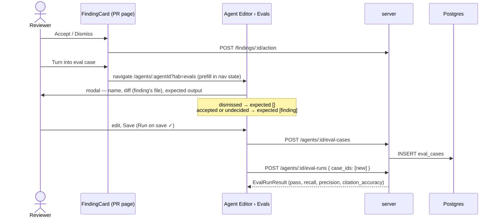

# Spec: Agent Evals  |  Spec ID: SPEC-03-agent-evals  |  Status: draft
Affected modules: cross-module (server, client)

## Problem & why

Today an agent's config — system prompt, model, linked skills, attached
context docs — can be edited freely in the Agent Editor, and nothing tells the
user whether an edit made the agent **better** or **worse**. The only feedback
loop is running the agent against a live PR and eyeballing the findings. That
is slow, non-repeatable, and invisible in aggregate: a prompt tweak that fixes
one false positive while silently killing three true positives looks like a
success.

The reviewer already produces exactly the labelled data needed to fix this.
Every finding gets an **accept** or **dismiss** decision from a human. An
accepted finding is a statement that "on this diff, the agent *should* flag
this"; a dismissed finding is a statement that "on this diff, the agent
*should not* have flagged this". Those decisions are already persisted
(`findings.accepted_at` / `findings.dismissed_at`) and today are used for
nothing beyond greying out a card.

This spec turns those decisions into a **regression suite for agents**: an
eval case is a frozen PR input plus an expected outcome, an eval run replays
the agent against that frozen input, and a code-only scorer reports recall,
precision and citation accuracy. Change the prompt, the model, or a linked
skill → run the evals → see in numbers whether the agent regressed.

## Goals / Non-goals

**Goals**

- G1 — Turn any finding into an eval case in one click, with the expectation
  derived from the human's accept/dismiss decision on that finding.
- G2 — Persist eval cases and eval runs in Postgres, owned by the agent that
  produced the finding.
- G3 — A modal to create and edit an eval case: frozen inputs (diff, files, PR
  meta) plus a hand-editable expected output.
- G4 — An **Evals** tab in the Agent Editor showing aggregate metrics and the
  case list, with per-case run/edit/delete, "Run all evals" and "New eval case".
- G5 — Deterministic, **code-only** scoring — recall, precision, citation
  accuracy — with no model in the scoring path.
- G6 — Runs of different agent versions are comparable: every eval run records
  the agent version it ran against, and the metric deltas compare the latest
  version to the previous one.
- G7 — An eval run reproduces the production review prompt as closely as a
  PR-less input allows, so the evals measure the agent that actually ships.

**Non-goals** (deliberately out of scope)

- Skill-owned eval cases. `eval_cases.owner_kind` already permits `'skill'`;
  this spec only ever writes `'agent'`. The Skill editor's Evals tab stays the
  stub it is today.
- The **Eval Dashboard** page. The sidebar entry and the "View full dashboard →"
  link remain non-functional placeholders; the `EvalDashboard` contract is used
  only to populate the metrics section inside the Evals tab.
- The `Learn` and `Reply to author` finding actions visible in the design
  reference. Only `Turn into eval case` is added to the finding card.
- The `Stats` and `CI` tabs of the Agent Editor (later lessons).
- LLM-as-judge scoring of any kind.
- Blocking a PR / CI check on an eval regression.

**Constraints & tradeoffs**

- The `eval_cases` and `eval_runs` tables **already exist** (`0000_init.sql`),
  as do the Zod contracts (`EvalCase`, `EvalRun`, `EvalCaseInput`,
  `EvalRunRecord`, `EvalRunResult`, `EvalDashboard`). This spec **extends**
  them (one new column, see *Inputs*); it does not recreate them.
- **An eval run is Postgres + one model call — no filesystem, no clone, no live
  PR row.** Everything repo- or PR-derived is frozen onto the case at capture
  (AC-14/AC-16). This is what keeps runs of different agent versions comparable,
  and it is why the case needs no pinned repo.
- **Rejected: recovering the rank note by parsing the rendered prompt.** The rank
  note is concatenated into the task line and never stored on its own, so it is
  tempting to strip the known task-line prefix back off `prompt_assembly.user` to
  recover it. That is string surgery on a prompt: retune the task-line wording and
  it silently yields an empty rank note. It is *recomputed* at capture instead,
  from the same file-rank index the review run used.
- `@devdigest/shared` is vendored twice (`server/src/vendor/shared/`,
  `client/src/vendor/shared/`) with no automated sync — any contract change
  lands in both copies.
- **Rejected: a targeted forbidden-list for dismissed findings.** The draft
  framed a dismissed finding as "must NOT comment Y". Because the captured diff
  is already scoped to the finding's own file, "flag nothing on this fragment"
  is a faithful and much simpler proxy — so a dismissed finding becomes a case
  with an *empty* expected output, and `expected_output` stays a plain array
  of expected findings.
- **Rejected: LLM-judge scoring.** A non-deterministic scorer defeats the whole
  purpose of a regression suite.
- **Rejected: fire-and-forget + SSE execution.** "Run all evals" runs the cases
  sequentially inside the request. Simple and adequate at the current set sizes;
  the cost is a long-lived request (see *Non-functional*).

## User stories

**S1 — Reviewer promotes a decision into a regression test.** A reviewer reads
a finding on a PR, accepts it (it is a real bug) or dismisses it (it is noise),
and clicks `Turn into eval case`. They land in the producing agent's Evals tab
with the modal already filled in: the diff of the finding's file, a name slugged
from the finding title, and an expected output that mirrors their decision. They
tweak the name, hit Save, and the case is part of the agent's suite forever.

**S2 — Agent author checks a prompt change for regressions.** The author edits
the agent's system prompt (which bumps `agents.version`), opens the Evals tab
and clicks `Run all evals`. Each case runs in turn against the new config; when
the run finishes the three metric cards show the new aggregate and the delta
against the *previous agent version*, and the case list shows which cases went
red.

**S3 — Agent author writes a case by hand.** From the Evals tab the author
clicks `New eval case`, pastes a diff, writes the expected findings as JSON, and
saves. No PR and no finding involved, so the case carries no frozen enrichment at
all — it is a diff plus an expectation, and the eval prompt simply omits the
sections it has no input for.

## Acceptance criteria (EARS)

**Creating a case from a finding**

- **AC-1** — WHEN the user clicks `Turn into eval case` on a finding, the system
  shall navigate to the Agent Editor of the agent that produced that finding,
  select its `Evals` tab, and open the eval-case modal prefilled from that
  finding. *(Verify: RTL test on the finding card + a route assertion)*
- **AC-2** — WHERE the finding is dismissed, the system shall prefill the
  expected output as an empty array. *(Verify: unit test on the prefill helper)*
- **AC-3** — WHERE the finding is accepted, or has neither an accept nor a
  dismiss decision, the system shall prefill the expected output with one
  expected-finding object carrying that finding's `severity`, `category`,
  `title`, `file`, `start_line` and `end_line` (the finding's full line range,
  not just its start — a missing `end_line` would collapse the AC-21 match to a
  single point). *(Verify: unit test on the prefill helper)*
- **AC-4** — WHEN prefilling a case from a finding, the system shall set the
  case's input diff to the hunks of that PR's diff belonging to the finding's
  file **only**, and shall leave that field editable before save. *(Verify: unit
  test on the diff-slice helper)*
- **AC-5** — WHEN prefilling a case from a finding, the system shall set the
  case name to a kebab-case slug of the finding title, editable before save.
  *(Verify: unit test on the slug helper)*
- **AC-6** — The system shall persist every eval case created by this feature
  with `owner_kind = 'agent'` and `owner_id` set to the agent that produced the
  originating finding. *(Verify: integration test against the create route)*

**The eval-case modal**

- **AC-7** — IF the expected-output field does not parse as JSON, THEN the
  system shall mark the field invalid and disable Save. *(Verify: RTL test)*
- **AC-8** — IF the name field is empty, THEN the system shall disable Save.
  *(Verify: RTL test)*
- **AC-9** — WHEN the user saves a case WHERE `Run on save` is enabled, the
  system shall immediately run that single case and render its result in the
  modal. *(Verify: RTL test + integration test on the run route with one
  `case_ids` entry)*
- **AC-10** — The system shall render the `Files` tab as a read-only list
  derived from the case's input diff. *(Verify: RTL test)*
- **AC-11** — The system shall render the `PR meta` tab as read-only, and shall
  inject the case's frozen PR meta into the eval prompt as the PR description and
  the task line. *(Verify: RTL test + integration test asserting the prompt
  assembly's `pr_description` slot)*
- **AC-12** — The system shall offer `Finding skeleton` in the modal, inserting
  an empty expected-finding object into the expected-output editor. *(Verify:
  RTL test)*

**Running a case**

- **AC-13** — WHEN an eval case is run, the system shall resolve the agent-side
  inputs **live** from the agent: system prompt, provider, model, strategy, and
  the bodies of its linked-and-enabled skills. *(Verify: integration test —
  edit the system prompt, re-run, assert the new prompt reached the model)*
- **AC-14** — WHEN an eval case is run, the system shall take the case-side
  inputs **frozen** on the case — diff, PR meta, declared intent, callers digest,
  repo map, rank note, context-doc contents — and shall never re-derive them from
  a live pull request or a repository clone. *(Verify: integration test that runs
  a case with no `pull_requests` row present)*
- **AC-15** — WHEN an eval case is captured from a finding, the system shall
  freeze onto the case the contents of the context docs the originating review run
  actually read, taken from that run's trace (`RunTrace.specs_read`). *(Verify:
  integration test — capture from a run with an attached doc, assert the content
  is on the case)*
- **AC-16** — The system shall perform no filesystem or repository-clone access
  during an eval run. *(Verify: integration test — run a case with the `GitClient`
  port overridden to throw on every call; the run still succeeds)*
- **AC-17** — WHEN "Run all evals" is triggered, the system shall run the
  agent's cases **sequentially**, one model call at a time. *(Verify:
  integration test asserting the mock provider's call order)*
- **AC-18** — IF one case's run fails (for example the model call errors), THEN
  the system shall record that case's run as failed with the error and continue
  running the remaining cases. *(Verify: integration test with a mock provider
  that throws on the second case)*
- **AC-19** — The system shall record on every eval run the agent version it ran
  against. *(Verify: integration test — bump the agent's version, re-run, assert
  two runs with different versions)*
- **AC-20** — The system shall record on every eval run its duration and its
  cost, preferring the cost reported by the provider over an estimate. *(Verify:
  integration test asserting `cost_usd` is the provider's value)*

**Scoring (code-only)**

- **AC-21** — The system shall count an expected finding as **matched** when a
  produced finding has the identical file path AND its `[start_line, end_line]`
  range intersects the expected finding's line range (an expected finding with
  only a `start_line` is a one-line range). *(Verify: unit test on the matcher,
  including the touching-boundary case)*
- **AC-22** — The system shall not use `severity`, `category` or `title` when
  deciding whether a finding matches an expectation; those fields are
  informational. *(Verify: unit test — same file/lines, different severity, still
  matches)*
- **AC-23** — The system shall compute **recall** as
  `matched expected findings / total expected findings` across the cases in the
  run. *(Verify: unit test on the scorer)*
- **AC-24** — WHERE a run's cases carry no expected findings at all, the system
  shall report recall as 1. *(Verify: unit test on the scorer)*
- **AC-25** — The system shall compute **precision** as
  `1 − false positives / total findings produced`, where a false positive is any
  finding produced for a case whose expected output is empty. *(Verify: unit test
  on the scorer)*
- **AC-26** — WHERE a run contains no case with an empty expected output, the
  system shall report precision as 1. *(Verify: unit test on the scorer)*
- **AC-27** — The system shall compute **citation accuracy** as
  `findings kept / (findings kept + findings dropped)` by the existing citation
  grounding gate (`reviewer-core`'s `groundFindings`), across the run. *(Verify:
  unit test on the scorer, fed a grounding result with a dropped finding)*
- **AC-28** — WHERE a run produced no findings before the grounding gate, the
  system shall report citation accuracy as 1. *(Verify: unit test on the scorer)*
- **AC-29** — The system shall compute recall, precision and citation accuracy
  in code only, issuing no model call in the scoring path. *(Verify: integration
  test with a mock provider asserting exactly one model call per case)*
- **AC-30** — The system shall mark a case as **passed** when every one of its
  expected findings matched AND, WHERE its expected output is empty, it produced
  zero findings. *(Verify: unit test on the scorer covering both shapes)*

**The Evals tab**

- **AC-31** — The system shall show three metric cards — recall, precision and
  citation accuracy — for the agent's latest version, each with its delta
  against the previous agent version. *(Verify: RTL test + integration test on
  the dashboard route)*
- **AC-32** — IF no previous agent version has eval runs, THEN the system shall
  render the metric cards without a delta. *(Verify: RTL test)*
- **AC-33** — The system shall show `N / M passing` above the case list, where
  `M` is the agent's case count and `N` the number of cases whose **most recent**
  run passed. *(Verify: RTL test)*
- **AC-34** — WHERE a case has never been run, the system shall render it as
  `never run`, with neither a pass nor a fail state. *(Verify: RTL test)*
- **AC-35** — The system shall offer run, edit and delete on every case in the
  list, and `Run all evals` and `New eval case` above it. *(Verify: RTL test)*
- **AC-36** — WHEN an eval case is deleted, the system shall delete its eval runs
  with it. *(Verify: integration test — delete a case with runs, assert no
  orphaned rows)*
- **AC-37** — WHERE the Eval Dashboard page does not exist, the system shall
  render the "View full dashboard →" link as a disabled placeholder. *(Verify:
  RTL test)*

**Trust boundary**

- **AC-38** — The system shall pass a case's input diff, PR-meta title/body, and
  resolved context-doc contents to the model as **data**, wrapped by the existing
  untrusted-input delimiters in the prompt assembler, never as instructions.
  *(Verify: unit test asserting the delimiter wrapping of each slot)*

## Edge cases

- **A finding whose agent was deleted.** `reviews.agent_id` is a plain uuid with
  no FK. `Turn into eval case` on a finding whose agent no longer exists has
  nowhere to navigate — the button must fail closed (disabled, with a reason),
  not 404 mid-navigation.
- **A finding whose file is not in the diff.** Cannot happen for a persisted
  finding (the grounding gate already dropped those), but the diff-slice helper
  must still return an empty diff rather than throw, and an empty input diff must
  be rejected at save time.
- **Editing the diff so the expectation no longer intersects it.** The user can
  hand-edit `input_diff` after prefill. A case whose expected finding cites lines
  that no longer exist in the diff will fail every run, and — because the
  grounding gate drops the model's finding too — will do so with a *low citation
  accuracy*, which reads as an agent problem rather than a bad case. The modal
  should flag, at save time, an expected finding whose file is absent from the
  diff.
- **An expected output that is an empty array vs a case with no expectation at
  all.** These are the same thing by construction: `[]` means "flag nothing on
  this fragment". There is no third state.
- **Run all with zero cases.** Renders `0 / 0 passing`, `Run all evals` disabled;
  no model calls, no eval-run rows, metrics rendered as unavailable rather than
  as `100%`.
- **A run cancelled mid-set.** Sequential execution means cases already run are
  persisted and cases not yet reached simply have no new run. The aggregate is
  computed from the *latest run per case*, so a partial "Run all" leaves a
  coherent, if mixed-version, aggregate. This is accepted; the metric cards read
  the latest agent version's runs only, so stale-version rows do not silently
  pollute the current number.
- **Two agents produced the same finding text on the same PR.** Findings are
  per-review, so each finding already belongs to exactly one agent run — there is
  no ambiguity about which agent owns the case.
- **A dismissed finding on a file that also contains a real bug.** The case says
  "flag nothing on this file's fragment", so the real bug becomes a false
  positive. This is a known consequence of the `[]` semantics and the reason the
  captured diff is scoped to the finding's file rather than the whole PR.
- **Repo-intel disabled or unindexed at capture time.** The frozen callers digest
  and repo map are then simply absent from the case, and the eval prompt omits
  those sections — identical to a production run against the same agent with
  repo-intel off.

## Non-functional

- **Latency / timeout.** "Run all evals" is sequential and synchronous: a set of
  N cases is N serial model calls inside one HTTP request. At a typical ~2 s per
  case this is fine for the sets we expect (≤ 20), but it is the known scaling
  limit of this design. *(Verify: measurement — a 20-case set completes inside
  the server's request timeout; if it does not, the fire-and-forget + SSE
  execution model rejected above is the fix.)*
- **Cost.** Every eval run is a real model call and is charged. The per-run cost
  is recorded and shown, so a "Run all" is never silently expensive. *(Verify:
  integration test asserting `cost_usd` is persisted per run)*
- **Determinism.** Comparability across agent versions depends on the case-side
  inputs being byte-identical between runs; nothing in the eval path may re-derive
  them from live repo or PR state. *(Verify: integration test — run the same case
  twice against an unchanged agent, assert the two prompt assemblies are
  identical)*

## Inputs (provenance)

**Design reference.** Three screenshots supplied by the requester during the
interview, saved at [`design/agent-evals/`](../design/agent-evals/README.md):
`01-finding-card-turn-into-eval-case.png` (the entry point on the finding card),
`02-eval-case-modal.png` (the modal's fields and the plain-array shape of the
expected output), `03-agent-editor-evals-tab.png` (the Evals tab layout). The
spec departs from them in four places — the dropped `TRACES PASSED` card, the
disabled dashboard link, and the out-of-scope `Learn` / `Reply to author` actions
and `Stats` / `CI` tabs; each is recorded in that folder's README and in
*Non-goals* above.

| Input | Source |
| --- | --- |
| Finding + its accept/dismiss decision | `[reused: findings table — accepted_at / dismissed_at]` |
| Producing agent | `[reused: findings → reviews.agent_id]` |
| Case input diff | `[deterministic: the originating PR's diff, sliced to the finding's file]` |
| Case input files | `[deterministic: derived from the input diff — read-only]` |
| Case PR meta (title, body, number, author) | `[deterministic: the originating pull request — frozen, read-only]` |
| Frozen enrichment (callers digest, repo map, declared intent, context-doc contents) | `[deterministic: the resolved inputs of the review run that produced the finding, read back from its run trace + the PR's stored intent]` |
| Rank note | `[deterministic: recomputed at capture time from the repo's file-rank index — never parsed back out of the rendered prompt]` |
| Agent system prompt, provider, model, strategy | `[reused: agents table — resolved live at run time]` |
| Linked skill bodies | `[reused: agent_skills → skills, linked AND enabled, in link order — resolved live]` |
| Recall / precision / citation accuracy | `[deterministic: code-only scorer over the produced findings + the grounding result]` |
| Produced findings | `[new: 1 LLM call per eval case per run]` |

**Split rule.** What the eval *tests* is resolved live from the agent (prompt,
model, strategy, linked skills). What the eval *holds constant* is frozen on the
case (diff, files, PR meta, enrichment — including the context-doc contents). This
is what makes two runs of different agent versions comparable, and it is why an
eval run touches **neither a live pull request nor a repository clone**: it is
Postgres plus one model call, nothing else.

The one thing this costs: editing an attached context doc will not move an
agent's eval numbers until the affected cases are re-captured. Accepted — the
regression loop this feature exists for is *prompt / model / linked skill*, and
all three stay live.

**New contract fields.** **One** column and its contract mirror are added; the
rest of the eval schema and contracts are used as they already exist.

| Field | Type | Required | Direction |
| --- | --- | --- | --- |
| `eval_runs.agent_version` | integer | yes | server → DB; the `agents.version` in force when the run executed. Groups runs for the metric deltas. |
| `EvalRunRecord.agent_version` | integer | yes | server → client |

The frozen enrichment lives inside the existing `eval_cases.input_meta` jsonb
column — no new column — alongside the PR meta the modal edits:

| `input_meta` key | Meaning |
| --- | --- |
| `pr` | number, title, body, author — read-only in the modal's `PR meta` tab; drives the prompt's PR-description slot and task line |
| `enrichment` | the callers digest, repo map, declared intent, rank note and context-doc contents, frozen at capture; not shown in the UI |
| `source` | the originating `finding_id` / `review_id` / `run_id` / `pr_id`; present only on a case captured from a finding, and the only thing the client needs to send for the server to resolve the whole `enrichment` block itself |

Routes (all workspace-scoped, following the existing agents module):

- `GET /agents/:id/eval-cases` — the agent's cases, each with its latest run
- `POST /agents/:id/eval-cases` — create
- `PUT /eval-cases/:id` — update
- `DELETE /eval-cases/:id` — delete (cascades its runs)
- `POST /agents/:id/eval-runs` — run the agent's cases; an optional `case_ids`
  body narrows it to a subset, which is how both the per-case ▷ button and
  `Run on save` are served by one route
- `GET /agents/:id/eval-dashboard` — the aggregate + deltas for the metric cards

## Untrusted inputs

Everything the eval prompt carries that originates outside the agent's own
configuration is **foreign text and must be treated as data, never as
instructions**:

- **The case's input diff** — PR code written by a third party, and hand-editable
  in the modal afterwards.
- **The case's PR meta** (title, body) — authored by the PR author.
- **The frozen enrichment** (callers digest, repo map, declared intent, rank note)
  — derived from repository content and the PR author's own description.
- **The frozen context-doc contents** — repository markdown. Freezing them does
  not launder them: text captured from a repo six weeks ago is exactly as untrusted
  as text read from a clone today, and gets the same wrapping.

All four already flow through `assemblePrompt`'s untrusted-input wrapping in the
production review path, and the eval path reuses that same assembler rather than
building its own prompt — that reuse *is* the mitigation (AC-38).

**Skill bodies remain trusted instructions**, exactly as in a production review
run: they are authored/vetted inside the workspace, and the existing safeguard is
import-disabled-by-default plus manual vetting, not prompt-level wrapping. The
eval path must not change that trust decision.

**The expected output is never sent to the model.** It is scoring data, held
entirely on the server side of the run; nothing about the expectation may leak
into the prompt, or the eval would grade the agent on a prompt it will never see
in production.
