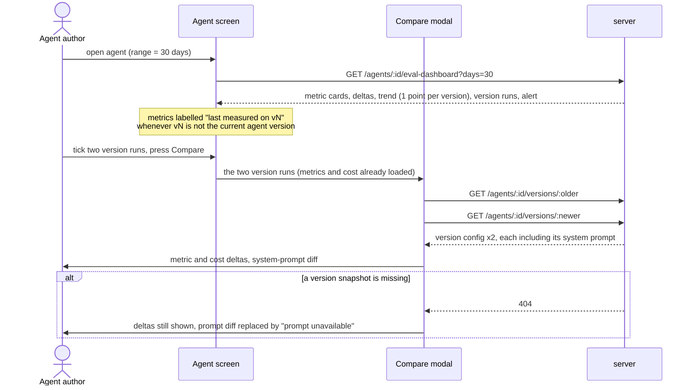

# Spec: Eval Dashboard  |  Spec ID: SPEC-04-eval-dashboard  |  Status: draft
Supersedes: [`SPEC-03-agent-evals`](./SPEC-03-agent-evals.md) — **AC-37 only** (the
"View full dashboard →" link as a disabled placeholder) and the matching
*Non-goal* ("The Eval Dashboard page"). Every other decision in SPEC-03 stands
and is built upon here.
Affected modules: cross-module (server, client)

## Problem & why

SPEC-03 gave every agent a regression suite, but it is only visible **one agent
at a time, inside the Agent Editor's Evals tab**, and only for the agent's
*current* version. Three things are missing, and all three are the reason the
suite exists:

1. **No cross-agent view.** With several reviewer agents in a workspace there is
   no single place that answers "which of my agents is currently worst, and when
   was each last measured?". You have to open each agent's editor in turn.
2. **No history.** `eval_runs` already records `agent_version`, `cost_usd` and the
   raw scoring counts for every execution, but the only thing rendered from it is
   the current version's aggregate plus a delta against the previous one. The
   shape of the curve over the last month — which prompt edit started the slide —
   is in the database and invisible.
3. **No way to ask "what changed?".** When precision drops between two versions,
   the two things you need side by side are *the numbers* and *the system prompts*.
   `agent_versions.config_json` has snapshotted every version's system prompt since
   the agents module was written, and nothing has ever read it back for comparison.

This spec adds an **Eval Dashboard** page: agents ranked at a glance, run history
across versions, a metric trend, a deterministic regression warning, and a
version-to-version comparison with a system-prompt diff. It adds **no new model
call anywhere** — every number and every sentence on this page is derived in code
from rows that already exist.

**A note on terminology — the "version run".** SPEC-03's `eval_runs` row is *one
case executed once*; there is no row for "the suite ran". But the design's run
lists (`v7 · 2026-05-29 09:14 · 17/20 pass · $0.23`) are plainly suite-level, one
entry per agent version. This spec therefore names and derives — **without a new
table or column** — an **eval version run**: *the pooled result of the latest
`eval_runs` row per case at one `agent_version`*. Its `ran_at` is the newest of
those rows, its cost is their sum, its metrics are their pooled counts. This is
the same "latest run per case within one agent version" rule the server already
uses for the metric cards (`server/INSIGHTS.md`), promoted to a first-class,
named thing. Everywhere below, "run" in a list or on the trend means a **version
run**; "case run" means a single `eval_runs` row.

## Goals / Non-goals

**Goals**

- G1 — An **Eval Dashboard** page, reachable from the sidebar, listing every agent
  that has eval cases: name, model, current metrics, a recall sparkline, and when
  it was last measured (with which version, and how many cases passed).
- G2 — A **Recent Eval Runs · all agents** list on that page: agent, date, version,
  the three metrics, cases passed, and cost.
- G3 — An **agent screen** (drill-down from an agent card): three metric cards with
  deltas, a **Metric Trend** chart spanning *all* agent versions in range, and a
  **Recent Runs** table with per-row checkboxes and cost.
- G4 — A **Compare** modal for two selected version runs — always **two different agent
  versions** (see *Constraints*): recall / precision / citation / cost deltas, plus a diff
  of the two versions' **system prompts**.
- G5 — A working **range picker** (7 / 30 / 90 days) that filters both the Metric
  Trend and the Recent Runs list.
- G6 — A **deterministic regression banner** naming which metric regressed, by how
  much, and on which version — composed in code, with no model in the path.
- G7 — **Version-skew honesty.** Because any agent config edit bumps `agents.version`,
  the current version usually has no runs yet. The dashboard shows the *last
  measured* version's metrics, explicitly labelled with that version — never
  silently attributed to the current config.
- G8 — Run evals from the dashboard: **Run eval** (one agent) and **Run all agents**,
  with live per-case progress, reusing SPEC-03's existing per-case run route.
- G9 — Derive the **version run** grouping (see *Problem & why*) with no new table
  and no new column.

**Non-goals** (deliberately out of scope)

- **`Promote v<N>`.** The button in the compare mock is dropped: the modal ships with
  `Close` only. No version restore/promote/rollback route is added.
- **Eval-case CRUD on the dashboard.** Creating, editing, deleting and prefiling cases
  stays exactly where SPEC-03 put it — the Agent Editor's **Evals** tab. Nothing moves.
- **A server-side "run all" endpoint.** Execution stays the client-driven sequence of
  per-case calls (see *Constraints*).
- **Any LLM in this feature's path** — no LLM-as-judge scoring (SPEC-03's rule), and no
  LLM-written regression sentence.
- **Skill-owned eval cases.** `eval_cases.owner_kind` still only ever holds `'agent'`.
- Clicking a version chip or a run row to navigate anywhere; comparing version runs
  **across different agents**; blocking a PR / CI check on a regression.
- The other `GLOBAL` sidebar entries visible in the mock (Memory, Multi-Agent Review,
  Agent Performance, CI Runs) — later lessons.

**Constraints & tradeoffs**

- **No new schema.** `eval_runs` already carries `agent_version`, `cost_usd` and the six
  raw scoring counts (migration `0017`); `agent_versions.config_json` already carries
  every version's `system_prompt`. A version run is *derived* from those.
- **Rejected: a `batch_id` column on `eval_runs`** to group "one press of Run eval". It
  would be the literal model of a suite execution, but it forces the client (which drives
  execution case-by-case — see below) to mint and thread a batch id through N independent
  HTTP calls, and it says nothing useful about the ~90% of history already in the table with
  no batch id. Grouping by `agent_version` gives the same rows the design shows, needs no
  migration, and matches the aggregation the user asked for (one trend point = the latest
  measurement of each version).
- **Rejected: a server-side `POST /eval-runs` that runs every agent.** N agents × M cases
  is N×M serial model calls in one HTTP request — it would blow the request timeout, and it
  gives the client no mid-batch signal. Execution therefore stays what `client/INSIGHTS.md`
  already found to work: the client loops `POST /agents/:id/eval-runs { case_ids: [one] }`,
  which yields live per-case progress for free via query invalidation. The cost is N×M
  round-trips and a run that dies if the tab closes; accepted at current set sizes.
- **Rejected: an LLM-written regression banner.** The whole point of the page is a
  deterministic regression signal; a non-deterministic sentence on top of it would be the
  one thing on the page you could not trust. The banner is a code-composed template.
- **Compare is always between two *different* agent versions.** It follows from the version-run
  model: a version appears in the run list exactly once, so two selected rows are two distinct
  versions by construction — there is no same-version comparison to support, and the modal never
  has to handle one. Note this does **not** guarantee the two *prompts* differ: a version bump can
  come from a model, strategy, linked-skill or context-doc change alone, and then the prompt diff
  is genuinely empty and must say so (AC-26).
- **`Run eval` reuses SPEC-03's route as-is.** No change to `POST /agents/:id/eval-runs`,
  the scorer, the runner, or the capture path.
- `@devdigest/shared` is vendored twice (`server/src/vendor/shared/`,
  `client/src/vendor/shared/`) with no automated sync — every contract change below lands
  in both copies.
- The chart primitives (`Sparkline`, `LineChart`, `MetricCard`) already exist in
  `client/src/vendor/ui/charts/` — no new charting dependency.

## User stories

**S1 — Compare agents at a glance.** As a team lead, I open **Eval Dashboard** from the
sidebar and see one card per agent that has eval cases: its model, its three current
metrics, a recall sparkline, and which version those metrics were last measured on. The
cross-agent run list below tells me when each agent was last measured and what that cost.
This is the decision: which agent is currently weakest and needs attention. I drill into
one by clicking its card. (Layout: `design/eval-dashboard/01-eval-dashboard.png`.)

**S2 — Attribute a regression to a prompt change.** As an agent author, I open an agent's
screen and read the regression banner, which names the metric that dropped, by how much,
and on which version. The Metric Trend shows where in the version history the drop began.
I select the two version runs on either side of it and press **Compare**. The modal gives
me the metric and cost deltas plus a diff of the two versions' system prompts — enough to
identify which prompt edit caused the drop. Reverting it happens in the Agent Editor,
which stays the only place prompts are edited. (Layouts:
`design/eval-dashboard/02-agent-screen.png`, `design/eval-dashboard/03-compare-runs-modal.png`.)

**S3 — Re-measure the fleet after editing agents.** As any user, once agents have been
edited their cards read *"not scored on the current version"* and name the version the
shown metrics actually come from. I press **Run all agents**, and the client executes the
suites agent by agent, case by case, repainting each card as its cases finish, so progress
is visible while it runs. When it completes, every card reflects the current version and
the cross-agent run list has one new entry per agent.

## Acceptance criteria (EARS)

**The page and its navigation** *(G1)*

- **AC-1** — The system shall render an **Eval Dashboard** entry in the sidebar's
  `SKILLS LAB` group, navigating to the dashboard page. *(Verify: RTL test on the nav
  definition + a route assertion — note `nav.ts` and `activeKeyFor` are two separate gates,
  per `client/INSIGHTS.md`)*
- **AC-2** — The system shall list on the dashboard exactly those agents in the workspace
  that own **at least one eval case**, and shall omit agents with none. *(Verify: integration
  test on the workspace dashboard route — one agent with cases, one without)*
- **AC-3** — The system shall show on each agent card the agent's name, its model, its recall
  sparkline, and its recall / precision / citation values. *(Verify: RTL test)*
- **AC-4** — WHERE an agent has eval cases but no eval runs at all, the system shall render
  its card without metrics and without a sparkline, offering a `Run eval` action instead.
  *(Verify: RTL test)*
- **AC-5** — WHEN the user activates an agent card, the system shall navigate to that agent's
  Eval Dashboard agent screen. *(Verify: RTL test + route assertion)*

**Version runs and the run lists** *(G2, G3, G9)*

- **AC-6** — The system shall derive a **version run** for each `agent_version` that has any
  case run, as the pooled result of the **latest case run per case** at that version: its
  `ran_at` is the newest of those case runs, its `cost_usd` their sum, and its recall /
  precision / citation the pooled raw counts (never an average of per-case ratios).
  *(Verify: unit test on the grouping helper, incl. a case run twice at the same version)*
- **AC-7** — The system shall compute a version run's metrics through the **same pooling
  function** the live scorer uses, so a number shown right after a run and the same number on
  the dashboard cannot drift. *(Verify: unit test asserting the dashboard aggregate equals the
  scorer's for the same rows)*
- **AC-8** — The system shall show, for each version run, its agent version, its `ran_at`, the
  three metrics, its passed-cases-over-total, and its cost — in both the cross-agent list and
  the agent screen's Recent Runs table. *(Verify: RTL test on both tables + integration test on
  both routes)*
- **AC-9** — The system shall order both run lists newest-first by `ran_at`. *(Verify: unit test)*
- **AC-10** — The system shall render the version chip and the run row as **non-interactive**
  text — neither navigates. *(Verify: RTL test asserting no link/handler on the chip)*

**Metric cards, deltas and version skew** *(G3, G7)*

- **AC-11** — The system shall show three metric cards — recall, precision, citation accuracy —
  for the agent's **most recently measured version**. *(Verify: integration test on the agent
  dashboard route + RTL test)*
- **AC-12** — IF the most recently measured version is not the agent's current `agents.version`,
  THEN the system shall label the metrics with the version they were measured on (e.g.
  `last measured on v6`) and shall not present them as the current configuration's score.
  *(Verify: RTL test — agent at v7, runs only at v6)*
- **AC-13** — The system shall show on each metric card the delta between the most recently
  measured version and the **previous measured version**, and shall render **no delta** where no
  previous measured version exists. *(Verify: RTL test + unit test on the delta helper)*
- **AC-14** — The system shall never compute a delta across a gap it cannot see — a delta is
  always between two *measured* versions, never between a measured version and an unmeasured
  current one. *(Verify: unit test — agent at v7, runs at v5 and v6 → delta is v6−v5)*
- **AC-15** — WHERE an agent has no eval runs at all, the system shall render the metric cards
  as unavailable (`—`), never as `0%`. *(Verify: RTL test — see `client/INSIGHTS.md`: "no data"
  and "scored zero" must not share a glyph)*

**Metric Trend** *(G3, G5)*

- **AC-16** — The system shall plot the Metric Trend with **one point per agent version** in
  range, taking that version's **latest** measurement, and shall plot recall, precision and
  citation as three series. *(Verify: unit test on the trend builder — two runs of one version
  yield one point, carrying the newer numbers)*
- **AC-17** — The system shall order trend points chronologically by the version run's `ran_at`.
  *(Verify: unit test)*
- **AC-18** — The system shall plot the trend across **all** agent versions in range, not only
  the current one. *(Verify: integration test — runs at three versions, three points returned)*

**Range picker** *(G5)*

- **AC-19** — The system shall offer a range picker with the options **7, 30 and 90 days**,
  defaulting to 30. *(Verify: RTL test)*
- **AC-20** — WHEN the user changes the range, the system shall filter **both** the Metric Trend
  and the Recent Runs list to version runs whose `ran_at` falls inside it. *(Verify: RTL test +
  integration test on the route's range parameter)*
- **AC-21** — WHERE the range parameter is absent, the system shall apply the 30-day default; IF it
  is present but is not one of the three allowed values, THEN the system shall reject the request at
  the route boundary rather than passing the value to a query. *(Verify: integration test — no
  `days` → 30-day window; `days=abc` and `days=9999` → 4xx)*
- **AC-22** — The metric cards and their deltas shall be computed from the **latest measured
  versions**, independently of the selected range, so narrowing the range never blanks the
  headline numbers. *(Verify: integration test — runs only outside the range; cards still
  populated, trend empty)*

**Compare** *(G4)*

- **AC-23** — WHILE exactly two version runs are selected, the system shall enable **Compare**;
  WHILE fewer or more than two are selected, it shall be disabled. Because a run list holds one
  entry per agent version, two selected entries are always **two different versions**. *(Verify:
  RTL test on the enable/disable rule + a unit test asserting the run list is unique by version)*
- **AC-24** — WHEN two version runs are compared, the system shall show the older→newer
  transition for recall, precision, citation accuracy and cost, each with its delta and its
  direction. *(Verify: RTL test + unit test on the delta helper, incl. a regression)*
- **AC-25** — WHEN two version runs are compared, the system shall show a line-level diff of the
  two versions' **system prompts**, taken from each version's stored config snapshot.
  *(Verify: RTL test + unit test on the diff helper)*
- **AC-26** — WHERE the two versions' system prompts are identical (the version was bumped by a
  model, strategy, skill or context-doc change), the system shall state that there are no prompt
  changes rather than render an empty diff. *(Verify: RTL test)*
- **AC-27** — IF a compared version's config snapshot cannot be resolved, THEN the system shall
  still render the metric and cost deltas and shall replace the prompt diff with an explicit
  "prompt unavailable" state. *(Verify: RTL test with a 404 on the version route)*
- **AC-28** — The system shall render both system prompts as **plain text**, never as markdown or
  HTML. *(Verify: RTL test asserting no `dangerouslySetInnerHTML` / raw-HTML rendering path)*
- **AC-29** — The system shall offer no promote/restore action in the compare modal. *(Verify:
  RTL test asserting the absence of that control)*

**Regression banner** *(G6)*

- **AC-30** — IF the most recently measured version's recall, precision or citation accuracy is
  at least one percentage point **below** the previous measured version's, THEN the system shall
  render a warning banner naming each regressed metric, the size of the drop in points, and the
  version it regressed on. *(Verify: unit test on the banner composer + RTL test)*
- **AC-31** — WHERE precision regressed AND the version run produced more false positives than the
  previous one, the banner shall say so, using the persisted false-positive count. *(Verify: unit
  test on the banner composer)*
- **AC-32** — The system shall name in the banner the metrics that **improved** alongside those
  that regressed. *(Verify: unit test on the banner composer)*
- **AC-33** — The system shall compose the banner **in code**, issuing no model call. *(Verify:
  integration test with a mock provider asserting zero model calls on the dashboard route)*
- **AC-34** — WHERE no metric regressed, or where there is no previous measured version, the system
  shall render no banner. *(Verify: unit test + RTL test)*

**Running evals from the dashboard** *(G8)*

- **AC-35** — WHEN the user triggers `Run eval` on an agent, the system shall run that agent's eval
  cases **one case per request**, using SPEC-03's existing per-case run route, and shall refresh
  that agent's metrics after each case completes. *(Verify: RTL test asserting one call per case +
  a refetch between them)*
- **AC-36** — WHEN the user triggers `Run all agents`, the system shall run every listed agent's
  cases sequentially, agent by agent. *(Verify: RTL test asserting call order across two agents)*
- **AC-37** — WHILE a run is in progress, the system shall indicate progress **only** on the agent
  (and case) actually executing, and not on the others. *(Verify: RTL test — see
  `client/INSIGHTS.md`: one shared mutation's `isPending` must never drive N triggers)*
- **AC-38** — IF one case's run fails, THEN the system shall continue with the remaining cases and
  agents, and shall surface the failure without aborting the sweep. *(Verify: RTL test with a
  rejecting mutation on the second case)*
- **AC-39** — The system shall disable `Run all agents` while no listed agent has any eval case.
  *(Verify: RTL test)*

## Edge cases

- **An agent edited but never re-eval'd (the normal case).** Any config save except `enabled`
  bumps `agents.version`, so the current version routinely has zero runs. The dashboard must not
  show `—` everywhere (that was the Evals tab's honest-but-useless behaviour): it shows the last
  measured version's numbers, labelled with that version (AC-12). The delta is between the two
  latest *measured* versions (AC-14) — never between a measured one and the empty current one.
- **An agent with cases but zero runs.** Card renders with no metrics, no sparkline, a `Run eval`
  CTA (AC-4); it contributes nothing to the cross-agent run list. Distinct from the case above:
  here there is nothing to be honest *about*.
- **An agent with zero cases.** Invisible on the dashboard entirely (AC-2). This is the spec's
  reading of "agents that have evals" and it means the page can legitimately be empty on a fresh
  workspace — which needs its own empty state pointing at the Agent Editor's Evals tab, since
  that is the only place a case can be created.
- **A version run whose cases were run piecemeal.** "Run all" is a client-driven sequence, and the
  user can also run single cases from the Evals tab days apart. All of those land at the same
  `agent_version` and therefore fold into **one** version run, whose `ran_at` is the newest case
  run in it (AC-6). A version run is a *measurement of a version*, not a wall-clock event — a
  partial sweep therefore updates an existing row rather than adding one.
- **A version run mixing a re-run case with stale ones.** Same mechanism: the latest case run per
  case wins. A version whose cases were half re-run shows a coherent, if mixed-timestamp,
  aggregate. Accepted — it is the same rule the metric cards already use.
- **Two versions with an identical system prompt.** Reachable by changing only the model, the
  strategy, the linked skills or the context docs. The compare modal must say "no prompt changes"
  (AC-26) — an empty diff pane reads as a bug.
- **A missing `agent_versions` snapshot.** Snapshots are written on create and on every config
  change, so in practice every version has one; but `eval_runs.agent_version` is nullable (rows
  predating migration `0016` fall back to the agent's current version) and nothing enforces a FK.
  Compare degrades to metrics-only (AC-27) instead of failing.
- **A case deleted after it was run.** `eval_runs` cascades on case delete, so historical version
  runs silently lose those case runs and their pass counts shift retroactively. Known and accepted;
  the alternative (soft-deleting cases) is a bigger change than this page justifies.
- **Cost missing on a case run.** `cost_usd` is nullable (a failed case run has none). A version
  run's cost is the sum of what is present; a version run with no cost at all renders `—`, not `$0.00`.
- **Range narrower than the last measurement.** Trend and Recent Runs go empty while the metric
  cards stay populated (AC-22). The empty trend must say "no runs in the last N days", not render
  an empty chart frame.
- **The tab is closed mid-sweep.** Execution is client-driven, so the sweep stops. Every case that
  completed is persisted, so the dashboard is coherent on reload — just partially re-measured.
  This is the accepted cost of the rejected server-side run-all endpoint.

## Non-functional

- **Cost.** `Run all agents` is N agents × M cases real model calls, each charged. The per-version-run
  cost is displayed everywhere runs are listed (AC-8), so a sweep is never silently expensive.
  *(Verify: manual check — the cost column populates from `eval_runs.cost_usd` after a real sweep)*
- **Latency.** Each dashboard route is a small number of indexed reads over `eval_cases` / `eval_runs`
  / `agents` plus in-memory grouping; no model call and no repo access is on the path.
  *(Verify: measurement — the workspace dashboard route responds in < 300 ms p95 for a workspace of
  ~10 agents × ~20 cases × ~10 versions)*
- **No model in the path.** The whole page — metrics, trend, deltas, banner — is code-derived.
  *(Verify: integration test with a mock provider asserting zero model calls across both dashboard
  routes)*
- **Consistency.** The number shown immediately after a run and the number on the dashboard are
  produced by the same pooling function (AC-7); they cannot disagree. *(Verify: unit test comparing
  both call paths on identical rows)*

## Inputs (provenance)

**Design reference.** Three screenshots supplied by the requester during the interview, committed at
[`design/eval-dashboard/`](../design/eval-dashboard/README.md) and described screen by screen in that
folder's README:

- [`01-eval-dashboard.png`](../design/eval-dashboard/01-eval-dashboard.png) — the Agents cards and the
  cross-agent run list.
- [`02-agent-screen.png`](../design/eval-dashboard/02-agent-screen.png) — metric cards, Metric Trend,
  Recent Runs with checkboxes and cost.
- [`03-compare-runs-modal.png`](../design/eval-dashboard/03-compare-runs-modal.png) — the v6 → v7
  comparison and the system-prompt diff.

Five deliberate departures from the mocks — the dropped `Promote` button, the added cost column on the
all-agents run list, the visible zero-run agent, the `last measured on v<N>` label, and one run-list row
per agent *version* — are recorded there and in *Non-goals* / *Constraints* / *Edge cases* above.

| Input | Source |
| --- | --- |
| Agents, their model and current version | `[reused: agents table]` |
| Which agents "have evals" | `[deterministic: agents owning at least one eval_cases row]` |
| Per-case metrics, pass, cost, agent version | `[reused: SPEC-03 — eval_runs, incl. the six raw counts from migration 0017]` |
| Version runs (the run lists, the trend) | `[deterministic: latest case run per case, grouped by agent_version, counts pooled]` |
| Metric cards + deltas | `[deterministic: the two most recently measured versions]` |
| Regression banner text | `[deterministic: composed in code from the metric deltas + the false-positive counts]` |
| Compared versions' system prompts | `[reused: agent_versions.config_json — via the existing GET /agents/:id/versions/:version]` |
| System-prompt diff | `[deterministic: line-level diff of the two snapshots, computed client-side]` |
| New eval results | `[reused: SPEC-03's POST /agents/:id/eval-runs — 1 LLM call per case, unchanged]` |

**New contract fields.** No new table and no new column (G9). Two new response shapes and two
additive fields on the existing `EvalDashboard`:

*`EvalVersionRun`* — one measured agent version; the row of both run lists and the point of the trend.

| Field | Type | Required | Direction |
| --- | --- | --- | --- |
| `agent_id` | string | yes | server → client |
| `agent_name` | string | yes | server → client (needed by the cross-agent list; redundant on the agent screen) |
| `agent_version` | integer | yes | server → client |
| `ran_at` | ISO timestamp | yes | server → client; the newest case run folded into this version run |
| `recall` / `precision` / `citation_accuracy` | number (0–1) | yes | server → client; pooled, not averaged |
| `cases_passed` / `cases_total` | integer | yes | server → client |
| `cost_usd` | number | no (null when no case run reported one) | server → client; sum over the folded case runs |

*`EvalAgentSummary`* — one agent card on the dashboard.

| Field | Type | Required | Direction |
| --- | --- | --- | --- |
| `agent_id` / `name` / `model` | string | yes | server → client |
| `cases_total` | integer | yes | server → client |
| `current_version` | integer | yes | server → client; `agents.version` |
| `measured_version` | integer | no (null when never run) | server → client; drives the `last measured on v<N>` label (AC-12) |
| `latest` | the metrics + `ran_at` + pass counts + cost of the latest version run | no (null when never run) | server → client |
| `sparkline` | ordered list of recall values, one per version run in range | yes (may be empty) | server → client |

*`EvalDashboard`* (existing, agent-scoped) gains:

| Field | Type | Required | Direction |
| --- | --- | --- | --- |
| `measured_version` | integer, nullable | yes | server → client; the version `current` and `delta` were computed from |
| `version_runs` | list of `EvalVersionRun` | yes | server → client; the Recent Runs table, range-filtered |

`EvalDashboard.trend` is **redefined** to one point per agent version (AC-16) rather than one point per
case run of the current version, and each point carries its `agent_version`. `EvalDashboard.alert` — a
`string | null` that has existed since the contract was written and has always been `null` — is now
populated by the deterministic banner composer (AC-30…AC-34). `EvalDashboard.recent_runs`
(per-*case* runs) is left untouched so SPEC-03's Evals tab keeps working.

**Routes.** One new, one extended; the rest of SPEC-03's eval routes are unchanged.

- `GET /eval-dashboard?days=<7|30|90>` — **new**, workspace-scoped: the agent summaries (AC-2/3/4) plus
  the cross-agent version-run list (AC-8).
- `GET /agents/:id/eval-dashboard?days=<7|30|90>` — **extended**: `measured_version`, `version_runs`,
  the redefined `trend`, and a populated `alert`.
- `GET /agents/:id/versions/:version` — **reused as-is** by the compare modal for the prompt snapshots.
- `POST /agents/:id/eval-runs` — **reused as-is**, one `case_ids` entry per call, for both `Run eval`
  and `Run all agents`.

## Untrusted inputs

This feature adds **no new model call and no new prompt**, so it opens no new prompt-injection surface:
the eval prompt path, its untrusted-input wrapping, and the frozen case inputs are exactly SPEC-03's and
are not touched. Two things still cross a boundary and must be handled as **data, never as instructions
and never as markup**:

- **System prompts rendered in the compare modal.** Workspace-authored, but arbitrary text containing
  code fences, angle brackets and diff-like markers. They are displayed, never re-executed, and must be
  rendered as plain text (AC-28) — not through the shared `Markdown` component, and never as raw HTML.
- **Agent names and model identifiers** shown on the cards and in the run lists — user-authored strings,
  rendered as text.

The `days` range parameter is client-supplied and must be validated to the allowed set at the route
boundary before it reaches a query (AC-21). Both dashboard routes are workspace-scoped like every other
route in the eval and agents modules; an agent id from another workspace must resolve to a 404, not to
another tenant's metrics.

**`actual_output` is not rendered by this feature.** The findings an agent produced during an eval run
are model output over an untrusted diff; the dashboard shows only counts and ratios derived from them,
never their text.
