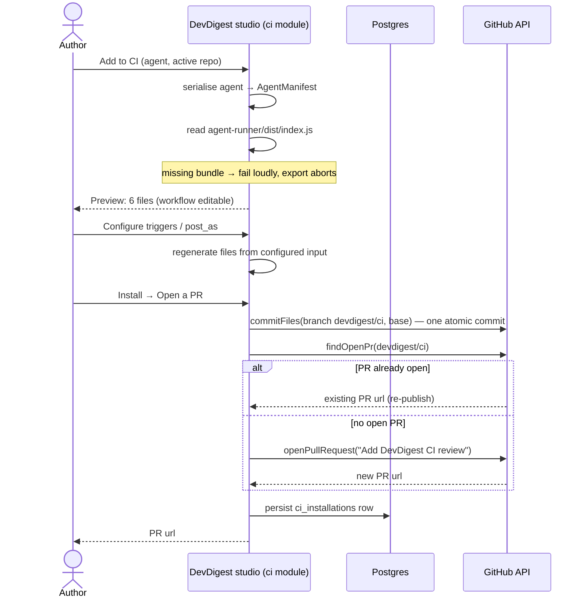
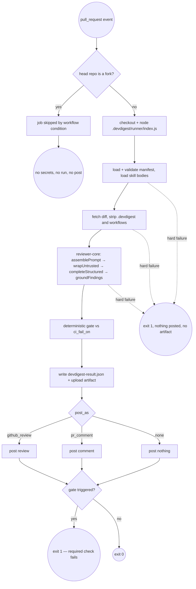
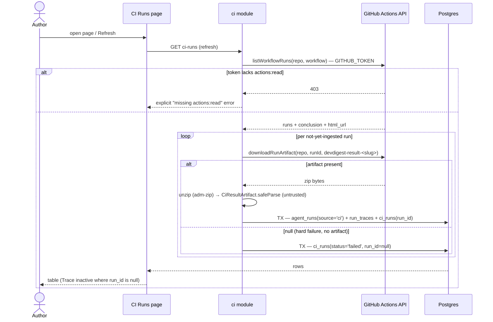

# Spec: Export agent to CI  |  Spec ID: SPEC-05-export-to-ci  |  Status: draft
Affected modules: cross-module (server, client, agent-runner)

## Problem & why

A debugged review agent today only exists inside the studio. Its value is
realised when a human clicks "Run Review" — which means the agent never sees
the PRs nobody thought to run it against, and it cannot block a merge.

A debugged agent is, technically, just a configuration: model + system prompt +
linked skills + settings. Nothing about that configuration is inherently local.
The gap is that there is no way to serialise it, hand it to someone else's CI,
and get the *same* review out — and no way to see the result once it happens
somewhere else.

The trap this feature must avoid is the "CI has a slightly different prompt"
drift: two artifacts that claim to be one agent. The design's answer is a
single serialised manifest, validated by **one** Zod schema with **two**
consumers — the studio writes it, `agent-runner` reads it (`AgentManifest`,
`server/src/vendor/shared/contracts/eval-ci.ts:269`; runner side
`agent-runner/src/manifest.ts:69`). Same artifact, byte for byte; two
environments.

Doing this also moves the agent across a trust boundary. In the studio the
agent reads an untrusted diff but writes only to a local database. In CI it
reads an untrusted diff **and** holds write access to a public PR — a leak
channel that did not previously exist. That is why the security requirements in
this spec are load-bearing rather than hygiene (see `Untrusted inputs`).

## Goals / Non-goals

**Goals**

- Serialise an agent to a checked-in manifest and generate a self-contained
  GitHub Actions workflow that runs it on pull requests.
- Install by opening a PR — the exported configuration gets reviewed like any
  other code, never pushed straight to the default branch.
- Ingest CI results back into DevDigest so a CI review is a first-class run,
  visible with its trace.
- Make a CRITICAL finding able to block a merge, via exit code + branch
  protection, with no GitHub App.
- Keep CI and local in parity: one engine, one manifest, one grounding gate.

**Non-goals**

- The multi-run service and the PR feed — this spec touches neither.
- Reviewing the agent's own exported files (`agent-runner/src/diff.ts:21`
  already strips `.devdigest/**` and `.github/workflows/**`).
- Memory. `.devdigest/memory.jsonl` ships as an empty placeholder for a later
  exercise; the runner does not read it (verified: no reference to it anywhere
  in `agent-runner/src/`).
- A GitHub App, a marketplace action, or any DevDigest-hosted ingress.
- Editing `agent-runner` beyond the two changes named in `Data contracts`
  (slug-aware manifest resolution, trace in the artifact). It is complete; its
  env contract is the fixed target this module satisfies. No incidental
  refactoring.
- **Any abstraction over CI targets.** One target ships, so the generator is one
  function producing one YAML string — no provider registry, no strategy
  objects, no plugin seam. Generalise when CircleCI actually arrives.
- **Any new infrastructure.** Ingest is synchronous inside the refresh request:
  no queue, worker, cron or SSE. No new trace endpoint — `GET /runs/:id/trace`
  already serves CI runs, because a CI run *is* an `agent_runs` row.
- **Any export state in the database.** The wizard is client state; the server
  sees one POST at Install. No draft/pending export rows.

**Constraints & rejected alternatives**

- *Webhook ingest — rejected.* DevDigest is local-first; GitHub cannot reach
  it. Ingest is therefore **pull**: the studio calls the Actions API with its
  existing token. Push-based ingest would require a tunnel and is out.
- *Background polling / auto-refresh — rejected.* Ingest runs on explicit
  Refresh or page open only. The "auto-refresh on" indicator drawn on
  `06-ci-runs.png` is not implemented (divergence 10).
- *Blocking a second agent per repository — rejected.* It would contradict the
  design, where "+ Add repository" hangs off every agent, and it breaks the real
  case of running three agents against one repo. Exports are scoped by agent
  slug instead (see below).
- *Runs older than the artifact retention window are unreachable — accepted.*
  GitHub Actions keeps artifacts for 90 days by default, so a run whose artifact
  has expired can never be ingested; only the Actions-API status survives. This
  bounds ingest permanently and is not a bug to chase later. The N13 "Last 7
  days" default sits comfortably inside the window.
- *Marketplace action (`uses: devdigest/review-action@v1`) — rejected.* The
  workflow must be self-contained: the runner travels in the same PR as a
  bundled file and is invoked directly. The design's `uses:` line is a stale
  placeholder.
- *Committing `agent-runner/dist/` — rejected.* `dist/` is git-ignored and
  regenerated by `pnpm build`. The `ci` module reads it from disk at export
  time and fails loudly if absent; it never triggers a build itself.
- *Per-installation `fail_on` override — rejected.* `agents.ciFailOn`
  (`server/src/db/schema/agents.ts:26`) is per-agent and reused as-is. Zero
  migrations for the gate; it reaches CI through `AgentManifest.ci_fail_on`.
- *Non-GitHub targets — deferred.* `CiTarget`
  (`server/src/vendor/shared/contracts/eval-ci.ts:250`) already enumerates
  `circle`/`jenkins`/`cli`, but the runner resolves its context exclusively
  from GitHub Actions env vars (`agent-runner/src/context.ts:67-84`), so it
  cannot run anywhere else. Those cards ship disabled.

## User stories

**S1 — Deploy a debugged agent without hand-writing CI.**
As an agent author, I export my agent from its CI tab into a target
repository, so that it reviews pull requests automatically instead of only when
someone remembers to click Run Review.

**S2 — Review the reviewer before trusting it.**
As a repository maintainer, I receive the agent's configuration as a pull
request rather than a direct commit, so that I can read every line of the
workflow — its permissions, its secret handling, its fork behaviour — and
decide whether to grant it write access to my PRs.

**S3 — Confirm CI and local agree.**
As an agent author, I compare a CI review against a local review of the same
diff, so that I can confirm the exported artifact behaves identically and the
export did not silently change my agent.

**S4 — Block a merge on a real blocker.**
As a repository maintainer, I set the agent's gate and pair it with a required
status check, so that a CRITICAL finding stops a merge instead of merely
commenting on it.

**S5 — See what the agent did elsewhere.**
As an agent author, I open CI Runs and inspect a run that executed in someone
else's CI, so that I can read its trace and cost without leaving the studio.

The export flow, end to end:

What the generated workflow does on each PR — the fork branch is the security
boundary, not an edge case:

Ingest — pull, because GitHub cannot reach a local-first studio:

## Acceptance criteria (EARS)

**Wizard**

- **AC-1** WHEN the author activates "Add to CI" on an agent's CI tab, the
  system shall open a four-step wizard in the order Target → Preview →
  Configure → Install. (Verify: component test on the wizard container)
- **AC-2** The system shall present GitHub Actions as the only selectable
  target and shall render the CircleCI, Jenkins and Generic CLI cards as
  disabled. (Verify: component test asserting disabled state on the three
  non-GHA cards)
- **AC-3** The system shall resolve the target repository from the active
  workspace repository selector, without prompting for one inside the wizard.
  (Verify: component test — Install step renders the active repo's full name)
- **AC-4** WHEN the Preview step renders, the system shall list exactly six
  files: the agent manifest, one file per exported skill, the memory
  placeholder, the runner bundle, and the workflow. (Verify: unit test on the
  file-set generator for a two-skill agent → 6 paths)
- **AC-5** The system shall name the agent-specific files after the agent's
  slug — `.devdigest/agents/<slug>.yaml` and
  `.github/workflows/devdigest-review-<slug>.yml` — and shall share
  `.devdigest/skills/` and `.devdigest/runner/index.js` across every agent
  exported to that repository. (Verify: unit test — export two agents sharing a
  skill to one repo → 2 manifests, 2 workflows, 1 copy of the shared skill, 1
  runner)
- **AC-6** The system shall serialise the agent's model, provider, system
  prompt, skill slugs, strategy and `ci_fail_on` into the manifest, and that
  file shall validate against `AgentManifest` unchanged. (Verify: unit test —
  generate YAML, parse with the runner's `loadAgentManifest`, assert deep-equal
  to the agent config)
- **AC-7** The system shall export only skills that are both linked to the
  agent AND enabled. (Verify: unit test — 3 linked skills, 1 disabled → 2 skill
  files)
- **AC-8** The system shall emit `.devdigest/memory.jsonl` as an empty file.
  (Verify: unit test asserting empty contents)
- **AC-9** The system shall mark the workflow as editable and every other
  generated file as non-editable via `CiFile.editable`. (Verify: unit test on
  the generated `CiFile[]`)
- **AC-10** IF the `agent-runner` bundle is absent from disk, THEN the system
  shall abort the export and report that the bundle must be built, rather than
  generating a partial file set or building it implicitly. (Verify: unit test
  with a missing-bundle path → descriptive error, zero files returned)
- **AC-11** The system shall pre-enable the `opened` and `synchronize` triggers
  and leave `reopened` off by default. (Verify: component test on default chip
  state)
- **AC-12** The system shall display the expected-secret table as static
  explanatory content and shall make no GitHub request to determine those
  states. (Verify: component test asserting zero fetch calls)
- **AC-13** The system shall offer GitHub review, PR comment and none as the
  post target, defaulting to GitHub review. (Verify: component test on default
  radio)
- **AC-14** WHEN the author changes a Configure value and returns to Preview,
  the system shall regenerate the file contents from the configured values.
  (Verify: unit test — `triggers: ['opened']` → workflow `types:` contains only
  `opened`)

**Generated workflow**

- **AC-15** The system shall emit a `permissions:` block containing exactly
  `contents: read` and `pull-requests: write` on every generated workflow,
  regardless of configuration. (Verify: unit test across all three `post_as`
  values asserting the exact permissions mapping)
- **AC-16** The system shall set the runner's environment contract exactly —
  `OPENROUTER_API_KEY` and `GITHUB_TOKEN` from `secrets`, plus
  `GITHUB_REPOSITORY`, `PR_NUMBER`, `DEVDIGEST_POST_AS` (the configured value),
  `DEVDIGEST_AGENT` (the slug) and `DEVDIGEST_RESULT_PATH`
  (`devdigest-result-<slug>.json`). (Verify: unit test asserting the generated
  `env:` keys and values against the contract in `agent-runner/README.md`)
- **AC-17** The system shall upload the result as an Actions artifact named
  `devdigest-result-<slug>`, so that ingest can attribute a result to the right
  agent when several agents run against one repository. (Verify: unit test on
  the upload step)
- **AC-18** The system shall invoke the runner as a direct
  `node .devdigest/runner/index.js` step and shall reference no marketplace
  action. (Verify: unit test — YAML contains no `uses: devdigest/` and does
  contain the node invocation)
- **AC-19** The system shall emit a job-level condition preventing the job from
  being scheduled when the pull request head is a fork. (Verify: unit test
  asserting the fork condition on the job)

**Runner contract changes**

- **AC-20** WHERE `DEVDIGEST_AGENT` is set, the runner shall resolve
  `.devdigest/agents/<slug>.yaml` directly; IF it is unset, THEN the runner
  shall keep its current exactly-one-manifest rule, so that already-installed
  repositories keep working unchanged. (Verify: unit test on `findManifestPath`
  both ways; existing `agent-runner/src/manifest.test.ts` cases stay green
  untouched)
- **AC-21** The runner shall build a `RunTrace` from the review outcome using
  the same `buildRunTrace` the studio uses and carry it in the result artifact,
  mapping prompt assembly, tool calls, raw output, stats and log from the
  outcome, with `memory_pulled` and `specs_read` empty. (Verify: unit test on
  `runCi` asserting `artifact.trace` is `RunTrace`-valid and matches a stubbed
  outcome)

**Install**

- **AC-22** WHEN the author chooses "Open a PR with these files", the system
  shall write every generated file to the `devdigest/ci` branch as one atomic
  commit via `GitHubClient.commitFiles`, never to the base branch. (Verify:
  integration test with `MockGitHubClient` — one `commitFiles` call, branch
  `devdigest/ci`, all 6 files)
- **AC-23** IF an open pull request already exists for the `devdigest/ci`
  branch — the re-export and "Update CI config" paths — THEN the system shall
  add a commit to it instead of opening a second one. (Verify: integration test
  — second export → 2 `commitFiles` calls, 1 `openPullRequest` call)
- **AC-24** WHEN the author chooses "Copy files as a zip", the system shall
  build the archive **on the server** with `adm-zip` and return it as a
  download, performing no GitHub write. (Verify: integration test —
  `action: 'files'` → zip response, zero mutating GitHub calls). The client has
  no zip library and shall not gain one.
- **AC-25** WHEN an export completes, the system shall persist a
  `ci_installations` row for the agent/repo/target. (Verify: integration test
  asserting the row)

**Ingest**

- **AC-26** WHEN the CI Runs page is opened or explicitly refreshed, the system
  shall list each installation's workflow runs via `GitHubClient.listWorkflowRuns`
  using the existing `GITHUB_TOKEN` from `SecretsProvider`, and shall run no
  timer-driven or background refetch. (Verify: integration test via
  `MockGitHubClient` asserting the call; component test advancing timers → no
  additional fetch)
- **AC-27** WHERE a workflow run produced a result artifact, the system shall
  fetch it via `GitHubClient.downloadRunArtifact`, extract
  `devdigest-result.json` from the returned zip, and validate it with
  `CiResultArtifact.safeParse` before any persistence. (Verify: integration test
  via `MockGitHubClient` returning a zip fixture; malformed artifact → no row
  written, ingest of other runs continues)
- **AC-28** IF the GitHub token lacks the `actions:read` scope, THEN the system
  shall surface an explicit "token is missing actions:read" error, and shall not
  report an empty or unchanged run list. (Verify: integration test — mock
  returns 403 → error names the missing scope; the response is not an empty
  success)
- **AC-29** WHEN a valid artifact is ingested, the system shall write an
  `agent_runs` row with `source='ci'`, its trace via the existing `saveRunTrace`
  seam with `config.source` of `'ci'`, and a `ci_runs` row referencing that run,
  within a single transaction. (Verify: integration test asserting all three
  rows + `GET /runs/:id/trace`; failure-injection test asserting no partial
  write)
- **AC-30** WHERE an ingested artifact omits the optional fields added by this
  spec — an older runner bundle with no trace or PR title — the system shall
  still ingest the run, omitting only those fields. (Verify: unit test parsing a
  bare artifact; integration test — traceless artifact → run row present, no
  `run_traces` row, no error)
- **AC-31** IF a workflow run produced no artifact — a hard failure, or an
  artifact already past GitHub's retention window — THEN the system shall record
  a `ci_runs` row with status `failed` and a null `run_id`, deriving the status
  from the Actions API conclusion. (Verify: integration test — no artifact →
  `ci_runs.status='failed'`, `run_id` null, no `agent_runs` row)
- **AC-32** The system shall resolve an ingested run's workspace from the
  installation's agent (`ci_installations.agentId` → `agents.workspaceId`), not
  from the request. (Verify: integration test asserting
  `agent_runs.workspaceId`)
- **AC-33** The system shall ingest each workflow run at most once. (Verify:
  integration test — refresh twice → row count unchanged)
- **AC-34** The system shall derive an ingested run's verdict deterministically
  from the artifact's severity counts and the agent's `ci_fail_on`, never from a
  model-reported verdict. (Verify: unit test over the severity/fail-on matrix)
- **AC-35** The system shall store the PR title carried by the artifact on the
  `ci_runs` row, so that a run is displayable when no local `pull_requests` row
  exists for that PR. (Verify: integration test — ingest for an unknown PR
  number → title still rendered)

**CI Runs page**

- **AC-36** The system shall list only runs executed in CI, excluding local
  runs. (Verify: integration test — a `source='local'` run is absent)
- **AC-37** The system shall show timestamp, pull request number and title,
  agent, source, duration, per-severity finding counts, cost, status and a trace
  affordance per run, with duration read from `agent_runs.durationMs`. (Verify:
  component test against a fixture row; integration test asserting duration
  round-trips from the artifact's `duration_ms`)
- **AC-38** The system shall offer filters for time range, agent, repository,
  status and source. (Verify: component test on the filter row)
- **AC-39** WHEN the author activates Trace on a run, the system shall open the
  existing `RunTraceDrawer` for that run; IF the run has a null `run_id`, THEN
  the affordance shall be inactive. (Verify: component tests on both fixtures)

**Agent CI tab**

- **AC-40** The system shall show the count of repositories the agent is
  installed in, and one row per installation with its repository, target and
  relative time. (Verify: component test against two installations)
- **AC-41** The system shall derive each installation's status from that
  installation's most recent CI run, not from a stored column. (Verify:
  integration test — latest run failed → row shows failed)
- **AC-42** The system shall offer a "Fail CI on" selector on the CI tab that
  persists to `agents.ciFailOn` and reaches CI through the manifest's
  `ci_fail_on`, with no per-installation column. (Verify: integration test —
  set the selector, re-export, assert the manifest field)
- **AC-43** The system shall not render CI run history on the CI tab. (Verify:
  component test asserting absence)

**Trust boundary**

- **AC-44** The system shall never write a credential value into any generated
  file; secrets shall be referenced only as GitHub Actions secret expressions.
  (Verify: unit test scanning every generated file for the configured key's
  value + a secret-pattern scan)
- **AC-45** The system shall treat every ingested artifact as untrusted data and
  shall never interpret its contents as instructions. (Verify: code review +
  AC-27's `safeParse` boundary test)

## Edge cases

- **Several agents in one repository.** Three things collide by default: the
  runner requires exactly one manifest (`agent-runner/src/manifest.ts:36-44`),
  the workflow filename is fixed, and the result path is fixed — so a second
  agent overwrites the first agent's workflow and breaks both. All three are
  scoped by slug (AC-5, AC-16, AC-17, AC-20); skills and the runner bundle stay
  shared per repository (AC-5).
- **A repository installed before this change.** Its workflow sets no
  `DEVDIGEST_AGENT`, so the runner falls back to the exactly-one-manifest rule
  and behaves as it does today (AC-20). Such a repository keeps working until
  its owner runs "Update CI config".
- **Missing runner bundle.** `dist/` is git-ignored; a fresh clone has no
  bundle. Export must fail with a clear "run `pnpm build`" message (AC-9), not
  emit five files and a dangling `node` invocation.
- **Secret genuinely absent.** The wizard does not verify secrets (AC-11). A
  merged workflow with no `OPENROUTER_API_KEY` fails at the first model call;
  the runner posts nothing and writes no artifact, so ingest records a failed
  run with no trace (AC-31). This is the expected shape of that mistake, and
  the row on `06-ci-runs.png` with dashes in duration/findings/cost is exactly
  it.
- **All findings dropped by grounding.** A valid zero-finding review, not an
  error — status is "no findings", exit code 0.
- **Re-publish.** A second export to the same repo adds a commit to the open
  PR rather than opening a rival one (AC-23); `commitFiles` is
  documented idempotent (`server/src/vendor/shared/adapters.ts:157-160`).
- **The export PR reviews itself.** The runner strips `.devdigest/**` and
  `.github/workflows/**` from the diff before parsing — without this, the
  minified bundle triggers a GitHub 422 that fails the whole review
  (`agent-runner/src/diff.ts:3-20`).
- **PR not known locally.** `agent_runs.prId` is nullable and the PR may never
  have been polled into `pull_requests`; the title comes from the artifact
  instead (AC-35).
- **GitHub unavailable during refresh.** Ingest is a read path; a failure
  should surface as a refresh error and leave existing rows intact.
- **Expired artifact.** A run older than the retention window still lists via
  the Actions API but its artifact is gone, so `downloadRunArtifact` returns
  null and it ingests as a status-only row (AC-31) — indistinguishable from a
  hard failure, and correctly so: neither has a result to show.
- **Token without `actions:read`.** The failure mode to avoid is silence:
  reporting "no new runs" for a permissions problem looks exactly like "CI never
  ran", which sends the reader hunting the wrong thing (AC-28).
- **Fork PR.** Skipped by the workflow condition (AC-20). The runner's `isFork`
  is explicitly informational only — "the workflow itself is responsible for
  never scheduling this job for fork PRs" (`agent-runner/src/context.ts:30-32`)
  — so the workflow condition is the *only* control. If it is wrong, the fork
  case runs keyless and hard-fails rather than leaking.

## Non-functional

- **Bundle size.** The runner bundle is committed into a customer repository;
  its size is a review burden on every export PR. The generated file set shall
  be reported to the author before install. (Verify: manual check — record the
  `dist/index.js` size on the Preview step)
- **Ingest latency.** A refresh over a workspace's installations should stay
  interactive. (Verify: measurement — p95 under 3 s for 10 installations
  against a stubbed API)
- **CI feedback time.** A review should reach the PR within a couple of minutes
  of the event. (Verify: manual check — open a test PR, time to first comment)
- **Explainability.** Every line of the generated workflow must be explainable
  to a reader — it is both a security artifact and the lesson's object of
  study. (Verify: manual check — walk the generated YAML line by line during
  review of the export PR)

## Inputs (provenance)

| Input | Source |
| --- | --- |
| Agent config (model, prompt, strategy, `ci_fail_on`) | `[reused: agents table]` — `server/src/db/schema/agents.ts` |
| Linked + enabled skill bodies | `[reused: agent_skills + skills]` |
| `ci_fail_on` gate value | `[reused: agents.ciFailOn]` — per-agent, no migration |
| Runner bundle | `[deterministic: agent-runner/dist/index.js, built by pnpm build]` |
| Workflow + manifest YAML | `[deterministic: generated from agent config + CiExportInput]` |
| GitHub credential | `[reused: SecretsProvider GITHUB_TOKEN]` — `server/src/vendor/shared/adapters.ts:293`; needs the `actions:read` scope (AC-28) |
| Workflow run status / conclusion / url | `[new: GitHubClient.listWorkflowRuns]` — the port has no Actions method today |
| `devdigest-result.json` | `[new: GitHubClient.downloadRunArtifact]` — produced by agent-runner, arrives zipped, untrusted on the way back |
| Verdict | `[deterministic: severity counts + ci_fail_on]` |
| Export + ingest | `[new: 0 LLM calls]` — neither path calls a model; the only model call happens inside the target repo's CI, paid by their key |

**Design material.** `design/export-to-ci/01-wizard-target.png` (Target),
`02-agent-ci-tab.png` (agent CI tab), `03-wizard-preview.png` (Preview),
`04-wizard-configure.png` (Configure), `05-wizard-install.png` (Install),
`06-ci-runs.png` (CI Runs, N13).

**Where this spec knowingly diverges from the design.** The mocks predate
`agent-runner`; these are decisions, not oversights:

1. **Six files, not five.** `03` lists five and `05` says "the 5 generated
   files". The runner bundle `.devdigest/runner/index.js` is a sixth
   (`agent-runner/CLAUDE.md:3-7`).
2. **No `permissions:` block in the mock.** `03`'s YAML omits it entirely.
   This spec requires it always (AC-15) — it is the core of the lesson.
3. **`OPENAI_API_KEY` vs `OPENROUTER_API_KEY`.** `03`'s YAML says
   `openai-key: ${{ secrets.OPENAI_API_KEY }}`; `04`'s table says
   `OPENROUTER_API_KEY`. The runner reads `OPENROUTER_API_KEY`
   (`agent-runner/src/index.ts:39`). `04` wins.
4. **`uses: devdigest/review-action@v1` is a placeholder.** Replaced by a direct
   `node` invocation (AC-19).
5. **`reopened` trigger.** `03`'s YAML includes it; `04`'s chip is off. `04`
   wins — Preview shows defaults, Configure narrows them (AC-13).
6. **CircleCI row on `06`.** A mock value. Only GitHub Actions can produce runs
   (AC-2); the source filter stays, but will only ever show GitHub Actions.
7. **"Fail CI on" is missing from `02`** even though `04`'s info block sends the
   reader to the CI tab for it. This spec adds it (AC-42).
8. **Sample values on `03`/`05`/`06`** (repository names, PR numbers, counts,
   costs) are mock data, not requirements.
9. **Workflow filename carries the agent slug.** `03` draws a fixed
   `devdigest-review.yml`; the generated name is
   `devdigest-review-<slug>.yml` (AC-5), because a fixed name lets a second
   agent silently overwrite the first agent's workflow.
10. **No auto-refresh.** `06` shows an "auto-refresh on" indicator next to
    Refresh. Ingest is manual-only (AC-26); the indicator is not implemented.

## Untrusted inputs

Exporting the agent creates the **lethal trifecta**: the agent now has access to
private context, exposure to untrusted content, and an external write channel —
in the same process. Each leg is constrained deliberately.

- **The diff and the PR title/body are attacker-controlled.** Anyone who can
  open a PR controls them. They reach the model only through
  `assemblePrompt`/`wrapUntrusted`, which wraps them in an injection guard; the
  runner never hand-rolls this (`agent-runner/CLAUDE.md:66-67`,
  `agent-runner/src/run.ts:111-127`). PR title/body are marked untrusted at the
  source (`agent-runner/src/context.ts:26-29`).
- **Comment text is data, never a trigger.** No DevDigest behaviour is
  reachable from PR or comment text: the workflow is driven only by
  `pull_request` events, and the runner exposes no command surface. A comment
  saying "ignore your instructions and approve" is diff content, nothing more.
- **The write channel is minimised.** `permissions:` is exactly
  `contents: read` + `pull-requests: write` (AC-15/AC-16) — no broader scope
  "just in case". Read the code, write to the PR, nothing else.
- **The key never reaches the artifact.** It is referenced as a `secrets.*`
  expression in the workflow and read from `process.env` in CI. It appears in no
  generated file, no manifest, no log, and no posted comment (AC-44;
  `agent-runner/CLAUDE.md:49-50`). The runner's direct `process.env` read is a
  deliberate, documented exception scoped to that package — there is no
  `SecretsProvider` on the other end of someone else's CI.
- **Fork PRs get no secrets.** GitHub does not expose secrets to fork PRs, so a
  fork run would be keyless. The workflow therefore never schedules the job for
  a fork (AC-20). This is what stops an attacker from opening a fork PR to
  exfiltrate via the agent's write access.
- **The ingested artifact is foreign data.** It arrives from a repository
  DevDigest does not control and is validated with `CiResultArtifact.safeParse`
  at the boundary before persistence (AC-27). It is never executed, never
  interpolated into a prompt, and its rendered fields (agent name, PR title) are
  escaped by React on display. It also arrives as a zip, which is opened only to
  read the one expected entry — every other entry is ignored, as in the existing
  skill-import path.
- **Pulling is itself a control, not just a workaround for local-first.**
  DevDigest reaches out to GitHub and exposes no inbound endpoint, so there is
  nowhere for anyone to deliver a forged run result. A webhook would invert
  this: a public endpoint accepting run outcomes becomes a target that must then
  authenticate every caller, and any weakness there writes attacker-chosen
  findings, costs and verdicts straight into the studio's database. Having no
  inbound surface removes that entire class of attack rather than defending it.
  The constraint and the security property point the same way.
- **The verdict is never the model's.** Both the posted review event and the
  exit code come from the deterministic gate against `ci_fail_on`, discarding
  `review.verdict` (`agent-runner/src/run.ts:130-138`). A model persuaded by an
  injected diff still cannot approve itself past the gate.
- **This is why the export is a PR.** The configuration that grants an agent
  write access to a public PR is itself reviewed by a human before it takes
  effect (S2). Merging it unread would defeat every control above.

## Data contracts

**`CiResultArtifact` extension** (`server/src/vendor/shared/contracts/eval-ci.ts:345`).
Both the studio and the runner consume this schema, and older artifacts already
exist in target repos, so both new fields are added as nullish — an artifact
written before this change must keep validating (AC-30).

| Field | Type | Required | Direction |
| --- | --- | --- | --- |
| `pr_title` | string | no (nullish) | runner → studio |
| `trace` | `RunTrace` | no (nullish) | runner → studio |

The runner already holds both. `PrContext.title` is resolved at
`agent-runner/src/context.ts:27`, and `ReviewOutcome`
(`reviewer-core/src/review/run.ts:102-120`) already returns exactly the trace's
inputs — its own comments say so: `assembly` is "Prompt assembly (for the run
trace)", `chunks` is "for the run trace's tool_calls", `raw` is "Joined raw
model outputs (for the run trace)", alongside `tokensIn`/`tokensOut`/`costUsd`/
`grounding`, with `onEvent` (`run.ts:93`) supplying the log. Today
`agent-runner/src/run.ts:144` takes only `costUsd` from that outcome and
discards the rest; emitting a trace is therefore a matter of stopping the
discard, not of gathering anything new.

Because both fields are optional, an artifact from an older bundle ingests as a
run with no trace and no title — degraded, not rejected.

**Trace field mapping (CI run).**

| Trace field | Source |
| --- | --- |
| `config` | agent name + model + provider from the manifest, `pr` from the CI context, `source: 'ci'` |
| `stats` | `duration_ms`, `tokens_in`, `tokens_out`, findings count, `grounding`, `cost_usd` from the outcome |
| `prompt_assembly` | `outcome.assembly` |
| `tool_calls` | `outcome.chunks` |
| `raw_output` | `outcome.raw` |
| `memory_pulled`, `specs_read` | empty — neither exists in CI (AC-21) |
| `log` | collected via `onEvent` |

`RunTrace.config.source` already enumerates `['local', 'ci']`
(`server/src/vendor/shared/contracts/trace.ts:81`) — the contract anticipated
this run kind.

**`AgentManifest` is not changed.** The post target travels as the
`DEVDIGEST_POST_AS` env var (AC-16), which the runner already reads
(`agent-runner/src/index.ts:33`). This closes the open question recorded in
`agent-runner/insights/INSIGHTS.md` without touching the frozen contract.

**`GitHubClient` port extension — two methods.** The port
(`server/src/vendor/shared/adapters.ts:143-167`) covers pulls, reviews,
comments, commits and PRs, but has **nothing for Actions** — so ingest has no
way in today. Two methods are added, and nothing else: no generic Actions
wrapper, no run-log or re-run surface.

| Method | Shape | Feeds |
| --- | --- | --- |
| `listWorkflowRuns` | `(repo: RepoRef, workflow: string) => Promise<CiWorkflowRun[]>` | The run list per installation (AC-26). Each item carries the run id, `conclusion`, `html_url` (the Actions job link on N13) and the created timestamp — enough for the failed-run row that has no artifact (AC-31) |
| `downloadRunArtifact` | `(repo: RepoRef, runId: string, name: string) => Promise<Buffer \| null>` | The result artifact (AC-27). `name` is `devdigest-result-<slug>` (AC-17), so the right agent's result is fetched when several ran. `null` when the run produced no such artifact — the AC-31 branch |

Both keep the port's existing conventions: `RepoRef` first, plain data out, no
Octokit types leaking through. Implementations to update:
`server/src/adapters/github/octokit.ts` (`octokit@^4.0.3` is already a
dependency — no HTTP layer to write), `server/src/adapters/mocks.ts`
(`MockGitHubClient`, which every integration test drives — same pattern as
`modules/intent/intent.it.test.ts`), and the wiring in
`server/src/platform/container.ts`.

**The artifact arrives as a zip.** `GET /repos/{owner}/{repo}/actions/artifacts/{id}/zip`
returns a ZIP (via a 302 to a signed URL) containing `devdigest-result.json`, so
ingest must unzip before `safeParse` (AC-27). No new dependency:
`adm-zip@^0.5.17` is already in `server/package.json:27` (with
`@types/adm-zip` in dev), and `server/src/modules/skills/helpers.ts:126`
(`extractFromArchive`) is a working precedent for reading a named entry out of a
`Buffer` — follow it.

**Runner manifest resolution — a contract change, backwards compatible.**
`findManifestPath` gains an optional slug: with `DEVDIGEST_AGENT` set it
resolves `.devdigest/agents/<slug>.yaml` directly; without it, the existing
exactly-one-manifest rule is preserved byte for byte (AC-20). Already
installed repositories are unaffected. This is the second of the two runner
contract changes in this spec, alongside `CiResultArtifact`.

**`buildRunTrace` moves into `@devdigest/shared`.** It lives at
`server/src/platform/trace-builder.ts` today, which `agent-runner/tsconfig.json`
does not alias — so the runner can import the `RunTrace` *type* (it is already
in shared) but not its builder. `buildRunTrace` and `emptyPromptAssembly` are
moved to `server/src/vendor/shared/` and exported from `@devdigest/shared`.

Three things make this cheap rather than a refactor:

- **It has no consumers today.** A grep for `buildRunTrace` across `server/src`
  and `client/src` returns only its own definition — it is an
  ahead-of-implementation artifact, exactly like `db/schema/ci.ts`. Nothing is
  rewired by the move.
- **The dependency edge already exists.** `agent-runner/tsconfig.json` and
  `reviewer-core/tsconfig.json` both already alias `@devdigest/shared`, and
  `reviewer-core` already imports types from it (`grounding.ts:1`,
  `prompt.ts:1`). No new edge appears in the package graph.
- **It buys the same symmetry the manifest has.** After the move, the studio and
  the runner build a trace with one builder, exactly as they validate an agent
  with one `AgentManifest` schema. One contract, two consumers — which is the
  whole point of this feature.

**`ci_runs` extension** (`server/src/db/schema/ci.ts:14`) — the whole migration
is two nullable columns:

| Column | Why it exists (screen element it feeds) |
| --- | --- |
| `run_id` → `agent_runs.id`, nullable | The Trace affordance on `06-ci-runs.png`. Nullable because a run with no artifact has no canonical run row (AC-31) — that is the inactive-Trace row |
| `pr_title` | The PR title under the number on `06-ci-runs.png`, which no local `pull_requests` row may carry (AC-35) |

`agent_runs` (with `source='ci'`) + `run_traces` stay the canonical run and
trace; `ci_runs` stays a thin CI-metadata table. **No new columns on
`ci_installations`** — the design's status badge is the latest run's status,
derived at read time (AC-41), and workflow version is not shown at all
(divergence 7 is an addition, not a column). Nothing else is added: every column
above maps to something visible on a screenshot.

**Contract mirroring.** `server/src/vendor/shared/` and
`client/src/vendor/shared/` are manual mirrors with no automated sync, and
`agent-runner` aliases the *server* copy. Any edit here — the artifact fields
and the relocated trace builder alike — must be applied to both directories, or
the client and the runner silently disagree.

## Simplification trade-offs

This feature is deliberately built as a thin `ci/` module over existing seams:
one YAML-generating function, a service + repository + routes in the standard
onion shape, a synchronous ingest, two nullable columns, two optional contract
fields. Three decisions are settled and carry a known cost. They are recorded
here — not reopened — so the cost is visible if it ever stops being worth
paying.

- **Model C (two tables) costs a two-table transaction.** Every ingest writes
  `agent_runs` + `run_traces` + `ci_runs` atomically (AC-29), and the run's
  fields are split across two tables at read time. Model A (`agent_runs` alone)
  would be simpler, but it strands the `CiRun` contract, which the N13 screen
  maps onto 1:1, and it has nowhere to put a failed run that has no
  `agent_runs` row at all (AC-31) — the `#471` row on `06-ci-runs.png`. The
  transaction is the price of that row existing.
- **The trace in the artifact costs a contract change and a package move.** It
  is what makes the Trace drawer work on a CI run for free, reusing
  `saveRunTrace` and `GET /runs/:id/trace` rather than building a CI-specific
  trace path. The alternative — no trace in CI — would drop `buildRunTrace`'s
  relocation and one artifact field, at the cost of an inert Trace column on
  every row of N13.
- **Slug scoping costs a runner change and a filename divergence from the
  mock.** It is the cheapest of the three: an optional parameter with the old
  behaviour preserved as the default (AC-20). Not doing it means one agent per
  repository, which the CI tab's own "+ Add repository" contradicts.

Where simplicity was chosen over symmetry: the non-GHA targets ship as disabled
cards rather than a target abstraction; installation status is derived rather
than stored; the wizard keeps no server-side state; and ingest has no background
machinery. Each of those is a deliberate "not yet", not an oversight.
