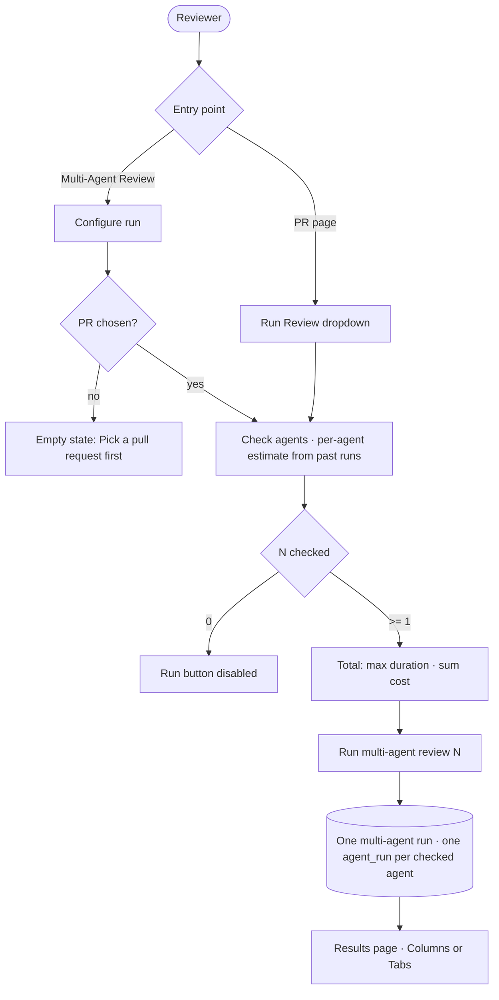
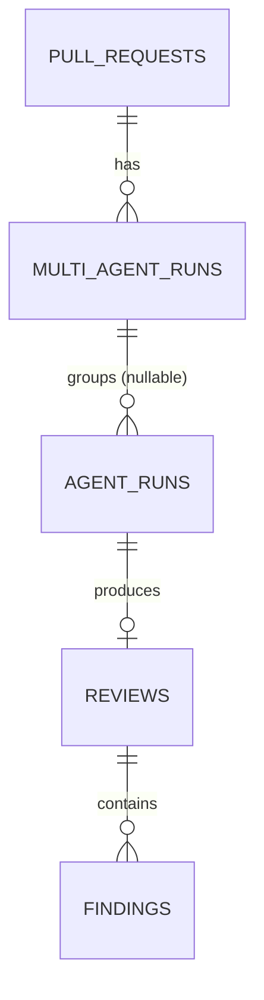
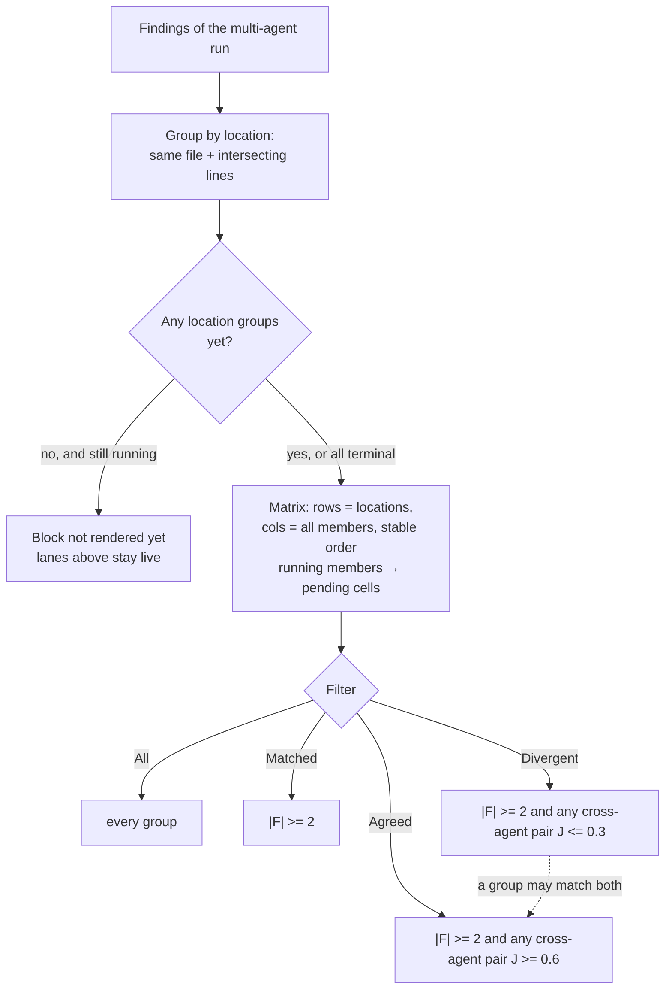
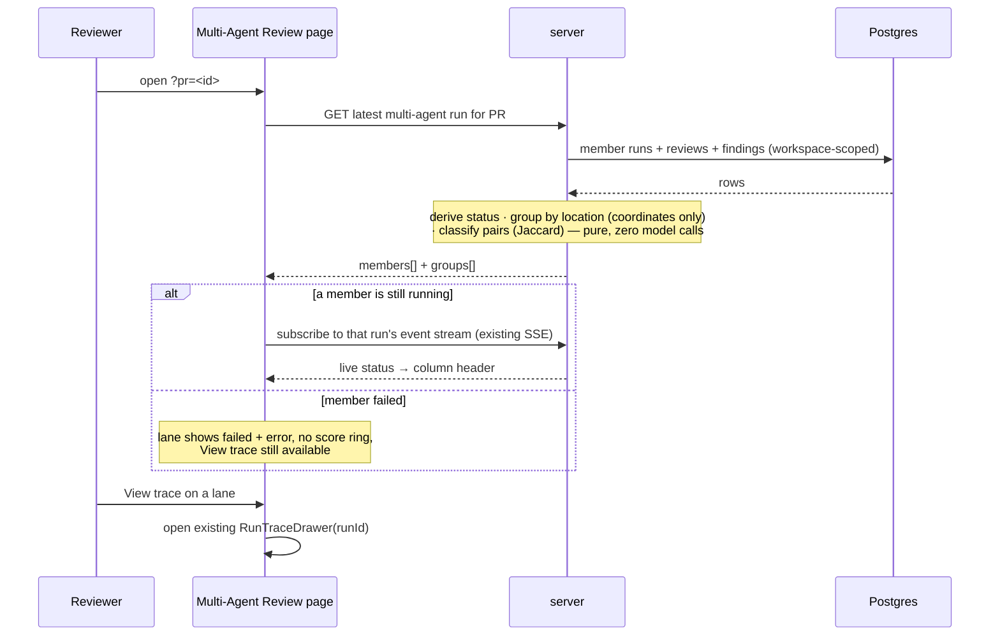

# Spec: Multi-Agent Review  |  Spec ID: SPEC-05-multi-agent-review  |  Status: draft
Affected modules: cross-module (server, client)

## Problem & why

Running several reviewer agents on one pull request is already possible — `POST
/pulls/:id/review` with `{all:true}` fans out to every enabled agent, each in its
own context, and the run-executor persists one `agent_runs` row per agent. What
is missing is everything around it:

- **No way to pick a set.** `RunReviewDropdown` offers "one agent" or "all
  enabled agents" and nothing between. Reviewing with exactly Security +
  Performance is not expressible.
- **No way to know the price before paying it.** Cost and duration are only
  visible *after* a run. There is no pre-run estimate anywhere in the product.
- **The runs are not a thing.** `multi_agent_runs` is a stub table: nothing
  writes it, nothing reads it, and `agent_runs` has no link back to it. Four
  agents launched by one click are four unrelated rows that later code can only
  re-associate by guessing at timestamps (the 60-second session window already
  used in `modules/_shared/session-window.ts` — a heuristic, not a fact).
- **The output is unreadable at N > 1.** Four agents produce four flat finding
  lists. The same bug reported by three agents looks like three bugs; an
  agent staying silent where another flagged a blocker is invisible. The reader
  cannot tell duplication from disagreement, which is the entire reason to run
  more than one agent.

## Goals / Non-goals

**Goals**

- Pick an explicit set of agents to run on a PR, from the PR page and from a
  dedicated Configure-run page, with a per-agent and total time/cost estimate
  before the run starts.
- Bind the resulting `agent_runs` to one multi-agent run, so "these four runs
  are one review" is a recorded fact rather than a timestamp heuristic.
- Read the result as one page in two modes — a column per agent (live lanes) and
  a tab per agent (finding detail) — each linking to the existing Run Trace.
- Group findings from different agents that describe the same code location, and
  show where the agents disagree, including which agents stayed silent.

**Non-goals**

- **Multi-run history.** Only the latest multi-agent run per PR is readable. No
  list, no comparison, no navigation to older multi-runs.
- **Per-Agent Stats / Agent Performance.** Per-finding agent attribution is kept
  in the data as raw material; no aggregate screen is built here.
- **The `ci/` and `agent-runner/` engine.** Untouched.
- **Compose Review drawer.** A different feature (curating findings before
  publishing); out of scope and not modified.
- **Changing how runs execute.** Parallel fan-out, per-agent contexts, the SSE
  bus with its replay buffer, `RunTraceDrawer`, and `LiveLogStream` are reused
  exactly as they are.
- **`Learn` and `Reply to author`** (mock 05). No backend exists; they are not
  rendered at all — not disabled, not "coming soon".
- **Rationale text under "did not flag"** (mocks 04/05, e.g. "Not a security
  concern."). No agent produces such a sentence and no field holds one. Only the
  words "did not flag" render; no space and no nullable field are reserved.
- **Surfacing severity disagreement between agents.** Two agents flagging one
  location at different severities is a real signal the data fully supports, and
  it is deliberately not surfaced: it is not a filter state and not a badge. The
  earlier "conflict = someone flagged and someone stayed silent, OR severities
  differ" predicate is gone; divergence is measured on titles (AC-41), and
  severity only ever appears as a cell's own value.
- **Grounding-gate-dropped findings.** `groundFindings`
  (`reviewer-core/src/grounding.ts:20`) returns `dropped: { finding, reason }[]`
  — findings the citation gate removed. They never reach the `findings` table and
  live only inside the `run_traces.trace` document, so "this agent *did* flag
  here but its citation was rejected" is arguably the most informative cell state
  we could show. It is deliberately deferred, not overlooked: surfacing it means
  reading and shaping trace jsonb per member, which is more machinery than this
  block needs today. Such an agent reads "did not flag".
- **Promoting the grouping rule into `reviewer-core`** or generalising it beyond
  what this page needs.

**Constraints & rejected alternatives** — simplicity is a requirement here, not a
preference; where two readings of a decision were defensible, the simpler one is
specified:

- **Extend, don't add.** The run trigger stays `POST /pulls/:id/review` with an
  added agent-set field. A separate "start multi-agent run" route was rejected —
  it would duplicate target resolution and fan-out for no behavioural gain.
- **Two new read endpoints, maximum**: the latest multi-run for a PR, and the
  per-agent estimates. Rejected: folding estimates into the existing `GET
  /agents` response — it would put a median query behind every agents-list fetch
  and change a contract consumed across the client (`server/INSIGHTS.md`: adding
  a field to a vendored contract breaks literal fixtures in both vendor copies,
  and the client's own copy is not auto-synced).
- **Groups are computed on read, never stored.** No groups table, no group ids,
  no write path. Rejected: persisting groups — it buys nothing while there is no
  history (see Non-goals) and adds a migration plus an invalidation problem.
- **Title similarity classifies, it does not group.** An earlier draft put a
  Jaccard threshold into the grouping rule itself. That is rejected because it
  makes the Divergent filter (AC-41) empty *by construction*: if low-similarity
  findings are split into different groups, no group can ever contain a
  low-similarity pair. Grouping is therefore coordinates only, and similarity is
  computed **within** a group. **Accepted consequence:** the mock's two separate
  groups at `src/middleware/ratelimit.ts:52` ("Retry-After header omitted on 429"
  and the machine-readable-code finding drawn as "429 response shape") are **one
  group** under this rule. The group labelled "429 response shape" does not
  exist — that is correct behaviour, not a regression to fix.
- **`multi_agent_runs` keeps its current stub columns** (`id`, `workspace_id`,
  `pr_id`, `ran_at`). The multi-run's status is derived from its `agent_runs`
  rows on read. Rejected: a `status` column — it would need transactional
  upkeep from the executor to stay honest, and is recomputable for free.
- **The shared pre-work step keeps its current all-or-nothing behaviour.**
  `ReviewRunExecutor.executeRuns` loads the diff and intent once for all queued
  runs and, on failure, fails every one of them (`failAll`). This spec
  deliberately does **not** introduce per-agent isolation of pre-work; it
  specifies the existing behaviour as observable (AC-22) so a later reader does
  not "fix" it into scope. Per-agent failure isolation applies to the agent's own
  review call, which already works.
- **Zero model calls** anywhere in this feature. The estimate is arithmetic over
  past runs; the grouping is a deterministic pure function.

## User stories

**S1 — Run a chosen set without leaving the PR.** As a reviewer, I tick the two
agents I want in the Run Review dropdown and start them in one click, so that I
review with the agents that fit this PR instead of one agent or all of them.

**S2 — Know the cost before spending it.** As a reviewer, I see each agent's
typical time and cost from its past runs and a total for my selection before I
start, so that I decide whether the set is worth running.

**S3 — Watch the lanes.** As a reviewer, I watch each selected agent's status,
duration, and cost in its own column while the run is in flight, so that I can
open the trace of a lane that is slow or failing without waiting for the rest.

**S4 — Read one agent in depth.** As a reviewer, I open an agent's tab and expand
a finding to its confidence and suggested fix, so that I can accept it, dismiss
it, or turn it into an eval case from where I am reading it.

**S5 — See what every agent said about one line.** As a reviewer, I read all
agents' findings as a matrix of code locations by agent, each cell holding that
agent's verdict or its silence, so that I can tell a duplicate from a real
disagreement and decide which agent to believe.

**S6 — Narrow to the interesting locations.** As a reviewer, I filter the matrix
to locations several agents flagged, and further to the ones where they said
notably different or notably similar things, so that I spend my attention on
genuine divergence rather than on unanimous noise.

The picking flow of S1/S2, from either entry point:

## Acceptance criteria (EARS)

### Picking agents

- **AC-1** — WHEN the user opens the Run Review dropdown on a PR page, the system
  shall render one checkbox per workspace agent, each with the agent's name and
  its time hint, plus a "Clear" action and a "Configure agents…" footer link.
  (Verify: RTL test on the picker component)
- **AC-2** — The system shall label the dropdown's primary button "Run
  multi-agent review (N)", where N is the number of checked agents, and shall
  disable that button WHILE N is 0. (Verify: RTL test)
- **AC-3** — WHEN the user activates "Clear", the system shall uncheck every
  agent in the picker. (Verify: RTL test)
- **AC-4** — The system shall not present a "run all" or single-agent action in
  the picker; running exactly one agent is expressed by checking exactly one
  checkbox. (Verify: RTL test asserting no such control renders)
- **AC-5** — WHEN the user starts a run with N ≥ 1 checked agents, the system
  shall create one multi-agent run and start exactly N agent runs bound to it,
  including when N is 1. (Verify: integration test via `fastify.inject`)
- **AC-5b** — WHEN a multi-agent run is successfully started from **either**
  entry point — the PR page's Run Review dropdown or the Configure-run page —
  the system shall navigate to the results page for that pull request
  (`/multi-agent-review/results?pr=<id>`). IF the run fails to start, THEN the
  system shall remain on the originating page so the error surfaces there.
  (Verify: RTL test per entry point asserting the router push target)

  > Added 2026-07-17. This was always in the flow diagram above — both entry
  > points converge on `K → L → M[Results page]` — but no AC encoded it, so it
  > was never built (the PR page switched to its findings tab and stayed put)
  > and nothing caught it: `plan-verifier` traces ACs, not diagrams. AC-5 is a
  > **server** AC (`Verify: fastify.inject`); its silence about navigation was
  > not a decision. Do not re-derive "no redirect" from that silence again.
- **AC-6** — The system shall continue to accept the existing `{agentId}` and
  `{all:true}` request bodies on `POST /pulls/:id/review` with unchanged
  behaviour, and runs started that way shall not be bound to a multi-agent run.
  (Verify: integration test asserting both legacy bodies still succeed and leave
  the binding empty)

### Configure run

- **AC-7** — WHILE no pull request is selected on the Configure-run page, the
  system shall show the "Pick a pull request first" empty state and no agent
  list. (Verify: RTL test)
- **AC-8** — WHEN a pull request is selected, the system shall list every
  workspace agent with its icon, name, one-line gist, checkbox, and estimate, and
  offer a "Select all" action. (Verify: RTL test)
- **AC-9** — The system shall derive an agent's estimate as the median
  `duration_ms` and the median `cost_usd` of that agent's last 5 completed
  (`status = 'done'`) runs within the workspace. (Verify: unit test of the pure
  estimate function over fixture rows)
- **AC-10** — The system shall compute the selection total as the **maximum**
  estimated duration across the checked agents and the **sum** of their estimated
  costs, presented as "≈ <duration> · <cost> · parallel fan-out". (Verify: unit
  test of the pure total function)
- **AC-11** — IF a checked agent has no completed run history, THEN the system
  shall show "no history yet" in place of its estimate, exclude it from both
  totals, and prefix the total with "≥" instead of "≈". (Verify: unit test +
  RTL test)
- **AC-12** — The system shall compute every estimate without any model call.
  (Verify: integration test injecting a mock LLM under all provider keys and
  asserting zero calls after hitting the estimate endpoint)

### The multi-agent run

- **AC-13** — WHEN a multi-agent run is created, the system shall record each of
  its agent runs' membership on the `agent_runs` row itself; runs not started
  from the picker shall carry no membership. (Verify: integration test reading
  the row back)
- **AC-14** — The system shall expose the **latest** multi-agent run for a pull
  request as a single read, returning each member agent's identity, status,
  score, duration, cost, error, run id, and findings. (Verify: integration test
  via `fastify.inject`)
- **AC-15** — The system shall derive the multi-agent run's status from its
  member runs: `running` WHILE any member is still running; `done` WHEN every
  member completed successfully; `partial` WHEN every member finished and at
  least one failed while at least one succeeded; `failed` WHEN every member
  failed. (Verify: unit test of the pure derivation over fixture rows)
- **AC-16** — Every new read shall scope its query by the caller's workspace.
  (Verify: integration test requesting another workspace's PR and asserting a
  not-found)

New binding on the existing `agent_runs` table — the only schema change in this
spec; `multi_agent_runs` keeps its current columns:

| Field | Type | Required | Direction | Notes |
| --- | --- | --- | --- | --- |
| `multi_agent_run_id` | uuid, FK → `multi_agent_runs.id`, `on delete set null` | no | write (executor) / read (page) | null for single-agent and CI runs; indexed for the per-PR read |

### Results page

- **AC-17** — WHEN the user opens `/multi-agent-review` without a pull request in
  the URL, the system shall show the "Pick a pull request first" empty state.
  (Verify: RTL test)
- **AC-18** — WHERE a pull request is given in the **results** route's URL
  (`/multi-agent-review/results?pr=<id>`), the system shall render the latest
  multi-agent run for that pull request; the page shall offer no navigation to
  earlier multi-agent runs. IF that pull request has no multi-agent run, THEN
  the system shall redirect to Configure run for it rather than render a dead
  end. (Verify: RTL test + manual check)

  > Amended 2026-07-17 (was: "WHERE a pull request is given in the URL…").
  > Configure run and Results are two routes, not two states of one URL —
  > `/multi-agent-review?pr=<id>` is Configure, `/multi-agent-review/results?pr=<id>`
  > is Results. The old single-URL reading forced AC-8 ("WHEN a PR is selected,
  > list every agent") and this AC to be simultaneously true at the same URL,
  > which the implementation reconciled with a `reconfiguring` state flag and a
  > "Run again" button — both now deleted, since the split dissolves the
  > collision instead of papering over it.
- **AC-18b** — The results page shall offer a control that returns to Configure
  run for the same pull request. (Verify: RTL test)
- **AC-19** — The system shall offer a two-mode switcher, Columns and Tabs, over
  the same multi-agent run data. (Verify: RTL test asserting both modes render
  from one fixture)
- **AC-20** — WHERE Columns mode is active, the system shall render one column
  per member agent with a score ring, its duration and cost in the header, its
  finding cards, and a footer with "View trace" and the finding count. (Verify:
  RTL test)
- **AC-21** — WHERE Tabs mode is active, the system shall render one tab per
  member agent with a score badge, an agent summary card with "View trace", and
  findings expandable to their confidence and suggested fix. (Verify: RTL test)
- **AC-22** — The system shall render exactly three actions on an expanded
  finding — Accept, Dismiss, and "Turn into eval case" — and shall render neither
  Learn nor "Reply to author" in any state. (Verify: RTL test asserting the two
  are absent from the DOM)
- **AC-23** — WHEN the user activates "Turn into eval case", the system shall
  open the existing eval-case capture path used by the PR page rather than a new
  one. (Verify: RTL test asserting the shared modal mounts)
- **AC-24** — WHILE a member run is in flight, the system shall show its live
  status in its column header from the existing run event stream, without
  polling. (Verify: RTL test with a mocked event stream)
- **AC-25** — IF a member run fails, THEN the system shall show its status as
  failed with the run's recorded error text, omit its score ring, keep its "View
  trace" action, and leave the other members' lanes unaffected. (Verify: RTL test
  + integration test asserting siblings still complete)
- **AC-26** — IF the shared pre-work of a multi-agent run fails, THEN every
  member's lane shall show failed, and the multi-agent run's derived status shall
  be `failed`. (Verify: integration test forcing a diff-load failure)
- **AC-27** — WHEN the user activates "View trace" on any lane, the system shall
  open the existing Run Trace drawer for that member's run, unmodified, defaulting
  to its Live-log view WHILE that run is in flight. (Verify: RTL test asserting
  the shared drawer component mounts with the run's id)
- **AC-28** — The system shall make the Multi-Agent Review page reachable from the
  sidebar's GLOBAL group. (Verify: manual click-through from the sidebar —
  `client/INSIGHTS.md` records that route registration and sidebar entry are two
  separate files and only one makes a route clickable)

### Findings-by-location block

The block is a **matrix**: one row per code location, one column per member agent
of the multi-agent run. It is not pre-filtered to disagreement — every location
is a row, and narrowing is the filter control's job (AC-34).

Two terms used below, for a location group `G`:

- **F** — the set of agents contributing at least one finding to `G`.
- **J** — the Jaccard overlap of two findings' **case-folded,
  punctuation-stripped title token sets**. J is only ever computed over
  **cross-agent pairs** within one group; two findings from the same agent never
  form a pair.

**Grouping**

- **AC-29** — The system shall group two findings from different member agents
  into one location group WHEN they cite the same file AND their line ranges
  intersect within the shared tolerance. Title similarity shall play no part in
  grouping. (Verify: unit test of the pure grouping function over fixture
  findings, including two same-location findings with unrelated titles landing in
  one group)
- **AC-30** — The system shall compute the grouping deterministically, with no
  model call and no embedding call, and shall produce the same groups in the same
  order for the same input. (Verify: unit test asserting a stable result across
  repeated calls + integration test asserting zero LLM calls on the page's read)
- **AC-31** — The system shall compute location groups on read from the
  multi-agent run's findings and shall not persist them. (Verify: integration
  test asserting no new table is written and repeated reads agree)
- **AC-32** — The system shall retain each finding's agent attribution in the
  grouped output. (Verify: integration test asserting every grouped finding
  carries its agent id)

**Cells**

- **AC-33** — FOR each location group, the system shall render a cell for every
  member agent of the multi-agent run, in the same order as the lanes/tabs above,
  showing one of exactly three states: the agent's severity at that location;
  "did not flag" WHEN the agent's run reached a terminal state and contributed no
  finding to the group; or "failed" WHEN the agent's run did not complete
  successfully. (Verify: unit test over a fixture with one flagging, one silent,
  and one failed agent + RTL test asserting column order matches the lanes)
- **AC-34** — The system shall render `cancelled` and reaped-orphan member runs
  under the same "failed" cell label, adding no further cell vocabulary. (Verify:
  unit test over a cancelled-status fixture row)
- **AC-35** — WHERE an agent contributes two or more findings to one group, the
  system shall count that agent once in F and shall show its **highest** severity
  in the cell. (Verify: unit test over a two-findings-one-agent fixture)
- **AC-36** — The system shall render no explanatory sentence beneath a "did not
  flag" cell. (Verify: RTL test asserting the cell contains only the label)
- **AC-37** — WHILE any member run has not reached a terminal state **and no
  location groups exist yet**, the system shall not render the block; WHEN at
  least one location group exists (even while siblings are still running), the
  system shall render the matrix with a **`pending`** cell for each still-running
  member (never `did_not_flag` or `failed` for an in-flight agent). WHEN every
  member run has finished with any status, the system shall render the block
  (including the empty-run state when there are no groups). (Verify: RTL — mid-run
  with groups shows pending cells; mid-run with zero groups shows nothing; all
  terminal shows the block)
  <!-- 2026-07-17: amended from "hide until all terminal". Original rationale
  (no truthful cell for a running agent) still holds — solved by adding
  `pending` rather than lying with silence/failure. Progressive display matches
  per-lane live updates. -->

**The filter**

- **AC-38** — The system shall offer a four-state filter over the rows — All,
  Matched, Divergent, Agreed — replacing any single conflict toggle. (Verify: RTL
  test)
- **AC-39** — WHERE the filter is **All**, the system shall show every location
  group. (Verify: RTL test)
- **AC-40** — WHERE the filter is **Matched**, the system shall show only groups
  where `|F| ≥ 2`. (Verify: unit test of the pure predicate)
- **AC-41** — WHERE the filter is **Divergent**, the system shall show only groups
  where `|F| ≥ 2` AND at least one cross-agent pair has `J ≤ 0.3`. (Verify: unit
  test covering just-above and just-below the threshold)
- **AC-42** — WHERE the filter is **Agreed**, the system shall show only groups
  where `|F| ≥ 2` AND at least one cross-agent pair has `J ≥ 0.6`. (Verify: unit
  test covering just-above and just-below the threshold)
- **AC-43** — The system shall evaluate the Divergent and Agreed predicates
  **existentially over cross-agent pairs**, not as an aggregate over the group, so
  that a group may satisfy both and appear under both filters. (Verify: unit test
  over a three-finding, two-agent fixture whose pairwise J values span both
  thresholds, asserting the group shows under Divergent and under Agreed)

**Why the thresholds are shaped this way** — both are load-bearing and both are
guesses:

- **The `0.3 < J < 0.6` band is deliberate, not a gap.** A group whose only
  cross-agent pairs fall in that band appears under **Matched** and under neither
  Divergent nor Agreed. Matched is the wider net that already catches it; the two
  narrow states exist to surface the confident ends of the spectrum, not to
  partition it. Do not "fix" this by widening a threshold until the states meet.
- **A group can be both Divergent and Agreed.** With three findings from two
  agents at one location, the cross-agent pairwise J values can be e.g.
  `{1.0, 0.077, 0.077}` — the location genuinely contains an agreement *and* a
  divergence, and reporting both is honest. Mutual exclusivity is not a goal.
- **`0.3` and `0.6` are the requester's first guess, not a measurement**, as is
  the line tolerance inherited from the shared coordinate rule. Expect to tune
  them against real multi-agent runs; they should live as named constants next to
  the pure predicate, not scattered at call sites.

The read that serves the whole results page, and where a lane's live status comes
from:

## Edge cases

- **No agents in the workspace.** The picker and Configure run show the existing
  "No agents yet — create one" affordance rather than an empty checkbox list.
- **Zero agents checked.** The run button is disabled (AC-2); no request is sent.
- **One agent checked.** Still a multi-agent run of one (AC-5). Columns mode
  renders a single column; the matrix has one column and every group has
  `|F| = 1`, so Matched, Divergent, and Agreed are all empty and only All shows
  rows — correct, not a bug.
- **An agent completes with zero findings.** Its column reads 0 findings, and its
  cell in every row reads "did not flag" (AC-33) — that silence is the signal.
- **All members complete with zero findings.** No groups exist; the block shows
  its empty state.
- **A member fails.** Its lane shows failed + error (AC-25); its cells read
  "failed" (AC-33), and it is not in F, so it can never make a group Matched,
  Divergent, or Agreed on its own.
- **A member is still running.** The matrix renders as soon as any location
  groups exist from finished members (AC-37); the still-running agent's cells
  read `pending` — not "did not flag" (that would be a lie that rewrites itself
  seconds later) and not "failed". While no groups exist yet, the block stays
  hidden so the empty-run note does not flash before the first finish. Lanes
  above keep streaming regardless (AC-24).
- **Two agents flag one location with unrelated titles.** One group, `|F| = 2`,
  low J → Matched and Divergent. This is the case the old Jaccard-in-grouping
  rule made unreachable.
- **One agent flags a location twice.** Counted once in F; its cell shows the
  higher severity (AC-35). Its two findings never form a J pair with each other.
- **Shared pre-work fails.** Every lane fails together (AC-26) — the existing
  `failAll` behaviour, deliberately unchanged.
- **The PR has no multi-agent run yet.** The results page shows an empty state
  pointing at Configure run; it does not fall back to showing unrelated
  single-agent runs from the PR's history.
- **An agent is deleted after its run.** `agent_runs.agent_id` is
  `on delete set null`; the lane renders from the run row's own persisted
  provider/model/score and is labelled as a removed agent rather than crashing.
- **A member run is cancelled, or was orphaned and reaped on boot**
  (`ReviewService.reapStaleRuns`). It is terminal but not `done`: it counts as a
  failed member for the derived status, and its cells read "failed" (AC-34). It
  is terminal, so it does not hold the block back (AC-37).
- **Reload mid-run.** The page re-reads the multi-agent run and re-subscribes to
  the still-running members; the existing replay buffer restores their log.
- **An agent with history only from failed runs.** The median is over `done` runs
  only, so it has no estimate: "no history yet" (AC-11).
- **Fewer than 5 completed runs.** The median is taken over what exists; only
  zero completed runs triggers the "no history yet" path.
- **A group with two agents saying nearly the same thing.** `|F| = 2`, high J →
  Matched and Agreed. This is the duplicate case, and collapsing it into one row
  is the point.
- **A group whose only cross-agent pairs sit at `0.3 < J < 0.6`.** Matched only —
  neither Divergent nor Agreed. Deliberate; see the threshold note above.

## Non-functional

- **Zero model calls.** Neither the estimate nor the grouping nor the page read
  invokes a provider. (Verify: integration test with a spy mock registered under
  every provider key asserting zero calls — the pattern SPEC-04 uses for AC-33)
- **Tenancy.** Every new read is scoped by workspace in its query, not only by
  route shape. (Verify: integration test cross-workspace, plus a manual diff
  check for `workspaceId` in each new `.where` — `server/INSIGHTS.md` records
  that typecheck does not catch a dropped scoping clause)
- **Untrusted rendering.** Agent-authored text renders through the shared
  Markdown component, which produces React elements and never
  `dangerouslySetInnerHTML`. (Verify: manual check + code review of the finding
  detail)
- **Live updates.** Column status uses the existing SSE stream; the page adds no
  polling loop. (Verify: manual check — network panel shows no repeated fetch
  while a run is in flight)
- **Grouping cost.** Grouping is pairwise over one PR's findings for a handful of
  agents; it runs inside the page read with no separate job. (Verify: measurement
  — page read stays under the app's normal read latency for a realistic run)

## Inputs (provenance)

| Input | Provenance |
| --- | --- |
| Selected agent set | **[new: user input]** — checkboxes in the picker / Configure run |
| Agent list, name, gist, icon | **[reused]** — the existing agents module |
| Per-agent time & cost estimate | **[deterministic]** — median over that agent's last 5 completed (`status='done'`) `agent_runs` rows, workspace-scoped |
| Selection totals | **[deterministic]** — max of estimated durations, sum of estimated costs |
| Run execution, per-agent contexts, fan-out | **[reused]** — `POST /pulls/:id/review` + `ReviewRunExecutor` |
| Live status, duration, cost, score, error per lane | **[reused]** — the `agent_runs` row + the existing run event stream |
| Findings, confidence, suggested fix | **[reused]** — the `reviews` / `findings` rows written by the run |
| Location groups | **[deterministic]** — pure function over the multi-run's findings: same file + intersecting line ranges within the shared tolerance. Coordinates only |
| Matched / Divergent / Agreed classification | **[deterministic]** — Jaccard overlap of case-folded, punctuation-stripped title token sets, over cross-agent pairs within a group; thresholds 0.3 and 0.6 |
| Multi-agent run status | **[deterministic]** — derived from member `agent_runs.status` |
| Run trace & live log | **[reused]** — the existing trace document + SSE replay buffer, rendered by the existing drawer |
| Accept / Dismiss | **[reused]** — the existing finding action routes |
| Turn into eval case | **[reused: SPEC-03]** — the existing eval-capture path |
| **Model calls** | **[new: 0 LLM calls]** — none anywhere in this feature |

The shared match rule this feature extends: `matchesExpectation`
(`server/src/modules/eval/scorer.ts`) matches *expected vs produced* on identical
file plus intersecting line ranges with a produced-side tolerance, ignoring
severity/category/title. This feature needs *produced vs produced* clustering
across N agents — a different shape, but the same coordinate test, and notably
the same "ignore the title" stance that AC-29 now takes. The coordinate part is
extracted as a pure function into `modules/_shared/` (the precedent set by
`session-window.ts`) and consumed by both; `matchesExpectation`'s own behaviour
stays untouched so SPEC-03/SPEC-04 metrics do not shift.

## Untrusted inputs

- **Agent/model output** — finding titles, gists, suggested fixes, and confidence
  reach this page from a model. They are rendered as data and are never
  interpreted as instructions. Titles additionally become *input to the
  classification function*: it tokenises them for Jaccard similarity only, and a
  hostile title can at worst mis-classify its group as Divergent or Agreed — it
  cannot affect grouping (which is coordinates only), and it cannot reach a
  model, a shell, or a query, since this feature makes no model call and
  interpolates no string into SQL.
- **Diff-derived file paths and line numbers** — originate in the pull request,
  i.e. from whoever opened it. They are rendered as text and used as grouping
  keys only; nothing in this feature reads a file from a path a finding names.
- **PR title, branch, author** — third-party text shown in the page header; data,
  never instructions.

## [NEEDS CLARIFICATION: the block's title]

The mocks call it **"WHERE AGENTS DISAGREE"**. That name is now wrong: the block
defaults to All and is a matrix of *every* location, of which divergence is one
of four filter states — a reader who trusts the heading will think the unanimous
rows are a bug. The requester was asked twice and chose to settle the mechanics
instead, so this is deliberately left open rather than silently decided.

Working title until they rule: **"Findings by location"** (alternatives:
"Agent agreement", "Location matrix"). This is copy only — one i18n key, no
behaviour, no AC depends on it. Everything else in this spec is decided; do not
let this block implementation.
